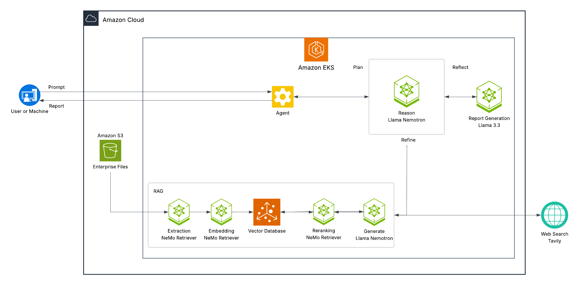

# AI-Q Blueprint Deployment on AWS Elastic Kubernetes Service (EKS)

This guide shows how to deploy the [NVIDIA AI-Q Research Assistant Blueprint](https://build.nvidia.com/nvidia/aiq) on Amazon Elastic Kubernetes Service (EKS). For more detailed deployment information about the AI-Q Research assistant blueprint, see the [github repository](https://github.com/NVIDIA-AI-Blueprints/aiq-research-assistant)

## Table of Contents

- [Architecture](#architecture)
- [Prerequisites](#prerequisites)
- [EKS Infrastructure Setup](#eks-infrastructure-setup)
  - [Step 1: Set Environment Variables](#step-1-set-environment-variables)
  - [Step 2: Deploy EKS Cluster](#step-2-deploy-eks-cluster)
  - [Step 3: Create Main GPU Node Group (49B Nemotron)](#step-3-create-main-gpu-node-group-49b-nemotron)
  - [Step 4: Create Secondary GPU Node Group (Supporting Models)](#step-4-create-secondary-gpu-node-group-supporting-models)
  - [Step 5: Create Data Ingestion GPU Node Group](#step-5-create-data-ingestion-gpu-node-group)
  - [Step 6: Install NVIDIA GPU Operator](#step-6-install-nvidia-gpu-operator)
  - [Step 7: Verify GPU Allocation](#step-7-verify-gpu-allocation)
  - [Step 8: Deploy Storage Class](#step-8-deploy-storage-class)
- [NVIDIA Enterprise RAG Blueprint Deployment](#nvidia-enterprise-rag-blueprint-deployment)
  - [Option 1: Default Deployment with Milvus](#option-1-default-deployment-with-milvus-recommended-for-quick-start)
    - [Step 9: Generate RAG Values File](#step-9-generate-rag-values-file)
    - [Step 10: Deploy RAG Blueprint](#step-10-deploy-rag-blueprint)
    - [Step 11: Setup Port Forwarding for RAG Services](#step-11-setup-port-forwarding-for-rag-services)
    - [Step 12: Verify RAG Deployment](#step-12-verify-rag-deployment)
  - [Option 2: Deployment with Amazon OpenSearch Serverless](opensearch/README.md)
- [Data Ingestion](#data-ingestion)
  - [Method 1: Direct Upload via RAG Frontend and Ingestor API](#method-1-direct-upload-via-rag-frontend-and-ingestor-api)
  - [Method 2: Batch Ingestion from S3 Bucket](#method-2-batch-ingestion-from-s3-bucket)
- [AI-Q Components Deployment](#ai-q-components-deployment)
  - [Step 13: Generate AIRA Values File](#step-13-generate-aira-values-file)
  - [Step 14: Deploy AIRA Components](#step-14-deploy-aira-components)
  - [Step 15: Setup Port Forwarding for AIRA](#step-15-setup-port-forwarding-for-aira)
  - [Step 16: Verify AIRA Deployment](#step-16-verify-aira-deployment)
  - [Step 17: Access AI-Q Blueprint Frontend](#step-17-access-ai-q-blueprint-frontend)
- [Observability](#observability)
  - [Access Monitoring Services](#access-monitoring-services)
- [Optional: Expose Services Publicly](#optional-expose-services-publicly)
- [Cleanup and Uninstallation](#cleanup-and-uninstallation)

## Architecture

This deployment supports two vector database options:
- **Option 1 (Default)**: Milvus with GPU acceleration for high-performance vector search
- **Option 2**: Amazon OpenSearch Serverless for managed, scalable vector storage



> **Note**: The architecture diagram shows the default deployment. For OpenSearch architecture, see the [OpenSearch Integration Guide](opensearch/README.md).

## Prerequisites

Before starting, ensure you have the following tools installed and configured:

- [**Helm**](https://helm.sh/docs/intro/install/) - Kubernetes package manager
- [**kubectl**](https://kubernetes.io/docs/tasks/tools/install-kubectl-linux/) - Kubernetes command-line tool
- [**eksctl**](https://eksctl.io/installation/) - Amazon EKS command-line tool
- AWS CLI - [Install](https://docs.aws.amazon.com/cli/latest/userguide/getting-started-install.html) AWS CLI and [Configure](https://docs.aws.amazon.com/cli/latest/userguide/cli-chap-configure.html) Credentials
- [**NGC API Key**](https://org.ngc.nvidia.com/setup/personal-keys) - Used for accessing NVIDIA container registry

**Requirements:**
- AWS Account with access to GPU instances
- Minimum of **16 A10G GPUs** (1 x g5.48xlarge + 2 x g5.12xlarge instances)
- Sufficient AWS IAM permissions to create EKS clusters and manage resources

## EKS Infrastructure Setup

### GPU Requirements for 49B Nemotron Model

This configuration maintains the full **49B Nemotron model** (`llama-3.3-nemotron-super-49b-v1.5`) for optimal reasoning performance using pre-built optimized profiles for A10G GPUs.

### Final GPU Requirements

**Main Node Group (MAIN_NG)** - 8 A10G GPUs (1 x g5.48xlarge instance):
1. **49B Nemotron Reasoning Model** (`llama-3.3-nemotron-super-49b-v1.5`) → 8 A10G GPUs

**Secondary Node Group (SECONDARY_NG)** - 4 A10G GPUs (1 x g5.12xlarge instance):
1. **Milvus Vector Database** (`milvusdb/milvus:v2.5.17-gpu`) → 1 A10G GPU
   - *Note: Only deployed with Option 1 (Milvus). Option 2 users will have this GPU available for other workloads.*
2. **Nemo Retriever Embedding Model** (`llama-3.2-nv-embedqa-1b-v2`) → 1 A10G GPU
3. **Nemo Retriever Reranking Model** (`llama-3.2-nv-rerankqa-1b-v2`) → 1 A10G GPU
4. **AIRA 8B Instruct Model** (`meta/llama-3.1-8b-instruct`) → 1 A10G GPU
   - Deployed by AIRA Helm chart for report generation
   - *Note: The official AI-Q blueprint uses Llama 3.3 70B Instruct. This deployment uses the smaller 8B model to reduce compute requirements. You can configure a different model in `helm/aira-values.eks.yaml.template`.*

**Data Ingestion Node Group (DATA_INGEST_NG)** - 4 A10G GPUs (1 x g5.12xlarge instance):
1. **Graphic Elements Model** (`nemoretriever-graphic-elements-v1`) → 1 A10G GPU
2. **Table Structure Model** (`nemoretriever-table-structure-v1`) → 1 A10G GPU
3. **Page Elements Model** (`nemoretriever-page-elements-v2`) → 1 A10G GPU
4. **PaddleOCR** → 1 A10G GPU

**Total: 16 A10G GPUs (1 x g5.48xlarge + 2 x g5.12xlarge instances)**

> **Note**: Each component uses 1 dedicated GPU for optimal performance.

### Step 1: Set Environment Variables

```bash
# Cluster & AWS region
export CLUSTER_NAME="nvidia-aiq-blueprint"
export REGION="us-east-1"
export ACCOUNT_ID=$(aws sts get-caller-identity --query Account --output text)

# Node group names
export MAIN_NG="main-ng"
export SECONDARY_NG="secondary-ng"
export DATA_INGEST_NG="data-ingest-ng"

# Instance types & sizes
export MAIN_GPU_INSTANCE_TYPE="g5.48xlarge"
export SECONDARY_GPU_INSTANCE_TYPE="g5.12xlarge"
export DATA_INGEST_GPU_INSTANCE_TYPE="g5.12xlarge"
export MAIN_NODES=1
export SECONDARY_NODES=1
export DATA_INGEST_NODES=1
export NODE_VOLUME_SIZE=500

# GPU Operator namespace
export GPU_OPERATOR_NS="gpu-operator"

# NGC API Key (replace with your actual key)
export NGC_API_KEY="<YOUR_NGC_API_KEY>"

# Tavily API Key for AIRA (replace with your actual key) 
export TAVILY_API_KEY="<YOUR_TAVILY_API_KEY>"
```

### Step 2: Deploy EKS Cluster

Create the EKS cluster without node groups (wait for completion before proceeding):

```bash
eksctl create cluster \
  --name "${CLUSTER_NAME}" \
  --region "${REGION}" \
  --without-nodegroup \
  --install-nvidia-plugin=false
```

### Step 3: Create Main GPU Node Group (49B Nemotron)

```bash
eksctl create nodegroup \
  --cluster "${CLUSTER_NAME}" \
  --region "${REGION}" \
  --name "${MAIN_NG}" \
  --node-type "${MAIN_GPU_INSTANCE_TYPE}" \
  --node-volume-size "${NODE_VOLUME_SIZE}" \
  --nodes "${MAIN_NODES}" \
  --node-labels role=gpu-main \
  --node-ami-family AmazonLinux2 \
  --full-ecr-access
```

### Step 4: Create Secondary GPU Node Group (Supporting Models)

```bash
eksctl create nodegroup \
  --cluster "${CLUSTER_NAME}" \
  --region "${REGION}" \
  --name "${SECONDARY_NG}" \
  --node-type "${SECONDARY_GPU_INSTANCE_TYPE}" \
  --node-volume-size "${NODE_VOLUME_SIZE}" \
  --nodes "${SECONDARY_NODES}" \
  --node-labels role=gpu-secondary \
  --node-ami-family AmazonLinux2 \
  --full-ecr-access
```

### Step 5: Create Data Ingestion GPU Node Group

```bash
eksctl create nodegroup \
  --cluster "${CLUSTER_NAME}" \
  --region "${REGION}" \
  --name "${DATA_INGEST_NG}" \
  --node-type "${DATA_INGEST_GPU_INSTANCE_TYPE}" \
  --node-volume-size "${NODE_VOLUME_SIZE}" \
  --nodes "${DATA_INGEST_NODES}" \
  --node-labels role=gpu-data-ingest \
  --node-ami-family AmazonLinux2 \
  --full-ecr-access
```

### Step 6: Install NVIDIA GPU Operator

```bash
# Add NVIDIA helm repository
helm repo add nvidia https://nvidia.github.io/gpu-operator
helm repo update

# Remove any existing NVIDIA device plugin (if it exists)
kubectl delete daemonset nvidia-device-plugin-daemonset -n kube-system --ignore-not-found=true

# Install GPU Operator
helm upgrade -i gpu-operator nvidia/gpu-operator \
  -n "${GPU_OPERATOR_NS}" --create-namespace \
  --set driver.enabled=false \
  --set toolkit.version=v1.14.3-ubi8

# Verify GPU Operator
kubectl get pods -n ${GPU_OPERATOR_NS:-gpu-operator} -o wide
```


### Step 7: Verify GPU Allocation

**Main Node Group** (8 physical GPUs per node × 1 node = 8 total GPUs - g5.48xlarge):
```bash
kubectl get nodes -l role=gpu-main -o wide
kubectl get nodes -l role=gpu-main -o custom-columns=NAME:.metadata.name,GPU:.status.allocatable.nvidia\\.com/gpu
```

**Secondary Node Group** (4 physical GPUs per node × 1 node = 4 total GPUs - g5.12xlarge):
```bash
kubectl get nodes -l role=gpu-secondary -o wide
kubectl get nodes -l role=gpu-secondary -o custom-columns=NAME:.metadata.name,GPU:.status.allocatable.nvidia\\.com/gpu
```

**Data Ingestion Node Group** (4 physical GPUs per node × 1 node = 4 total GPUs - g5.12xlarge):
```bash
kubectl get nodes -l role=gpu-data-ingest -o wide
kubectl get nodes -l role=gpu-data-ingest -o custom-columns=NAME:.metadata.name,GPU:.status.allocatable.nvidia\\.com/gpu
```

### Step 8: Deploy Storage Class

Deploy the AWS EBS CSI driver for persistent, high-performance storage suitable for production workloads.

1. **Associate IAM OIDC Provider with Cluster**

   First, associate an IAM OIDC provider with your EKS cluster:

   ```bash
   # Associate IAM OIDC provider with the cluster
   eksctl utils associate-iam-oidc-provider \
     --region=$REGION \
     --cluster=$CLUSTER_NAME \
     --approve
   ```

2. **Create IAM Service Account for EBS CSI Driver**

   ```bash
   # Create IAM service account with required permissions
   eksctl create iamserviceaccount \
     --name ebs-csi-controller-sa \
     --namespace kube-system \
     --cluster $CLUSTER_NAME \
     --role-name AmazonEKS_EBS_CSI_DriverRole \
     --role-only \
     --attach-policy-arn arn:aws:iam::aws:policy/service-role/AmazonEBSCSIDriverPolicy \
     --approve
   ```

3. **Install AWS EBS CSI Driver Add-on**

   ```bash
   # Get the AWS account ID
   ACCOUNT_ID=$(aws sts get-caller-identity --query Account --output text)
   
   # Install the EBS CSI driver add-on
   eksctl create addon \
     --name aws-ebs-csi-driver \
     --cluster $CLUSTER_NAME \
     --service-account-role-arn arn:aws:iam::${ACCOUNT_ID}:role/AmazonEKS_EBS_CSI_DriverRole \
     --force
   ```

4. **Verify EBS CSI Driver Installation**

   ```bash
   # Check if the EBS CSI driver pods are running
   kubectl get pods -n kube-system -l app=ebs-csi-controller
   kubectl get pods -n kube-system -l app=ebs-csi-node
   ```

5. **Create GP3 Storage Class (Recommended)**

   Create a high-performance GP3 storage class:

   ```bash
   cat << 'EOF' | kubectl apply -f -
   apiVersion: storage.k8s.io/v1
   kind: StorageClass
   metadata:
     name: ebs-gp3
     annotations:
       storageclass.kubernetes.io/is-default-class: "true"
   provisioner: ebs.csi.aws.com
   parameters:
     type: gp3
     iops: "3000"
     throughput: "125"
     encrypted: "true"
   allowVolumeExpansion: true
   volumeBindingMode: WaitForFirstConsumer
   EOF
   ```

6. **Verify Storage Class Configuration**

   ```bash
   kubectl get storageclass
   kubectl describe storageclass ebs-gp3
   ```

   You should see the `ebs-gp3` storage class marked as default.

## NVIDIA Enterprise RAG Blueprint Deployment

The RAG Blueprint supports two vector database options. Choose the option that best fits your requirements:

### **Option 1: Default Deployment with Milvus (Recommended for Quick Start)**

This option uses Milvus as the vector database with GPU acceleration. Follow the steps below for a streamlined deployment.

### **Option 2: Deployment with Amazon OpenSearch Serverless**

For production deployments requiring managed vector database services, you can integrate Amazon OpenSearch Serverless. This option provides:
- Fully managed, serverless vector database
- Auto-scaling capabilities
- Enterprise-grade security with IAM integration
- Separation of compute and storage

> **Note**: If you choose Option 2 (OpenSearch), follow the [OpenSearch Integration Guide](opensearch/README.md) for complete setup instructions, then return to [Data Ingestion](#data-ingestion) to continue with the remaining deployment steps.

---

### **Continuing with Option 1: Milvus Deployment**

### Step 9: Generate RAG Values File

Generate the actual rag-values.yaml file from the template with your node hostnames:

> **Note**: The repository contains `helm/rag-values.yaml.template` with placeholder variables like `$MAIN_GPU_NODE_1`. This step generates the actual `rag-values.yaml` file with your specific node hostnames.

```bash
# Get node hostnames and export as environment variables for envsubst
export MAIN_GPU_NODE_1=$(kubectl get nodes -l role=gpu-main -o jsonpath='{.items[0].metadata.name}')
export SECONDARY_GPU_NODE=$(kubectl get nodes -l role=gpu-secondary -o jsonpath='{.items[0].metadata.name}')
export DATA_INGEST_GPU_NODE=$(kubectl get nodes -l role=gpu-data-ingest -o jsonpath='{.items[0].metadata.name}')

# Display all retrieved hostnames
echo "Main GPU Node (g5.48xlarge): ${MAIN_GPU_NODE_1}"
echo "Secondary GPU Node (g5.12xlarge): ${SECONDARY_GPU_NODE}"
echo "Data Ingestion GPU Node (g5.12xlarge): ${DATA_INGEST_GPU_NODE}"

# Generate rag-values.yaml from template (only replace specific variables)
envsubst '$MAIN_GPU_NODE_1 $SECONDARY_GPU_NODE $DATA_INGEST_GPU_NODE' < helm/rag-values.yaml.template > helm/rag-values.yaml
```

### Step 10: Deploy RAG Blueprint

Deploy the RAG blueprint with the 49B Nemotron model:

```bash
helm upgrade --install rag -n rag \
  https://helm.ngc.nvidia.com/nvidia/blueprint/charts/nvidia-blueprint-rag-v2.3.0.tgz \
  --username '$oauthtoken' \
  --password "${NGC_API_KEY}" \
  --set imagePullSecret.password=$NGC_API_KEY \
  --set ngcApiSecret.password=$NGC_API_KEY \
  -f helm/rag-values.yaml \
  --create-namespace
```

This deploys:
- **49B Nemotron** (8 GPUs) for main reasoning and query rewriting
- **Supporting Models** (Milvus, Embedding, Reranking) on remaining GPUs

### Step 11: Setup Port Forwarding for RAG Services

To securely access RAG services, use kubectl port-forward:

```bash
# Port-forward RAG frontend (run in a separate terminal)
kubectl port-forward -n rag svc/rag-frontend 3001:3000

# Port-forward ingestor server (run in another separate terminal)
kubectl port-forward -n rag svc/ingestor-server 8082:8082
```

> **Note**: These commands will run in the foreground. Open separate terminal windows for each port-forward command, or run them in the background.

> **Alternative**: If you need to expose services publicly, see the [Optional: Expose Services Publicly](#optional-expose-services-publicly) section after completing the deployment.

### Step 12: Verify RAG Deployment

Ensure all components are successfully running before proceeding

```bash
kubectl get all -n rag
```


## Data Ingestion

Now that the RAG system is deployed, you can ingest documents into the vector database using two methods:

### Method 1: Direct Upload via RAG Frontend and Ingestor API

Use the RAG frontend interface or directly call the ingestor server API to upload documents:

#### Option A: RAG Frontend Interface

Ensure the RAG frontend port-forward is running from Step 12, then navigate to:

```
http://localhost:3001
```

Use the upload interface to:
- Upload PDF, DOCX, and other supported document formats
- Monitor ingestion progress in real-time
- Verify documents are successfully processed

#### Option B: Direct API Calls

For programmatic document ingestion using the ingestor API, refer to the official NVIDIA RAG ingestion API usage guide:

**📖 [Ingestion API Usage Examples](https://github.com/NVIDIA-AI-Blueprints/rag/blob/v2.3.0/notebooks/ingestion_api_usage.ipynb)**

Ensure the ingestor server port-forward is running from Step 11, then use:
```bash
export INGESTOR_URL="localhost"
echo "Ingestor API: http://$INGESTOR_URL:8082"
```

### Method 2: Batch Ingestion from S3 Bucket

For large-scale document ingestion from an S3 bucket, use the provided batch ingestion script.

First, ensure the ingestor server port-forward is running from Step 11, then:

```bash
# Set required environment variables
export S3_BUCKET_NAME="your-pdf-bucket-name" # Replace with your S3 bucket name
export INGESTOR_URL="localhost:8082"  # Using port-forward from Step 11

# Optional: Configure additional settings
export S3_PREFIX=""  # Optional: folder path (e.g., "documents/")
export RAG_COLLECTION_NAME="multimodal_data"
export UPLOAD_BATCH_SIZE="100"

# Run the batch ingestion script
./scripts/data_ingestion.sh
```

This method is ideal for:
- Processing large numbers of documents
- Automated ingestion workflows
- Documents already stored in S3

> **Note**: For more details on script options and advanced usage, see the [batch_ingestion.py documentation](https://github.com/NVIDIA-AI-Blueprints/rag/tree/v2.3.0/scripts).

## AI-Q Components Deployment

Now that the RAG Blueprint is deployed and verified, we can deploy the AI-Q Research Assistant (AIRA) components that will use the RAG services for enhanced research capabilities.

### Step 13: Generate AIRA Values File

Generate the actual aira-values.eks.yaml file from the template with your node hostname:

```bash
# Export environment variable for envsubst (SECONDARY_GPU_NODE is already set from Step 9)
echo "Using Secondary GPU Node for AIRA NIM-LLM: ${SECONDARY_GPU_NODE}"

# Generate aira-values.eks.yaml from template
envsubst '$SECONDARY_GPU_NODE' < helm/aira-values.eks.yaml.template > helm/aira-values.eks.yaml
```

### Step 14: Deploy AIRA Components

Deploy AIRA using the NGC Helm chart:

> **Important - Model Configuration**: The official AI-Q blueprint uses **Llama 3.3 70B Instruct** for report generation. This deployment has been modified to use **Llama 3.1 8B Instruct** (`meta/llama-3.1-8b-instruct`) to significantly reduce compute requirements and costs. While this provides faster deployment, report quality and reasoning capabilities may differ from the official blueprint.
> 
> To use the original 70B model or another larger model, you will need to:
> 1. Modify the model configuration in `helm/aira-values.eks.yaml.template` (update `image.repository`, `model.name`, and `backendEnvVars.INSTRUCT_MODEL_NAME`)
> 2. Adjust GPU resource requests/limits in the same file (increase to 8 GPUs for 70B model if using g5.48xlarge)
> 3. Ensure your EKS node group has sufficient GPU capacity (It requires larger instance types like g5.48xlarge)

```bash
# Verify Tavily API key is set
echo "Tavily API Key: ${TAVILY_API_KEY:0:10}..."

# Deploy AIRA using NGC Helm chart
helm upgrade --install aira https://helm.ngc.nvidia.com/nvidia/blueprint/charts/aiq-aira-v1.2.0.tgz \
  --username='$oauthtoken' \
  --password="${NGC_API_KEY}" \
  -n nv-aira --create-namespace \
  -f helm/aira-values.eks.yaml \
  --set imagePullSecret.password="$NGC_API_KEY" \
  --set ngcApiSecret.password="$NGC_API_KEY" \
  --set tavilyApiSecret.password="$TAVILY_API_KEY"
```

This deploys:
- **AIRA Backend**: Research assistant functionality
- **Instruct Model**: Dedicated model for report generation (1 GPU)
- **NGINX Proxy**: Routes requests to appropriate services
- **Frontend**: User interface

### Step 15: Setup Port Forwarding for AIRA

To securely access the AIRA frontend, use kubectl port-forward:

```bash
# Port-forward AIRA frontend (run in a separate terminal)
kubectl port-forward -n nv-aira svc/aira-aira-frontend 3000:3000
```

> **Note**: This command will run in the foreground. Open a separate terminal window or run it in the background.

> **Alternative**: If you need to expose the service publicly, see the [Optional: Expose Services Publicly](#optional-expose-services-publicly) section.

### Step 16: Verify AIRA Deployment

Check that all AIRA components are running:

```bash
# Check all AIRA components
kubectl get all -n nv-aira

# Check specifically for the NIM-LLM pod (should be on SECONDARY_GPU_NODE)
kubectl get pods -n nv-aira -o wide

# Wait for all components to be ready
kubectl wait --for=condition=ready pod -l app=aira -n nv-aira --timeout=300s
```

### Step 17: Access AI-Q Blueprint Frontend

With port-forwarding enabled from Step 15, access the AIRA Research Assistant:

**AIRA Research Assistant:**
- URL: http://localhost:3000
- Use this to generate comprehensive research reports

**RAG Frontend** (optional):
- URL: http://localhost:3001
- Use this to test the RAG application directly (requires port-forward from Step 12)

## Observability

### Access Monitoring Services

To access observability dashboards, use kubectl port-forward:

**RAG Observability (Zipkin & Grafana):**

```bash
# Port-forward Zipkin for distributed tracing (run in a separate terminal)
kubectl port-forward -n rag svc/rag-zipkin 9411:9411

# Port-forward Grafana for metrics and dashboards (run in another separate terminal)
kubectl port-forward -n rag svc/rag-grafana 8080:80
```

**AI-Q Observability (Phoenix):**

```bash
# Port-forward Phoenix for AI-Q tracing (run in a separate terminal)
kubectl port-forward -n nv-aira svc/aira-phoenix 6006:6006
```

**Access Monitoring UIs:**

- **Zipkin UI** (RAG tracing): http://localhost:9411
- **Grafana UI** (RAG metrics): http://localhost:8080
- **Phoenix UI** (AI-Q tracing): http://localhost:6006

> **Note**: For detailed information on using these observability tools, refer to:
> - [Viewing Traces in Zipkin](https://github.com/NVIDIA-AI-Blueprints/rag/blob/main/docs/observability.md#view-traces-in-zipkin)
> - [Viewing Metrics in Grafana Dashboard](https://github.com/NVIDIA-AI-Blueprints/rag/blob/main/docs/observability.md#view-metrics-in-grafana)

> **Alternative**: If you need to expose monitoring services publicly, you can create an Ingress resource with appropriate authentication and security controls.

## Optional: Expose Services Publicly

<details>
<summary>Click to expand instructions for exposing services via AWS Network Load Balancers</summary>

By default, this deployment uses port-forwarding for secure local access. If you need to expose services publicly (e.g., for team collaboration or production use), you can configure AWS Network Load Balancers.

> **⚠️ Security Warning**: Exposing services publicly without additional security controls creates potential security risks. Consider implementing:
> - Network ACLs or Security Groups to restrict access to specific IP ranges
> - AWS WAF for application-level protection
> - Authentication/authorization mechanisms
> - TLS/SSL encryption
> - VPN or AWS PrivateLink for internal-only access

### Expose RAG Services

```bash
# Patch the frontend service to LoadBalancer with internet-facing access
kubectl patch svc rag-frontend -n rag -p '{
  "spec": {
    "type": "LoadBalancer"
  },
  "metadata": {
    "annotations": {
      "service.beta.kubernetes.io/aws-load-balancer-type": "nlb",
      "service.beta.kubernetes.io/aws-load-balancer-scheme": "internet-facing",
      "service.beta.kubernetes.io/aws-load-balancer-backend-protocol": "tcp"
    }
  }
}'

# Patch the ingestor-server service to LoadBalancer with internet-facing access
kubectl patch svc ingestor-server -n rag -p '{
  "spec": {
    "type": "LoadBalancer"
  },
  "metadata": {
    "annotations": {
      "service.beta.kubernetes.io/aws-load-balancer-type": "nlb",
      "service.beta.kubernetes.io/aws-load-balancer-scheme": "internet-facing",
      "service.beta.kubernetes.io/aws-load-balancer-backend-protocol": "tcp"
    }
  }
}'
```

### Expose AIRA Frontend

```bash
# Patch the AIRA frontend service to LoadBalancer with internet-facing access
kubectl patch svc aira-aira-frontend -n nv-aira -p '{
  "spec": {
    "type": "LoadBalancer"
  },
  "metadata": {
    "annotations": {
      "service.beta.kubernetes.io/aws-load-balancer-type": "nlb",
      "service.beta.kubernetes.io/aws-load-balancer-scheme": "internet-facing",
      "service.beta.kubernetes.io/aws-load-balancer-backend-protocol": "tcp"
    }
  }
}'
```

### Expose Observability Services (Optional)

```bash
# Expose Zipkin for distributed tracing
kubectl patch svc rag-zipkin -n rag -p '{
  "spec": {
    "type": "LoadBalancer"
  },
  "metadata": {
    "annotations": {
      "service.beta.kubernetes.io/aws-load-balancer-type": "nlb",
      "service.beta.kubernetes.io/aws-load-balancer-scheme": "internet-facing",
      "service.beta.kubernetes.io/aws-load-balancer-backend-protocol": "tcp"
    }
  }
}'

# Expose Grafana for metrics and dashboards
kubectl patch svc rag-grafana -n rag -p '{
  "spec": {
    "type": "LoadBalancer"
  },
  "metadata": {
    "annotations": {
      "service.beta.kubernetes.io/aws-load-balancer-type": "nlb",
      "service.beta.kubernetes.io/aws-load-balancer-scheme": "internet-facing",
      "service.beta.kubernetes.io/aws-load-balancer-backend-protocol": "tcp"
    }
  }
}'

# Expose Phoenix for AI-Q tracing
kubectl patch svc aira-phoenix -n nv-aira -p '{
  "spec": {
    "type": "LoadBalancer"
  },
  "metadata": {
    "annotations": {
      "service.beta.kubernetes.io/aws-load-balancer-type": "nlb",
      "service.beta.kubernetes.io/aws-load-balancer-scheme": "internet-facing",
      "service.beta.kubernetes.io/aws-load-balancer-backend-protocol": "tcp"
    }
  }
}'
```

### Get Load Balancer URLs

After patching the services, retrieve the Load Balancer URLs:

```bash
# RAG Services
echo "RAG Frontend: http://$(kubectl get svc rag-frontend -n rag -o jsonpath='{.status.loadBalancer.ingress[0].hostname}'):3000"
echo "Ingestor Server: http://$(kubectl get svc ingestor-server -n rag -o jsonpath='{.status.loadBalancer.ingress[0].hostname}'):8082"

# AIRA Frontend
echo "AIRA Frontend: http://$(kubectl get svc aira-aira-frontend -n nv-aira -o jsonpath='{.status.loadBalancer.ingress[0].hostname}'):3000"

# Observability (if exposed)
echo "Zipkin UI: http://$(kubectl get svc rag-zipkin -n rag -o jsonpath='{.status.loadBalancer.ingress[0].hostname}'):9411"
echo "Grafana UI: http://$(kubectl get svc rag-grafana -n rag -o jsonpath='{.status.loadBalancer.ingress[0].hostname}'):80"
echo "Phoenix UI: http://$(kubectl get svc aira-phoenix -n nv-aira -o jsonpath='{.status.loadBalancer.ingress[0].hostname}'):6006"
```

> **Note**: It takes a few minutes for the AWS Load Balancers to be provisioned and become available.

</details>

## Cleanup and Uninstallation

### Uninstall RAG Blueprint

```bash
helm uninstall rag -n rag
```

### Uninstall AI-Q Components

```bash
# Uninstall AIRA components
helm uninstall aira -n nv-aira

# Optional: Delete the namespace
kubectl delete namespace nv-aira
```

> **Note**: If you deployed with OpenSearch Serverless (Option 2), refer to the [OpenSearch Integration Guide cleanup section](opensearch/README.md#cleanup) for additional resource cleanup steps.

### Complete Cluster Cleanup (Optional)

If you want to completely remove the EKS cluster and all resources:

```bash
# Delete the entire EKS cluster (this will remove all node groups and resources)
eksctl delete cluster --name "${CLUSTER_NAME}" --region "${REGION}"
```

> **Warning**: This will permanently delete all data and resources in the cluster. Make sure to backup any important data before running this command.

