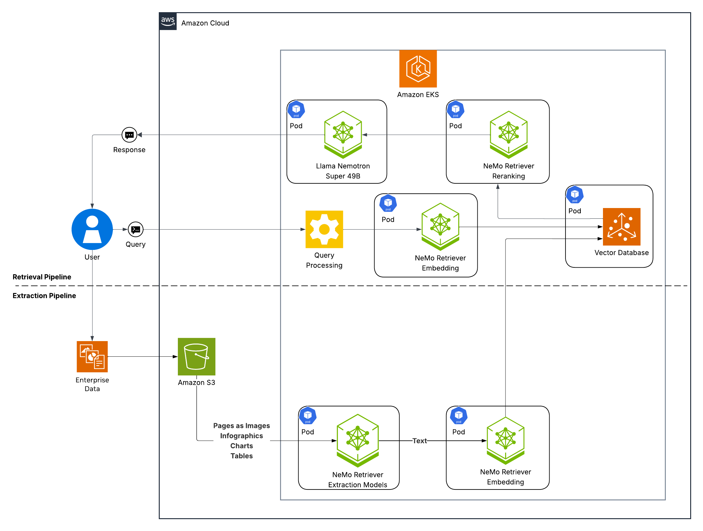
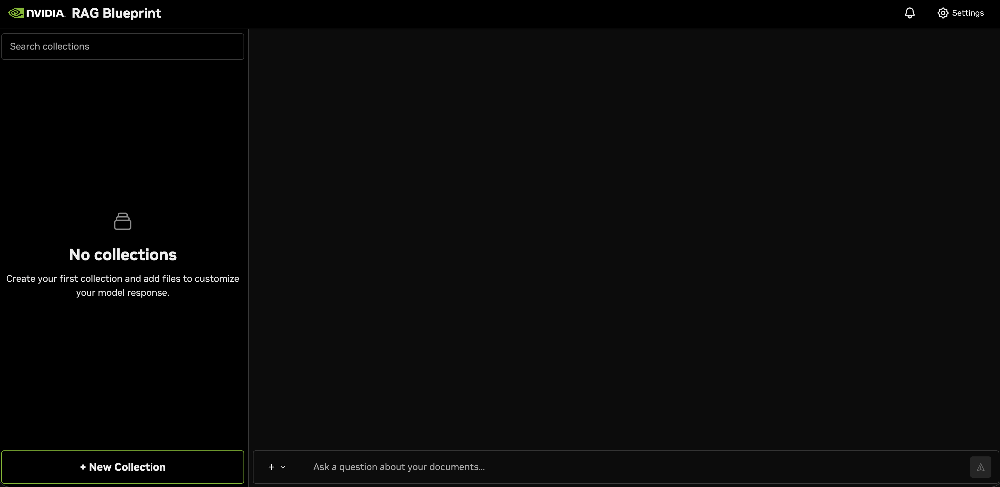
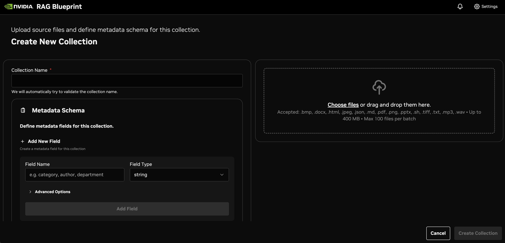

# Deploy NVIDIA Enterprise RAG Blueprint on Amazon Elastic Kubernetes Service (EKS) Workshop

## Table of Contents

- [Diagram](#diagram)
- [Introduction](#introduction)
- [What you will learn](#what-you-will-learn)
- [Learn the Components](#learn-the-components)
- [Setup and Requirements](#setup-and-requirements)
- [Task 1. Infrastructure Deployment](#task-1-infrastructure-deployment)
- [Task 2. Install NVIDIA GPU Operator](#task-2-install-nvidia-gpu-operator)
- [Task 3. Deploy Storage Class](#task-3-deploy-storage-class)
- [Task 4. Install AWS Load Balancer Controller](#task-4-install-aws-load-balancer-controller)
- [Task 5. Configure NVIDIA NGC API Key](#task-5-configure-nvidia-ngc-api-key)
- [Task 6. Deploy Enterprise RAG Blueprint](#task-6-deploy-enterprise-rag-blueprint)
  - [Option 1: Default Deployment with Milvus](#option-1-default-deployment-with-milvus-recommended-for-quick-start)
  - [Option 2: Deployment with Amazon OpenSearch Serverless](opensearch/README.md)
- [Task 7. Access the RAG App Services](#task-7-access-the-rag-app-services)
- [Task 8. Test the RAG Application via UI](#task-8-test-the-rag-application-via-ui)
- [Task 9. Test the RAG Application via API](#task-9-test-the-rag-application-via-api)
- [S3 Data Ingestion (Optional)](#s3-data-ingestion-optional)
- [Monitor Backend Services](#monitor-backend-services)
- [Observability](#observability)
- [Congratulations!](#congratulations)
- [Cleanup and Uninstallation](#cleanup-and-uninstallation)

## Diagram



**Enterprise RAG Blueprint Architecture:**

The NVIDIA Enterprise RAG Blueprint provides a comprehensive solution for Retrieval Augmented Generation with support for two vector database options:
- **Option 1 (Default)**: Milvus with GPU acceleration for high-performance vector search
- **Option 2**: Amazon OpenSearch Serverless for managed, scalable vector storage

> **Note**: The architecture diagram shows the default Milvus deployment. For OpenSearch architecture, see the [OpenSearch Integration Guide](opensearch/README.md).

The blueprint features:

- **Reasoning Model**: `llama-3.1-nemotron-nano-8b-v1` for intelligent query processing
- **NeMo Retriever Embedding**: `llama-3.2-nv-embedqa-1b-v2` for semantic search
- **NeMo Retriever Reranking**: `llama-3.2-nv-rerankqa-1b-v2` for improved relevance
- **Page Elements Model**: `nemoretriever-page-elements-v2` for document understanding
- **Table Structure Model**: `nemoretriever-table-structure-v1` for table extraction and understanding
- **Graphic Elements Model**: `nemoretriever-graphic-elements-v1` for chart and diagram processing
- **OCR Engine**: `paddleocr-nim` for optical character recognition
- **Vector Database**: Milvus for efficient embedding storage and retrieval
- **Frontend**: React-based RAG Playground for user interaction

## Introduction

This workshop will guide you through deploying the complete [NVIDIA Enterprise RAG Blueprint](https://build.nvidia.com/nvidia/build-an-enterprise-rag-pipeline) on Amazon Elastic Kubernetes Service (EKS). You'll leverage the power of NVIDIA Inference Microservices (NIMs) and NeMo Retriever to build a comprehensive retrieval augmented generation system optimized for enterprise workloads. For more deployment details of this blueprint, see the [Github Repository](https://github.com/NVIDIA-AI-Blueprints/rag/tree/main)


This workshop is ideal for developers, data scientists, and architects interested in:

- **Building enterprise-grade RAG applications**: Learn how to deploy a complete RAG pipeline using NVIDIA's enterprise blueprint.
- **Optimizing GPU utilization**: Explore how to efficiently deploy multiple AI models across GPU resources for maximum performance.
- **Leveraging advanced retrieval**: Understand how to implement sophisticated embedding and reranking models for improved accuracy.
- **Scaling AI workloads**: Learn to manage and scale complex AI deployments using Kubernetes orchestration.

## What you will learn

By the end of this workshop, you will have hands-on experience with:

1. **Deploying the Enterprise RAG Blueprint on EKS**: Learn to deploy a complete enterprise-grade RAG solution including multiple NIM models, vector databases, and frontend services onto your EKS cluster.
2. **Managing GPU resources efficiently**: Understand how to optimize GPU allocation across multiple AI models for cost-effective deployment.
3. **Integrating advanced retrieval components**: Gain familiarity with NeMo Retriever's embedding and reranking capabilities for superior document understanding.
4. **Operating enterprise RAG systems**: Explore techniques for monitoring, scaling, and maintaining enterprise RAG deployments using Kubernetes best practices.

## Learn the Components

### NVIDIA Enterprise RAG Blueprint

The [NVIDIA Enterprise RAG Blueprint](https://build.nvidia.com/nvidia/build-an-enterprise-rag-pipeline) is a comprehensive solution that combines multiple NVIDIA AI microservices to deliver enterprise-grade retrieval augmented generation capabilities. It includes optimized models for reasoning, embedding, reranking, and document processing.

### GPUs in Amazon Elastic Kubernetes Service (EKS)

GPUs accelerate AI workloads running on your nodes, particularly machine learning inference and training. EKS provides a range of GPU-enabled instance types including A10G, L40S, A100, and H100 GPUs, allowing you to choose the optimal configuration for your workload requirements.

### NVIDIA NIMs (NVIDIA Inference Microservices)

[NVIDIA NIMs](https://www.nvidia.com/en-us/ai/) are containerized AI inference microservices that provide easy-to-deploy, scalable, and secure AI model serving. NIMs include optimized runtimes, pre-built containers, and enterprise support.

### NVIDIA NeMo Retriever

[NVIDIA NeMo Retriever](https://developer.nvidia.com/blog/develop-production-grade-text-retrieval-pipelines-for-rag-with-nvidia-nemo-retriever) provides state-of-the-art embedding and reranking models specifically designed for enterprise RAG applications. It includes specialized models for different document types and retrieval scenarios.

### RAG Server and Ingestor

The blueprint includes dedicated microservices for:
- **RAG Server**: Handles query processing, retrieval orchestration, and response generation
- **Ingestor Server**: Manages document processing, embedding generation, and vector database population
- **NV-Ingest**: Advanced document processing pipeline supporting multiple content types

### Vector Database Integration

The blueprint supports two vector database options:
- **Milvus** (Default): GPU-accelerated similarity search with advanced indexing capabilities
- **Amazon OpenSearch Serverless**: Fully managed, auto-scaling vector database with IAM integration

Choose the option that best fits your deployment requirements during Task 6.

## Setup and Requirements

### What you need

To complete this lab, you need:

- Access to a standard internet browser (Chrome browser recommended).
- Access to an AWS Account with access to GPU instances (g5.12xlarge recommended). You will need a minimum of **8 A10G GPUs** (2 x g5.12xlarge instances) for the optimized deployment.
- Sufficient AWS IAM permissions to create EKS clusters and manage resources.
- An [NVIDIA NGC API Key](https://org.ngc.nvidia.com/setup/personal-keys) for accessing NVIDIA container registry and models.
- Time to complete the lab (approximately 2-3 hours).

### GPU Requirements

The optimized deployment requires:

**Main Node Group (2 x g5.12xlarge instances = 8 total A10G GPUs, using 8):**
1. **Reasoning Model** (`llama-3.1-nemotron-nano-8b-v1`) → 2 A10G GPUs
2. **NeMo Retriever Embedding Model** (`llama-3.2-nv-embedqa-1b-v2`) → 1 A10G GPU
3. **NeMo Retriever Reranking Model** (`llama-3.2-nv-rerankqa-1b-v2`) → 1 A10G GPU
4. **Page Elements Model** (`nemoretriever-page-elements-v2`) → 1 A10G GPU
5. **Table Structure Model** (`nemoretriever-table-structure-v1`) → 1 A10G GPU
6. **Graphic Elements Model** (`nemoretriever-graphic-elements-v1`) → 1 A10G GPU
7. **OCR Engine** (`paddleocr-nim`) → 1 A10G GPU

### How to start your lab and sign in to the AWS Console

### Activate Cloud Shell

Cloud Shell is a virtual machine loaded with development tools. It offers a persistent home directory and runs on the AWS Cloud, providing command-line access to your AWS resources.

In the AWS Console, in the top right toolbar, click the **Activate Cloud Shell** button.


It takes a few moments to provision and connect to the environment.


`AWS CLI` is the command-line tool for AWS Cloud. It comes pre-installed on Cloud Shell and supports tab-completion.

## Task 1. Infrastructure Deployment

1. **Open Cloud Shell** and install prerequisites:

   The Cloud Shell environment comes preinstalled with `kubectl`, the native CLI tool to manage Kubernetes objects within your Amazon EKS clusters.

   Install additional required tools:
   - `eksctl` - The CLI used to work with EKS clusters
   - `helm` - The Kubernetes package manager

   **Install `eksctl`:**

   ```bash
   # for ARM systems, set ARCH to: `arm64`, `armv6` or `armv7`
   ARCH=amd64
   PLATFORM=$(uname -s)_$ARCH

   curl -sLO "https://github.com/eksctl-io/eksctl/releases/latest/download/eksctl_$PLATFORM.tar.gz"

   # (Optional) Verify checksum
   curl -sL "https://github.com/eksctl-io/eksctl/releases/latest/download/eksctl_checksums.txt" | grep $PLATFORM | sha256sum --check

   tar -xzf eksctl_$PLATFORM.tar.gz -C /tmp && rm eksctl_$PLATFORM.tar.gz

   sudo mv /tmp/eksctl /usr/local/bin
   ```

   **Install `helm`:**

   ```bash
   curl -fsSL -o get_helm.sh https://raw.githubusercontent.com/helm/helm/main/scripts/get-helm-3
   chmod 700 get_helm.sh
   ./get_helm.sh
   ```

2. **Set Environment Variables**

   Configure the deployment parameters for your EKS cluster:

   ```bash
   # Cluster & AWS region
   export CLUSTER_NAME="nvidia-enterprise-rag"
   export REGION="us-east-1"

   # Node group names
   export MAIN_NG="main-ng"

   # Instance types & sizes
   export GPU_INSTANCE_TYPE="g5.12xlarge"
   export MAIN_NODES=2
   export NODE_VOLUME_SIZE=500

   # GPU Operator namespace
   export GPU_OPERATOR_NS="gpu-operator"
   ```

3. **Create EKS Cluster**

   Create the EKS cluster without node groups (wait for completion before proceeding):

   ```bash
   eksctl create cluster \
     --name "${CLUSTER_NAME}" \
     --region "${REGION}" \
     --without-nodegroup \
     --install-nvidia-plugin=false
   ```

   **Get Credentials:**

   > **Note**: Wait for the cluster creation to complete before proceeding to get the credentials

   ```bash
   aws eks update-kubeconfig --region $REGION --name $CLUSTER_NAME
   ```

   Verify your cluster connection:

   ```bash
   kubectl config get-contexts
   ```

   You should see output indicating your cluster context is active.

4. **Create GPU Node Group**

   Create GPU-enabled worker nodes using the Amazon Linux 2 GPU-optimized AMI:

   ```bash
   eksctl create nodegroup \
     --cluster "${CLUSTER_NAME}" \
     --region "${REGION}" \
     --name "${MAIN_NG}" \
     --node-type "${GPU_INSTANCE_TYPE}" \
     --node-volume-size "${NODE_VOLUME_SIZE}" \
     --nodes "${MAIN_NODES}" \
     --node-labels role=gpu-main \
     --node-ami-family AmazonLinux2
   ```

   > **Note**: We explicitly specify `AL2_x86_64_GPU` AMI type and Kubernetes version 1.32 to ensure compatibility with the NVIDIA Container Toolkit version used by the GPU Operator.

   Verify the nodes are ready:

   ```bash
   kubectl get nodes -l role=gpu-main -o wide
   ```

   You should see 2 nodes in Ready status.

## Task 2. Install NVIDIA GPU Operator

The GPU Operator manages the lifecycle of NVIDIA software components needed for GPU workloads.

1. **Add NVIDIA Helm Repository**

   ```bash
   # Add NVIDIA helm repository
   helm repo add nvidia https://nvidia.github.io/gpu-operator
   helm repo update
   ```

2. **Remove Existing NVIDIA Device Plugin**

   ```bash
   # Remove any existing NVIDIA device plugin (if it exists)
   kubectl delete daemonset nvidia-device-plugin-daemonset -n kube-system --ignore-not-found=true
   ```

3. **Install GPU Operator**

   ```bash
   # Install GPU Operator (toolkit version matches AL2 GPU AMI)
   helm upgrade -i gpu-operator nvidia/gpu-operator \
     -n "${GPU_OPERATOR_NS}" --create-namespace \
     --set driver.enabled=false \
     --set toolkit.version=v1.14.3-ubi8
   ```

4. **Verify GPU Allocation**

   Wait for the GPU Operator to be ready, then verify GPU resources are available:

   ```bash
   # Check GPU Operator pods
   kubectl get pods -n gpu-operator

   # Verify GPU allocation on nodes
   kubectl get nodes -l role=gpu-main -o custom-columns=NAME:.metadata.name,GPU:.status.allocatable.nvidia\\.com/gpu
   ```

   You should see 8 total GPUs available (4 per g5.12xlarge instance × 2 instances).

## Task 3. Deploy Storage Class

Choose between AWS EBS CSI driver (recommended) or local path provisioner (for quick POC testing).

### Option 1: AWS EBS CSI Driver (Recommended)

The AWS EBS CSI driver provides persistent, high-performance storage suitable for enterprise workloads.

1. **Associate IAM OIDC Provider with Cluster**

   First, associate an IAM OIDC provider with your EKS cluster:

   ```bash
   # Associate IAM OIDC provider with the cluster
   eksctl utils associate-iam-oidc-provider \
     --region=$AWS_REGION \
     --cluster=$CLUSTER_NAME \
     --approve
   ```

2. **Create IAM Service Account for EBS CSI Driver**

   ```bash
   # Create IAM service account with required permissions
   eksctl create iamserviceaccount \
     --name ebs-csi-controller-sa \
     --namespace kube-system \
     --cluster $CLUSTER_NAME \
     --role-name AmazonEKS_EBS_CSI_DriverRole \
     --role-only \
     --attach-policy-arn arn:aws:iam::aws:policy/service-role/AmazonEBSCSIDriverPolicy \
     --approve
   ```

3. **Install AWS EBS CSI Driver Add-on**

   ```bash
   # Get the AWS account ID
   ACCOUNT_ID=$(aws sts get-caller-identity --query Account --output text)
   
   # Install the EBS CSI driver add-on
   eksctl create addon \
     --name aws-ebs-csi-driver \
     --cluster $CLUSTER_NAME \
     --service-account-role-arn arn:aws:iam::${ACCOUNT_ID}:role/AmazonEKS_EBS_CSI_DriverRole \
     --force
   ```

4. **Verify EBS CSI Driver Installation**

   ```bash
   # Check if the EBS CSI driver pods are running
   kubectl get pods -n kube-system -l app=ebs-csi-controller
   kubectl get pods -n kube-system -l app=ebs-csi-node
   ```

5. **Create GP3 Storage Class (Recommended)**

   Create a high-performance GP3 storage class:

   ```bash
   cat << 'EOF' | kubectl apply -f -
   apiVersion: storage.k8s.io/v1
   kind: StorageClass
   metadata:
     name: ebs-gp3
     annotations:
       storageclass.kubernetes.io/is-default-class: "true"
   provisioner: ebs.csi.aws.com
   parameters:
     type: gp3
     iops: "3000"
     throughput: "125"
     encrypted: "true"
   allowVolumeExpansion: true
   volumeBindingMode: WaitForFirstConsumer
   EOF
   ```

6. **Verify Storage Class Configuration**

   ```bash
   kubectl get storageclass
   kubectl describe storageclass ebs-gp3
   ```

   You should see the `ebs-gp3` storage class marked as default.

### Option 2: Local Path Provisioner (Alternative for Quick POC)

<details>
<summary>Click to expand local path provisioner setup</summary>

Use this option for quick proof-of-concept testing when persistent storage across node restarts is not required.

1. **Install Local Path Provisioner**

   ```bash
   kubectl apply -f https://raw.githubusercontent.com/rancher/local-path-provisioner/v0.0.26/deploy/local-path-storage.yaml
   ```

2. **Verify Installation**

   ```bash
   kubectl get pods -n local-path-storage
   ```

3. **Set as Default Storage Class**

   ```bash
   kubectl get storageclass
   kubectl patch storageclass local-path -p '{"metadata": {"annotations":{"storageclass.kubernetes.io/is-default-class":"true"}}}'
   ```

> **Note**: Local path provisioner stores data directly on the node's filesystem. Data will be lost if the pod is scheduled to a different node or if the node is terminated.

</details>

## Task 4. Install AWS Load Balancer Controller

The AWS Load Balancer Controller is required for LoadBalancer services to provision AWS Network Load Balancers (NLB) and Application Load Balancers (ALB).

### Install AWS Load Balancer Controller with Helm (AWS Recommended Method)

Following the [official AWS documentation](https://docs.aws.amazon.com/eks/latest/userguide/lbc-helm.html), use Helm to install the AWS Load Balancer Controller:

1. **Download and Create IAM Policy**

   ```bash
   # Download the IAM policy for AWS Load Balancer Controller
   curl -O https://raw.githubusercontent.com/kubernetes-sigs/aws-load-balancer-controller/v2.13.3/docs/install/iam_policy.json
   
   # Create IAM policy
   aws iam create-policy \
     --policy-name AWSLoadBalancerControllerIAMPolicy \
     --policy-document file://iam_policy.json
   ```

2. **Create IAM Service Account**

   ```bash
   # Get your AWS Account ID
   ACCOUNT_ID=$(aws sts get-caller-identity --query Account --output text)
   
   # Create IAM service account with the specific policy
   eksctl create iamserviceaccount \
     --cluster=$CLUSTER_NAME \
     --namespace=kube-system \
     --name=aws-load-balancer-controller \
     --attach-policy-arn=arn:aws:iam::${ACCOUNT_ID}:policy/AWSLoadBalancerControllerIAMPolicy \
     --override-existing-serviceaccounts \
     --region $REGION \
     --approve
   ```

3. **Install via Helm**

   ```bash
   # Add the EKS chart repository
   helm repo add eks https://aws.github.io/eks-charts
   helm repo update eks
   
   # Install AWS Load Balancer Controller
   helm install aws-load-balancer-controller eks/aws-load-balancer-controller \
     -n kube-system \
     --set clusterName=$CLUSTER_NAME \
     --set serviceAccount.create=false \
     --set serviceAccount.name=aws-load-balancer-controller \
     --set region=$REGION \
     --set vpcId=$(aws eks describe-cluster --name $CLUSTER_NAME --region $REGION --query "cluster.resourcesVpcConfig.vpcId" --output text) \
     --version 1.13.0
   ```

### Verify Installation

```bash
# Check if the controller deployment is ready
kubectl get deployment -n kube-system aws-load-balancer-controller

# Check if the controller pods are running
kubectl get pods -n kube-system -l app.kubernetes.io/name=aws-load-balancer-controller

# Check controller logs (optional)
kubectl logs -n kube-system deployment/aws-load-balancer-controller
```

Expected output should show:
```
NAME                           READY   UP-TO-DATE   AVAILABLE   AGE
aws-load-balancer-controller   2/2     2            2           84s
```

## Task 5. Configure NVIDIA NGC API Key

The Enterprise RAG Blueprint requires access to NVIDIA's container registry and model repositories. You'll need an [NGC API key](https://org.ngc.nvidia.com/setup/api-key) to proceed.

1. **Set your NGC API Key**

   Export your NGC API key as an environment variable:

   ```bash
   export NGC_API_KEY="<YOUR_NGC_API_KEY>"
   ```

   > **Important**: Replace `<YOUR_NGC_API_KEY>` with your actual NGC API key from the NVIDIA NGC portal.

## Task 6. Deploy Enterprise RAG Blueprint

The Enterprise RAG Blueprint supports two vector database options. Choose the option that best fits your requirements:

### **Option 1: Default Deployment with Milvus (Recommended for Quick Start)**

This option uses Milvus as the vector database with GPU acceleration for high-performance vector search.

### **Option 2: Deployment with Amazon OpenSearch Serverless**

For production deployments requiring managed vector database services, you can integrate Amazon OpenSearch Serverless. This option provides:
- Fully managed, serverless vector database
- Auto-scaling capabilities
- Enterprise-grade security with IAM integration
- Separation of compute and storage

> **Note**: If you choose Option 2 (OpenSearch), follow the [OpenSearch Integration Guide](opensearch/README.md) for complete setup instructions, then return to [Task 7: Access the RAG App Services](#task-7-access-the-rag-app-services) to continue with the remaining steps.

---

### **Continuing with Option 1: Milvus Deployment**

1. **Create the Custom Values File**

   The `values.yaml` file is already provided in your workshop directory. Verify its contents:

   ```bash
   ls -la helm/values.yaml
   cat helm/values.yaml | head -20
   ```

   This file contains optimized configurations for:
   - GPU resource allocation
   - Model endpoints and configurations
   - Service networking
   - Storage settings

2. **Deploy the RAG Blueprint**

   Deploy the Helm chart with your NGC API key and custom configuration:

   ```bash
   helm upgrade --install rag -n nv-nvidia-blueprint-rag \
     https://helm.ngc.nvidia.com/nvidia/blueprint/charts/nvidia-blueprint-rag-v2.3.0.tgz  \
     --username '$oauthtoken' \
     --password "${NGC_API_KEY}" \
     --set imagePullSecret.password=$NGC_API_KEY \
     --set ngcApiSecret.password=$NGC_API_KEY \
     -f helm/values.yaml \
     --create-namespace
   ```

3. **Monitor Deployment Progress**

   The deployment will take 10-15 minutes. Please be patient and wait for all pods to reach the running state. Monitor the progress:

   ```bash
   # Watch all pods in the namespace
   kubectl get pods -n nv-nvidia-blueprint-rag -w
   ```

   Use `Ctrl+C` to stop watching when all pods are running.

   > **Note**: The initial deployment can take up to 20 minutes for container initialization. Do not interrupt the process - allow sufficient time for all components to start properly.

4. **Verify Deployment**

   Ensure all components are successfully running:

   ```bash
   kubectl get all -n nv-nvidia-blueprint-rag
   ```

   You should see pods for:
   - `rag-server` - Main RAG orchestration service
   - `ingestor-server` - Document processing service
   - `nim-llm` - Language model inference
   - `nemoretriever-embedding-ms` - Embedding model
   - `nemoretriever-ranking-ms` - Reranking model
   - `nemoretriever-page-elements-v2` - Document parsing
   - `milvus` - Vector database
   - `rag-redis` - Caching and task management
   - `rag-minio` - Object storage
   - `rag-frontend` - Web interface

## Task 7. Access the RAG App Services


1. **Configure Load Balancers for Internet Access**

   Patch all three services to expose them properly via AWS Load Balancers.

   **Patch the frontend service:**

   ```bash
   kubectl patch svc rag-frontend -n nv-nvidia-blueprint-rag -p '{
     "spec": {
       "type": "LoadBalancer"
     },
     "metadata": {
       "annotations": {
         "service.beta.kubernetes.io/aws-load-balancer-type": "nlb",
         "service.beta.kubernetes.io/aws-load-balancer-scheme": "internet-facing",
         "service.beta.kubernetes.io/aws-load-balancer-backend-protocol": "tcp"
       }
     }
   }'
   ```

   **Patch the rag-server service:**

   ```bash
   kubectl patch svc rag-server -n nv-nvidia-blueprint-rag -p '{
     "spec": {
       "type": "LoadBalancer"
     },
     "metadata": {
       "annotations": {
         "service.beta.kubernetes.io/aws-load-balancer-type": "nlb",
         "service.beta.kubernetes.io/aws-load-balancer-scheme": "internet-facing",
         "service.beta.kubernetes.io/aws-load-balancer-backend-protocol": "tcp"
       }
     }
   }'
   ```

   **Patch the ingestor-server service:**

   ```bash
   kubectl patch svc ingestor-server -n nv-nvidia-blueprint-rag -p '{
     "spec": {
       "type": "LoadBalancer"
     },
     "metadata": {
       "annotations": {
         "service.beta.kubernetes.io/aws-load-balancer-type": "nlb",
         "service.beta.kubernetes.io/aws-load-balancer-scheme": "internet-facing", 
         "service.beta.kubernetes.io/aws-load-balancer-backend-protocol": "tcp"
       }
     }
   }'
   ```

2. **Get Load Balancer URLs**

   All services are now accessible via AWS Load Balancers. Retrieve the Load Balancer URLs:

   ```bash
   # Export the Load Balancer URLs as environment variables
   export FRONTEND_URL=$(kubectl get svc rag-frontend -n nv-nvidia-blueprint-rag -o jsonpath='{.status.loadBalancer.ingress[0].hostname}')
   export RAG_SERVER_URL=$(kubectl get svc rag-server -n nv-nvidia-blueprint-rag -o jsonpath='{.status.loadBalancer.ingress[0].hostname}')
   export INGESTOR_URL=$(kubectl get svc ingestor-server -n nv-nvidia-blueprint-rag -o jsonpath='{.status.loadBalancer.ingress[0].hostname}')

   # Display the URLs
   echo "RAG Frontend: http://$FRONTEND_URL:3000"
   echo "RAG Server: http://$RAG_SERVER_URL:8081"
   echo "Ingestor Server: http://$INGESTOR_URL:8082"
   ```

   > **Note**: It takes a few minutes for the AWS Load Balancers to be provisioned and become available.

## Task 8. Test the RAG Application via UI

Now you'll test the RAG application using the web-based frontend interface.

1. **Access the RAG Playground**

   Open your web browser and navigate to the frontend URL:
   
   ```
   http://<FRONTEND_URL>:3000
   ```

   You should see the RAG Playground home page with the main interface:

   

2. **Upload a Document**

   To test the RAG capabilities with your own content:
   
   - Click on the **"New Collection"** tab
   - Add your document and **"Create Collection"** (you can use the [NVIDIA CUDA C Programming Guide](https://docs.nvidia.com/cuda/pdf/CUDA_C_Programming_Guide.pdf) for testing)
   - Wait for the document to be processed and embedded

   

3. **Ask Questions**

   Switch back to the **Chat** tab and start asking questions about your uploaded documents. The RAG system will retrieve relevant context and generate informed responses.

## Task 9. Test the RAG Application via API

You can also interact with the RAG system programmatically using the REST APIs. This is useful for integration with other applications or automated testing.

1. **Verify Service Health**

   Test that all services are responding correctly:

   ```bash
   # Test RAG server health
   curl -X GET "http://$RAG_SERVER_URL:8081/v1/health" \
     -H "accept: application/json"

   # Test ingestor server health  
   curl -X GET "http://$INGESTOR_URL:8082/v1/health" \
     -H "accept: application/json"
   ```

2. **Manage Collections**

   Create and manage vector database collections:

   ```bash
   # List existing collections
   curl -X GET "http://$INGESTOR_URL:8082/v1/collections" \
     -H "accept: application/json"

   # Create a new collection
   curl -X POST "http://$INGESTOR_URL:8082/v1/collection" \
     -H "accept: application/json" \
     -H "Content-Type: application/json" \
     -d '{
       "collection_name": "multimodal_data",
       "configuration": {}
     }'

   # Verify the collection was created
   curl -X GET "http://$INGESTOR_URL:8082/v1/collections" \
     -H "accept: application/json"
   ```

3. **Test RAG Generation**

   Query the RAG system with a question (requires documents in the collection):

   ```bash
   curl -X POST "http://$RAG_SERVER_URL:8081/v1/generate" \
     -H "accept: application/json" \
     -H "Content-Type: application/json" \
     -d '{
       "messages": [
         {
           "role": "user", 
           "content": "What is the main topic or subject discussed in the documents?"
         }
       ],
       "collection_names": ["multimodal_data"],
       "temperature": 0.5,
       "top_p": 0.9,
       "reranker_top_k": 10,
       "vdb_top_k": 100,
       "use_knowledge_base": true,
       "enable_citations": true,
       "enable_guardrails": false,
       "model": "nvidia/llama-3.1-nemotron-nano-8b-v1",
       "embedding_model": "nvidia/llama-3.2-nv-embedqa-1b-v2",
       "reranker_model": "nvidia/llama-3.2-nv-rerankqa-1b-v2"
     }'
   ```

For detailed examples and comprehensive API documentation, refer to the [NVIDIA AI Blueprints RAG repository](https://github.com/NVIDIA-AI-Blueprints/rag) which contains the complete source code and additional usage examples.

## S3 Data Ingestion (Optional)

<details>
<summary>Click to expand S3 data ingestion instructions</summary>

For large-scale document processing, you can ingest documents directly from an S3 bucket and use the RAG Blueprint's batch ingestion script.

**Prerequisites:** AWS CLI configured, S3 bucket with documents (PDF, DOCX, TXT), RAG system deployed, Python 3 installed

1. **Set Environment Variables**

   ```bash
   # Set your S3 bucket and prefix
   export S3_BUCKET_NAME="your-pdf-bucket-name"          # Replace with your S3 bucket name
   export S3_PREFIX=""                                   # Optional: S3 prefix/folder (e.g., "documents/", or "" for root)
   export RAG_COLLECTION_NAME="multimodal_data"          # Collection name for ingestion
   export LOCAL_DATA_DIR="/tmp/s3_ingestion"             # Local temporary directory
   export UPLOAD_BATCH_SIZE="100"                        # Number of files to upload per batch

   # Get the ingestor server endpoint (hostname only, without port)
   export INGESTOR_URL=$(kubectl get svc ingestor-server -n nv-nvidia-blueprint-rag -o jsonpath='{.status.loadBalancer.ingress[0].hostname}')
   export INGESTOR_PORT="8082"

   echo "S3 Bucket: s3://$S3_BUCKET_NAME/$S3_PREFIX"
   echo "Ingestor URL: http://$INGESTOR_URL:$INGESTOR_PORT"
   echo "Collection: $RAG_COLLECTION_NAME"
   ```

2. **Download Documents from S3**

   ```bash
   # Create local directory and sync documents from S3
   mkdir -p "$LOCAL_DATA_DIR"
   aws s3 sync "s3://$S3_BUCKET_NAME/$S3_PREFIX" "$LOCAL_DATA_DIR" \
     --exclude "*" --include "*.pdf" --include "*.docx" --include "*.txt"

   echo "Downloaded $(find $LOCAL_DATA_DIR -type f | wc -l) files"
   ```

3. **Set Up Python Virtual Environment**

   ```bash
   # Create and activate virtual environment
   python3 -m venv rag_venv
   source rag_venv/bin/activate
   ```

4. **Download and Run Batch Ingestion Script**

   ```bash
   # Download the batch ingestion script and requirements
   curl -o batch_ingestion.py https://raw.githubusercontent.com/NVIDIA-AI-Blueprints/rag/v2.3.0/scripts/batch_ingestion.py
   curl -o requirements.txt https://raw.githubusercontent.com/NVIDIA-AI-Blueprints/rag/v2.3.0/scripts/requirements.txt

   # Install required dependencies in virtual environment
   pip install -q -r requirements.txt

   # Run batch ingestion
   python3 batch_ingestion.py \
     --folder "$LOCAL_DATA_DIR" \
     --collection-name "$RAG_COLLECTION_NAME" \
     --create_collection \
     --ingestor-host "$INGESTOR_URL" \
     --ingestor-port "$INGESTOR_PORT" \
     --upload-batch-size "$UPLOAD_BATCH_SIZE" \
     -v

   # Deactivate virtual environment
   deactivate
   ```

5. **Clean Up**

   ```bash
   # Remove temporary files and virtual environment
   rm -rf "$LOCAL_DATA_DIR"
   rm -rf rag_venv
   rm -f batch_ingestion.py requirements.txt
   ```

6. **Verify Ingestion**

   ```bash
   # Check the number of documents in the collection
   curl -s -X GET "http://$INGESTOR_URL:$INGESTOR_PORT/v1/documents?collection_name=$RAG_COLLECTION_NAME" \
     -H "accept: application/json" | jq '.total_documents // 0'
   ```

For more information about the batch ingestion script, see the [NVIDIA AI Blueprints RAG repository](https://github.com/NVIDIA-AI-Blueprints/rag/blob/v2.3.0/scripts/batch_ingestion.py).

</details>

## Monitor Backend Services

You can monitor the backend services during your interactions with the RAG system to understand performance and troubleshoot any issues:

```bash
# Watch logs from the RAG server
kubectl logs -f deployment/rag-server -n nv-nvidia-blueprint-rag

# Monitor resource usage
kubectl top pods -n nv-nvidia-blueprint-rag
```

## Observability

The Enterprise RAG Blueprint includes built-in observability tools for monitoring and debugging your RAG applications. Expose these services via AWS Network Load Balancers for external access.

### Expose Monitoring Services

**RAG Observability (Zipkin & Grafana):**

```bash
# Expose Zipkin for distributed tracing
kubectl patch svc rag-zipkin -n nv-nvidia-blueprint-rag -p '{
  "spec": {
    "type": "LoadBalancer"
  },
  "metadata": {
    "annotations": {
      "service.beta.kubernetes.io/aws-load-balancer-type": "nlb",
      "service.beta.kubernetes.io/aws-load-balancer-scheme": "internet-facing",
      "service.beta.kubernetes.io/aws-load-balancer-backend-protocol": "tcp"
    }
  }
}'

# Expose Grafana for metrics and dashboards
kubectl patch svc rag-grafana -n nv-nvidia-blueprint-rag -p '{
  "spec": {
    "type": "LoadBalancer"
  },
  "metadata": {
    "annotations": {
      "service.beta.kubernetes.io/aws-load-balancer-type": "nlb",
      "service.beta.kubernetes.io/aws-load-balancer-scheme": "internet-facing",
      "service.beta.kubernetes.io/aws-load-balancer-backend-protocol": "tcp"
    }
  }
}'
```

**Access Monitoring UIs:**

```bash
# Get Zipkin URL for RAG tracing
echo "Zipkin UI: http://$(kubectl get svc rag-zipkin -n nv-nvidia-blueprint-rag -o jsonpath='{.status.loadBalancer.ingress[0].hostname}'):9411"

# Get Grafana URL for RAG metrics
echo "Grafana UI: http://$(kubectl get svc rag-grafana -n nv-nvidia-blueprint-rag -o jsonpath='{.status.loadBalancer.ingress[0].hostname}'):80"
```

> **Note**: For detailed information on using these observability tools, refer to:
> - [Viewing Traces in Zipkin](https://github.com/NVIDIA-AI-Blueprints/rag/blob/main/docs/observability.md#view-traces-in-zipkin)
> - [Viewing Metrics in Grafana Dashboard](https://github.com/NVIDIA-AI-Blueprints/rag/blob/main/docs/observability.md#view-metrics-in-grafana)

## Congratulations!

Congratulations! You've successfully deployed the complete NVIDIA Enterprise RAG Blueprint on Amazon EKS.

### Next Steps

Consider exploring these advanced capabilities:

1. **Scale the Deployment**: Increase replica counts for higher throughput
2. **Enable Monitoring**: Deploy Prometheus and Grafana for observability
3. **Enterprise Hardening**: Implement LoadBalancer services and ingress controllers
4. **Advanced Document Processing**: Test complex documents with tables, charts, and mixed content using the deployed OCR and structure extraction models
5. **Custom Document Types**: Integrate additional document processing models for domain-specific content

NVIDIA offers enterprise support through [NVIDIA AI Enterprise](https://aws.amazon.com/marketplace/seller-profile?id=c568fe05-e33b-411c-b0ab-047218431da9) available on AWS Marketplace.

## Cleanup and Uninstallation

To avoid incurring additional costs, clean up your resources when finished.

### Uninstall RAG Blueprint

```bash
helm uninstall rag -n nv-nvidia-blueprint-rag
kubectl delete namespace nv-nvidia-blueprint-rag
```

> **Note**: If you deployed with OpenSearch Serverless (Option 2), refer to the [OpenSearch Integration Guide cleanup section](opensearch/README.md#cleanup) for additional resource cleanup steps.

### Complete Cluster Cleanup

If you want to completely remove the EKS cluster and all resources:

```bash
# Delete the entire EKS cluster (this will remove all node groups and resources)
eksctl delete cluster --name "${CLUSTER_NAME}" --region "${REGION}"
```

> **Warning**: This will permanently delete all data and resources in the cluster. Make sure to backup any important data before running this command.

## Learn More

For additional information and resources:

- [NVIDIA Enterprise RAG Blueprint](https://build.nvidia.com/nvidia/build-an-enterprise-rag-pipeline)
- [Amazon Elastic Kubernetes Service (EKS)](https://aws.amazon.com/eks/)
- [NVIDIA AI Enterprise](https://aws.amazon.com/marketplace/pp/prodview-ozgjkov6vq3l6)
- [NVIDIA NIMs](https://www.nvidia.com/en-us/ai/)
- [NeMo Retriever Documentation](https://developer.nvidia.com/nemo-retriever)
