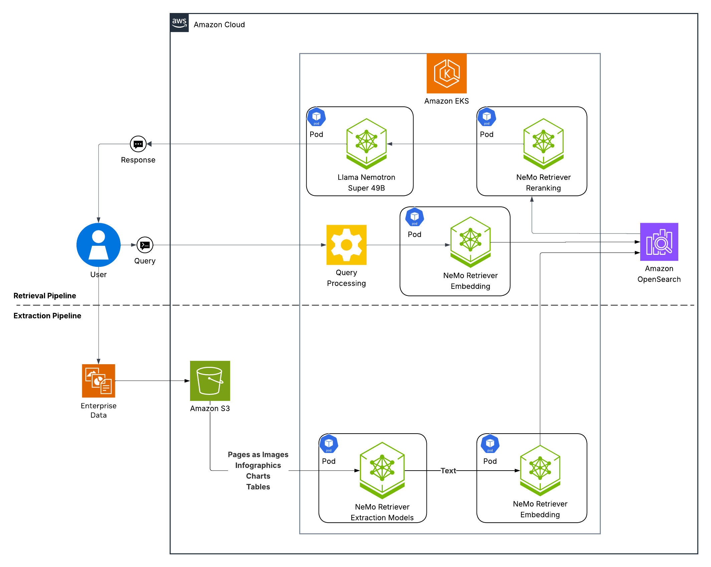

# OpenSearch Integration Guide for Enterprise RAG Blueprint on EKS

This guide covers the integration of Amazon OpenSearch Serverless with the NVIDIA Enterprise RAG Blueprint on Amazon EKS.

## Prerequisites

Before starting this guide, you must complete the infrastructure setup steps from the [main README](../README.md):
- ✅ **Tasks 1-4**: EKS cluster creation, GPU node group, GPU operator, storage, and NGC API key setup

> **Important**: Complete Tasks 1-4 from the [main README](../README.md) before proceeding with this OpenSearch integration guide.

## Architecture Overview

This deployment replaces the default Milvus vector database with Amazon OpenSearch Serverless, providing:
- **Managed Service**: No infrastructure management required
- **Auto-scaling**: Automatic capacity adjustments based on workload
- **IAM Integration**: Secure access using IAM Roles for Service Accounts (IRSA)
- **Separation of Concerns**: Decoupled storage and compute



## Table of Contents

- [Task 6-OS: Setup OpenSearch Serverless Collection](#task-6-os-setup-opensearch-serverless-collection)
- [Task 7-OS: Configure OpenSearch Access using IRSA](#task-7-os-configure-opensearch-access-using-irsa)
- [Task 8-OS: Integrate OpenSearch Files](#task-8-os-integrate-opensearch-files)
- [Task 9-OS: Build OpenSearch-Enabled Docker Images](#task-9-os-build-opensearch-enabled-docker-images)
- [Task 10-OS: Deploy RAG Blueprint with OpenSearch](#task-10-os-deploy-rag-blueprint-with-opensearch)
- [Task 11-OS: Setup Port Forwarding for RAG Services](#task-11-os-setup-port-forwarding-for-rag-services)
- [Task 12-OS: Verify RAG Deployment](#task-12-os-verify-rag-deployment)
- [Returning to Main Deployment Flow](#returning-to-main-deployment-flow)
- [Cleanup](#cleanup)

---

## Task 6-OS: Setup OpenSearch Serverless Collection

### Set OpenSearch Environment Variables

First, set the required environment variables for OpenSearch configuration:

```bash
# OpenSearch Configuration
export OPENSEARCH_SERVICE_ACCOUNT="opensearch-access-sa"
export OPENSEARCH_NAMESPACE="rag"
export OPENSEARCH_IAM_ROLE_NAME="EKSOpenSearchServerlessRole"
export COLLECTION_NAME="rag-vector-collection"
export POLICY_NAME="${COLLECTION_NAME}-policy"

# Get AWS Account ID if not already set
export ACCOUNT_ID=$(aws sts get-caller-identity --query Account --output text)
```

### Create OpenSearch Serverless Resources

Now you'll create the OpenSearch Serverless collection with the necessary security policies.

#### Verify Variables

Ensure all required variables are set:

```bash
# Verify required variables are set
echo "Region: $REGION"
echo "Cluster: $CLUSTER_NAME" 
echo "Collection: $COLLECTION_NAME"
echo "Account ID: $ACCOUNT_ID"
echo "IRSA Role: $OPENSEARCH_IAM_ROLE_NAME"
```

#### Create Data Access Policy

Create the OpenSearch Serverless data access policy that will grant permissions to the IRSA role:

```bash
# Create access policy using the service account IAM role
aws opensearchserverless create-access-policy \
  --type data \
  --name "$POLICY_NAME" \
  --policy "[{\"Rules\":[{\"ResourceType\":\"collection\",\"Resource\":[\"collection/$COLLECTION_NAME\"],\"Permission\":[\"aoss:CreateCollectionItems\",\"aoss:DeleteCollectionItems\",\"aoss:UpdateCollectionItems\",\"aoss:DescribeCollectionItems\"]},{\"ResourceType\":\"index\",\"Resource\":[\"index/$COLLECTION_NAME/*\"],\"Permission\":[\"aoss:ReadDocument\",\"aoss:WriteDocument\",\"aoss:CreateIndex\",\"aoss:DeleteIndex\",\"aoss:UpdateIndex\",\"aoss:DescribeIndex\"]}],\"Principal\":[\"arn:aws:iam::${ACCOUNT_ID}:role/${OPENSEARCH_IAM_ROLE_NAME}\"]}]" \
  --region "$REGION"
```

#### Create Encryption Policy

```bash
aws opensearchserverless create-security-policy \
  --type encryption \
  --name "$POLICY_NAME" \
  --policy "{\"Rules\":[{\"Resource\":[\"collection/$COLLECTION_NAME\"],\"ResourceType\":\"collection\"}],\"AWSOwnedKey\":true}" \
  --region "$REGION"
```

#### Create Network Policy

```bash
aws opensearchserverless create-security-policy \
  --type network \
  --name "$POLICY_NAME" \
  --policy "[{\"Rules\":[{\"Resource\":[\"collection/$COLLECTION_NAME\"],\"ResourceType\":\"collection\"}],\"AllowFromPublic\":true}]" \
  --region "$REGION"
```

#### Create Collection

```bash
aws opensearchserverless create-collection \
  --name "$COLLECTION_NAME" \
  --type VECTORSEARCH \
  --region "$REGION"
```

#### Get Collection Endpoint

```bash
# Wait for collection to become ACTIVE (may take 2-3 minutes), then get endpoint
export OPENSEARCH_ENDPOINT=$(aws opensearchserverless batch-get-collection --names "$COLLECTION_NAME" --region "$REGION" --query 'collectionDetails[0].collectionEndpoint' --output text)
echo "✅ OpenSearch endpoint: $OPENSEARCH_ENDPOINT"
```

---

## Task 7-OS: Configure OpenSearch Access using IRSA

We'll use IAM Roles for Service Accounts (IRSA) to provide secure, pod-level access to OpenSearch Serverless.

### Task 7a: Associate OIDC Provider with EKS Cluster

> **Note**: If you completed Task 3 (EBS CSI driver setup), the OIDC provider is already associated. Running this command again is safe and will confirm the association.

```bash
# Associate IAM OIDC provider with the cluster (idempotent - safe to run multiple times)
eksctl utils associate-iam-oidc-provider \
  --region=$REGION \
  --cluster=$CLUSTER_NAME \
  --approve

# Verify OIDC provider was created
OIDC_ISSUER=$(aws eks describe-cluster --name $CLUSTER_NAME --region $REGION --query 'cluster.identity.oidc.issuer' --output text)
echo "✅ OIDC Issuer configured: $OIDC_ISSUER"
```

### Task 7b: Create OpenSearch IAM Policy

Create the IAM policy that defines OpenSearch Serverless permissions:

```bash
# Create the IAM policy document
cat > opensearch-serverless-policy.json << EOF
{
    "Version": "2012-10-17",
    "Statement": [
        {
            "Effect": "Allow",
            "Action": [
                "aoss:CreateCollectionItems",
                "aoss:DeleteCollectionItems", 
                "aoss:UpdateCollectionItems",
                "aoss:DescribeCollectionItems",
                "aoss:ReadDocument",
                "aoss:WriteDocument",
                "aoss:CreateIndex",
                "aoss:DeleteIndex",
                "aoss:UpdateIndex",
                "aoss:DescribeIndex",
                "aoss:APIAccessAll"
            ],
            "Resource": "*"
        },
        {
            "Effect": "Allow",
            "Action": [
                "aoss:ListCollections",
                "aoss:BatchGetCollection",
                "aoss:GetCollectionItems",
                "aoss:DescribeCollection"
            ],
            "Resource": "*"
        }
    ]
}
EOF

# Create the IAM policy
aws iam create-policy \
  --policy-name OpenSearchServerlessAccess \
  --policy-document file://opensearch-serverless-policy.json \
  --description "Policy for service accounts to access OpenSearch Serverless collections"

# Clean up policy file
rm opensearch-serverless-policy.json

# Set the policy ARN variable
OPENSEARCH_POLICY_ARN="arn:aws:iam::${ACCOUNT_ID}:policy/OpenSearchServerlessAccess"
```

### Task 7c: Create Namespace and IAM Service Account

```bash
# Create the RAG namespace if it doesn't exist
kubectl create namespace $OPENSEARCH_NAMESPACE --dry-run=client -o yaml | kubectl apply -f -

# Create IAM role with trust policy for the service account
eksctl create iamserviceaccount \
  --cluster=$CLUSTER_NAME \
  --namespace=$OPENSEARCH_NAMESPACE \
  --name=$OPENSEARCH_SERVICE_ACCOUNT \
  --role-name=$OPENSEARCH_IAM_ROLE_NAME \
  --attach-policy-arn=$OPENSEARCH_POLICY_ARN \
  --region=$REGION \
  --approve

# Verify the service account was created
kubectl get serviceaccount $OPENSEARCH_SERVICE_ACCOUNT -n $OPENSEARCH_NAMESPACE
```

---

## Task 8-OS: Integrate OpenSearch Files

Clone the RAG source code and integrate OpenSearch support:

> **Note**: Run these commands from the `rag-blueprint-eks` directory.

```bash
# Clone RAG source code (this will create a 'rag' directory)
git clone -b v2.3.0 https://github.com/NVIDIA-AI-Blueprints/rag.git rag

# Copy OpenSearch implementation into RAG source
cp -r opensearch/vdb/opensearch rag/src/nvidia_rag/utils/vdb/
cp opensearch/main.py rag/src/nvidia_rag/ingestor_server/main.py 
cp opensearch/vdb/__init__.py rag/src/nvidia_rag/utils/vdb/__init__.py
cp opensearch/pyproject.toml rag/pyproject.toml
```

---

## Task 9-OS: Build OpenSearch-Enabled Docker Images

Build custom Docker images with OpenSearch support and push to ECR:

> **Note**: Run these commands from the `rag-blueprint-eks` directory.

```bash
# Login to NGC registry
docker login nvcr.io  # username: $oauthtoken, password: NGC API Key

# Build and push OpenSearch-enabled RAG images to ECR
./opensearch/build-opensearch-images.sh
```

This script will:
- Build Docker images with OpenSearch integration
- Tag images with version `2.3.0-opensearch`
- Push to your ECR registry

---

## Task 10-OS: Deploy RAG Blueprint with OpenSearch

Deploy the RAG Blueprint using the OpenSearch-enabled images and IRSA service account:

> **Note**: Run these commands from the `rag-blueprint-eks` directory (parent directory of `opensearch/`).

```bash
# Set deployment variables
export ECR_REGISTRY="${ACCOUNT_ID}.dkr.ecr.${REGION}.amazonaws.com"
export IMAGE_TAG="2.3.0-opensearch"

# Deploy RAG with OpenSearch configuration
cd ..
helm upgrade --install rag -n rag \
  https://helm.ngc.nvidia.com/nvidia/blueprint/charts/nvidia-blueprint-rag-v2.3.0.tgz \
  --username '$oauthtoken' \
  --password "${NGC_API_KEY}" \
  --create-namespace \
  --set imagePullSecret.password=$NGC_API_KEY \
  --set ngcApiSecret.password=$NGC_API_KEY \
  --set serviceAccount.create=false \
  --set serviceAccount.name=$OPENSEARCH_SERVICE_ACCOUNT \
  --set image.repository="${ECR_REGISTRY}/nvidia-rag-server" \
  --set image.tag="${IMAGE_TAG}" \
  --set ingestor-server.image.repository="${ECR_REGISTRY}/nvidia-rag-ingestor" \
  --set ingestor-server.image.tag="${IMAGE_TAG}" \
  --set envVars.APP_VECTORSTORE_URL="${OPENSEARCH_ENDPOINT}" \
  --set envVars.APP_VECTORSTORE_AWS_REGION="${REGION}" \
  --set ingestor-server.envVars.APP_VECTORSTORE_URL="${OPENSEARCH_ENDPOINT}" \
  --set ingestor-server.envVars.APP_VECTORSTORE_AWS_REGION="${REGION}" \
  -f helm/values-os.yaml

# Patch ingestor-server deployment to use IRSA service account
kubectl patch deployment ingestor-server -n rag \
  -p "{\"spec\":{\"template\":{\"spec\":{\"serviceAccountName\":\"$OPENSEARCH_SERVICE_ACCOUNT\"}}}}"
```

This deploys:
- **Reasoning Model** (nano-8b, 2 GPUs)
- **Embedding & Reranking Models**
- **Data Ingestion Models** (OCR, table extraction, page elements)
- **RAG Server** with OpenSearch Serverless integration
- **Frontend** for user interaction

---

## Task 11-OS: Setup Port Forwarding for RAG Services

To securely access RAG services, use kubectl port-forward:

```bash
# Port-forward RAG frontend (run in a separate terminal)
kubectl port-forward -n rag svc/rag-frontend 3000:3000

# Port-forward RAG server (run in another separate terminal)
kubectl port-forward -n rag svc/rag-server 8081:8081

# Port-forward ingestor server (run in another separate terminal)
kubectl port-forward -n rag svc/ingestor-server 8082:8082
```

> **Note**: These commands will run in the foreground. Open separate terminal windows for each port-forward command, or run them in the background.

**Access the Services:**

Once port-forwarding is active, you can access the services at:
- **RAG Frontend**: http://localhost:3000
- **RAG Server**: http://localhost:8081
- **Ingestor Server**: http://localhost:8082

---

## Task 12-OS: Verify RAG Deployment

Check that all RAG components are running:

```bash
# Check all pods in RAG namespace
kubectl get all -n rag

# Wait for all pods to be ready
kubectl wait --for=condition=ready pod -l app.kubernetes.io/instance=rag -n rag --timeout=600s

# Check specific components
kubectl get pods -n rag -o wide | grep -E "NAME|nim-llm|rag-server|ingestor|embedding|reranking"

# Verify service accounts are using IRSA
kubectl get pod -n rag -l app.kubernetes.io/component=rag-server -o jsonpath='{.items[0].spec.serviceAccountName}' | xargs -I {} echo "RAG Server service account: {}"
kubectl get pod -n rag -l app=ingestor-server -o jsonpath='{.items[0].spec.serviceAccountName}' | xargs -I {} echo "Ingestor Server service account: {}"
```

---

## Returning to Main Deployment Flow

✅ **OpenSearch Integration Complete!**

You have successfully deployed the Enterprise RAG Blueprint with Amazon OpenSearch Serverless integration.

### Next Steps

Return to the [main README](../README.md#task-6-access-the-rag-app-services) to continue with:
- **Task 6: Access the RAG App Services**
- **Task 7: Test the RAG Application via UI**
- **Task 8: Test the RAG Application via API**
- **S3 Data Ingestion (Optional)**
- **Cleanup and Uninstallation**

> **Note**: All remaining tasks are identical for both Milvus and OpenSearch deployments.

---

## Cleanup

When you're done with your OpenSearch deployment, follow these steps to clean up all OpenSearch-related resources.

### Delete OpenSearch Serverless Resources

```bash
# Set the variables
export REGION=us-east-1
export COLLECTION_NAME="rag-vector-collection"
export POLICY_NAME="${COLLECTION_NAME}-policy"
export ACCOUNT_ID=$(aws sts get-caller-identity --query Account --output text)

# Delete the OpenSearch Serverless collection
echo "🗑️  Deleting OpenSearch Serverless collection..."
# Get the collection ID first (delete requires ID, not name)
COLLECTION_ID=$(aws opensearchserverless batch-get-collection \
  --names "$COLLECTION_NAME" \
  --region "$REGION" \
  --query 'collectionDetails[0].id' \
  --output text)

aws opensearchserverless delete-collection \
  --id "$COLLECTION_ID" \
  --region "$REGION"

echo "✅ Collection deletion initiated (may take a few minutes)"

# Delete the security policies
echo "🗑️  Deleting network security policy..."
aws opensearchserverless delete-security-policy \
  --type network \
  --name "$POLICY_NAME" \
  --region "$REGION"

echo "🗑️  Deleting encryption security policy..."
aws opensearchserverless delete-security-policy \
  --type encryption \
  --name "$POLICY_NAME" \
  --region "$REGION"

# Delete the data access policy
echo "🗑️  Deleting data access policy..."
aws opensearchserverless delete-access-policy \
  --type data \
  --name "$POLICY_NAME" \
  --region "$REGION"

echo "✅ OpenSearch Serverless policies deleted"
```

### Delete IAM Resources

```bash
# Delete the IAM role and service account
echo "🗑️  Deleting IAM service account and role..."
eksctl delete iamserviceaccount \
  --cluster=$CLUSTER_NAME \
  --namespace=rag \
  --name=opensearch-access-sa \
  --region=$REGION

# Delete the IAM policy
echo "🗑️  Deleting OpenSearch IAM policy..."
aws iam delete-policy \
  --policy-arn arn:aws:iam::${ACCOUNT_ID}:policy/OpenSearchServerlessAccess

echo "✅ IAM resources cleaned up"
```

### Delete Custom Docker Images (Optional)

If you want to clean up the custom Docker images from ECR:

```bash
# Set ECR registry
export ECR_REGISTRY="${ACCOUNT_ID}.dkr.ecr.${REGION}.amazonaws.com"

# Delete RAG server image repository
echo "🗑️  Deleting RAG server ECR repository..."
aws ecr delete-repository \
  --repository-name nvidia-rag-server \
  --region $REGION \
  --force

# Delete ingestor image repository
echo "🗑️  Deleting ingestor ECR repository..."
aws ecr delete-repository \
  --repository-name nvidia-rag-ingestor \
  --region $REGION \
  --force

echo "✅ ECR repositories deleted"
```

### Cleanup Summary

After completing these steps, you will have removed:
- ✅ OpenSearch Serverless collection
- ✅ Network and encryption security policies
- ✅ Data access policy
- ✅ IAM service account and role
- ✅ IAM policy for OpenSearch access
- ✅ Custom Docker images (optional)

> **Note**: Return to the [main README cleanup section](../README.md#cleanup-and-uninstallation) to complete the standard cleanup steps (RAG Blueprint and cluster deletion if desired).
