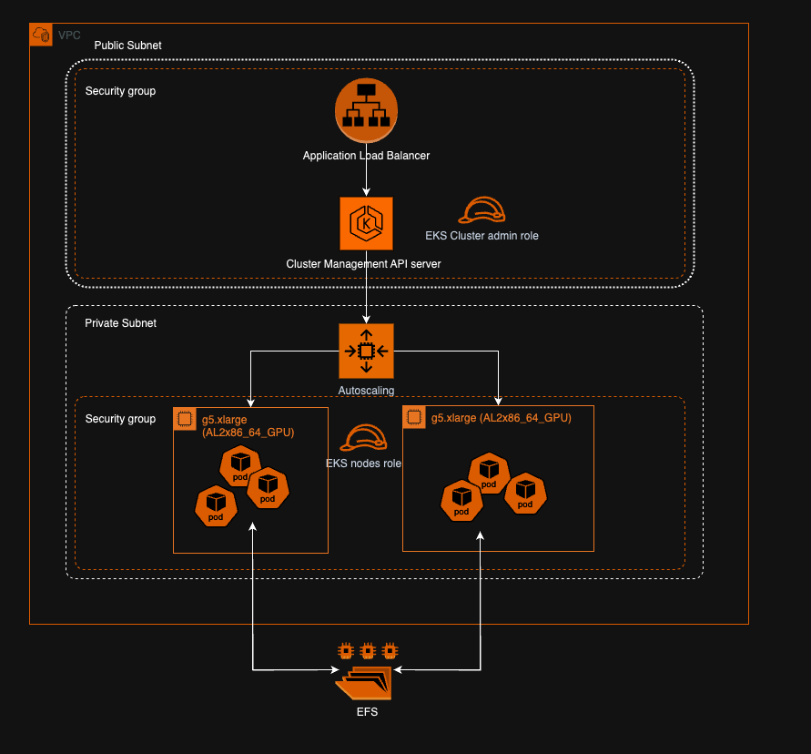

# NVIDIA NIM on AWS EKS:

This repository is dedicated to testing NVIDIA NIM on AWS EKS (Elastic Kubernetes Service).

## AWS Infrastructure setup:

1:Refer this high-level architecture diagram for an overview of the setup


2: Refer this to prepare your local environment to run cdk
https://docs.aws.amazon.com/cdk/v2/guide/getting_started.html

There are four stacks in the nim-eks-cdk/lib directory. You can either deploy all of them using `cdk deploy --all` or deploy each stack by specifying the stack name
like `cdk deploy vpc-stack`

Stack Deployment Order:

    cdk deploy vpc-stack
    cdk deploy eks-cluster-stack
    cdk deploy efs-stack

Note: Ensure that you are in the nim-eks-cdk directory to run the above mentioned commands

ClusterAdmin user is created by the cdk. Create access keys for this user to run kubectl and helm commands. Once secret credentials are created run the following command to manage the cluster

    aws eks update-kubeconfig --name <eks-cluster-name> --region <region-code> --profile <profile-name-if-any>

Note: Ensure that you are in the cloud-service-providers/aws/eks directory for the rest of this guide.

## Cluster setup for inference:

For the NIM Operator, here are the [instructions](nim-operator-setup.md). 

To install the NIM Helm Chart, here are the steps:

1: Install NVIDIA Device Plugin: Install NVIDIA device plugins to run GPU workloads. Check CUDA base image version for compatibility.

    kubectl create -f https://raw.githubusercontent.com/NVIDIA/k8s-device-plugin/v0.14.1/nvidia-device-plugin.yml

Note: The CDK in this repo spins up AWS G5 instances with OS - Amazon linux 2.  
`v0.14.1 version for Nvidia device plugins is compatible with Amazon linux 2`

We can also validate if the plugin installation was successful.

    kubectl get nodes "-o=custom-columns=NAME:.metadata.name,GPU:.status.allocatable.nvidia\.com/gpu"

2: Create a kubernetes secret for NGC_API_KEY

    export NGC_API_KEY=<NGC_API_KEY>
    kubectl create secret generic ngc-api --from-literal=NGC_CLI_API_KEY=$NGC_API_KEY

3: Create Docker Registry Secret:

    kubectl create secret generic registry-secret  \
    --from-file=.dockerconfigjson=/path/to/.docker/config.json \
    --type=kubernetes.io/dockerconfigjson

Note: If you are not logged in to the nvcr.io container registry, run docker login nvcr.io using the NGC API key

    docker login nvcr.io
    username: $oauthtoken
    password: $NGC_API_KEY

# Monitoring

1. Install prometheus stack using helm.

```

      helm repo add prometheus-community https://prometheus-community.github.io/helm-charts
      helm repo update
      helm install prometheus prometheus-community/kube-prometheus-stack
```

2. Install prometheus adapter (this is to scale up/down pods based on custom metrics pushed by the application to the prometheus instance)

```
      helm install prometheus-adapter prometheus-community/prometheus-adapter -f monitoring/custom-rules.yaml
```

# NIM Deployment

1.         bash setup/setup.sh

    Note: This setup script (directory: nim-deploy/setup)creates two storage classes- EFS and EBS. The necessary csi drivers are installed as add-ons by the CDK.

2.  Use Helm to deploy the custom-values.yaml.
    a) EBS volume:

         helm install nim-llm ../../../helm/nim-llm/ -f storage/custom-values-ebs-sc.yaml

    b) EFS storage:

         helm install nim-llm ../../../helm/nim-llm/ -f storage/custom-values-efs-sc.yaml

    c) Host path storage:

         helm install nim-llm ../../../helm/nim-llm/ -f storage/custom-values-host-path.yaml

         Note: Since we are running pods as non-root user, cache path specified in the custom-values-host-path.yaml should be created on the EC2 instance prior to installing helm. Also the directory ownership should be assigned to 1000:1000 (or any no root uid:gid as specified in the custom-values.yaml)

3.  Use ingress.yaml to add an alb ingress controller.

         kubectl apply -f ingress.yaml

# Sample request and response:
Get the DNS of the Load Balancer created in the previous step:
```
ELB_DNS=$(aws elbv2 describe-load-balancers --query "LoadBalancers[*].{DNSName:DNSName}")
```
Send as sample request:

```
curl -X 'POST' \
  "http://${ELB_DNS}/v1/chat/completions" \
  -H 'accept: application/json' \
  -H 'Content-Type: application/json' \
  -d '{
    "messages": [
    {
        "content": "You are a polite and respectful chatbot helping people plan a vacation.",
        "role": "system"
    },
    {
        "content": "What should I do for a 4 day vacation in Spain?",
        "role": "user"
    }
   ],
   "model": "meta/llama3-8b-instruct",
   "max_tokens": 16,
   "top_p": 1,
   "n": 1,
   "stream": false,
   "stop": "\n",
   "frequency_penalty": 0.0
}'

```
Response:

```
    {
    "id": "cmpl-ba02077a544e411f8ba2ff9f38a6917a",
    "object": "chat.completion",
    "created": 1717642306,
    "model": "meta/llama3-8b-instruct",
    "choices": [
        {
            "index": 0,
            "message": {
                "role": "assistant",
                "content": "Spain is a wonderful destination! With four days, you can easily explore one or"
            },
            "logprobs": null,
            "finish_reason": "length",
            "stop_reason": null
        }
    ],
    "usage": {
        "prompt_tokens": 42,
        "total_tokens": 58,
        "completion_tokens": 16
    }
}
```

# Gen-ai perf tool

      kubectl apply -f perf/gen-ai-perf.yaml

ssh into the triton pod

      kubectl exec -it triton -- bash

Run the following command

      NIM_MODEL_NAME="meta/llama3-8b-instruct"
      server_url=http://nim-llm-service:8000
      concurrency=20
      input_tokens=128
      output_tokens=10

      genai-perf -m $NIM_MODEL_NAME --endpoint v1/chat/completions --endpoint-type chat \
      --service-kind openai --streaming \
      -u $server_url \
      --num-prompts 100 --prompt-source synthetic \
      --synthetic-input-tokens-mean $input_tokens \
      --synthetic-input-tokens-stddev 50 \
      --concurrency $concurrency \
      --extra-inputs max_tokens:$output_tokens \
      --extra-input ignore_eos:true \
      --profile-export-file test_chat_${concurrency}
