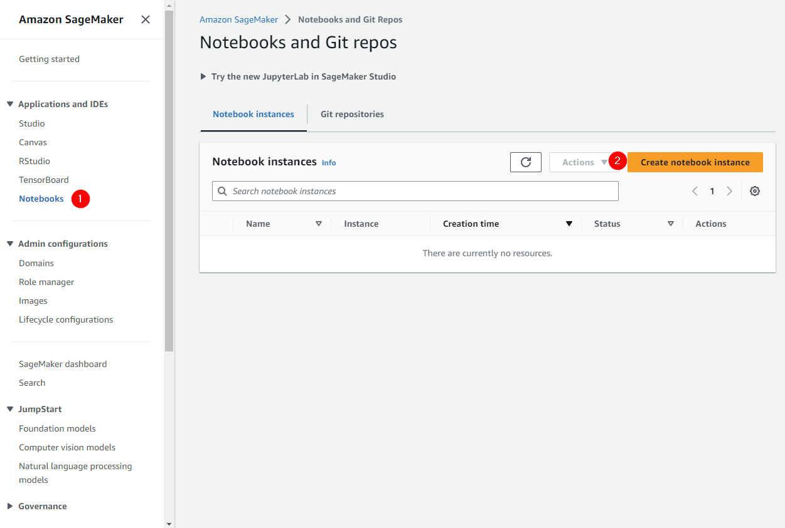
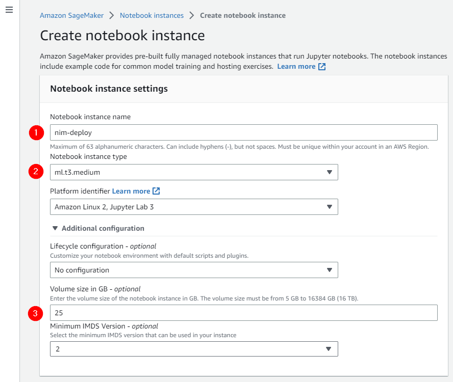
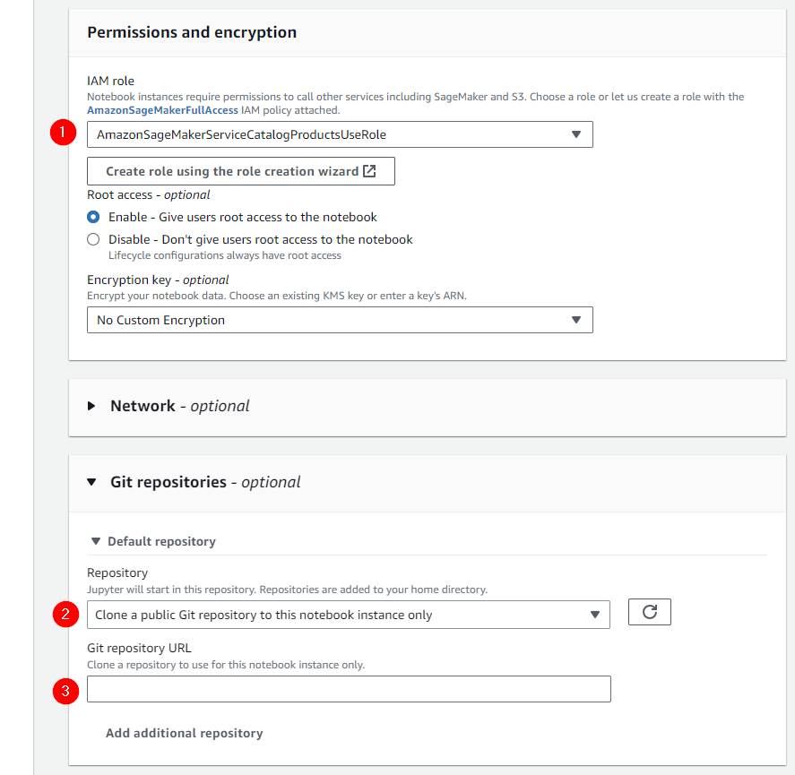

# NVIDIA NIM on AWS Sagemaker

## AWS Sagemaker Notebook Configuration

- Login to AWS and navigate to the **Amazon Sagemaker** service
- Configure a SageMaker notebook using instance type `ml.t3.medium`
 

- Configure the instance with enough storage to accommodate container image pull(s) - `25GB` should be adequate
 

- Ensure IAM role `AmazonSageMakerServiceCatalogProductsUseRole` is associated with your notebook
  - Note you may need to associate additional permissions with this role to permit ECR `CreateRepository` and image push operations
- Configure the Default repository and reference this repo: https://github.com/NVIDIA/nim-deploy.git
- Click **Create notebook instance**
 
