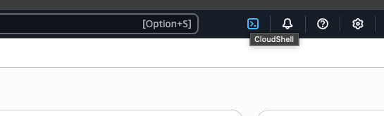

# Deploy RAG application using NVIDIA LLM and NeMo Retriever NIMs on Amazon Elastic Kubernetes Service (EKS) Workshop

## Table of Contents

- [Diagram](#diagram)
- [Introduction](#introduction)
- [What you will learn](#what-you-will-learn)
- [Learn the Components](#learn-the-components)
- [Setup and Requirements](#setup-and-requirements)
- [Task 1. Infrastructure Deployment](#task-1-infrastructure-deployment)
- [Task 2. Configure NVIDIA NGC API Key](#task-2-configure-nvidia-ngc-api-key)
- [Task 3. Deploying NVIDIA NIM](#task-3-deploying-nvidia-nim)
- [Task 4. Deploying NeMo Retriever Embedding Microservice](#task-4-deploying-nemo-retriever-embedding-microservice)
- [Task 5. Deploying Milvus](#task-5-deploying-milvus)
- [Task 6. Deploying Chain Server & RAG Playground](#task-6-deploying-chain-server--rag-playground)
- [Task 7. Access the RAG Playground Frontend Service](#task-7-access-the-rag-playground-frontend-service)
- [Congratulations!](#congratulations)

## Diagram


## Introduction

This workshop will guide you through deploying a [Retrieval Augmented Generation (RAG) text Q&A agent microservice](https://catalog.ngc.nvidia.com/orgs/nvidia/teams/aiworkflows/helm-charts/rag-app-text-chatbot-langchain) on Amazon Elastic Kubernetes Service (EKS). You'll leverage the power of NVIDIA Inference Microservices (NIMs) and Nemo LLM Retriever Embedding to build a robust question-answering system. This system utilizes Milvus as the vector store to manage embeddings and generate accurate responses to user queries.

This workshop is ideal for developers and data scientists interested in:

- **Building RAG applications**: Learn how to construct a complete RAG pipeline using NVIDIA's pre-built microservices and open-source tools.
- **Optimizing LLM inference**: Explore how to deploy and utilize TensorRT optimized LLMs for efficient inference within a microservice architecture.
- **Leveraging vector databases**: Understand how to use Milvus to store and query embeddings for semantic search in a RAG workflow.

## What you will learn

By the end of this workshop, you will have hands-on experience with:

1. **Deploying a RAG pipeline on EKS**: Learn to deploy a complete RAG pipeline, including LLM, embedding, and retriever microservices, onto your EKS cluster using NVIDIA NIMs.
2. **Integrating with Milvus vector database**: Understand how to connect your RAG pipeline to a Milvus vector store for efficient storage and retrieval of embeddings.
3. **Utilizing the NVIDIA Langchain wrapper**: Gain familiarity with the NVIDIA Langchain wrapper for seamless interaction with deployed NIMs.
4. **Managing and scaling your RAG deployment**: Explore techniques for managing, monitoring, and scaling your RAG pipeline using Kubernetes features to ensure optimal performance and resource utilization.

## Learn the Components

### GPUs in Amazon Elastic Kubernetes Service (EKS)

GPUs let you accelerate specific workloads running on your nodes such as machine learning and data processing. EKS provides a range of machine type options for node configuration, including machine types with NVIDIA L40S, A10G, A100, H100, H200 GPUs.

### NVIDIA NIMs

[NVIDIA NIMs](https://www.nvidia.com/en-us/ai/) are a set of easy-to-use inference microservices for accelerating the deployment of foundation models on any cloud or data center and helping to keep your data secure.

### NVIDIA NeMo Retriever Microservice

[NVIDIA NeMo Retriever](https://developer.nvidia.com/blog/develop-production-grade-text-retrieval-pipelines-for-rag-with-nvidia-nemo-retriever), part of [NVIDIA NeMo](https://www.nvidia.com/en-us/ai-data-science/products/nemo/), is a collection of generative AI microservices that enable organizations to seamlessly connect custom models to diverse business data and deliver highly accurate responses.

### NVIDIA AI Enterprise

[NVIDIA AI Enterprise](https://www.nvidia.com/en-us/data-center/products/ai-enterprise/) is an end-to-end, cloud-native software platform that accelerates data science pipelines and streamlines development and deployment of production-grade co-pilots and other generative AI applications. Available through [AWS Marketplace](https://aws.amazon.com/marketplace/pp/prodview-ozgjkov6vq3l6?sr=0-2&ref_=beagle&applicationId=AWSMPContessa).

### Chain Server

NVIDIA developed a chain server that communicates with the inference server. The server also supports retrieving embeddings from the vector database before submitting a query to the inference server to perform retrieval augmented generation.

### Vector Database

The Chain Server supports connecting to either Milvus or pgvector. NVIDIA provides a sample RAG pipeline that deploys Milvus to simplify demonstrating the inference and embedding microservices.

### RAG Playground

The application provides a user interface for entering queries that are answered by the inference microservice. The application also supports uploading documents that the embedding microservice processes and stores as embeddings in a vector database.

## Setup and Requirements

### What you need

To complete this lab, you need:

- Access to a standard internet browser (Chrome browser recommended).
- Access to an AWS Account with access to GPU A10G or L40S instances on AWS i.e. g5 or g6e instances respectively. You will need a minimum of `2` GPUs, `3` GPUs if you want to run vector DB on GPU. `1` GPU for LLM and `1` for Embedding NIM. Milvus Vector DB can run on CPU or GPU. If you want to run milvus on GPU you will need the `3rd` GPU
- Sufficient AWS IAM Permission
- Time to complete the lab.

### How to start your lab and sign in to the AWS Cloud Console

### Activate Cloud Shell

Cloud Shell is a virtual machine that is loaded with development tools. It offers a persistent home directory and runs on the AWS Cloud. Cloud Shell provides command-line access to your AWS Cloud resources.

In the AWS Console, in the top right toolbar, click the **Activate Cloud Shell** button.



It takes a few moments to provision and connect to the environment.


`AWS CLI` is the command-line tool for AWS Cloud. It comes pre-installed on Cloud Shell and supports tab-completion.

## Task 1. Infrastructure Deployment

1. **Open Cloud Shell** and install pre-reqs:

   The Cloud Shell environment comes preinstalled with `kubectl` which is the native CLI tool to manage Kubernetes objects within your Amazon EKS clusters

   - `eksctl` - The `eksctl` CLI is used to work with EKS clusters. It automates many individual tasks. See [the documentation](https://eksctl.io/installation/) for more information
   - `helm` - The Helm package manager for Kubernetes helps you install and manage applications on your Kubernetes cluster. See [the documentation](https://docs.helm.sh/) for more information

   **Install `eksctl`:**

   ```bash
   # for ARM systems, set ARCH to: `arm64`, `armv6` or `armv7`
   ARCH=amd64
   PLATFORM=$(uname -s)_$ARCH

   curl -sLO "https://github.com/eksctl-io/eksctl/releases/latest/download/eksctl_$PLATFORM.tar.gz"

   # (Optional) Verify checksum
   curl -sL "https://github.com/eksctl-io/eksctl/releases/latest/download/eksctl_checksums.txt" | grep $PLATFORM | sha256sum --check

   tar -xzf eksctl_$PLATFORM.tar.gz -C /tmp && rm eksctl_$PLATFORM.tar.gz

   sudo mv /tmp/eksctl /usr/local/bin
   ```

   **Install `helm`:**

   ```bash
   curl -fsSL -o get_helm.sh https://raw.githubusercontent.com/helm/helm/main/scripts/get-helm-3
   chmod 700 get_helm.sh
   ./get_helm.sh
   ```

2. **Specify the following parameters**

   Below `1` instance of `g5.12xlarge` (which comes with 4 A10G GPUs) has been specified. You can change the instance type and count to match the requirement. For example you can use `1` `g6e.12xlarge` (4 L40S GPUs) or `2-3` `g5.8xlarge` or `g6e.8xlarge` instances. Refer to [what you need section above](#what-you-need)

   ```bash
   export REGION=us-east-1 # switch to a region of your choice
   export CLUSTER_NAME=EKSrag
   export NUM_INSTANCES=1
   export INSTANCE_TYPE="g5.12xlarge" 
   ```

3. **Create EKS Cluster**

   ```bash
   eksctl create cluster --name $CLUSTER_NAME --region $REGION --node-type $INSTANCE_TYPE --nodes $NUM_INSTANCES
   ```

   By selecting a GPU instance type, `eksctl` will automatically install the [NVIDIA Device Plugin for Kubernetes](https://catalog.ngc.nvidia.com/orgs/nvidia/helm-charts/nvidia-device-plugin) which exposes the number of GPUs on each nodes in the EKS cluster and allows GPU workloads to be scheduled.

   **Get Credentials:**

   > **Note**: Wait for the cluster creation to complete before proceeding to get the credentials

   ```bash
   aws eks update-kubeconfig --region $REGION --name $CLUSTER_NAME
   ```

   ```bash
   kubectl config get-contexts
   ```

   You should see output like this:

   ```bash
   $ kubectl config get-contexts

   CURRENT   NAME                                                CLUSTER                                             AUTHINFO                                            NAMESPACE
             aolaoye@EKSrag.us-east-1.eksctl.io                  EKSrag.us-east-1.eksctl.io                     aolaoye@EKSrag.us-east-1.eksctl.io                  
   *         arn:aws:eks:us-east-1:XXXXXXXX:cluster/EKSrag   arn:aws:eks:us-east-1:XXXXXXXX:cluster/EKSrag   arn:aws:eks:us-east-1:715841358637:cluster/EKSrag  
   ```

   Also, you can check the cluster nodes:

   ```bash
   ~ $ kubectl get nodes
   NAME                             STATUS   ROLES    AGE   VERSION
   ip-192-168-34-216.ec2.internal   Ready    <none>   22m   v1.32.3-eks-473151a
   ```

## Task 2. Configure NVIDIA NGC API Key

The first step in the pipeline is to deploy an inference NIM - this will be used to host the LLM that will be responsible for generating responses for a given set of user queries. In order to get started with NIM, we'll need to make sure we have access to an [NGC API key](https://org.ngc.nvidia.com/setup/api-key). We can export this key to be used an environment variable:

```bash 
export NGC_CLI_API_KEY="<YOUR NGC API KEY>"
```

## Task 3. Deploying NVIDIA NIM

1. **Open Cloud Shell**

2. **Fetch the NIM LLM Helm chart**

   Now that we've configured the NGC API key, we can download the NIM LLM Helm chart from NGC using the following command:

   ```bash
   helm fetch https://helm.ngc.nvidia.com/nim/charts/nim-llm-1.3.0.tgz --username='$oauthtoken' --password=$NGC_CLI_API_KEY
   ```

3. **Create a NIM Namespace**

   Namespaces are used to manage resources for a specific service or set of services in kubernetes. It's best practice to ensure all the resources for a given service are managed in its corresponding namespace. We will set up the namespaces for the other corresponding services in later steps, but we create a namespace for our NIM service using the following kubectl command:

   ```bash
   # create namespace
   kubectl create namespace nim
   ```

4. **Configure secrets**

   In order to configure and launch an NVIDIA NIM, it is important to configure the secrets we'll need to pull all the model artifacts directly from NGC. This can be done using your NGC API key:

   ```bash
   kubectl create secret docker-registry registry-secret --docker-server=nvcr.io --docker-username='$oauthtoken' --docker-password=$NGC_CLI_API_KEY -n nim
   kubectl create secret generic ngc-api --from-literal=NGC_API_KEY=$NGC_CLI_API_KEY -n nim
   ```

5. **Setup NIM Configuration**

   We deploy the LLama 3 8B instruct NIM for this exercise. In order to configure our NIM, we create a custom value file where we configure the deployment:

   ```bash
   # create nim_custom_value.yaml manifest
   cat <<EOF > nim_custom_value.yaml
   image:
     repository: "nvcr.io/nim/meta/llama3-8b-instruct" # container location
     tag: 1.0.0 # NIM version you want to deploy
   model:
     ngcAPISecret: ngc-api  # name of a secret in the cluster that includes a key named NGC_CLI_API_KEY and is an NGC API key
   imagePullSecrets:
     - name: registry-secret # name of a secret used to pull nvcr.io images, see https://kubernetes.io/docs/tasks/    configure-pod-container/pull-image-private-registry/
   resources:
     limits:
       nvidia.com/gpu: 1
   EOF
   ```

6. **Launching NIM deployment**

   Now we can deploy our NIM microservice to the namespace we created:

   ```bash  
   helm install my-nim nim-llm-1.3.0.tgz -f nim_custom_value.yaml --namespace nim
   ``` 

   Verify NIM pod is running:

   ```bash 
   kubectl get pods -n nim
   ``` 

7. **Testing NIM deployment**

   Once we've verified that our NIM service was deployed successfully. We can make inference requests to see what type of feedback we'll receive from the NIM service. In order to do this, we enable port forwarding on the service to be able to access the NIM from our localhost on port 8000:

   ```bash
   kubectl port-forward service/my-nim-nim-llm 8000:8000 -n nim
   ```

   Next, we can open another terminal or tab in the cloud shell and try the following request:

   ```bash
   curl -X 'POST' \
   'http://localhost:8000/v1/chat/completions' \
   -H 'accept: application/json' \
   -H 'Content-Type: application/json' \
   -d '{
   "messages": [
       {
       "content": "You are a polite and respectful chatbot helping people plan a vacation.",
       "role": "system"
       },
       {
       "content": "What should I do for a 4 day vacation in Spain?",
       "role": "user"
       }
   ],
   "model": "meta/llama3-8b-instruct",
   "max_tokens": 512,
   "top_p": 1,
   "n": 1,
   "stream": false,
   "frequency_penalty": 0.0
   }'
   ``` 

   If you get a chat completion from the NIM service, that means the service is working as expected! From here, we can move on to deploying the NeMo Retriever service.

## Task 4. Deploying NeMo Retriever Embedding Microservice

1. **Fetch NeMo Retriever Embedding Helm Chart**

   The NeMo Retriever microservice can be installed via Helm. As a starting point we can fetch the Helm chart, assuming we still leverage the NGC API Key we configured earlier:

   ```bash
   helm fetch https://helm.ngc.nvidia.com/nim/nvidia/charts/nvidia-nim-llama-32-nv-embedqa-1b-v2-1.6.0.tgz --username='$oauthtoken' --password=$NGC_CLI_API_KEY
   ```

2. **Create NeMo Retriever Namespace**

   We create the NeMo Retriever namespace to manage all the kubernetes related resource for the microservice:

   ```bash  
   kubectl create namespace nrem
   ```

3. **Creating Secrets**

   We need to configure image pull secrets and NGC secrets to enable the pulling of model artifacts from NGC and the NVCR registry. In the next following steps, we configure these secrets using the API key we set as a prerequisite:

   ```bash   
   kubectl create secret -n nrem docker-registry ngc-secret \
   --docker-server=nvcr.io \
   --docker-username='$oauthtoken' \
   --docker-password="${NGC_CLI_API_KEY}"
   ```

   ```bash
   kubectl create secret -n nrem generic ngc-api --from-literal=NGC_API_KEY=${NGC_CLI_API_KEY}
   ```

4. **Install the Helm Chart for Nemo Retriever Embedding Microservice**

   Now that we've configured the secrets we need to pull artifacts from NGC, we can deploy the NeMo retriever microservice via Helm:

   ```bash
   helm upgrade --install \
   --namespace nrem \
   nemo-embedder \
   --set persistence.class="local-nfs" \
   --set image.tag=1.6.0 \
   nvidia-nim-llama-32-nv-embedqa-1b-v2-1.6.0.tgz
   ```

   Ensure all of the pods are in a running state:

   ```bash
   kubectl get pods -n nrem
   ```

   The output should be similar to the following:

   ```bash
   NAME                                                              READY   STATUS    RESTARTS   AGE
   nemo-embedder-nvidia-nim-llama-32-nv-embedqa-1b-v2-58bbf85ctx4b   1/1     Running   0          2m43s
   ```

   Once we've verified the pods are running. We can test by enabling port forwarding on the service to be able to access from our localhost:

   ```bash
   kubectl port-forward -n nrem service/nemo-embedder-nvidia-nim-llama-32-nv-embedqa-1b-v2 8000:8000
   ```

   Next, we can open another terminal or tab in the cloud shell and try the following request:

   ```bash
   curl -X 'POST'   'http://localhost:8000/v1/embeddings'   -H 'accept: application/json'   -H 'Content-Type: application/json'       -d '{
     "input": "hello world",
     "model": "nvidia/llama-3.2-nv-embedqa-1b-v2",
     "input_type": "passage"
   }'
   ```

   We should receive an embedding vector as output from the cURL command. Once we've verified that we're able to ping the service, ctrl + c to stop port forwarding. From here, we can move on to setting up the Milvus microservice.

## Task 5. Deploying Milvus

The RAG application will leverage Milvus as the vector store - we'll be storing any embeddings generated for retrieval purposes in this vector store. When we enable use of the knowledge base, the users query will be vectorized using the embedding NIM and contents semantically similar will be retrieved and injected as context into the inference NIM to improve the quality of the generated output.

1. **Create the Milvus Namespace**

   In order to get started with the Milvus service, we create a namespace that will be used to manage resources specific to the microservice:

   ```bash
   kubectl create namespace vectorstore
   ```

2. **Add the Milvus Repository**

   The Milvus microservice can be installed and managed via Helm charts. We can add the Helm repo by running the following:

   ```bash
   helm repo add milvus https://zilliztech.github.io/milvus-helm/
   ```

   And then updating the repository:

   ```bash
   helm repo update
   ```

3. **Install a host-path dynamic provisioner and configure storage class for persistence**

   ```bash
   # Install Rancher's Local-Path Provisioner – works on single-node cluster
   kubectl apply -f https://raw.githubusercontent.com/rancher/local-path-provisioner/master/deploy/local-path-storage.yaml

   # Make it the default StorageClass
   kubectl patch storageclass local-path \
     -p '{"metadata": {"annotations":{"storageclass.kubernetes.io/is-default-class":"true"}}}'
   ```

4. **Optional!!! Create Custom File to Utilize GPUs**

   In order to leverage the Milvus microservice, we'll need to ensure that we have access to at least one GPU resource. We can configure a file with custom values, to request a GPU for the service:

   ```bash
   cat <<EOF > milvus_custom_value.yaml
   standalone:
     resources:
       requests:
         nvidia.com/gpu: "1"
       limits:
         nvidia.com/gpu: "1"
   EOF
   ```

5. **Install Milvus Helm Chart**

   From here, we can install the Milvus Helm Chart and point to the file we created in the previous section:

   **If Milvus is GPU enabled:**

   To use the storage class deployed above:

   ```bash
   helm install milvus milvus/milvus --set cluster.enabled=false --set etcd.replicaCount=1 --set minio.mode=standalone --set pulsarv3.enabled=false --set global.storageClass=local-path -f milvus_custom_value.yaml -n vectorstore
   ```

   To disable persistence:

   ```bash
   helm upgrade --install milvus milvus/milvus \
   --set cluster.enabled=false \
   --set etcd.replicaCount=1 \
   --set minio.mode=standalone \
   --set pulsarv3.enabled=false \
   --set etcd.persistence.enabled=false \
   --set minio.persistence.enabled=false \
   --set standalone.persistence.enabled=false \
   -f milvus_custom_value.yaml \
   -n vectorstore
   ```

   **Otherwise:**

   To use the storage class deployed above:

   ```bash
   helm install milvus milvus/milvus --set cluster.enabled=false --set etcd.replicaCount=1 --set minio.mode=standalone --set pulsarv3.enabled=false  --set global.storageClass=local-path -n vectorstore
   ```

   To disable persistence:

   ```bash
   helm upgrade --install milvus milvus/milvus \
   --set cluster.enabled=false \
   --set etcd.replicaCount=1 \
   --set minio.mode=standalone \
   --set pulsarv3.enabled=false \
   --set etcd.persistence.enabled=false \
   --set minio.persistence.enabled=false \
   --set standalone.persistence.enabled=false \
   -n vectorstore
   ```

   We can check the status of the pods, which should all be **up and running** in a **Ready** state within a couple of minutes:

   ```bash
   kubectl get pods -n vectorstore
   ```

   Output should look like the following:

   ```bash
   NAME                                READY   STATUS    RESTARTS   AGE
   milvus-etcd-0                       1/1     Running   0          2m23s
   milvus-minio-cd798dd6f-s4rj2        1/1     Running   0          2m24s
   milvus-standalone-d4d948c97-fln68   1/1     Running   0          2m24s
   ```

## Task 6. Deploying Chain Server & RAG Playground

Now that we've deployed all the prerequisite services, we can deploy the chain server and RAG playground services.

1. **Create the Chain Server & RAG Playground Namespace**

   We can create a namespace for the chain server and RAG playground using the following command:

   ```bash
   kubectl create namespace canonical-rag-langchain
   ```

2. **Installing the Helm Pipeline**

   Both the chain server and RAG playground can be installed via Helm. First we fetch the Helm chart from NGC using our API key:

   ```bash
   helm fetch https://helm.ngc.nvidia.com/nvidia/aiworkflows/charts/rag-app-text-chatbot-langchain-24.08.tgz     --username='$oauthtoken' --password=$NGC_CLI_API_KEY
   ```

   Once fetched, we can install the Helm pipeline by running the following:

   ```bash
   helm install canonical-rag-langchain rag-app-text-chatbot-langchain-24.08.tgz -n canonical-rag-langchain --set imagePullSecret.password=$NGC_CLI_API_KEY
   ```

3. **Configure Chain Server to Point to Exposed FQDN Service Names**

   We need to change the chain-server to point to exposed fqdn service names:

   ```bash
   kubectl get svc -n nim

   NAME                 TYPE        CLUSTER-IP       EXTERNAL-IP   PORT(S)    AGE
   my-nim-nim-llm       ClusterIP   10.100.144.104   <none>        8000/TCP   123m
   my-nim-nim-llm-sts   ClusterIP   None             <none>        8000/TCP   123m
   ```

   ```bash
   kubectl get svc -n nrem

   NAME                                                 TYPE        CLUSTER-IP       EXTERNAL-IP   PORT(S)    AGE
   nemo-embedder-nvidia-nim-llama-32-nv-embedqa-1b-v2   ClusterIP   10.100.22.51     <none>        8000/TCP   91m 
   ```

   ```bash
   kubectl set env deployment/chain-server \
     APP_LLM_SERVERURL=my-nim-nim-llm.nim.svc.cluster.local:8000 \
     -n canonical-rag-langchain

   kubectl set env deployment/chain-server \
     APP_EMBEDDINGS_SERVERURL=nemo-embedder-nvidia-nim-llama-32-nv-embedqa-1b-v2.nrem.svc.cluster.local:8000 \
     -n canonical-rag-langchain

    kubectl rollout restart deployment chain-server -n canonical-rag-langchain  
   ```

   We can check the status of the pods, which should all be **up and running** in a **Ready** state within a couple of minutes:

   ```bash  
   kubectl get pods -n canonical-rag-langchain
   ```

   Output should look like the following:

   ```bash
   NAME                             READY   STATUS    RESTARTS   AGE
   chain-server-c67cdb449-ffth4     1/1     Running   0          15s
   rag-playground-76c8fbb46-tl7gn   1/1     Running   0          10m
   ```

   **To troubleshoot:**

   ```bash
   kubectl logs  chain-server-748bb5c5ff-58cw7 -n canonical-rag-langchain
   ```

## Task 7. Access the RAG Playground Frontend Service

The RAG Playground service exposes a UI that enables interaction with the end to end RAG pipeline. A user submits a prompt or a request and this triggers the chain server to communicate with all the necessary services required to generate output.

We need to take a few steps in order to access the service.

1. **Understanding Service Types**

   The service type that's been configured for the RAG playground is a `NodePort` service type. With this service, kubernetes exposes applications to external clients via specific ports on worker nodes.

   Given the exposure via ports on worker nodes, this service type is used purely just for demo purposes and is **NOT** recommended for production workloads for security related reasons.

   For more secure approaches, we recommend configuring services using `ClusterIP` or `LoadBalancer` types.

   We can verify the service types for the RAG playground by running the following command:

   ```bash
   kubectl get svc -n canonical-rag-langchain
   ```

2. **Accessing the Frontend Service**

   In order to access the `NodePort` service, we need to configure a firewall rule to allow TCP traffic on your node port. In order to do this, we need to find the node port our applications are exposed on.

   We can do this using the following command:

   ```bash
   kubectl get service rag-playground --output yaml -n canonical-rag-langchain
   ```

   Output should look like the following:

   ```yaml
   apiVersion: v1
   kind: Service
   metadata:
     annotations:
       meta.helm.sh/release-name: canonical-rag-langchain
       meta.helm.sh/release-namespace: canonical-rag-langchain
     creationTimestamp: "2025-06-01T15:38:08Z"
     labels:
       app.kubernetes.io/managed-by: Helm
     name: rag-playground
     namespace: canonical-rag-langchain
     resourceVersion: "30822"
     uid: dda7ced2-9b00-41e4-b639-5683722d35b3
   spec:
     clusterIP: 10.100.47.249
     clusterIPs:
     - 10.100.47.249
     externalTrafficPolicy: Cluster
     internalTrafficPolicy: Cluster
     ipFamilies:
     - IPv4
     ipFamilyPolicy: SingleStack
     ports:
     - name: http
       nodePort: 31359
       port: 3001
       protocol: TCP
       targetPort: http
     selector:
       app.kubernetes.io/name: rag-playground
     sessionAffinity: None
     type: NodePort
   status:
     loadBalancer: {}
   ```

   In this example, the node port the application is exposed on is **31359**, but this will be different depending on the application.

   Lets identify the security group ID associated with the managed node group and node where the workloads are running

   ```bash
   CLUSTER_SG=$(aws eks describe-cluster --name "$CLUSTER_NAME" \
     --query "cluster.resourcesVpcConfig.clusterSecurityGroupId" \
     --output text)
   ```

   Get your workstation IP address

   > **Note**: The step below should be executed on your workstation NOT AWS Cloud Shell

   ```bash
   MYIP=$(curl -s https://checkip.amazonaws.com)
   CIDR="${MYIP%$'\r'}/32"
   ```

   Using the node port value, we create a firewall to enable TCP traffic using the following command:

   > **Note**: Replace `31359` from the command below, with the nodePort value from the previous command

   ```bash
   aws ec2 authorize-security-group-ingress \
         --group-id "$CLUSTER_SG" \
         --protocol tcp \
         --port "31359" \
         --cidr "$CIDR" # This is your workstation IP address to allow you connect from your browser
   ```

   With this the AWS network security group rules has been configured. In addition, we need the external IP address of one of the nodes in the cluster. This can be done using the following command:

   ```bash 
   # get information on nodes in the cluster
   kubectl get nodes --output wide
   ```

   This output should yield information regarding the list of current nodes in the cluster. Each node may come configured with an internal and external IP address. To access the application, we get the external IP address the RAG playground service is running on.

   With both the external IP address and exposed node port, we can access the frontend service in our browser using the following address: `NODE_IP_ADDRESS:NODE_PORT/converse`.

   From here, we should be able to interact with the service and get some outputs from the LLM. **First upload a document to the knowledgebase and then converse to ask questions**

   Below screenshot shows the usage of [this NVIDIA CUDA documentation](https://docs.nvidia.com/cuda/pdf/CUDA_C_Programming_Guide.pdf) for testing

## Congratulations!

Congratulations! You've successfully deployed a RAG text Q&A agent microservice on AWS EKS using NVIDIA Inference Microservices. To validate that the system is working as expected, try uploading your own document and asking questions about its content. As a next step, you can begin exploring improvements like experimenting with different LLMs, fine-tuning the embedding model, or scaling the deployment for increased performance and availability.


NVIDIA offers NIMs with enterprise support through our AWS Marketplace listing, [NVIDIA AI Enterprise](https://aws.amazon.com/marketplace/seller-profile?id=c568fe05-e33b-411c-b0ab-047218431da9).

## Cleanup

To avoid incurring further cost, clean up the EKS cluster as show below

```bash
eksctl delete cluster --name $CLUSTER_NAME --region $REGION --wait
```

## Learn More

Be sure to check out the following articles for more information:

- [Amazon Elastic Kubernetes Service (EKS)](https://aws.amazon.com/eks/)
- [NVIDIA AI Enterprise](https://console.cloud.AWS.com/marketplace/product/nvidia/nvidia-ai-enterprise-vmi)
- [NVIDIA NIMs](https://www.nvidia.com/en-us/ai/)


