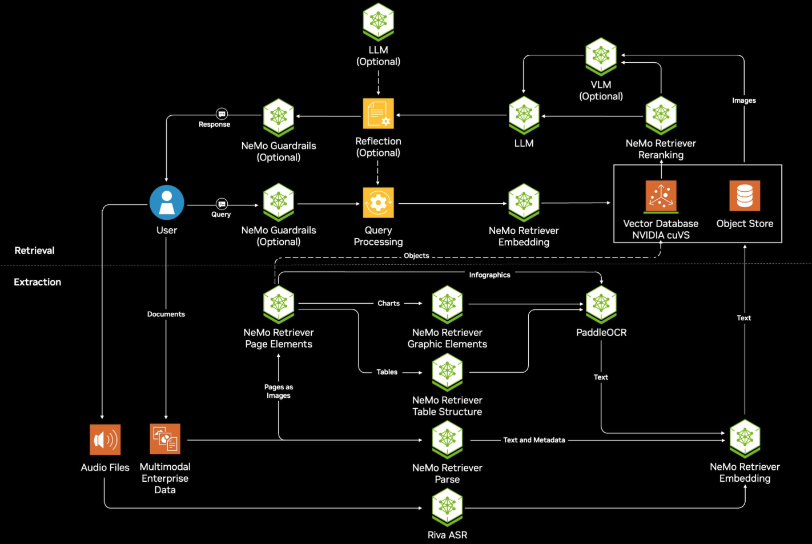
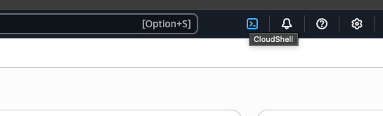
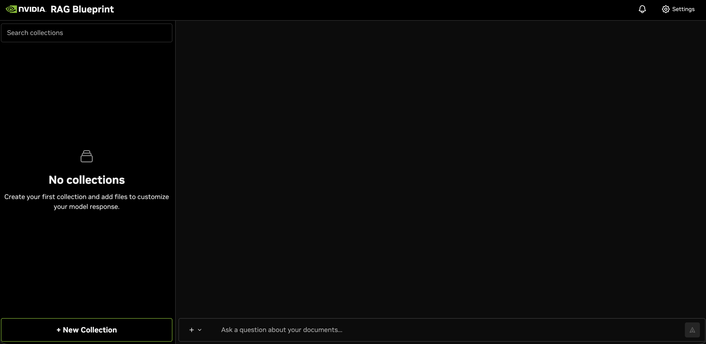
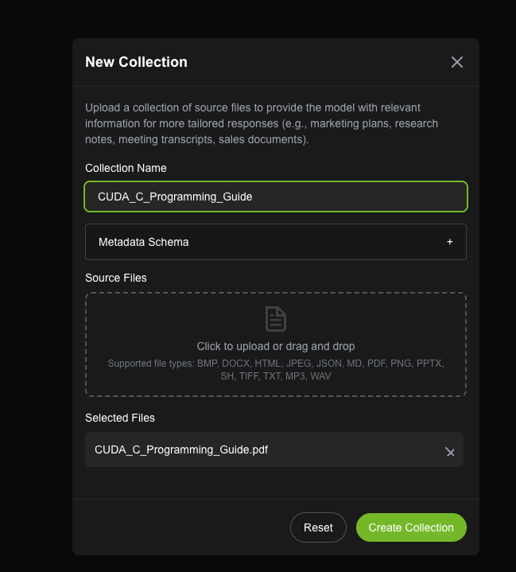

# Deploy NVIDIA Enterprise RAG Blueprint on Amazon Elastic Kubernetes Service (EKS) Workshop

## Table of Contents

- [Diagram](#diagram)
- [Introduction](#introduction)
- [What you will learn](#what-you-will-learn)
- [Learn the Components](#learn-the-components)
- [Setup and Requirements](#setup-and-requirements)
- [Task 1. Infrastructure Deployment](#task-1-infrastructure-deployment)
- [Task 2. Install NVIDIA GPU Operator](#task-2-install-nvidia-gpu-operator)
- [Task 3. Deploy Storage Class](#task-3-deploy-storage-class)
- [Task 4. Install AWS Load Balancer Controller](#task-4-install-aws-load-balancer-controller)
- [Task 5. Configure NVIDIA NGC API Key](#task-5-configure-nvidia-ngc-api-key)
- [Task 6. Deploy Enterprise RAG Blueprint](#task-6-deploy-enterprise-rag-blueprint)
- [Task 7. Access the RAG Frontend Service](#task-7-access-the-rag-frontend-service)
- [Task 8. Test the RAG Application](#task-8-test-the-rag-application)
- [Data Ingestion Options](#data-ingestion-options)
- [Congratulations!](#congratulations)
- [Cleanup and Uninstallation](#cleanup-and-uninstallation)

## Diagram



**Enterprise RAG Blueprint Architecture:**

The NVIDIA Enterprise RAG Blueprint provides a comprehensive solution for Retrieval Augmented Generation, featuring:

- **Reasoning Model**: `llama-3.1-nemotron-nano-8b-v1` for intelligent query processing
- **NeMo Retriever Embedding**: `llama-3.2-nv-embedqa-1b-v2` for semantic search
- **NeMo Retriever Reranking**: `llama-3.2-nv-rerankqa-1b-v2` for improved relevance
- **Page Elements Model**: `nemoretriever-page-elements-v2` for document understanding
- **Table Structure Model**: `nemoretriever-table-structure-v1` for table extraction and understanding
- **Graphic Elements Model**: `nemoretriever-graphic-elements-v1` for chart and diagram processing
- **OCR Engine**: `paddleocr-nim` for optical character recognition
- **Vector Database**: Milvus for efficient embedding storage and retrieval
- **Frontend**: React-based RAG Playground for user interaction

## Introduction

This workshop will guide you through deploying the complete [NVIDIA Enterprise RAG Blueprint](https://build.nvidia.com/nvidia/build-an-enterprise-rag-pipeline) on Amazon Elastic Kubernetes Service (EKS). You'll leverage the power of NVIDIA Inference Microservices (NIMs) and NeMo Retriever to build a production-ready retrieval augmented generation system optimized for enterprise workloads. For more deployment details of this blueprint, see the [Github Repository](https://github.com/NVIDIA-AI-Blueprints/rag/tree/main)


This workshop is ideal for developers, data scientists, and architects interested in:

- **Building enterprise-grade RAG applications**: Learn how to deploy a complete, production-ready RAG pipeline using NVIDIA's enterprise blueprint.
- **Optimizing GPU utilization**: Explore how to efficiently deploy multiple AI models across GPU resources for maximum performance.
- **Leveraging advanced retrieval**: Understand how to implement sophisticated embedding and reranking models for improved accuracy.
- **Scaling AI workloads**: Learn to manage and scale complex AI deployments using Kubernetes orchestration.

## What you will learn

By the end of this workshop, you will have hands-on experience with:

1. **Deploying the Enterprise RAG Blueprint on EKS**: Learn to deploy a complete enterprise-grade RAG solution including multiple NIM models, vector databases, and frontend services onto your EKS cluster.
2. **Managing GPU resources efficiently**: Understand how to optimize GPU allocation across multiple AI models for cost-effective deployment.
3. **Integrating advanced retrieval components**: Gain familiarity with NeMo Retriever's embedding and reranking capabilities for superior document understanding.
4. **Operating production RAG systems**: Explore techniques for monitoring, scaling, and maintaining enterprise RAG deployments using Kubernetes best practices.

## Learn the Components

### NVIDIA Enterprise RAG Blueprint

The [NVIDIA Enterprise RAG Blueprint](https://build.nvidia.com/nvidia/build-an-enterprise-rag-pipeline) is a comprehensive, production-ready solution that combines multiple NVIDIA AI microservices to deliver enterprise-grade retrieval augmented generation capabilities. It includes optimized models for reasoning, embedding, reranking, and document processing.

### GPUs in Amazon Elastic Kubernetes Service (EKS)

GPUs accelerate AI workloads running on your nodes, particularly machine learning inference and training. EKS provides a range of GPU-enabled instance types including A10G, L40S, A100, and H100 GPUs, allowing you to choose the optimal configuration for your workload requirements.

### NVIDIA NIMs (NVIDIA Inference Microservices)

[NVIDIA NIMs](https://www.nvidia.com/en-us/ai/) are containerized AI inference microservices that provide easy-to-deploy, scalable, and secure AI model serving. NIMs include optimized runtimes, pre-built containers, and enterprise support for production deployments.

### NVIDIA NeMo Retriever

[NVIDIA NeMo Retriever](https://developer.nvidia.com/blog/develop-production-grade-text-retrieval-pipelines-for-rag-with-nvidia-nemo-retriever) provides state-of-the-art embedding and reranking models specifically designed for enterprise RAG applications. It includes specialized models for different document types and retrieval scenarios.

### RAG Server and Ingestor

The blueprint includes dedicated microservices for:
- **RAG Server**: Handles query processing, retrieval orchestration, and response generation
- **Ingestor Server**: Manages document processing, embedding generation, and vector database population
- **NV-Ingest**: Advanced document processing pipeline supporting multiple content types

### Vector Database Integration

The blueprint integrates with Milvus vector database, providing GPU-accelerated similarity search, advanced indexing capabilities, and horizontal scaling for large-scale document collections.

## Setup and Requirements

### What you need

To complete this lab, you need:

- Access to a standard internet browser (Chrome browser recommended).
- Access to an AWS Account with access to GPU instances (g5.12xlarge recommended). You will need a minimum of **8 A10G GPUs** (2 x g5.12xlarge instances) for the optimized deployment.
- Sufficient AWS IAM permissions to create EKS clusters and manage resources.
- An [NVIDIA NGC API Key](https://org.ngc.nvidia.com/setup/personal-keys) for accessing NVIDIA container registry and models.
- Time to complete the lab (approximately 2-3 hours).

### GPU Requirements

The optimized deployment requires:

**Main Node Group (2 x g5.12xlarge instances = 8 total A10G GPUs, using 8):**
1. **Reasoning Model** (`llama-3.1-nemotron-nano-8b-v1`) → 2 A10G GPUs
2. **NeMo Retriever Embedding Model** (`llama-3.2-nv-embedqa-1b-v2`) → 1 A10G GPU
3. **NeMo Retriever Reranking Model** (`llama-3.2-nv-rerankqa-1b-v2`) → 1 A10G GPU
4. **Page Elements Model** (`nemoretriever-page-elements-v2`) → 1 A10G GPU
5. **Table Structure Model** (`nemoretriever-table-structure-v1`) → 1 A10G GPU
6. **Graphic Elements Model** (`nemoretriever-graphic-elements-v1`) → 1 A10G GPU
7. **OCR Engine** (`paddleocr-nim`) → 1 A10G GPU

### How to start your lab and sign in to the AWS Console

### Activate Cloud Shell

Cloud Shell is a virtual machine loaded with development tools. It offers a persistent home directory and runs on the AWS Cloud, providing command-line access to your AWS resources.

In the AWS Console, in the top right toolbar, click the **Activate Cloud Shell** button.



It takes a few moments to provision and connect to the environment.


`AWS CLI` is the command-line tool for AWS Cloud. It comes pre-installed on Cloud Shell and supports tab-completion.

## Task 1. Infrastructure Deployment

1. **Open Cloud Shell** and install prerequisites:

   The Cloud Shell environment comes preinstalled with `kubectl`, the native CLI tool to manage Kubernetes objects within your Amazon EKS clusters.

   Install additional required tools:
   - `eksctl` - The CLI used to work with EKS clusters
   - `helm` - The Kubernetes package manager

   **Install `eksctl`:**

   ```bash
   # for ARM systems, set ARCH to: `arm64`, `armv6` or `armv7`
   ARCH=amd64
   PLATFORM=$(uname -s)_$ARCH

   curl -sLO "https://github.com/eksctl-io/eksctl/releases/latest/download/eksctl_$PLATFORM.tar.gz"

   # (Optional) Verify checksum
   curl -sL "https://github.com/eksctl-io/eksctl/releases/latest/download/eksctl_checksums.txt" | grep $PLATFORM | sha256sum --check

   tar -xzf eksctl_$PLATFORM.tar.gz -C /tmp && rm eksctl_$PLATFORM.tar.gz

   sudo mv /tmp/eksctl /usr/local/bin
   ```

   **Install `helm`:**

   ```bash
   curl -fsSL -o get_helm.sh https://raw.githubusercontent.com/helm/helm/main/scripts/get-helm-3
   chmod 700 get_helm.sh
   ./get_helm.sh
   ```

2. **Set Environment Variables**

   Configure the deployment parameters for your EKS cluster:

   ```bash
   # Cluster & AWS region
   export CLUSTER_NAME="nvidia-enterprise-rag"
   export REGION="us-east-1"

   # Node group names
   export MAIN_NG="main-ng"

   # Instance types & sizes
   export GPU_INSTANCE_TYPE="g5.12xlarge"
   export MAIN_NODES=2
   export NODE_VOLUME_SIZE=500

   # GPU Operator namespace
   export GPU_OPERATOR_NS="gpu-operator"
   ```

3. **Create EKS Cluster**

   Create the EKS cluster without node groups (wait for completion before proceeding):

   ```bash
   eksctl create cluster \
     --name "${CLUSTER_NAME}" \
     --region "${REGION}" \
     --without-nodegroup \
     --install-nvidia-plugin=false
   ```

   **Get Credentials:**

   > **Note**: Wait for the cluster creation to complete before proceeding to get the credentials

   ```bash
   aws eks update-kubeconfig --region $REGION --name $CLUSTER_NAME
   ```

   Verify your cluster connection:

   ```bash
   kubectl config get-contexts
   ```

   You should see output indicating your cluster context is active.

4. **Create GPU Node Group**

   Create GPU-enabled worker nodes using the Amazon Linux 2 GPU-optimized AMI:

   ```bash
   eksctl create nodegroup \
     --cluster "${CLUSTER_NAME}" \
     --region "${REGION}" \
     --name "${MAIN_NG}" \
     --node-type "${GPU_INSTANCE_TYPE}" \
     --node-volume-size "${NODE_VOLUME_SIZE}" \
     --nodes "${MAIN_NODES}" \
     --node-labels role=gpu-main \
     --ami-type AL2_x86_64_GPU \
     --kubernetes-version 1.32
   ```

   > **Note**: We explicitly specify `AL2_x86_64_GPU` AMI type and Kubernetes version 1.32 to ensure compatibility with the NVIDIA Container Toolkit version used by the GPU Operator.

   Verify the nodes are ready:

   ```bash
   kubectl get nodes -l role=gpu-main -o wide
   ```

   You should see 2 nodes in Ready status.

## Task 2. Install NVIDIA GPU Operator

The GPU Operator manages the lifecycle of NVIDIA software components needed for GPU workloads.

1. **Add NVIDIA Helm Repository**

   ```bash
   # Add NVIDIA helm repository
   helm repo add nvidia https://nvidia.github.io/gpu-operator
   helm repo update
   ```

2. **Remove Existing NVIDIA Device Plugin**

   ```bash
   # Remove any existing NVIDIA device plugin (if it exists)
   kubectl delete daemonset nvidia-device-plugin-daemonset -n kube-system --ignore-not-found=true
   ```

3. **Install GPU Operator**

   ```bash
   # Install GPU Operator (toolkit version matches AL2 GPU AMI)
   helm upgrade -i gpu-operator nvidia/gpu-operator \
     -n "${GPU_OPERATOR_NS}" --create-namespace \
     --set driver.enabled=false \
     --set toolkit.version=v1.14.3-ubi8
   ```

4. **Verify GPU Allocation**

   Wait for the GPU Operator to be ready, then verify GPU resources are available:

   ```bash
   # Check GPU Operator pods
   kubectl get pods -n gpu-operator

   # Verify GPU allocation on nodes
   kubectl get nodes -l role=gpu-main -o custom-columns=NAME:.metadata.name,GPU:.status.allocatable.nvidia\\.com/gpu
   ```

   You should see 8 total GPUs available (4 per g5.12xlarge instance × 2 instances).

## Task 3. Deploy Storage Class

Choose between AWS EBS CSI driver (recommended for production) or local path provisioner (for quick POC testing).

### Option 1: AWS EBS CSI Driver (Recommended)

The AWS EBS CSI driver provides persistent, high-performance storage suitable for production workloads.

1. **Associate IAM OIDC Provider with Cluster**

   First, associate an IAM OIDC provider with your EKS cluster:

   ```bash
   # Associate IAM OIDC provider with the cluster
   eksctl utils associate-iam-oidc-provider \
     --region=$AWS_REGION \
     --cluster=$CLUSTER_NAME \
     --approve
   ```

2. **Create IAM Service Account for EBS CSI Driver**

   ```bash
   # Create IAM service account with required permissions
   eksctl create iamserviceaccount \
     --name ebs-csi-controller-sa \
     --namespace kube-system \
     --cluster $CLUSTER_NAME \
     --role-name AmazonEKS_EBS_CSI_DriverRole \
     --role-only \
     --attach-policy-arn arn:aws:iam::aws:policy/service-role/AmazonEBSCSIDriverPolicy \
     --approve
   ```

3. **Install AWS EBS CSI Driver Add-on**

   ```bash
   # Get the AWS account ID
   ACCOUNT_ID=$(aws sts get-caller-identity --query Account --output text)
   
   # Install the EBS CSI driver add-on
   eksctl create addon \
     --name aws-ebs-csi-driver \
     --cluster $CLUSTER_NAME \
     --service-account-role-arn arn:aws:iam::${ACCOUNT_ID}:role/AmazonEKS_EBS_CSI_DriverRole \
     --force
   ```

4. **Verify EBS CSI Driver Installation**

   ```bash
   # Check if the EBS CSI driver pods are running
   kubectl get pods -n kube-system -l app=ebs-csi-controller
   kubectl get pods -n kube-system -l app=ebs-csi-node
   ```

5. **Create GP3 Storage Class (Recommended)**

   Create a high-performance GP3 storage class:

   ```bash
   cat << 'EOF' | kubectl apply -f -
   apiVersion: storage.k8s.io/v1
   kind: StorageClass
   metadata:
     name: ebs-gp3
     annotations:
       storageclass.kubernetes.io/is-default-class: "true"
   provisioner: ebs.csi.aws.com
   parameters:
     type: gp3
     iops: "3000"
     throughput: "125"
     encrypted: "true"
   allowVolumeExpansion: true
   volumeBindingMode: WaitForFirstConsumer
   EOF
   ```

6. **Verify Storage Class Configuration**

   ```bash
   kubectl get storageclass
   kubectl describe storageclass ebs-gp3
   ```

   You should see the `ebs-gp3` storage class marked as default.

### Option 2: Local Path Provisioner (Alternative for Quick POC)

<details>
<summary>Click to expand local path provisioner setup</summary>

Use this option for quick proof-of-concept testing when persistent storage across node restarts is not required.

1. **Install Local Path Provisioner**

   ```bash
   kubectl apply -f https://raw.githubusercontent.com/rancher/local-path-provisioner/v0.0.26/deploy/local-path-storage.yaml
   ```

2. **Verify Installation**

   ```bash
   kubectl get pods -n local-path-storage
   ```

3. **Set as Default Storage Class**

   ```bash
   kubectl get storageclass
   kubectl patch storageclass local-path -p '{"metadata": {"annotations":{"storageclass.kubernetes.io/is-default-class":"true"}}}'
   ```

> **Note**: Local path provisioner stores data directly on the node's filesystem. Data will be lost if the pod is scheduled to a different node or if the node is terminated.

</details>

## Task 4. Install AWS Load Balancer Controller

The AWS Load Balancer Controller is required for LoadBalancer services to provision AWS Network Load Balancers (NLB) and Application Load Balancers (ALB).

### Install AWS Load Balancer Controller with Helm (AWS Recommended Method)

Following the [official AWS documentation](https://docs.aws.amazon.com/eks/latest/userguide/lbc-helm.html), use Helm to install the AWS Load Balancer Controller:

1. **Download and Create IAM Policy**

   ```bash
   # Download the IAM policy for AWS Load Balancer Controller
   curl -O https://raw.githubusercontent.com/kubernetes-sigs/aws-load-balancer-controller/v2.13.3/docs/install/iam_policy.json
   
   # Create IAM policy
   aws iam create-policy \
     --policy-name AWSLoadBalancerControllerIAMPolicy \
     --policy-document file://iam_policy.json
   ```

2. **Create IAM Service Account**

   ```bash
   # Get your AWS Account ID
   ACCOUNT_ID=$(aws sts get-caller-identity --query Account --output text)
   
   # Create IAM service account with the specific policy
   eksctl create iamserviceaccount \
     --cluster=$CLUSTER_NAME \
     --namespace=kube-system \
     --name=aws-load-balancer-controller \
     --attach-policy-arn=arn:aws:iam::${ACCOUNT_ID}:policy/AWSLoadBalancerControllerIAMPolicy \
     --override-existing-serviceaccounts \
     --region $REGION \
     --approve
   ```

3. **Install via Helm**

   ```bash
   # Add the EKS chart repository
   helm repo add eks https://aws.github.io/eks-charts
   helm repo update eks
   
   # Install AWS Load Balancer Controller
   helm install aws-load-balancer-controller eks/aws-load-balancer-controller \
     -n kube-system \
     --set clusterName=$CLUSTER_NAME \
     --set serviceAccount.create=false \
     --set serviceAccount.name=aws-load-balancer-controller \
     --set region=$REGION \
     --set vpcId=$(aws eks describe-cluster --name $CLUSTER_NAME --region $REGION --query "cluster.resourcesVpcConfig.vpcId" --output text) \
     --version 1.13.0
   ```

### Verify Installation

```bash
# Check if the controller deployment is ready
kubectl get deployment -n kube-system aws-load-balancer-controller

# Check if the controller pods are running
kubectl get pods -n kube-system -l app.kubernetes.io/name=aws-load-balancer-controller

# Check controller logs (optional)
kubectl logs -n kube-system deployment/aws-load-balancer-controller
```

Expected output should show:
```
NAME                           READY   UP-TO-DATE   AVAILABLE   AGE
aws-load-balancer-controller   2/2     2            2           84s
```

## Task 5. Configure NVIDIA NGC API Key

The Enterprise RAG Blueprint requires access to NVIDIA's container registry and model repositories. You'll need an [NGC API key](https://org.ngc.nvidia.com/setup/api-key) to proceed.

1. **Set your NGC API Key**

   Export your NGC API key as an environment variable:

   ```bash
   export NGC_API_KEY="<YOUR_NGC_API_KEY>"
   ```

   > **Important**: Replace `<YOUR_NGC_API_KEY>` with your actual NGC API key from the NVIDIA NGC portal.

## Task 6. Deploy Enterprise RAG Blueprint

Now you'll deploy the complete Enterprise RAG Blueprint using the optimized configuration.

1. **Create the Custom Values File**

   The `values.yaml` file is already provided in your workshop directory. Verify its contents:

   ```bash
   ls -la values.yaml
   cat values.yaml | head -20
   ```

   This file contains optimized configurations for:
   - GPU resource allocation
   - Model endpoints and configurations
   - Service networking
   - Storage settings

2. **Deploy the RAG Blueprint**

   Deploy the Helm chart with your NGC API key and custom configuration:

   ```bash
   helm upgrade --install rag -n nv-nvidia-blueprint-rag \
     https://helm.ngc.nvidia.com/nvidia/blueprint/charts/nvidia-blueprint-rag-v2.2.0.tgz \
     --username '$oauthtoken' \
     --password "${NGC_API_KEY}" \
     --set imagePullSecret.password=$NGC_API_KEY \
     --set ngcApiSecret.password=$NGC_API_KEY \
     -f values.yaml \
     --create-namespace
   ```

3. **Monitor Deployment Progress**

   The deployment will take 10-20 minutes. Please be patient and wait for all pods to reach the running state. Monitor the progress:

   ```bash
   # Watch all pods in the namespace
   kubectl get pods -n nv-nvidia-blueprint-rag -w
   ```

   Use `Ctrl+C` to stop watching when all pods are running.

   > **Note**: The initial deployment can take up to 20 minutes for container initialization. Do not interrupt the process - allow sufficient time for all components to start properly.

4. **Verify Deployment**

   Ensure all components are successfully running:

   ```bash
   kubectl get all -n nv-nvidia-blueprint-rag
   ```

   You should see pods for:
   - `rag-server` - Main RAG orchestration service
   - `ingestor-server` - Document processing service
   - `nim-llm` - Language model inference
   - `nemoretriever-embedding-ms` - Embedding model
   - `nemoretriever-reranking-ms` - Reranking model
   - `nemoretriever-page-elements-v2` - Document parsing
   - `milvus` - Vector database
   - `rag-redis` - Caching and task management
   - `rag-minio` - Object storage
   - `rag-frontend` - Web interface

## Task 7. Access the RAG Frontend Service

The RAG Blueprint includes a web-based frontend for interacting with the system.

1. **Configure Load Balancers for Internet Access**

   Patch both services to expose them properly via AWS Load Balancers:

   ```bash
   # Patch the frontend service to LoadBalancer with internet-facing access
   kubectl patch svc rag-frontend -n nv-nvidia-blueprint-rag -p '{
     "spec": {
       "type": "LoadBalancer"
     },
     "metadata": {
       "annotations": {
         "service.beta.kubernetes.io/aws-load-balancer-type": "nlb",
         "service.beta.kubernetes.io/aws-load-balancer-scheme": "internet-facing",
         "service.beta.kubernetes.io/aws-load-balancer-backend-protocol": "tcp"
       }
     }
   }'

   # Patch the ingestor-server service to LoadBalancer with internet-facing access
   kubectl patch svc ingestor-server -n nv-nvidia-blueprint-rag -p '{
     "spec": {
       "type": "LoadBalancer"
     },
     "metadata": {
       "annotations": {
         "service.beta.kubernetes.io/aws-load-balancer-type": "nlb",
         "service.beta.kubernetes.io/aws-load-balancer-scheme": "internet-facing", 
         "service.beta.kubernetes.io/aws-load-balancer-backend-protocol": "tcp"
       }
     }
   }'
   ```

2. **Get Load Balancer URLs**

   The RAG frontend is now accessible via AWS Load Balancer. Get the Load Balancer URL:

   ```bash
   # Get the RAG frontend Load Balancer URL
   kubectl get svc rag-frontend -n nv-nvidia-blueprint-rag -o jsonpath='{.status.loadBalancer.ingress[0].hostname}'

   # Get the Ingestor server Load Balancer URL  
   kubectl get svc ingestor-server -n nv-nvidia-blueprint-rag -o jsonpath='{.status.loadBalancer.ingress[0].hostname}'
   ```

3. **Access the Frontend**

   Open your web browser and navigate to `http://<LOAD_BALANCER_URL>:3000` to access the RAG frontend.

   > **Note**: It may take a few minutes for the AWS Load Balancers to be provisioned and become available.

   **Alternative: Local Access via Port Forwarding**
   ```bash
   kubectl port-forward service/rag-frontend 3000:3000 -n nv-nvidia-blueprint-rag
   ```
   Then navigate to `http://localhost:3000`.

## Task 8. Test the RAG Application

Now you'll test the complete RAG pipeline. We recommend starting with the API testing approach as it's more reliable for validating the backend functionality.

### Method 1: API Testing (Recommended)

Test the RAG backend APIs directly to ensure they're functioning correctly:

**Option 1: Use LoadBalancer URLs (Recommended for Production)**
```bash
# Get the Load Balancer URLs
export RAG_SERVER_URL=$(kubectl get svc rag-server -n nv-nvidia-blueprint-rag -o jsonpath='{.status.loadBalancer.ingress[0].hostname}')
export INGESTOR_URL=$(kubectl get svc ingestor-server -n nv-nvidia-blueprint-rag -o jsonpath='{.status.loadBalancer.ingress[0].hostname}')

echo "RAG Server: http://$RAG_SERVER_URL:8081"
echo "Ingestor Server: http://$INGESTOR_URL:8082"
```

**Option 2: Use Port Forwarding for Local Testing**
```bash
# Port forward RAG services for testing (run in separate terminals)
kubectl port-forward service/rag-server 8081:8081 -n nv-nvidia-blueprint-rag &
kubectl port-forward service/ingestor-server 8082:8082 -n nv-nvidia-blueprint-rag &
```

**Test the APIs:**

> **Note**: The following examples use localhost URLs (Option 2). If using LoadBalancer URLs (Option 1), replace `localhost:8081` with `$RAG_SERVER_URL:8081` and `localhost:8082` with `$INGESTOR_URL:8082`.

```bash
# 1. Test RAG server health
curl -X GET "http://localhost:8081/v1/health" \
  -H "accept: application/json"

# 2. Test ingestor server health  
curl -X GET "http://localhost:8082/v1/health" \
  -H "accept: application/json"

# 3. List existing collections
curl -X GET "http://localhost:8082/v1/collections" \
  -H "accept: application/json"

# 4. Create the default multimodal_data collection
curl -X POST "http://localhost:8082/v1/collection" \
  -H "accept: application/json" \
  -H "Content-Type: application/json" \
  -d '{
    "collection_name": "multimodal_data",
    "configuration": {}
  }'

# 5. Verify the collection was created
curl -X GET "http://localhost:8082/v1/collections" \
  -H "accept: application/json"

# 6. Test RAG generation endpoint (requires documents in collection)
curl -X POST "http://localhost:8081/v1/generate" \
  -H "accept: application/json" \
  -H "Content-Type: application/json" \
  -d '{
    "messages": [
      {
        "role": "user", 
        "content": "What is the main topic or subject discussed in the documents?"
      }
    ],
    "collection_names": ["multimodal_data"],
    "temperature": 0.5,
    "top_p": 0.9,
    "reranker_top_k": 10,
    "vdb_top_k": 100,
    "use_knowledge_base": true,
    "enable_citations": true,
    "enable_guardrails": false,
    "model": "nvidia/llama-3.1-nemotron-nano-8b-v1",
    "embedding_model": "nvidia/llama-3.2-nv-embedqa-1b-v2",
    "reranker_model": "nvidia/llama-3.2-nv-rerankqa-1b-v2"
  }'
```

**Stop port forwarding when done:**
```bash
# Stop the background port forwarding processes
pkill -f "kubectl port-forward.*rag-server"
pkill -f "kubectl port-forward.*ingestor-server"
```

For detailed examples and comprehensive API documentation, refer to the [NVIDIA AI Blueprints RAG repository](https://github.com/NVIDIA-AI-Blueprints/rag) which contains the complete source code and additional usage examples.

### Method 2: UI Testing (Optional)

<details>
<summary>Click to expand UI testing steps</summary>

1. **Explore the RAG Playground Interface**

   You should see the RAG Playground home page with the main interface:

   

2. **Upload a Document**

   To test the RAG capabilities with your own content:
   
   - Click on the **"New Collection"** tab
   - Add your document and **"Create Collection"** (you can use the [NVIDIA CUDA C Programming Guide](https://docs.nvidia.com/cuda/pdf/CUDA_C_Programming_Guide.pdf) for testing)
   - Wait for the document to be processed and embedded

   

3. **Ask Questions**

   Switch back to the RAG UI and test the RAG capabilities.

</details>

## Data Ingestion Options

Now that your RAG system is deployed and tested, you have multiple options for ingesting documents into the vector database:

### Option 1: UI-Based Document Upload (Covered Above)

Use the RAG Playground interface to upload documents directly through the web UI. This is ideal for:
- Testing and experimentation
- Small document collections
- Interactive document processing

### Option 2: S3 Data Ingestion (Recommended for Production)

For production deployments and large-scale document processing, you can ingest Multi-modal PDF documents directly from S3 into the vector database.

For complete setup instructions and usage, see the dedicated **[S3 Data Ingestion Guide](s3_data_ingestion/README.md)**.

## Monitor Backend Services

You can monitor the backend services during your interactions with the RAG system to understand performance and troubleshoot any issues:

```bash
# Watch logs from the RAG server
kubectl logs -f deployment/rag-server -n nv-nvidia-blueprint-rag

# Monitor resource usage
kubectl top pods -n nv-nvidia-blueprint-rag
```

## Congratulations!

Congratulations! You've successfully deployed the complete NVIDIA Enterprise RAG Blueprint on Amazon EKS.

### Next Steps

Consider exploring these advanced capabilities:

1. **Scale the Deployment**: Increase replica counts for higher throughput
2. **Enable Monitoring**: Deploy Prometheus and Grafana for observability
3. **Production Hardening**: Implement LoadBalancer services and ingress controllers
4. **Advanced Document Processing**: Test complex documents with tables, charts, and mixed content using the deployed OCR and structure extraction models
5. **Custom Document Types**: Integrate additional document processing models for domain-specific content

NVIDIA offers enterprise support for production deployments through [NVIDIA AI Enterprise](https://aws.amazon.com/marketplace/seller-profile?id=c568fe05-e33b-411c-b0ab-047218431da9) available on AWS Marketplace.

## Cleanup and Uninstallation

To avoid incurring additional costs, clean up your resources when finished.

### Uninstall RAG Blueprint

```bash
helm uninstall rag -n nv-nvidia-blueprint-rag
kubectl delete namespace nv-nvidia-blueprint-rag
```

### Complete Cluster Cleanup

If you want to completely remove the EKS cluster and all resources:

```bash
# Delete the entire EKS cluster (this will remove all node groups and resources)
eksctl delete cluster --name "${CLUSTER_NAME}" --region "${REGION}"
```

> **Warning**: This will permanently delete all data and resources in the cluster. Make sure to backup any important data before running this command.

## Learn More

For additional information and resources:

- [NVIDIA Enterprise RAG Blueprint](https://build.nvidia.com/nvidia/build-an-enterprise-rag-pipeline)
- [Amazon Elastic Kubernetes Service (EKS)](https://aws.amazon.com/eks/)
- [NVIDIA AI Enterprise](https://aws.amazon.com/marketplace/pp/prodview-ozgjkov6vq3l6)
- [NVIDIA NIMs](https://www.nvidia.com/en-us/ai/)
- [NeMo Retriever Documentation](https://developer.nvidia.com/nemo-retriever)
