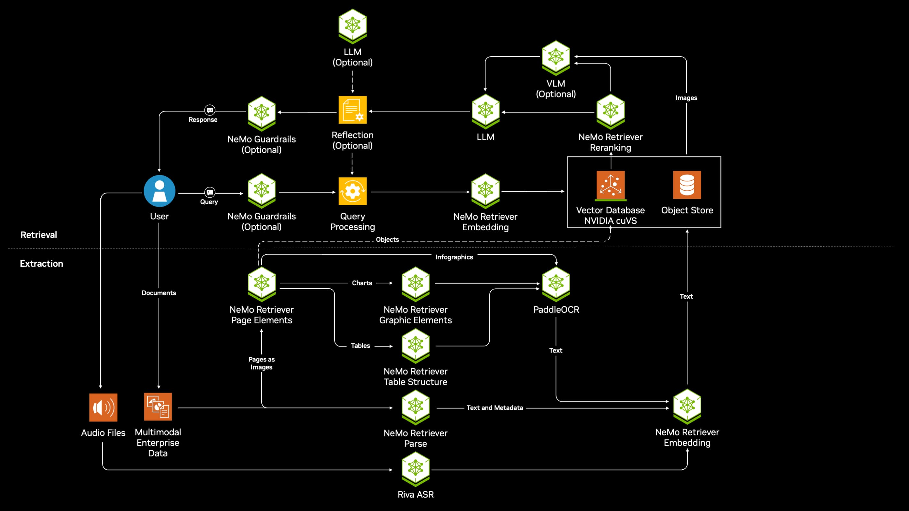
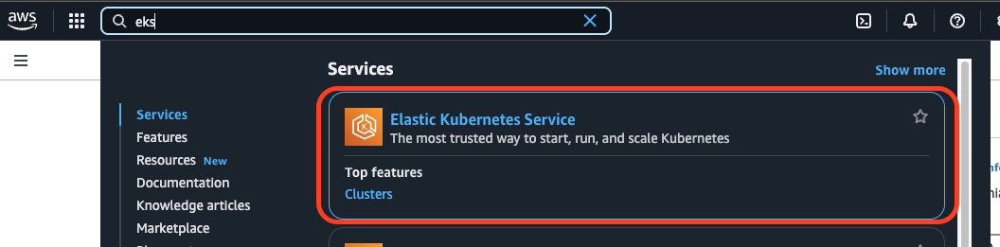
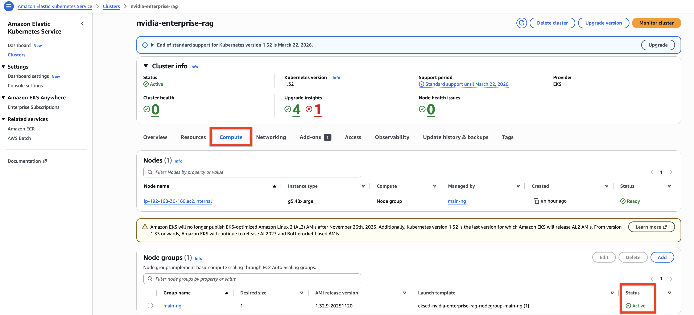
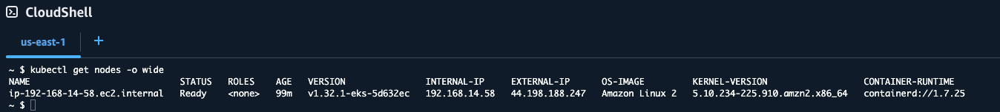
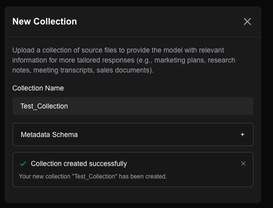
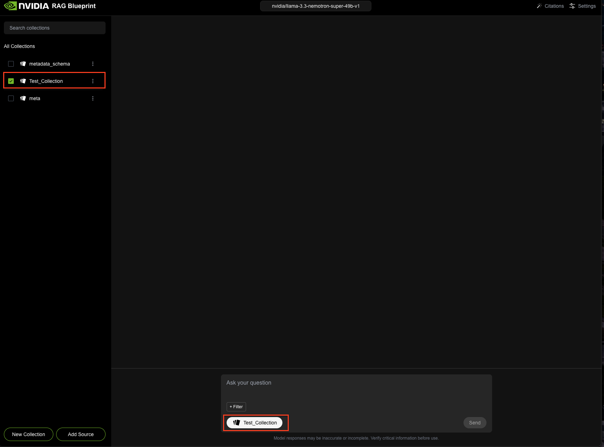

# Deploy the NVIDIA Enterprise RAG Pipeline Blueprint on Amazon Elastic Kubernetes Service


In this workshop, you will learn how to deploy and manage containerized AI models using <a href="https://github.com/NVIDIA-AI-Blueprints" target="_blank">NVIDIA AI Blueprints</a> on Amazon <a href="https://aws.amazon.com/eks/" target="_blank">Elastic Kubernetes Service (EKS)</a>. This workshop is designed for developers and data scientists who are looking to:

* Building RAG applications: Learn how to construct a complete RAG pipeline using NVIDIA's pre-built microservices and open-source tools.
* Optimizing LLM inference: Explore how to deploy and utilize TensorRT optimized LLMs for efficient inference within a microservice architecture.
* Leveraging vector databases: Understand how to use Milvus to store and query embeddings for semantic search in a RAG workflow.




---

**Target Audience:** Developers, DevOps Engineers, Data Scientists

**Use Cases:** AI Inference, Scaling with Kubernetes

---

## What You'll Learn

By the end of this workshop, you will have hands-on experience with:
1. Deploying a RAG pipeline on EKS: Learn to deploy a complete RAG pipeline, including LLM, embedding, and retriever microservices, onto your EKS cluster using NVIDIA NIM microservices
2. Integrating with Milvus vector database: Understand how to connect your RAG pipeline to a Milvus vector store for efficient storage and retrieval of embeddings.
3. Utilizing the NVIDIA Langchain wrapper: Gain familiarity with the NVIDIA Langchain wrapper for seamless interaction with deployed NIM.
4. Managing and scaling your RAG deployment: Explore techniques for managing, monitoring, and scaling your RAG pipeline using Kubernetes features to ensure optimal performance and resource utilization.

## Learn the Components
### **GPUs in Elastic Kubernetes Service (EKS)**
[GPUs](https://aws.amazon.com/ec2/instance-types/#Accelerated_Computing) let you accelerate specific workloads running on your nodes such as machine learning and data processing. EKS provides a range of machine type options for node configuration, including machine types with [NVIDIA H100, A100, L40S, L4 and more](https://aws.amazon.com/ec2/instance-types/#Accelerated_Computing).

### **NVIDIA NIM Microservices**
[NVIDIA NIM](https://www.nvidia.com/en-us/ai/) are a set of easy-to-use inference microservices for accelerating the deployment of foundation models on any cloud or data center and helping to keep your data secure.

### **NVIDIA NeMo Retriever Embedding & Reranker Microservice**
[NVIDIA NeMo Retriever](https://developer.nvidia.com/blog/develop-production-grade-text-retrieval-pipelines-for-rag-with-nvidia-nemo-retriever), part of [NVIDIA NeMo](https://www.nvidia.com/en-us/ai-data-science/products/nemo/), is a collection of generative AI microservices that enable organizations to seamlessly connect custom models to diverse business data and deliver highly accurate responses.

### **NVIDIA AI Enterprise**
[NVIDIA AI Enterprise](https://www.nvidia.com/en-us/data-center/products/ai-enterprise/) is an end-to-end, cloud-native software platform that accelerates data science pipelines and streamlines development and deployment of production-grade co-pilots and other generative AI applications. Available through the [AWS Marketplace](https://aws.amazon.com/marketplace/pp/prodview-ozgjkov6vq3l6?sr=0-1&ref_=beagle&applicationId=AWSMPContessa).

### **Chain Server**
NVIDIA developed a chain server that communicates with the inference server. The server also supports retrieving embeddings from the vector database before submitting a query to the inference server to perform retrieval augmented generation.

### **Vector Database**
The Chain Server supports connecting to either Milvus or pgvector. NVIDIA provides a sample RAG pipeline that deploys Milvus to simplify demonstrating the inference and embedding microservices.

### **RAG Playground**
The application provides a user interface for entering queries that are answered by the inference microservice. The application also supports uploading documents that the embedding microservice processes and stores as embeddings in a vector database.


## What You'll Need
* AWS Account - This account will require:
   * Permissions to deploy EC2 instances in an EKS Cluster
   * Service quota (1 or more) to launch a g5.48xlarge type instances
* An NVIDIA API Key: 
   * Click this <a href="https://nvdam.widen.net/s/tmbxdkxmmd/create-build-account-and-api-key-3">link</a>, and follow the instructions on how to create an account and generate an API Key. An API key will be required to download the NVIDIA Blueprint.

## Prerequisites

1. To prepare for the command-line management of your Amazon EKS clusters, you need to install several tools. 
    - Use the Cloud Shell Terminal in the AWS Console, and follow the instructions below to install the tools that will enable you to set up credentials, create and modify clusters, and work with clusters once they are running.
      - Please make sure to install <a href="https://docs.aws.amazon.com/eks/latest/eksctl/installation.html">eksctl</a> (following the "For Unix" instructions) and <a href="https://helm.sh/docs/intro/install/#from-script"> Helm</a> (following the "From Script" instructions) 

# Task 1: Set up the necessary Infrastructure

[Amazon Elastic Kubernetes Service](https://docs.aws.amazon.com/eks/latest/userguide/what-is-eks.html) (Amazon EKS) is the premiere platform for running [Kubernetes](https://kubernetes.io/docs/concepts/overview/) clusters.
Amazon EKS simplifies building, securing, and maintaining Kubernetes clusters. It can be more cost effective at providing enough resources to meet peak demand than maintaining your own data centers.

In order to deploy the NVIDIA RAG Blueprint on an EKS Cluster, we need to create the right resources and deploy the necessary tools. 
  
---

**Get started with Amazon EKS**

As described in this [User Guide](https://docs.aws.amazon.com/eks/latest/userguide/getting-started.html) on how to get started, there are two "getting started" guides available for creating a new Kubernetes cluster with nodes in Amazon EKS.

For the purpose of this workshop, we will be using `eksctl` - a simple command line utility for creating and managing Kubernetes clusters on Amazon EKS. 

Please follow the instructions below, to create an EKS Cluster with GPU-based instances.

At the end of the tutorial, you will have a running Amazon EKS cluster that you can deploy applications to. This is the fastest and simplest way to get started with Amazon EKS.

---
1. **Create Cluster**

    1.   Open the AWS CloudShell:

    

    2. Specify the following parameters:
    
    ```
        export CLUSTER_NAME=nvidia-enterprise-rag
        export CLUSTER_NODE_TYPE=g5.48xlarge
        export NODE_COUNT=1
    ```

    3. Create EKS Cluster:
    ```
    eksctl create cluster --name=$CLUSTER_NAME --node-type=$CLUSTER_NODE_TYPE --nodes=$NODE_COUNT
    ```
    <i>Please note, cluster creation takes several minutes. During creation you’ll see several lines of output.</i>


2. **Verify the creation of the Cluster**
  
    1. In the search bar at the top, type in "EKS" and select "Elastic Kubernetes Service"

    

    
    4. In the "Clusters" tab, wait until the value in column "Status" changes to "Active" with a green check mark

    
    

    5. Click on the "nim-eks-workshop" link, then click on the "Compute" tab. Verify that there is a Node group running, with status "Active", under the "Node Groups" section

    
    
    
    6. In the CloudShell terminal, execute the below command to verify the nodes are visible

    ```
    kubectl get nodes -o wide
    ```

    The result should be something similar to:

    

---

# Task 2: NVIDIA Blueprint Deployment

1. Set up your NVIDIA API key

As part of the RAG blueprint several NVIDIA NIMs will be deployed. In order to get started with NIM, we'll need to make sure we have access to an [NVIDIA API key](https://build.nvidia.com/settings/api-keys). We can export this key to be used as an environment variable:

```
export NGC_API_KEY="<YOUR NGC API KEY>"
```

2. Install the Blueprint helm chart

In the lab terminal, execute the below:

  ```bash
helm upgrade --install rag https://helm.ngc.nvidia.com/nvidia/blueprint/charts/nvidia-blueprint-rag-v2.3.0.tgz \
  --set envVars.APP_LLM_MODELNAME="nvidia/llama-3.1-nemotron-nano-8b-v1" \
  --set envVars.APP_QUERYREWRITER_MODELNAME="nvidia/llama-3.1-nemotron-nano-8b-v1" \
  --set envVars.APP_FILTEREXPRESSIONGENERATOR_MODELNAME="nvidia/llama-3.1-nemotron-nano-8b-v1" \
  --set envVars.APP_VECTORSTORE_ENABLEGPUSEARCH="False" \
  --set nim-llm.image.repository="nvcr.io/nim/nvidia/llama-3.1-nemotron-nano-8b-v1" \
  --set nim-llm.image.tag="1.8.4" \
  --set nim-llm.model.name="nvidia/llama-3.1-nemotron-nano-8b-v1" \
  --set nim-llm.resources.limits."nvidia\.com/gpu"=2 \
  --set nim-llm.resources.requests."nvidia\.com/gpu"=2 \
  --set ingestor-server.envVars.APP_VECTORSTORE_ENABLEGPUINDEX="False" \
  --set ingestor-server.envVars.APP_VECTORSTORE_ENABLEGPUSEARCH="False" \
  --set ingestor-server.envVars.SUMMARY_LLM="nvidia/llama-3.1-nemotron-nano-8b-v1" \
  --set nv-ingest.milvus.image.all.tag="v2.5.17" \
  --set nv-ingest.milvus.standalone.resources.limits."nvidia\.com/gpu"=0 \
  --namespace rag \
  --create-namespace \
  --set imagePullSecret.password=$NGC_API_KEY \
  --set ngcApiSecret.password=$NGC_API_KEY  
  ```

### 3. Verify all the Pods are running

All the pods need to be in Status "Running" and the Ready column needs to show 1/1
```
kubectl get pods -n rag
```

# Task 3: Access the RAG Frontend Service

The RAG Playground service exposes a UI that enables interaction with the end to end RAG pipeline. A user submits a prompt or a request and this triggers the chain server to communicate with all the necessary services required to generate output.

We need to take a few steps in order to access the service.

### 1. Accessing the Frontend Service

In order to access the UI, we need to expose an external load balancer service to allow TCP traffic to the service that is running our front end.

We can do this using the following command:

```
kubectl -n rag expose deployment rag-frontend --name=rag-frontend-lb --type=LoadBalancer --port=80 --target-port=3000
```

To access the UI of the application, we get the external IP address of the front end load balancer service:

```
kubectl -n rag get svc rag-frontend-lb
```

Wait until output looks like this:
```
user1-54803080 [ ~ ]$ kubectl -n rag get svc rag-frontend-lb -w
NAME              TYPE           CLUSTER-IP   EXTERNAL-IP       PORT(S)        AGE
rag-frontend-lb   LoadBalancer   10.0.XX.XX   XX.XX.XX.XX   80:30977/TCP   14s
```

### Before using the RAG app. Verify that all PODs are running:

```
kubectl get pods -n rag
```

Open your browser and in the address bar, paste the EXTERNAL-IP-FROM-YOUR-CLI-RESULT-ABOVE

From here, we should be able to interact with the service and get some outputs from the LLM.

It should look like this:


# Task 4. Test the RAG Blueprint

In order to test the RAG capabilities of this application, we need to upload a document:

* Click new collection at the bottom left corner and give it a name
* Upload a Document by clicking in the square under "Source Files", selecting a PDF or text file and clicking "Create Collection"
    - Here is an [ example document that talks about the NVIDIA Nemotron 3 family of models](https://research.nvidia.com/labs/nemotron/files/NVIDIA-Nemotron-3-White-Paper.pdf)


* Wait for "Collection Created successfully" notification



* Close the prompt window, and click the "Test_Collection" checkbox on the left:



### 4. Test Nemotron Thinking Capabilities

Try these example prompts to see the advanced reasoning:

* Basic Q&A:

    "What are the main topics covered in this document?"


* Analysis Request:

    "Analyze the key arguments presented and identify any potential weaknesses or gaps."


* Complex Reasoning:

    "Based on the information in this document, what implications does this have for [relevant topic]? Please consider multiple perspectives."