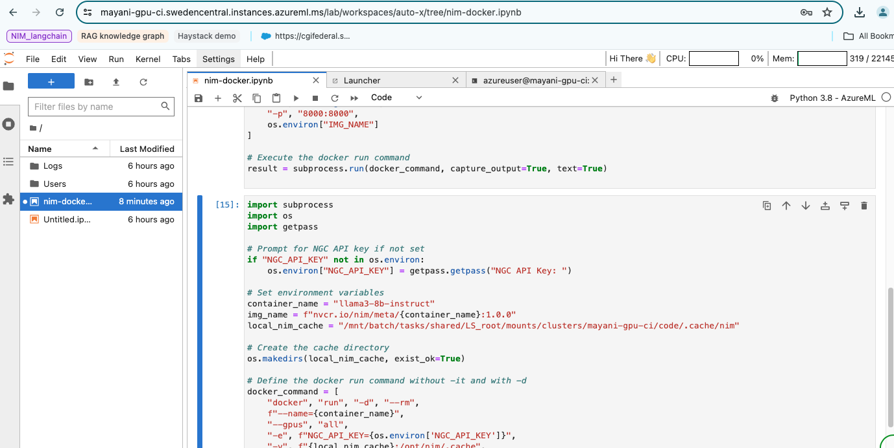

# Instructions for deploying NIM models on AzureML using Python SDK

In this example, we will deploy the LLAMA3 8B model on AzureML using the Python SDK.

****Prerequisites:**
- [NGC API Key](https://catalog.ngc.nvidia.com/)
- [AzureML workspace](https://learn.microsoft.com/en-us/azure/machine-learning/how-to-manage-workspace?view=azureml-api-2&tabs=python)

1. Provision the compute instance using the Jupyter notebook `provision aml-compute.ipynb`.This will setup the GPU compute 1xA100 on AzureML. You can run this Jupyter notebook from your local machine. 

2. Upon the successful running of this notebook, you will get the URL of the Jupyter server which starts running on the AzureML compute as shown below (_note: your URL would be different name_). You can then paste the URL in your local machines' browser
```bash 

{'display_name': 'Jupyter Lab', 'endpoint_uri': 'https://mayani-gpu-ci.swedencentral.instances.azureml.ms/lab'}].....

```

3. Run the script `nim-azureml-compute.ipynb` from this repository on your jupyter server which is running on the AzureML compute node as shown in the image below



