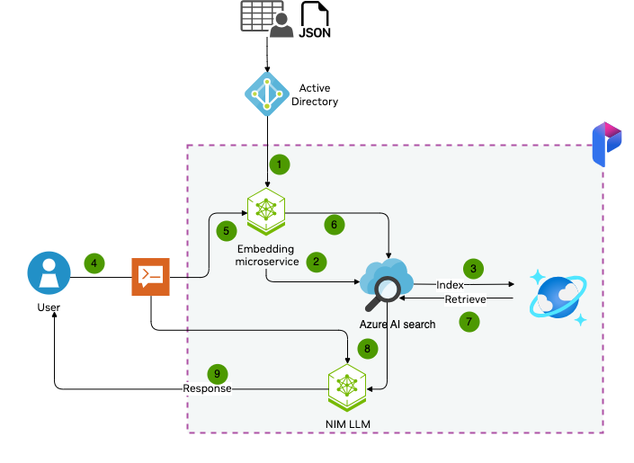
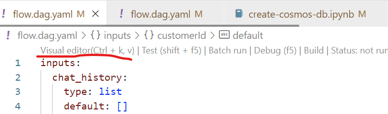
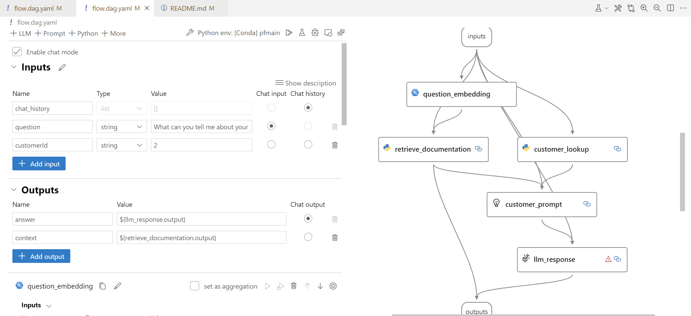

# End to End LLM App development with Azure AI Studio, Prompt Flow and NIMs

 

[Azure AI Studio](https://learn.microsoft.com/en-us/azure/ai-studio/what-is-ai-studio) is a trusted platform that empowers developers to drive innovation and shape the future with AI in a safe, secure, and responsible way.  One of the key features of Azure AI studio is its' complete AI toolchain 

- Azure AI Search
- Fine-tuning
- Prompt flow
- Open frameworks
- Tracing and debugging
- Evaluations

**Table Of Contents**

1. [Pre-Requisites](#1-pre-requisites)
2. [Environment](#2-environment)
3. [Provision Azure Resources](#3-create-azure-resources)
    - 3.1 [Authenticate With Azure](#31-authenticate-with-azure)
    - 3.2 [Run Provisioning Script](#32-run-provisioning-script)
    - 3.3 [Verify config.json setup](#33-verify-configjson-setup)
    - 3.4 [Verify .env setup](#34-verify-env-setup)
    - 3.5 [Verify local Connections](#35-verify-local-connections-for-prompt-flow)
    - 3.6 [Verify cloud Connections](#36-verify-cloud-connections-for-prompt-flow)
4. [Populate With Your Data](#4-populate-with-sample-data)
5. [Build Your Prompt Flow](#5-building-a-prompt-flow)
    - 5.1 [Explore contoso-chat Prompt Flow](#51-explore-the-contoso-chat-prompt-flow)
    - 5.2 [Run The Prompt Flow](#52-run-the-prompt-flow)


## 1. Pre-Requisites

- **Azure Subscription** - [Signup for a free account.](https://azure.microsoft.com/free/)
- **Visual Studio Code** - [Download it for free.](https://code.visualstudio.com/download)
- **GitHub Account** - [Signup for a free account.](https://github.com/signup)
- **Access to Azure Open AI Services** - [Learn about getting access.](https://learn.microsoft.com/legal/cognitive-services/openai/limited-access)
- **Ability to provision Azure AI Search (Paid)** - Required for Semantic Ranker

## 2. Environment

1.  We will be using the [Azure-Sample/contoso-chat](https://github.com/Azure-Samples/contoso-chat?tab=readme-ov-file) repository as our reference example and then add NIM bits on top of it. The first step is to clone that repository and open it in VS code

    ```bash
    git clone https://github.com/Azure-Samples/contoso-chat.git
    cd contoso-chat
    git checkout cc2e808
    code .
    ```

2. Install the [Prompt Flow Extension](https://marketplace.visualstudio.com/items?itemName=prompt-flow.prompt-flow) in VS Code
      - Open the VS Code Extensions tab
      - Search for "Prompt Flow"
      - Install the extension

3. Install the [Azure CLI](https://learn.microsoft.com/cli/azure/install-azure-cli) for your device OS

4. Create a new local Python environment 

    ```bash 
    python3 -m venv .venv
    source .venv/bin/activate
    pip install -r requirements.txt
    ```

## 3. Create Azure resources

We setup our development ennvironment in the previous step. In this step, we'll **provision Azure resources** for our project, ready to use for developing our LLM Application.


### 3.1 Authenticate with Azure

Start by connecting your Visual Studio Code environment to your Azure account:

1. Open the terminal in VS Code and use command `az login`. 

Verify that the console shows a message indicating a successful authentication. **Congratulations! Your VS Code session is now connected to your Azure subscription!**

### 3.2 Run Provisioning Script

The project requires a number of Azure resources to be set up, in a specified order. To simplify this, an auto-provisioning script has been provided. (NOTE: It will use the current active subscription to create the resource. If you have multiple subscriptions, use `az account set --subscription "<SUBSCRIPTION-NAME>"` first to set the desired active subscription.)

Run the provisioning script as follows:

  ```bash
  ./provision.sh
  ```

The script should **set up a dedicated resource group** with the following resources:

 - **Azure AI services** resource
 - **Azure Machine Learning workspace** (Azure AI Project) resource
 - **Search service** (Azure AI Search) resource
 - **Azure Cosmos DB account** resource

The script will set up an **Azure AI Studio** project with the following model deployments created by default, in a relevant region that supports them. _Your Azure subscription must be [enabled for Azure OpenAI access](https://learn.microsoft.com/azure/ai-services/openai/overview#how-do-i-get-access-to-azure-openai)_.
 - gpt-3.5-turbo
 - mixtral-8x7b-instruct from NVIDIA catalog
 - nv-embed-qa
 - gpt-4

The Azure AI Search resource will have **Semantic Ranker** enabled for this project, which requires the use of a paid tier of that service. It may also be created in a different region, based on availability of that feature.

### 3.3 Verify `config.json` setup

The script should automatically create a `config.json` in your root directory, with the relevant Azure subscription, resource group, and AI workspace properties defined. _These will be made use of by the Azure AI SDK for relevant API interactions with the Azure AI platform later_.

If the config.json file is not created, simply download it from your Azure portal by visiting the _Azure AI project_ resource created, and looking at its Overview page.

### 3.4 Verify `.env` setup

The default sample has an `.env.sample` file that shows the relevant environment variables that need to be configured in this project. The script should create a `.env` file that has these same variables _but populated with the right values_ for your Azure resources.

If the file is not created, simply copy over `.env.sample` to `.env` - then populate those values manually from the respective Azure resource pages using the Azure Portal (for Azure CosmosDB and Azure AI Search) and the Azure AI Studio (for the Azure OpenAI values)

### 3.5 Verify local connections for Prompt Flow

You will need to have your local Prompt Flow extension configured to have the following _connection_ objects set up:
 - `contoso-cosmos` to Azure Cosmos DB endpoint
 - `contoso-search` to Azure AI Search endpoint

Verify if these were created by using the [pf tool](https://microsoft.github.io/promptflow/reference/pf-command-reference.html#pf-connection) from the VS Code terminal as follows:

```bash
pf connection list
```

If the connections are _not_ visible, create them by running the `connections/create-connections.ipynb` notebook. Then run the above command to verify they were created correctly.

### 3.6 Verify cloud connections for Prompt Flow

The auto-provisioning will have setup 2 of the 3 connections for you by default. First, verify this by
 - going to [Azure AI Studio](https://ai.azure.com)
 - signing in with your Azure account, then clicking "Build"
 - selecting the Azure AI project for this repo, from that list
 - clicking "Settings" in the sidebar for the project
 - clicking "View All" in the Connections panel in Settings

You should see `contoso-search` and `aoai-connection` pre-configured, else create them from the Azure AI Studio interface using the **Create Connection** workflow (and using the relevant values from your `.env` file).

You will however need to **create `contoso-cosmos` manually from Azure ML Studio**. This is a temporary measure for _custom connections_ and may be automated in future. For now, do this:

1. Visit https://ai.azure.com and sign in if necessary
1. Under Recent Projects, click your Azure AI project (e.g., contoso-chat-aiproj)
1. Select Settings (on sidebar), scroll down to the Connections pane, and click "View All"
1. Click "+ New connection", modify the Service field, and select Custom from dropdown
1. Enter "Connection Name": contoso-cosmos, "Access": Project.
1. Click "+ Add key value pairs" **four** times. Fill in the following details found in the `.env` file:
      - key=key, value=.env value for COSMOS_KEY, is-secret=checked
      - key=endpoint, value=.env value for COSMOS_ENDPOINT
      - key=containerId, value=customers
      - key=databaseId, value=contoso-outdoor
1. Click "Save" to finish setup. 

Refresh main Connections list screen to verify that you now have all three required connections listed.


## 4. Populate with sample data

In this step we want to populate the required data for our application use case.

1. **Populate Search Index** in Azure AI Search
    -  We will use the `NV-Embed-QA` model from NVIDIA API catalog for creating vector embeddings which will then be used to populate the Search Index. In order to do that, let's clone the `nim-deploy` repository as well since we will be copying some scripts from this repository inside the `contoso-chat` repository. Run the code in the `data/product_info/create-nv-embedd-search.ipynb` notebook.
    
    ```bash
    $ cd ~  # navigate to home directory
    $ git clone https://github.com/NVIDIA/nim-deploy.git
    cp nim-deploy/cloud-service-providers/azure/promptflow/data/create-nv-embedd-search.ipynb contoso-chat/data/create-nv-embedd-search.ipynb
    $ cd contoso-chat

    ```
    - Run the jupyter notebook and then you should have the index created
    - Visit the Azure AI Search resource in the Azure Portal
    - Click on "Indexes" and verify that a new index was created
1. **Populate Customer Data** in Azure Cosmos DB
    - Run the code in the `data/customer_info/create-cosmos-db.ipynb` notebook. 
    - Visit the Azure Cosmos DB resource in the Azure Portal
    - Click on "Data Explorer" and verify tat the container and database were created!

## 5. Building a prompt flow

We are now ready to begin building our prompt flow! The repository comes with a number of pre-written flows that provide the starting points for this project. In the following section, we'll explore what these are and how they work.

### 5.1. Explore the `contoso-chat` Prompt Flow

A prompt flow is a DAG (directed acyclic graph) that is made up of nodes that are connected together to form a flow. Each node in the flow is a python function tool that can be edited and customized to fit your needs. 
- In order to run the `contoso-chat` with NIMs, we need to copy over some files from `nim-deploy` repository to the contoso-chat repository using following commands

```bash
cp ~/nim-deploy/cloud-service-providers/azure/promptflow/contoso-chat-api-catlog/* ~/contoso-chat/contoso-chat/
```
- The above copying files will replace the original `flow.dag.yml` with the one from `nim-deploy` which has the steps to use NIM LLMs.
- Click on the `contoso-chat/flow.dag.yaml` file in the Visual Studio Code file explorer. 
- You should get a view _similar to_ what is shown below.
- Click the `Visual editor` text line shown underlined below.
    

- This will open up the prompt flow in the visual editor as shown:  - 
    


### 5.2 Run the prompt flow

Let's run the flow to see what happens.  **Note that the input node is pre-configured with a question.** By running the flow, we anticipate that the output node should now provide the result obtained from the LLM when presented with the _customer prompt_ that was created from the initial question with enhanced customer data and retrieved product context.

- To run the flow, click the `Run All` (play icon) at the top. When prompted, select "Run it with standard mode".
- Watch the console output for execution progress updates
- On completion, the visual graph nodes should light up (green=success, red=failure).
- Click any node to open the declarative version showing details of execution
- Click the `Prompt Flow` tab in the Visual Studio Code terminal window for execution times

For more details on running the prompt flow, [follow the instructions here](https://microsoft.github.io/promptflow/how-to-guides/init-and-test-a-flow.html#test-a-flow).

