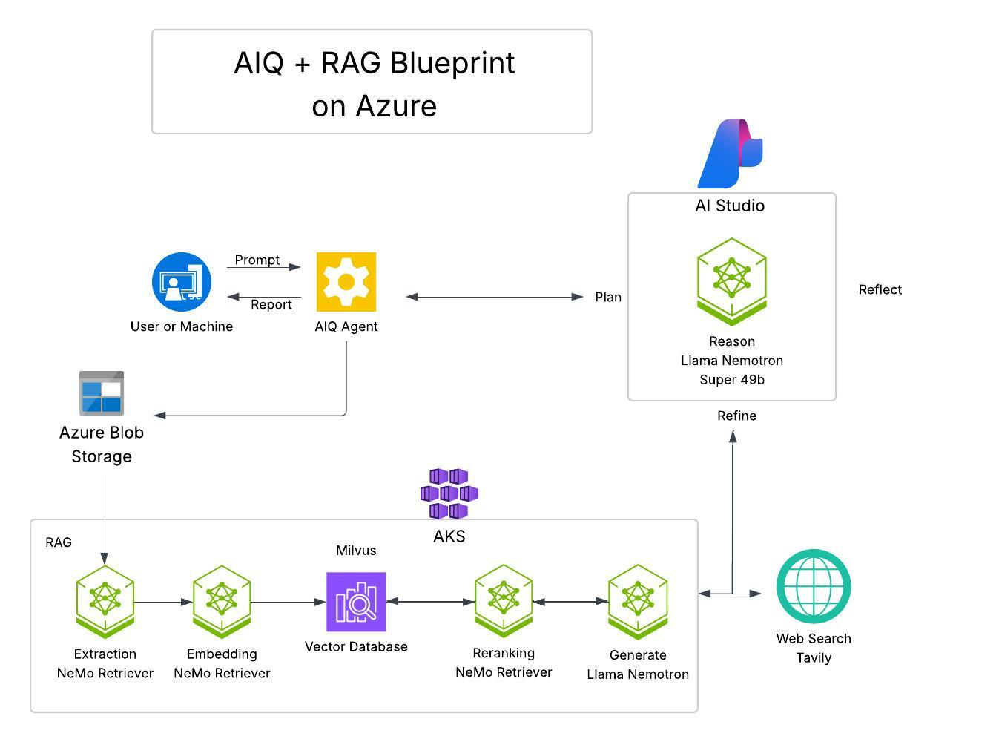

# Deploy the Complete NVIDIA AI Research Platform( RAG Blueprint + AI-Q Research Assistant) on Azure Kubernetes Engine (AKS) + Azure AI Studio



## Introduction
This workshop guides you through deploying a complete AI research platform on Azure Kubernetes Engine (AKS). You'll deploy both the NVIDIA [RAG Blueprint](https://build.nvidia.com/nvidia/build-an-enterprise-rag-pipeline) and the [AI-Q Research Assistant](https://build.nvidia.com/nvidia/ai-research-assistant) to create a powerful system for document Q&A and automated research report generation.

The platform combines document understanding (RAG) with intelligent research capabilities (AI-Q) to enable:
* **Document Q&A**: Chat with your documents using state-of-the-art RAG technology
* **Research Reports**: Generate comprehensive reports from multiple sources with AI-Q
* **Web Search Integration**: Combine your private documents with real-time web research
* **Human-in-the-Loop**: Edit and refine AI-generated content collaboratively

This workshop is ideal for researchers, analysts, and developers interested in:
* Building production-grade AI applications with NVIDIA NIM
* Deploying RAG pipelines with advanced reasoning capabilities
* Creating AI-powered research tools with multi-source intelligence
* Leveraging Kubernetes for scalable AI deployments
* Option to deploy Nemotron 49B locally on AKS, on Azure AI Foundry or use hosted NIM on build.nvidia.com

## What you will learn
By the end of this workshop, you will have hands-on experience with:
1. **Deploying the RAG Blueprint**: Set up a complete document Q&A system with Nemotron 49B, embedding, reranking, and vector search.
2. **Deploying AI-Q**: Add advanced research capabilities that reuse Nemotron 49B for multi-source synthesis and report generation.
3. **Integrating Multiple AI Services**: Connect different NIMs and microservices in a cohesive architecture with shared LLM resources.
4. **Enabling Web Search**: Configure Tavily API for real-time web research capabilities.
5. **Loading Research Datasets**: Initialize the system with curated biomedical and financial document collections.
6. **Generating Research Reports**: Use AI to create comprehensive, multi-source research documents.
7. **Phoenix Tracing(Optional)**: Monitor and debug your AI workflows with distributed tracing.

## Learn the Components
### **NVIDIA RAG Blueprint**
A production-ready Retrieval Augmented Generation pipeline that enables Q&A over your documents. Includes document ingestion, embedding, vector search, reranking, and LLM-powered response generation with citations.

### **NVIDIA AI-Q Research Assistant**
An intelligent research platform that generates comprehensive reports by querying multiple sources, synthesizing findings, and presenting them in editable, human-friendly formats.

### **NIMs (NVIDIA Inference Microservices)**
Optimized containers for deploying AI models with TensorRT acceleration. This workshop uses:
- **Nemotron Super 49B**: Advanced reasoning, chain-of-thought, Q&A, and report synthesis (shared by both RAG and AI-Q). Deployed on Azure AI Foundry or use build.nvidia.com API
- **NeMo Retriever Embedding 1B**: High-quality text embeddings
- **NeMo Retriever Reranking 1B**: Result reranking for improved accuracy
- **Page Elements NIM**: PDF text extraction

### **Tavily API**
A research-grade web search API optimized for AI consumption, enabling real-time web research beyond your document collections.

### **Phoenix Tracing** (optional)
An open-source observability platform providing distributed tracing and performance monitoring for AI workflows.

### **NVIDIA NIM on Azure AI Foundry** (optional)
NIM microservices are natively supported on Azure AI Foundry, enabling developers to quickly create a streamlined path for deployment. The microservices are running on Azure’s managed compute, removing the complexity of setting up and maintaining GPU infrastructure while ensuring high availability and scalability, even for highly demanding workloads. This enables teams to move quickly from model selection to production use. 

## Prerequisites 
- Azure Account with access to 1-A100 GPUs (standard_nc96ads_a100_v4)
- Azure CLI configured and authenticated
- kubectl installed
- Helm 3.x installed
- **NGC Account and API Key** ([Get it here](https://nvdam.widen.net/s/kfshg7fpsr/create-build-account-and-api-key-4))
- **Tavily API Key** ([Sign up here](https://tavily.com) - Free tier available)


### Hardware Requirements

The infrastructure provisioning script will automatically create an Azure Kubernetes Service (AKS) cluster with the following resources in the specified region. Ensure your Azure subscription has sufficient quotas for these resources.

* **Cluster Management Node Pool**:
  * **Machine Type**: `Standard_D32s_v5`
  * **Quantity**: 2 nodes (default for control/management)
* **GPU Worker Node Pool**:
  * **Machine Type**: `Standard_NC96ads_A100_v4`
  * **Quantity**: 1 nodes
  * **GPUs per node**: 4 x **NVIDIA A100** (80GB)

You may adjust node counts and machine types in the environment variables to fit your workload and quota limits.


# Task 1: Environment Configuration

### 1. Install AKS Preview extension

1. Open Cloud Shell

Once you log in, click on the Cloud Shell button, located at the top bar:


(Note: if it's not visible, click on the 3 dots):


2. When asked, select "Bash"


3. When asked, select "No Storage", the preferred subscription, and click "Apply"


4. Run the below commands:

```bash
az extension add --name aks-preview
az extension update --name aks-preview
```

### 2. Configure NVIDIA API Key

As part of the RAG blueprint several NVIDIA NIMs will be deployed. In order to get started with NIM, we'll need to make sure we have access to an [NVIDIA API key](https://org.ngc.nvidia.com/setup/api-key). We can export this key to be used as an environment variable:

```bash
export NGC_API_KEY="<YOUR NGC API KEY>"
```

### 3. Set up environment variables

```bash
export REGION=<PREFERRED_AZURE_REGION>
export RESOURCE_GROUP=<RG-GROUP-NAME>
export CLUSTER_NAME=rag-demo 
export CLUSTER_MACHINE_TYPE=Standard_D32s_v5
export NODE_POOL_MACHINE_TYPE=standard_nc96ads_a100_v4
export NODE_COUNT=1
export CPU_COUNT=2
export CHART_NAME=rag-chart
export NAMESPACE=rag
```

### 4. Create a Resource Group

```bash
az group create -l $REGION -n $RESOURCE_GROUP
```

### 5. Create AKS cluster

```bash
az aks create -g $RESOURCE_GROUP \
    -n $CLUSTER_NAME \
    --location $REGION \
    --node-count $CPU_COUNT \
    --node-vm-size $CLUSTER_MACHINE_TYPE \
    --enable-node-public-ip \
    --generate-ssh-keys
```

### 6. Get AKS cluster credentials

```bash
az aks get-credentials --resource-group $RESOURCE_GROUP --name $CLUSTER_NAME
```

### 7. Create node pool

```bash
az aks nodepool add --resource-group $RESOURCE_GROUP \
    --cluster-name $CLUSTER_NAME \
    --name gpupool \
    --node-count $NODE_COUNT \
    --gpu-driver none \
    --node-vm-size $NODE_POOL_MACHINE_TYPE \
    --node-osdisk-size 2048 \
    --max-pods 110
```

# Task 2: NVIDIA GPU Operator Installation

### 1. Add the NVIDIA Helm repository

```bash
helm repo add nvidia https://helm.ngc.nvidia.com/nvidia --pass-credentials && helm repo update
```

### 2. Install the GPU Operator

```bash
helm install --create-namespace --namespace gpu-operator nvidia/gpu-operator --wait --generate-name
```

### 3. Validate the installation 

```bash
kubectl get pods -A -o wide
```

We need to wait until all pods are in "Running" status and their "Ready" column shows all pods ready (e.g. 1/1, 2/2 etc.)

# Task 3: NVIDIA Blueprint Deployment

### 1. Create a Kubernetes namespace

```bash
kubectl create namespace $NAMESPACE
```

### 2. Install the RAG 2.3 blueprint Helm chart

Note: in order to save GPU resources, we will be deploying the text-only ingestion blueprint.

```bash

helm upgrade --install rag  --create-namespace -n rag \
https://helm.ngc.nvidia.com/nvidia/blueprint/charts/nvidia-blueprint-rag-v2.3.0.tgz \
--username '$oauthtoken' \
--password "${NGC_API_KEY}" \
--values igntitevalues.yaml \
--set nim-llm.enabled=false \
--set nvidia-nim-llama-32-nv-embedqa-1b-v2.enabled=true \
--set nvidia-nim-llama-32-nv-rerankqa-1b-v2.enabled=true \
--set ingestor-server.enabled=true \
--set nv-ingest.enabled=true \
--set nv-ingest.nemoretriever-page-elements-v2.deployed=false \
--set nv-ingest.nemoretriever-graphic-elements-v1.deployed=false \
--set nv-ingest.nemoretriever-table-structure-v1.deployed=false \
--set nv-ingest.paddleocr-nim.deployed=false \
--set imagePullSecret.password="${NGC_API_KEY}" \
--set ngcApiSecret.password="${NGC_API_KEY}" 
```

### 3. Verify that the PODs are running

```bash
kubectl get pods -n $NAMESPACE
```

### **IT CAN TAKE UP TO 20 mins ** for all services to come up. You can continue on next steps in the meantime while you wait. When all services start , it should look like this:
```
kubectl get pods -n $NAMESPACE

NAME                                                         READY   STATUS    RESTARTS      AGE
ingestor-server-b999c9fb-lpdnd                               1/1     Running   0             22m
milvus-standalone-7d97475c66-fdlm5                           1/1     Running   2 (21m ago)   22m
rag-etcd-0                                                   1/1     Running   0             22m
rag-frontend-b44c8bcc-v9rcn                                  1/1     Running   0             22m
rag-minio-b88f5d5c5-fb7bs                                    1/1     Running   0             22m
rag-nv-ingest-66fcb6d8f-67b25                                1/1     Running   0             22m
rag-nvidia-nim-llama-32-nv-embedqa-1b-v2-78b9b74dcd-mb7fb    1/1     Running   0             22m
rag-nvidia-nim-llama-32-nv-rerankqa-1b-v2-675c668db9-vjxws   1/1     Running   0             22m
rag-redis-master-0                                           1/1     Running   0             22m
rag-redis-replicas-0                                         1/1     Running   0             22m
rag-server-674c9ff7df-fpkdx                                  1/1     Running   3 (19m ago)   22m
```


# Task 4: Access the RAG Frontend Service

The RAG Playground service exposes a UI that enables interaction with the end to end RAG pipeline. A user submits a prompt or a request and this triggers the chain server to communicate with all the necessary services required to generate output.

We need to take a few steps in order to access the service.

### Accessing the Frontend Service

In order to access the UI, we need to expose an external load balancer service to allow TCP traffic to the service that is running our front end.

We can do this using the following command:

```bash
kubectl -n $NAMESPACE expose deployment rag-frontend --name=rag-frontend-lb --type=LoadBalancer --port=80 --target-port=3000
```

To access the UI of the application, we get the external IP address of the front end load balancer service:

```bash
kubectl -n $NAMESPACE get svc rag-frontend-lb
```

Output should look like this:
```bash
user1-54803080 [ ~ ]$ kubectl -n $NAMESPACE get svc rag-frontend-lb -w


NAME              TYPE           CLUSTER-IP     EXTERNAL-IP    PORT(S)        AGE
rag-frontend-lb   LoadBalancer   10.0.229.183   9.163.78.170   80:32499/TCP   14m
```

### Before using the RAG app. Verify that all PODs are running:

```bash
kubectl get pods -n $NAMESPACE
```

Open your browser and navigate to: http://EXTERNAL-IP-FROM-YOUR-CLI-RESULT-ABOVE

From here, we should be able to interact with the service and get some outputs from the LLM.


###  Testing the RAG Blueprint

In order to test the RAG capabilities of this application, we need to upload a document:

* Click new collection at the bottom left corner and give it a name
* Upload a Document by clicking in the square under "Source Files", selecting a PDF or text file and clicking "Create Collection"


* Wait for "Collection Created successfully" notification


* Close the prompt window, and click the "Test_Collection" checkbox on the left:


# Task 5: Deploy AIQ Service


## Option A: Use Azure AI Foudry for nemotron-super-49b

Deploy nemotron-super-49b on Azure AI Foundry , follow this guide:

https://developer.nvidia.com/blog/accelerated-ai-inference-with-nvidia-nim-on-azure-ai-foundry/

Go to nemotron-super-49b on Azure AI Foundry: 
https://ai.azure.com/explore/models/Llama-3.3-Nemotron-Super-49B-v1.5-NIM-microservice/version/1/registry/azureml-nvidia


Click Deploy:


Oncle complete you will get an endpoint url and key:


```
export NVIDIA_API_URL="https://ai-azwestus-uma7-hbbtf.westus.inference.ml.azure.com/v1"
export NVIDIA_API_KEY="xxx"
```

## Option B: Use build.nvidia.api key created earlier for nemotron-super-49b

```
export NVIDIA_API_URL="https://integrate.api.nvidia.com/v1"
export NVIDIA_API_KEY="nvapi-cxxxxx"
```
-------
Set  **Tavily API Key** ([Sign up here](https://tavily.com) - Free tier available)
```
export MODEL_NAME="nvidia/llama-3.3-nemotron-super-49b-v1"
export TAVILY_API_KEY="tvly-xxxxx"
```

## Deploy AIQ Blueprint
```
helm upgrade --install aiq -n aira https://helm.ngc.nvidia.com/nvidia/blueprint/charts/aiq-aira-v1.2.0.tgz \
  --create-namespace \
  --username '$oauthtoken' \
  --password "${NGC_API_KEY}" \
  --set phoenix.enabled=true \
  --set phoenix.image.repository=docker.io/arizephoenix/phoenix \
  --set phoenix.image.tag=latest \
  --set tavilyApiSecret.password="$TAVILY_API_KEY" \
  --set nim-llm.enabled=false \
  --set config.rag_url="http://rag-server.rag.svc.cluster.local:8081" \
  --set config.rag_ingest_url="http://ingestor-server.rag.svc.cluster.local:8082" \
  --set config.milvus_host="milvus.rag.svc.cluster.local" \
  --set config.milvus_port="19530" \
  --set backendEnvVars.INSTRUCT_BASE_URL="$NVIDIA_API_URL" \
  --set backendEnvVars.INSTRUCT_API_KEY="$NVIDIA_API_KEY" \
  --set backendEnvVars.NEMOTRON_BASE_URL="$NVIDIA_API_URL" \
  --set backendEnvVars.NEMOTRON_API_KEY="$NVIDIA_API_KEY" \
  --set backendEnvVars.NEMOTRON_MODEL_NAME="$MODEL_NAME"
  ```

### Accessing the Frontend Service

In order to access the UI, we need to expose an external load balancer service to allow TCP traffic to the service that is running our front end.

We can do this using the following command:

```bash
  kubectl -n aira expose deployment aiq-aira-frontend --name=aiq-aira-frontend-lb --type=LoadBalancer --port=80 --target-port=3000
```

To access the UI of the application, we get the external IP address of the front end load balancer service:

```bash
kubectl -n aira get svc aiq-aira-frontend-lb
```

Output should look like this:
```bash
user1-54803080 [ ~ ]$ kubectl -n aira get svc rag-frontend-lb -w


NAME              TYPE           CLUSTER-IP     EXTERNAL-IP    PORT(S)        AGE
aiq-aira-frontend-lb   LoadBalancer   10.0.13.61   50.85.148.12   80:30369/TCP   21m
```

### Before using the RAG app. Verify that all PODs are running:

```bash
kubectl get pods -n aira
```
sample output:
```
NAME                                READY   STATUS    RESTARTS   AGE
aiq-aira-backend-899c7494d-lvbbq    1/1     Running   0          63m
aiq-aira-frontend-c986bfc68-jqsdp   1/1     Running   0          63m
aiq-phoenix-6f69fff6d8-wh5cl        1/1     Running   0          63m
```
Open your browser and navigate to: http://EXTERNAL-IP-FROM-YOUR-CLI-RESULT-ABOVE

From here, we should be able to interact with the service and get some outputs from the LLM.

It should look like this:


## Task 6: Loading Default Collections

AI-Q includes pre-curated Biomedical and Financial document collections. Load them with:

###  Apply Load Files Job


```bash
wget -O load-files.yaml https://gist.githubusercontent.com/azeltov/32c4f7383e4fd5d01ef673ca0a0bd4a6/raw/2de34255a123f01225f31cfb9178dbc23a5dd21e/load-files.yaml
```

Then apply the load-files job:

```bash
kubectl apply -f load-files.yaml
```

This will create a Kubernetes job that loads the pre-curated datasets into your Milvus vector database.

### Monitor Loading Progress

```bash
kubectl logs -l job-name=load-files-nv-ingest -n aira -f
```

Watch for completion messages. This process takes 5-10 minutes depending on cluster performance.

Once Job is complete, you will see the pre-created collections:


## Task 7. Test AI-Q Research Features

###  Generate Your First Research Report

1. In the AI-Q interface, select **"Financial Dataset"** from the collection dropdown
  
  
2. Enable **"Web Search"** toggle (to include Tavily results)
  
3. Enter a research topic: **"What are the key trends in commercial lending?"**
4. Click **"Generate Report"**
5. Wait 2-3 minutes for the AI to:
   - Generate research queries (Nemotron 49B)
   - Search your documents (via RAG)
   - Search the web (via Tavily)
   - Synthesize findings (Nemotron 49B)
   - Generate the final report (Nemotron 49B)

### 6.2 Edit and Refine the Report

1. Once the report is generated, click **"Edit"** on any section
2. Modify the content, add your insights, or request AI rewrites
3. Click **"Regenerate Section"** to have the AI refine specific parts
4. Click **"Save"** when satisfied

