# Deploy NVIDIA AI-Q  Research Blueprint on Azure Kubernetes Engine + Azure AI Foundry


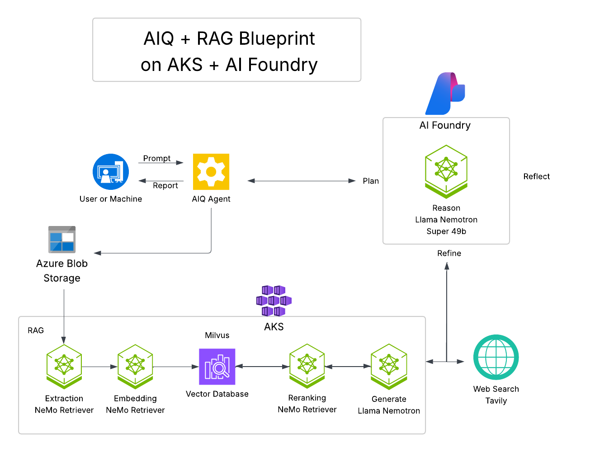

## Introduction

This workshop guides you through deploying a complete AI research platform on Azure Kubernetes Engine (AKS). You'll deploy both the NVIDIA [RAG Blueprint](https://build.nvidia.com/nvidia/build-an-enterprise-rag-pipeline) and the [AI-Q Research Assistant](https://build.nvidia.com/nvidia/ai-research-assistant) to create a powerful system for document Q&A and automated research report generation.

The platform combines document understanding (RAG) with intelligent research capabilities (AI-Q) to enable:

* **Document Q&A**: Chat with your documents using state-of-the-art RAG technology
* **Research Reports**: Generate comprehensive reports from multiple sources with AI-Q
* **Web Search Integration**: Combine your private documents with real-time web research
* **Human-in-the-Loop**: Edit and refine AI-generated content collaboratively

This workshop is ideal for researchers, analysts, and developers interested in:

* Building production-grade AI applications with NVIDIA NIM
* Deploying RAG pipelines with advanced reasoning capabilities
* Creating AI-powered research tools with multi-source intelligence
* Leveraging Kubernetes for scalable AI deployments
* Option to deploy Nemotron 49B locally on AKS, on Azure AI Foundry or use hosted NIM on build.nvidia.com

## What you will learn

By the end of this workshop, you will have hands-on experience with:

1. **Deploying the RAG Blueprint**: Set up a complete document Q&A system with Nemotron 49B, embedding, reranking, and vector search.
2. **Deploying AI-Q**: Add advanced research capabilities that reuse Nemotron 49B for multi-source synthesis and report generation.
3. **Integrating Multiple AI Services**: Connect different NIMs and microservices in a cohesive architecture with shared LLM resources.
4. **Enabling Web Search**: Configure Tavily API for real-time web research capabilities.
5. **Loading Research Datasets**: Initialize the system with curated biomedical and financial document collections.
6. **Generating Research Reports**: Use AI to create comprehensive, multi-source research documents.
7. **Phoenix Tracing(Optional)**: Monitor and debug your AI workflows with distributed tracing.

## Learn the Components
### **NVIDIA RAG Blueprint**

A production-ready Retrieval Augmented Generation pipeline that enables Q&A over your documents. Includes document ingestion, embedding, vector search, reranking, and LLM-powered response generation with citations.

### **NVIDIA AI-Q Research Assistant**

An intelligent research platform that generates comprehensive reports by querying multiple sources, synthesizing findings, and presenting them in editable, human-friendly formats.

### **NIMs (NVIDIA Inference Microservices)**

Optimized containers for deploying AI models with TensorRT acceleration. This workshop uses:

- **Nemotron Super 49B**: Advanced reasoning, chain-of-thought, Q&A, and report synthesis (shared by both RAG and AI-Q). Deployed on Azure AI 

Foundry or use build.nvidia.com API

- **NeMo Retriever Embedding 1B**: High-quality text embeddings
- **NeMo Retriever Reranking 1B**: Result reranking for improved accuracy
- **Page Elements NIM**: PDF text extraction

### **Tavily API**

A web search API that returns structured, LLM-ready content instead of raw HTML. AI-Q uses Tavily to combine your private document collections with real-time web data when generating research reports. Without it, AI-Q is limited to searching only your uploaded documents. With Tavily enabled, research reports can cite both internal documents and current web sources.

### **Phoenix Tracing** (optional)

An open-source observability platform providing distributed tracing and performance monitoring for AI workflows.

### **NVIDIA NIM on Azure AI Foundry** (optional)

NIM microservices are natively supported on Azure AI Foundry, enabling developers to quickly create a streamlined path for deployment. The microservices are running on Azure’s managed compute, removing the complexity of setting up and maintaining GPU infrastructure while ensuring high availability and scalability, even for highly demanding workloads. This enables teams to move quickly from model selection to production use. 

## Prerequisites 

- Azure Account with access to H100 GPUs (Standard_NC80adis_H100_v5)
- Azure CLI configured and authenticated
- kubectl installed
- Helm 3.x installed
- **NGC Account and API Key** ([Get it here](https://nvdam.widen.net/s/kfshg7fpsr/create-build-account-and-api-key-4))
- **Tavily API Key** ([Sign up here](https://tavily.com) - Free tier available)

### Prerequisites Validation

Before starting, verify your environment meets all requirements:

```bash
# Check Azure CLI version
az --version

# Verify authentication
az account show

# Check kubectl installation
kubectl version --client

# Check Helm installation
helm version

# Check GPU quota in your region
az vm list-usage --location <your-region> --query "[?localName=='Standard NCADSv5 Family vCPUs'].{Name:localName, Current:currentValue, Limit:limit}" -o table
```

### Hardware Requirements

The infrastructure provisioning script will automatically create an Azure Kubernetes Service (AKS) cluster with the following resources in the specified region. Ensure your Azure subscription has sufficient quotas for these resources.

* **Cluster Management Node Pool**:
  * **Machine Type**: `Standard_D32s_v5`
  * **Quantity**: 2 nodes (default for control/management)
  * **vCPUs**: 32 per node, 64 total
  * **Memory**: 128 GiB per node, 256 GiB total
* **GPU Worker Node Pool**:
  * **Machine Type**: `Standard_NC80adis_H100_v5`
  * **Quantity**: 4 nodes
  * **GPUs per node**: 2 x **NVIDIA H100 NVL** (95 GiB memory each)
  * **Total GPUs**: 8 x NVIDIA H100 NVL
  * **vCPUs**: 80 per node, 320 total
  * **Memory**: 640 GiB per node, 2.56 TiB total

**Note**: You can also use another SKU such as the `Standard_NC96ads_A100_v4` (1 node with 4x A100 80GB GPUs) but this limits the deployment of the `nim-llm` in-cluster. Using the `Standard_NC80adis_H100_v5` or similar SKU (4 nodes with 2x H100 NVL 95GB GPUs each) allows the `nim-llm` to be deployed in-cluster.

You may adjust node counts and machine types in the environment variables to fit your workload and quota limits.


## Task 1: Environment Configuration

### 1. Install AKS Preview extension

1. Open Cloud Shell

Once you log in, click on the Cloud Shell button, located at the top bar:

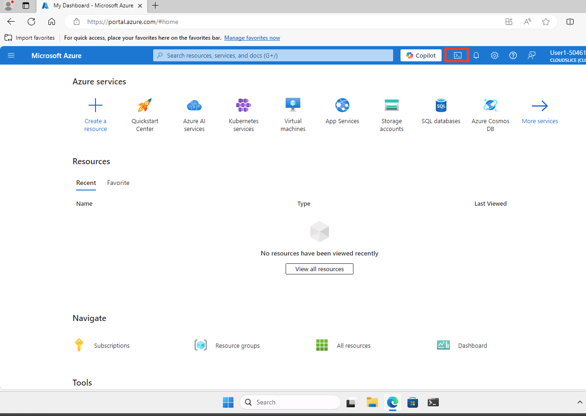

(Note: if it's not visible, click on the 3 dots):


2. When asked, select **Bash**


3. When asked, select "No Storage", the preferred subscription, and click "Apply"


4. Run the below commands:

```bash
az extension add --name aks-preview
az extension update --name aks-preview
```

### 2. Configure NVIDIA API Key

As part of the RAG blueprint several NVIDIA NIMs will be deployed. In order to get started with NIM, we'll need to make sure we have access to an [NVIDIA API key](https://org.ngc.nvidia.com/setup/api-key). We will save this key to be used as an environment variable `NGC_API_KEY="nvapi-..."`.

### 3. Set up environment variables

```bash

# NVIDIA API key available at https://org.ngc.nvidia.com/setup/api-key
export NGC_API_KEY="nvapi-..."
export NVIDIA_API_KEY=${NGC_API_KEY}

# Tavily API Key - Free tier available at https://tavily.com
export TAVILY_API_KEY="tvly-..."

# Note: SDK appends /v1 automatically, so don't include it here
export NVIDIA_API_URL="https://integrate.api.nvidia.com"

export MODEL_NAME=nvidia/llama-3.3-nemotron-super-49b-v1.5

# AKS Infrastructure Configuration
export REGION=eastus2
export RESOURCE_GROUP=rg-aiq-rag
export CLUSTER_NAME=rag-demo
export CLUSTER_MACHINE_TYPE=Standard_D32s_v5
export NODE_POOL_MACHINE_TYPE=Standard_NC80adis_H100_v5
export NODE_COUNT=4
export CPU_COUNT=2

# Namespace Configuration
export NAMESPACE=rag
export RAG_NAMESPACE=rag

# Kubeconfig
export KUBECONFIG=${PWD}/cluster.config

export CHART_NAME=rag-chart

# Azure Managed Grafana
export GRAFANA_NAME="aiq-rag-workshop-${RANDOM}"

# Azure Monitor Workspace
export AZ_MONITOR_WORKSPACE_NAME="aiq-rag-workshop"
```

### 4. Create a Resource Group

```bash
az group create -l ${REGION} -n ${RESOURCE_GROUP}
```

### 5. Create the Azure Monitor Workspace

```bash
az monitor account create \
  --resource-group ${RESOURCE_GROUP} \
  --location ${REGION} \
  --name ${AZ_MONITOR_WORKSPACE_NAME}
```

Retrieve the Azure Monitor Workspace ID

```bash
AZ_MONITOR_WORKSPACE_ID=$(az monitor account show \
  --resource-group ${RESOURCE_GROUP} \
  --name ${AZ_MONITOR_WORKSPACE_NAME} \
  --query id -o tsv)
```

Verify that the ${AZ_MONITOR_WORKSPACE_ID} is properly set

```bash
echo ${AZ_MONITOR_WORKSPACE_ID}
```

Expect:

```bash
/subscriptions/XXXXXXX-XXXX-XXXX-XXXX-XXXXXX/resourcegroups/rg-aiq-rag/providers/microsoft.monitor/accounts/aiq-rag-aks-labs
```

### 6. Create an Azure Managed Grafana instance

The Azure CLI extension for Azure Managed Grafana (amg) allows us to create, edit, delete the Azure Managed Grafana instance from the cli. If you can't add this extension, you can still perform these actions using the Azure Portal.

Add the Azure Manage Grafana extension to az cli:

```bash
az extension add --name amg
```

Create an Azure Managed Grafana instance:

```bash
az grafana create \
  --name ${GRAFANA_NAME} \
  --resource-group ${RESOURCE_GROUP} \
  --location ${REGION}
```

Once created, save the Grafana resource ID

```bash
GRAFANA_RESOURCE_ID=$(az grafana show \
  --name ${GRAFANA_NAME} \
  --resource-group ${RESOURCE_GROUP} \
  --query id -o tsv)
```

Verify that the ${GRAFANA_RESOURCE_ID} is properly set:

```bash
echo ${GRAFANA_RESOURCE_ID}
```

Expect:

```bash
/subscriptions/XXXXX-XXXX-XXX-XXXX-XXXXXX/resourceGroups/rg-aiq-rag/providers/Microsoft.Dashboard/grafana/aiq-rag-workshop-25151
```

### 6. Create AKS cluster

```bash
az aks create -g ${RESOURCE_GROUP} \
    --name ${CLUSTER_NAME} \
    --location ${REGION} \
    --node-count ${CPU_COUNT} \
    --node-vm-size ${CLUSTER_MACHINE_TYPE} \
    --enable-azure-monitor-metrics \
    --grafana-resource-id ${GRAFANA_RESOURCE_ID} \
    --azure-monitor-workspace-resource-id ${AZ_MONITOR_WORKSPACE_ID} \
    --tier Standard \
    --ssh-access disabled
```

### 7. Get AKS cluster credentials

```bash
az aks get-credentials --resource-group ${RESOURCE_GROUP} --name ${CLUSTER_NAME} --file cluster.config
```

### 8. Create the GPU node pool

Before proceeding, we need to register the new `ManagedGPUExperiencePreview` feature

```bash
az feature register --namespace Microsoft.ContainerService --name ManagedGPUExperiencePreview
```

Once registered, create the new node pool:

```bash
az aks nodepool add \
  --resource-group ${RESOURCE_GROUP} \
  --cluster-name ${CLUSTER_NAME} \
  --name gpupool \
  --node-count ${NODE_COUNT} \
  --node-vm-size ${NODE_POOL_MACHINE_TYPE} \
  --gpu-driver none \
  --node-taints sku=gpu:NoSchedule
```

> [!NOTE]: When creating GPU node pools without the `--gpu-driver none` flag, AKS automatically installs NVIDIA drivers as part of the node image deployment. For Standard_NC80adis_H100_v5 SKUs, if you want to use the NVIDIA GPU Operator to manage drivers instead, you can use the `--gpu-driver none` flag during node pool creation. In this workshop, since we deploy the GPU Operator in Task 2, the operator will detect and work with the automatically installed drivers (currently version 580.95.05 with CUDA 13.0 on H100 nodes).

Finally, create a grafana folder and import the sample dashboard:

```bash
az grafana folder create \
  --name ${GRAFANA_NAME} \
  --title AIQ-RAG-Workshop\
  --resource-group ${RESOURCE_GROUP}
```

Import the sample dashboard

```bash
az grafana dashboard import \
  --name ${GRAFANA_NAME} \
  --resource-group ${RESOURCE_GROUP} \
  --folder 'AIQ-RAG-Workshop' \
  --definition manifests/consolidated-nim-dashboard-example.json
```

## Task 2: NVIDIA GPU Operator Installation

### 1. Add the NVIDIA Helm repository

```bash
helm repo add nvidia https://helm.ngc.nvidia.com/nvidia --pass-credentials && helm repo update
```

### 2. Install the GPU Operator

```bash
helm install gpu-operator nvidia/gpu-operator \
  --namespace gpu-operator \
  --create-namespace \
  --set driver.enabled=true \
  --set toolkit.enabled=true \
  --set dcgmExporter.enabled=true \
  --set dcgmExporter.serviceMonitor.enabled=false \
  --set daemonsets.tolerations[0].key=sku \
  --set daemonsets.tolerations[0].operator=Equal \
  --set daemonsets.tolerations[0].value=gpu \
  --set daemonsets.tolerations[0].effect=NoSchedule
```

> [!NOTE]: 
> - `driver.enabled=true` - GPU Operator installs NVIDIA drivers (required for DCGM)
> - `toolkit.enabled=true` - Provides NVIDIA Container Toolkit (required for DCGM to access GPU libraries)
> - `dcgmExporter.enabled=true` - Deploys DCGM exporter pods for GPU metrics collection
> - `dcgmExporter.serviceMonitor.enabled=false` - We'll use Azure Monitor compatible ServiceMonitors instead
> - `daemonsets.tolerations` - Required to schedule GPU Operator components on tainted GPU nodes

### 3. Validate the installation 

```bash
kubectl get pods -n gpu-operator
```

> [!NOTE]: Driver installation takes 3-5 minutes. Wait for all pods to reach Running status before proceeding.

Expect (after 3-5 minutes):

```bash
NAME                                                         READY   STATUS    RESTARTS   AGE
gpu-feature-discovery-xxxxx                                  1/1     Running   0          5m
gpu-operator-xxxxx                                           1/1     Running   0          5m
gpu-operator-node-feature-discovery-gc-xxxxx                 1/1     Running   0          5m
gpu-operator-node-feature-discovery-master-xxxxx             1/1     Running   0          5m
gpu-operator-node-feature-discovery-worker-xxxxx             1/1     Running   0          5m
nvidia-container-toolkit-daemonset-xxxxx                     1/1     Running   0          4m
nvidia-cuda-validator-xxxxx                                  0/1     Completed 0          3m
nvidia-dcgm-exporter-xxxxx                                   1/1     Running   0          4m
nvidia-device-plugin-daemonset-xxxxx                         1/1     Running   0          4m
nvidia-driver-daemonset-xxxxx                                1/1     Running   0          4m
nvidia-mig-manager-xxxxx                                     1/1     Running   0          3m
nvidia-operator-validator-xxxxx                              1/1     Running   0          4m
```

You should see:
- **4 nvidia-driver-daemonset pods** (1 per GPU node) - Installing NVIDIA drivers
- **4 nvidia-container-toolkit-daemonset pods** (1 per GPU node) - Container runtime integration
- **4 nvidia-dcgm-exporter pods** (1 per GPU node) - **GPU metrics collection**
- **4 nvidia-device-plugin-daemonset pods** (1 per GPU node) - GPU resource management
- **4 nvidia-cuda-validator pods** (Completed) - Validation that CUDA works
- **4 nvidia-operator-validator pods** (1 per GPU node) - Overall validation

Verify GPU resources are allocatable:

```bash
kubectl get nodes -l agentpool=gpunp -o json | jq -r '.items[0].status.allocatable["nvidia.com/gpu"]'
```

Expect: `2` (GPUs per node)

## Task 3: NVIDIA Blueprint Deployment

### 1. Create a Kubernetes namespace

```bash
kubectl create namespace rag
```

### 2. Install the RAG 2.3 blueprint Helm chart

Note: in order to save GPU resources, we will be deploying the text-only ingestion blueprint.
Execute the below, to download the values.yaml file:
<!-- ```bash
wget -O values.yaml https://tinyurl.com/rag23values
``` -->

Install RAG2.3 Blueprint,  with NIMS llama-32-nv-embedqa-1b,llama-32-nv-rerankqa-1b,nemoretriever-page-elements-v2, nemoretriever-table-structure-v1 deployed on our A100 GPU Node. For Nemotron Super 49B we point to build.nvidia.com API :

```bash
helm install \
  --namespace rag \
  --create-namespace rag \
  https://helm.ngc.nvidia.com/nvidia/blueprint/charts/nvidia-blueprint-rag-v2.3.0.tgz \
  --username '$oauthtoken' \
  --password "${NGC_API_KEY}" \
  --values manifests/values.yaml \
  --set nim-llm.enabled=false \
  --set nvidia-nim-llama-32-nv-embedqa-1b-v2.enabled=true \
  --set nvidia-nim-llama-32-nv-embedqa-1b-v2.tolerations[0].key=sku \
  --set nvidia-nim-llama-32-nv-embedqa-1b-v2.tolerations[0].operator=Equal \
  --set nvidia-nim-llama-32-nv-embedqa-1b-v2.tolerations[0].value=gpu \
  --set nvidia-nim-llama-32-nv-embedqa-1b-v2.tolerations[0].effect=NoSchedule \
  --set nvidia-nim-llama-32-nv-rerankqa-1b-v2.enabled=true \
  --set nvidia-nim-llama-32-nv-rerankqa-1b-v2.tolerations[0].key=sku \
  --set nvidia-nim-llama-32-nv-rerankqa-1b-v2.tolerations[0].operator=Equal \
  --set nvidia-nim-llama-32-nv-rerankqa-1b-v2.tolerations[0].value=gpu \
  --set nvidia-nim-llama-32-nv-rerankqa-1b-v2.tolerations[0].effect=NoSchedule \
  --set ingestor-server.enabled=true \
  --set nv-ingest.enabled=true \
  --set nv-ingest.nemoretriever-page-elements-v2.deployed=true \
  --set nv-ingest.nemoretriever-page-elements-v2.tolerations[0].key=sku \
  --set nv-ingest.nemoretriever-page-elements-v2.tolerations[0].operator=Equal \
  --set nv-ingest.nemoretriever-page-elements-v2.tolerations[0].value=gpu \
  --set nv-ingest.nemoretriever-page-elements-v2.tolerations[0].effect=NoSchedule \
  --set nv-ingest.nemoretriever-graphic-elements-v1.deployed=false \
  --set nv-ingest.nemoretriever-table-structure-v1.deployed=true \
  --set nv-ingest.nemoretriever-table-structure-v1.tolerations[0].key=sku \
  --set nv-ingest.nemoretriever-table-structure-v1.tolerations[0].operator=Equal \
  --set nv-ingest.nemoretriever-table-structure-v1.tolerations[0].value=gpu \
  --set nv-ingest.nemoretriever-table-structure-v1.tolerations[0].effect=NoSchedule \
  --set nv-ingest.paddleocr-nim.deployed=false \
  --set nv-ingest.tolerations[0].key=sku \
  --set nv-ingest.tolerations[0].operator=Equal \
  --set nv-ingest.tolerations[0].value=gpu \
  --set nv-ingest.tolerations[0].effect=NoSchedule \
  --set imagePullSecret.password="${NGC_API_KEY}" \
  --set ngcApiSecret.password="${NGC_API_KEY}"
```

> [!NOTE]: The tolerations for `sku=gpu:NoSchedule` are required because GPU nodes are tainted to ensure only GPU workloads are scheduled on them. These tolerations are set for:
> - Embedding NIM (nvidia-nim-llama-32-nv-embedqa-1b-v2)
> - Reranking NIM (nvidia-nim-llama-32-nv-rerankqa-1b-v2)
> - NV-Ingest document processing NIMs (page-elements, table-structure)
> - NV-Ingest service itself

For more details on how to customize the [RAG Blueprint](https://github.com/NVIDIA-AI-Blueprints/rag/blob/v2.3.0/README.md)

### 3. Verify that the PODs are running

```bash
kubectl get pods -n rag
```

> [!NOTE]
> **IT CAN TAKE UP TO 20 mins** for all services to come up. You can continue on next steps in the meantime while you wait.

## Task 4: Access the RAG Frontend Service

The RAG Playground service exposes a UI that enables interaction with the end to end RAG pipeline. A user submits a prompt or a request and this triggers the chain server to communicate with all the necessary services required to generate output.

We need to take a few steps in order to access the service.

### Accessing the Frontend Service

In order to access the UI, we'll use port-forwarding to connect to the RAG frontend service.

Before starting, verify that all PODs are running:

```bash
kubectl get pods -n rag
```

Expect:

```bash
NAME                                                         READY   STATUS    RESTARTS      AGE
ingestor-server-b999c9fb-855c7                               1/1     Running   0             57m
milvus-standalone-7d97475c66-42q9k                           1/1     Running   1 (56m ago)   57m
rag-etcd-0                                                   1/1     Running   0             57m
rag-frontend-b44c8bcc-fgx9z                                  1/1     Running   0             57m
rag-minio-b88f5d5c5-r4w2c                                    1/1     Running   0             57m
rag-nemoretriever-page-elements-v2-598c95db78-d4rdx          1/1     Running   0             12m
rag-nemoretriever-table-structure-v1-68b89bfcdb-jxvnz        1/1     Running   0             12m
rag-nv-ingest-59d849cc57-27md7                               1/1     Running   0             13m
rag-nvidia-nim-llama-32-nv-embedqa-1b-v2-5646d8d6d6-nrx7v    1/1     Running   0             13m
rag-nvidia-nim-llama-32-nv-rerankqa-1b-v2-5897c9b79f-vj56s   1/1     Running   0             13m
rag-redis-master-0                                           1/1     Running   0             57m
rag-redis-replicas-0                                         1/1     Running   0             57m
rag-server-674c9ff7df-ktgxl                                  1/1     Running   2 (55m ago)   57m
```

Once all pods are ready, create a port-forward to the RAG frontend:

```bash
kubectl port-forward -n rag svc/rag-frontend 8080:3000
```

This command will forward local port 8080 to the RAG frontend service port 3000. Keep this terminal window open.

Open your browser and navigate to: http://localhost:8080

From here, we should be able to interact with the service and get some outputs from the LLM.

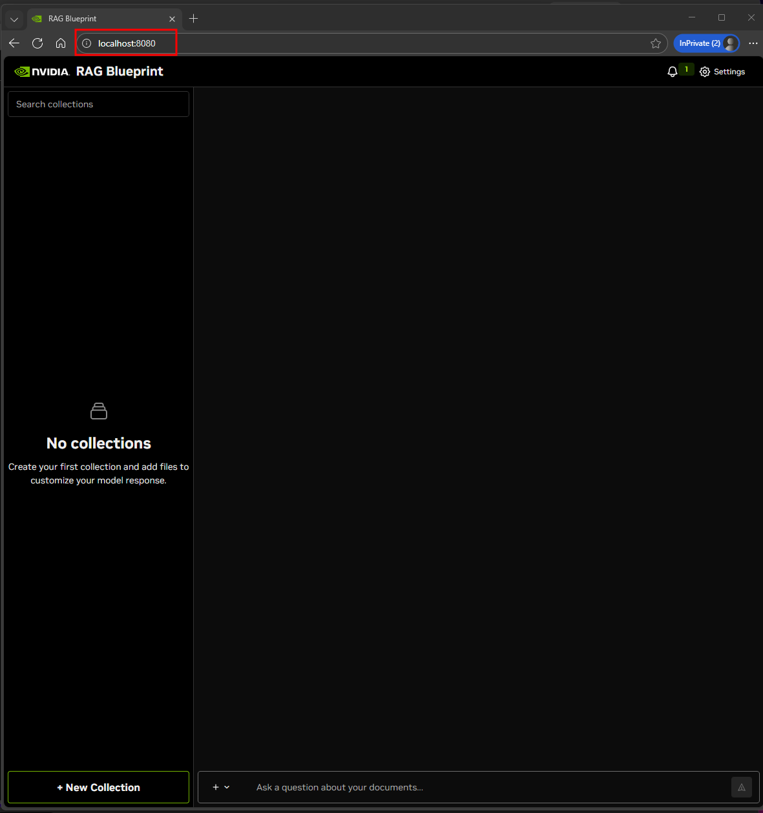

###  Testing the RAG Blueprint

In order to test the RAG capabilities of this application, we need to upload a document:

* Click new collection at the bottom left corner and give it a name
* Upload a Document by clicking in the square under "Source Files", selecting a PDF or text file and clicking "Create Collection"


* Wait for "Collection Created successfully" notification


* Close the prompt window, and click the "Test_Collection" checkbox on the left:

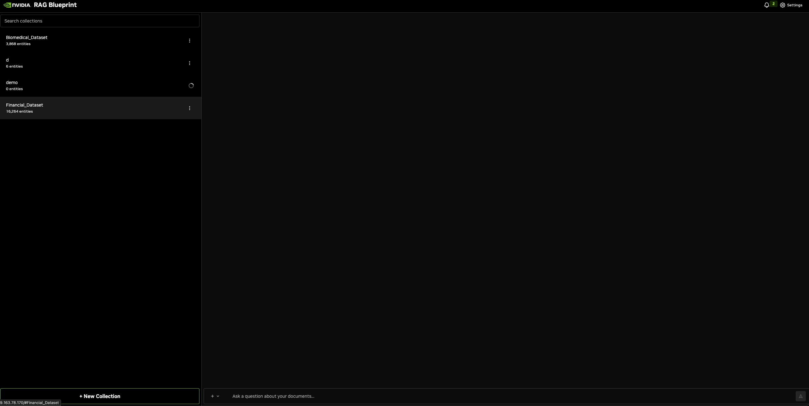


## Task 5: Deploy AIQ Service

Choose your Nemotron Super 49B deployment model:

| Option | Deployment Type | Setup Time | GPU Requirements | Best For |
|--------|----------------|------------|------------------|----------|
| **Option A: Azure AI Foundry** | Managed inference service | Minutes | None (managed) | Production workloads, auto-scaling needs |
| **Option B: NVIDIA Build API** | Hosted API | Seconds | None (hosted) | Quick prototyping, testing |
| **Option C: In-Cluster** | Self-hosted on AKS | 15-30 mins | 2x H100 NVL GPUs | Data privacy, full control |

All options provide identical LLM capabilities.

<details>
<summary><h3>Option A: Use Azure AI Foundry for nemotron-super-49b</h3></summary>

To Deploy nemotron-super-49b on Azure AI Foundry, follow this workshop guide: [Deploy NVIDIA NIM on Azure AI Foundry](../nim-aifoundry/README.md)

Go to nemotron-super-49b on Azure AI Foundry: 

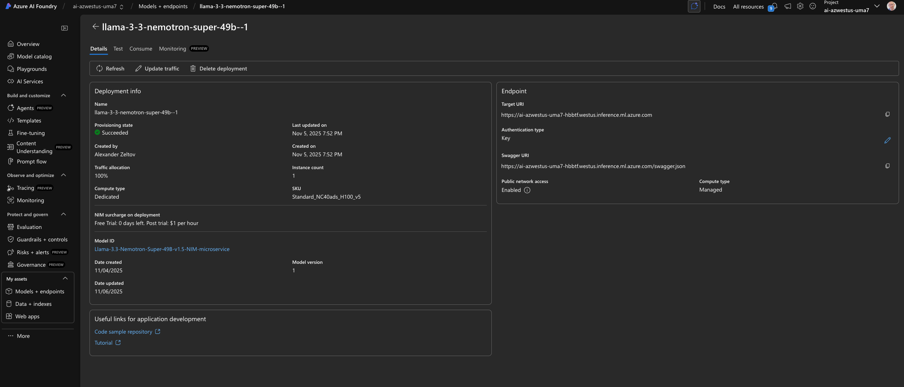

Click Deploy:

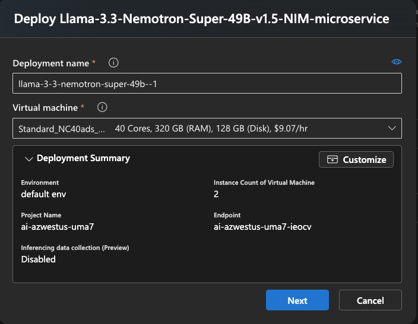

Once complete you will get an endpoint url and key:


Adjust these environment variables to reflect the information retrieved from the AI Foundry:

```bash
export NVIDIA_API_URL="https://ai-azwestus-uma7-hbbtf.westus.inference.ml.azure.com/v1"
export NVIDIA_API_KEY="xxx"
```

</details>

<details>
<summary><h3>Option B: Use build.nvidia.com API for nemotron-super-49b</h3></summary>

```bash
export NVIDIA_API_URL="https://integrate.api.nvidia.com/v1"
export NVIDIA_API_KEY="nvapi-cxxxxx"
```

</details>

<details>
<summary><h3>Option C: Deploy nemotron-super-49b locally in your AKS cluster</h3></summary>

This option deploys the Nemotron 49B model directly on your AKS GPU nodes, giving you full control and avoiding external API dependencies. This requires sufficient GPU resources (recommended: 2x H100 NVL GPUs).

1. Create the aira namespace

```bash
kubectl create ns aira
```

2. Create the NGC secret in the aira namespace

```bash
kubectl create secret generic ngc-api-secret --from-literal=password=$NGC_API_KEY -n aira
kubectl create secret docker-registry ngc-secret \
  --docker-server=nvcr.io \
  --docker-username='$oauthtoken' \
  --docker-password=$NGC_API_KEY \
  -n aira
```

3. Create the nemotron-49b StatefulSet

```bash
kubectl apply -f manifests/nemotron-49b-statefulset.yaml
```

#### 3. Deploy the StatefulSet

```bash
kubectl apply -f nemotron-49b-statefulset.yaml
```

#### 4. Monitor the deployment

Watch pod status (model download can take 15-30 minutes)

```bash
kubectl get pods -n aira -w
```

Expect:

```bash
kubectl get pods -n aira
NAME                                READY   STATUS    RESTARTS   AGE
aiq-nim-llm-0                       1/1     Running   0          2d18h
```

Check logs

```bash
kubectl logs -n aira aiq-nim-llm-0 -f
```

Wait until the pod shows `1/1 Running` and logs indicate the model is loaded and server is ready.

#### 5. Set environment variables for in-cluster deployment

```bash
export NVIDIA_API_URL="http://aiq-nim-llm.aira.svc.cluster.local:8000/v1"
export NVIDIA_API_KEY="not-used-for-local"
export MODEL_NAME="meta/llama-3.3-nemotron-super-49b-instruct"
```

**Note**: When using the in-cluster NIM, the API key is not validated (set to any value), and the model name should match the NIM's internal model name.

</details>

### Deploy AIQ Blueprint

The last portion missing before we can deploy the AI-Q Bluepring is the **Tavily API Key** ([Sign up here](https://tavily.com) - Free tier available)

```bash
export TAVILY_API_KEY="tvly-xxxxx"
```

We are now ready to deploy the AI-Q Blueprint on our AKS cluster!

```bash
helm upgrade --install aiq -n aira https://helm.ngc.nvidia.com/nvidia/blueprint/charts/aiq-aira-v1.2.0.tgz \
  --create-namespace \
  --username '$oauthtoken' \
  --password "${NGC_API_KEY}" \
  --set phoenix.enabled=true \
  --set phoenix.image.repository=docker.io/arizephoenix/phoenix \
  --set phoenix.image.tag=latest \
  --set tavilyApiSecret.password="$TAVILY_API_KEY" \
  --set nim-llm.enabled=true \
  --set config.rag_url="http://rag-server.rag.svc.cluster.local:8081" \
  --set config.rag_ingest_url="http://ingestor-server.rag.svc.cluster.local:8082" \
  --set config.milvus_host="milvus.rag.svc.cluster.local" \
  --set config.milvus_port="19530" \
  --set backendEnvVars.INSTRUCT_BASE_URL="$NVIDIA_API_URL" \
  --set backendEnvVars.INSTRUCT_API_KEY="$NVIDIA_API_KEY" \
  --set backendEnvVars.NEMOTRON_BASE_URL="$NVIDIA_API_URL" \
  --set backendEnvVars.NEMOTRON_API_KEY="$NVIDIA_API_KEY" \
  --set backendEnvVars.NEMOTRON_MODEL_NAME="$MODEL_NAME"
  ```

### Accessing the Frontend Service

In order to access the UI, we need to expose an external load balancer service to allow TCP traffic to the service that is running our front end.

We can do this using the following command:

```bash
kubectl -n aira expose deployment aiq-aira-frontend --name=aiq-aira-frontend-lb --type=LoadBalancer --port=80 --target-port=3000
```

To access the UI of the application, we get the external IP address of the front end load balancer service:

```bash
kubectl -n aira get svc aiq-aira-frontend-lb
```

Output should look like this:
```bash
kubectl -n aira get svc rag-frontend-lb -w


NAME              TYPE           CLUSTER-IP     EXTERNAL-IP    PORT(S)        AGE
aiq-aira-frontend-lb   LoadBalancer   10.0.13.61   50.85.148.12   80:30369/TCP   21m
```

### Before using the RAG app. Verify that all PODs are running:

```bash
kubectl get pods -n aira
```
sample output:
```
NAME                                READY   STATUS    RESTARTS   AGE
aiq-aira-backend-899c7494d-lvbbq    1/1     Running   0          63m
aiq-aira-frontend-c986bfc68-jqsdp   1/1     Running   0          63m
aiq-phoenix-6f69fff6d8-wh5cl        1/1     Running   0          63m
```
Open your browser and navigate to: http://EXTERNAL-IP-FROM-YOUR-CLI-RESULT-ABOVE

From here, we should be able to interact with the service and get some outputs from the LLM.

It should look like this:

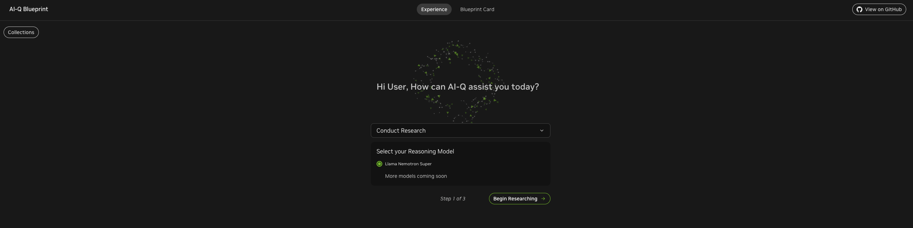

## Task 6: Loading Default Collections

AI-Q includes pre-curated Biomedical and Financial document collections. Load them with:

###  Apply Load Files Job

```bash
cat <EOF>> load-files.yaml
apiVersion: batch/v1
kind: Job
metadata:
  name: load-files-nv-ingest
  namespace: aira
spec:
  template:
    spec:
      imagePullSecrets:
      - name: ngc-secret
      containers:
      - name: load-files-nv-ingest
        image: nvcr.io/nvidia/blueprint/aira-load-files:v1.1.0
        imagePullPolicy: IfNotPresent
        env:
        - name: MILVUS_HOST
          value: "milvus.rag.svc.cluster.local"
        - name: MILVUS_PORT
          value: "19530"
        - name: RAG_INGEST_URL
          value: "http://ingestor-server.rag.svc.cluster.local:8082"
        - name: PYTHONUNBUFFERED
          value: "1"
        volumeMounts:
        - name: tempdata
          mountPath: /tmp-data
      volumes:
      - name: tempdata
        emptyDir: {}

      restartPolicy: OnFailure
EOF
```

Then apply the load-files job:

```bash
kubectl apply -f load-files.yaml
```

This will create a Kubernetes job that loads the pre-curated datasets into your Milvus vector database.

### Monitor Loading Progress

```bash
kubectl logs -l job-name=load-files-nv-ingest -n aira -f
```

Watch for completion messages. This process takes 5-10 minutes depending on cluster performance.

Once Job is complete, you will see the pre-created collections in Milvus:

**Available Collections:**
- **Biomedical Dataset** (`biomedical_collection`) - Research papers and medical literature focused on healthcare and life sciences
- **Financial Dataset** (`financial_collection`) - Financial reports, earnings statements, and commercial lending documents

These collections are stored as vector embeddings in Milvus and are ready for semantic search and retrieval.

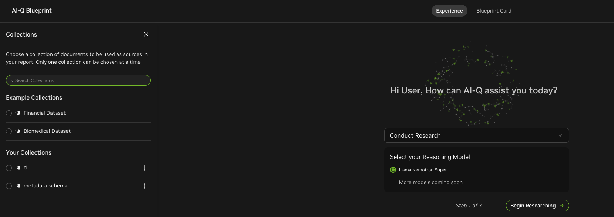


## Task 7. Test AI-Q Research Features

###  Generate Your First Research Report

1. In the AI-Q interface, select **"Financial Dataset"** (`financial_collection`) from the collection dropdown
  
  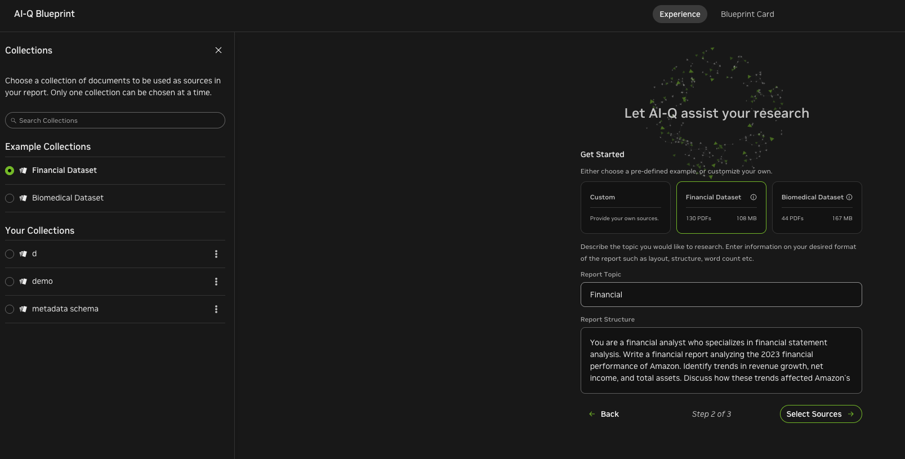
2. Enable **"Web Search"** toggle (to include Tavily results)
  
3. Enter a research topic: **"What are the key trends in commercial lending?"**
4. Click **"Generate Report"**
5. Wait 2-3 minutes for the AI to:
   - Generate research queries (Nemotron 49B)
   - Search your documents (via RAG)
   - Search the web (via Tavily)
   - Synthesize findings (Nemotron 49B)
   - Generate the final report (Nemotron 49B)

### 6.2 Edit and Refine the Report

1. Once the report is generated, click **"Edit"** on any section
2. Modify the content, add your insights, or request AI rewrites
3. Click **"Regenerate Section"** to have the AI refine specific parts
4. Click **"Save"** when satisfied

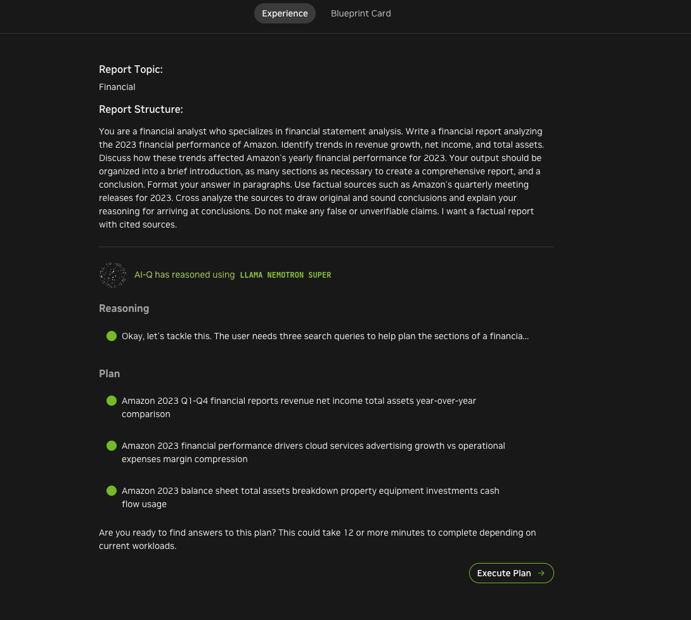

---

## Monitoring and Observability

With all services deployed, you now have access to comprehensive telemetry and monitoring capabilities. If you deployed Option C (in-cluster NIM), you have additional GPU and inference metrics available.

### Available Telemetry Endpoints

| Pod/Service | Telemetry Type | Description | Access Method |
|-------------|---------------|-------------|---------------|
| `aiq-nim-llm-0` | GPU metrics, inference stats | Real-time GPU utilization, memory, model performance, token throughput (Option C only) | DCGM exporter, NIM metrics endpoint |
| `aiq-phoenix-*` | Distributed tracing | Request traces, latency breakdown, LLM call chains, token usage | Port-forward to 6006, web UI |
| DCGM Exporter (gpu-operator) | GPU hardware metrics | GPU utilization, temperature, memory, power consumption across all nodes | Prometheus metrics, DCGM CLI |
| `aiq-aira-backend-*` | Application metrics | Backend health, API response times, error rates | Health endpoint `/health` |
| `rag-server-*` | RAG pipeline metrics | Query performance, embedding latency, cache hit rates, reranking stats | Health endpoint `/health` |
| `milvus-standalone-*` | Vector DB metrics | Search latency, index performance, storage utilization | Metrics endpoint `9091/metrics` |
| ServiceMonitors | Prometheus integration | Centralized metrics collection for Azure Monitor or Prometheus | `kubectl get servicemonitors -A` |

### Access GPU Metrics (Option C)

If you deployed the in-cluster NIM (Option C), check GPU utilization:

```bash
# View GPU metrics from DCGM exporter
kubectl get pods -n gpu-operator -l app=nvidia-dcgm-exporter

# Check GPU utilization for nim-llm pod
kubectl exec -it aiq-nim-llm-0 -n aira -- nvidia-smi

# View detailed GPU metrics
kubectl exec -it <dcgm-exporter-pod> -n gpu-operator -- dcgmi discovery -l
```

### Access Phoenix Tracing

Phoenix provides distributed tracing for all AI workflows:

```bash
# Access Phoenix UI
kubectl port-forward -n aira svc/aiq-phoenix 6006:6006
```

Open http://localhost:6006 in your browser to view:
- **Request traces**: End-to-end request flow through RAG, LLM, and web search
- **Latency breakdown**: Time spent in each component (embedding, retrieval, LLM inference)
- **Token usage**: Input/output tokens per request, cost estimation
- **Error rates**: Failed requests, retry attempts, error patterns

### ServiceMonitor Integration

ServiceMonitors are deployed for integration with Azure Monitor or Prometheus. 

1. Create the service monitors: 

```bash
cat <<EOF > servicemonitors.yaml
# Consolidated ServiceMonitors for AIQ RAG Blueprint
# This file contains all ServiceMonitor resources for monitoring NIMs and services
# Used with Azure Monitor managed Prometheus

---
# ServiceMonitor for AIQ NIM LLM (Nemotron)
apiVersion: azmonitoring.coreos.com/v1
kind: ServiceMonitor
metadata:
  name: aiq-nim-llm
  namespace: aira
  labels:
    app: aiq-nim-llm
spec:
  namespaceSelector:
    matchNames:
    - aira
  selector:
    matchLabels:
      app: aiq-nim-llm
  endpoints:
  - port: http
    path: /v1/metrics
    interval: 30s
    scrapeTimeout: 10s

---
# ServiceMonitor for Milvus Vector Database
apiVersion: azmonitoring.coreos.com/v1
kind: ServiceMonitor
metadata:
  name: milvus-standalone
  namespace: rag
spec:
  namespaceSelector:
    matchNames:
    - rag
  selector:
    matchLabels:
      app.kubernetes.io/name: milvus
      app.kubernetes.io/instance: rag
  endpoints:
  - port: metrics
    interval: 30s
    path: /metrics

---
# ServiceMonitor for Embedding NIM
apiVersion: azmonitoring.coreos.com/v1
kind: ServiceMonitor
metadata:
  name: rag-embedding-nim
  namespace: rag
spec:
  namespaceSelector:
    matchNames:
    - rag
  selector:
    matchLabels:
      app.kubernetes.io/name: nvidia-nim-llama-32-nv-embedqa-1b-v2
  endpoints:
  - interval: 30s
    path: /v1/metrics
    port: http

---
# ServiceMonitor for Reranking NIM
apiVersion: azmonitoring.coreos.com/v1
kind: ServiceMonitor
metadata:
  name: rag-reranking-nim
  namespace: rag
spec:
  namespaceSelector:
    matchNames:
    - rag
  selector:
    matchLabels:
      app.kubernetes.io/name: nvidia-nim-llama-32-nv-rerankqa-1b-v2
  endpoints:
  - interval: 30s
    path: /v1/metrics
    port: http

---
# ServiceMonitor for DCGM Exporter (GPU Metrics)
apiVersion: monitoring.coreos.com/v1
kind: ServiceMonitor
metadata:
  name: dcgm-exporter-metrics
  namespace: gpu-operator
  labels:
    app: nvidia-dcgm-exporter
spec:
  selector:
    matchLabels:
      app: nvidia-dcgm-exporter
  endpoints:
  - port: gpu-metrics
    interval: 15s
    path: /metrics
EOF
```

2. Apply the ServiceMonitor to the cluster

```bash
kubectl apply -f servicemonitors.yaml
```

3. List all ServiceMonitors

```bash
kubectl get servicemonitors -A
```

4. View specific ServiceMonitor configuration

```bash
kubectl describe servicemonitor <name> -n <namespace>
```

These ServiceMonitors automatically expose metrics for:

- GPU utilization and health
- Inference latency and throughput  
- Vector database performance
- RAG pipeline statistics

### Load test the cluster

We can use the `rag-sweep-hpa.sh` script described in the blog post (Enabling Horizontal Autoscaling of Enterprise RAG Components on Kubernetes)[https://developer.nvidia.com/blog/enabling-horizontal-autoscaling-of-enterprise-rag-components-on-kubernetes/] to gather some statistic on the NIM-LLM deployed on the cluster:

```bash
cat <<EOF> rag-sweep-job.yaml
apiVersion: v1
kind: ConfigMap
metadata:
  name: rag-sweep-script
  namespace: rag
data:
  rag-sweep.sh: |
    #!/usr/bin/env bash
    set -e
    
    # Script to sweep through different concurrency levels for RAG service with HPA
    # Requires genai-perf CLI tool installed and configured
    # Original author(s): Juana Nakfour,  Anita Tragler, Ruchika Kharwar, NVIDIA Corp.
    # Original source: https://developer.nvidia.com/blog/enabling-horizontal-autoscaling-of-enterprise-rag-components-on-kubernetes/
    # Modified by: Diego Casati, Microsoft Corp.
    
        export RAG_SERVICE="aiq-nim-llm.aira.svc.cluster.local:8000"
    export NIM_MODEL="nvidia/llama-3.3-nemotron-super-49b-v1.5"
    export NIM_MODEL_NAME="nvidia/llama-3.3-nemotron-super-49b-v1.5"
    export NIM_MODEL_TOKENIZER="nvidia/Llama-3_3-Nemotron-Super-49B-v1"
    
    export CONCURRENCY_RANGE="50 100 150 200 250 300"
    export request_multiplier=15
    
    export ISL="256"
    export OSL="256"
    
    # Skip collection-specific parameters for testing
    # export COLLECTION="multimodal_data"
    # export VDB_TOPK=10
    # export RERANKER_TOPK=4
    export OUTPUT_DIR="/results"
    
    mkdir -p $OUTPUT_DIR
    
    echo "[$(date +"%Y-%m-%d %H:%M:%S")] Starting RAG sweep benchmark"
    
    for CR in ${CONCURRENCY_RANGE}; do
    
      total_requests=$((request_multiplier * CR))
      EXPORT_FILE=RAG_CR-${CR}_ISL-${ISL}_OSL-${OSL}-$(date +"%Y-%m-%d-%H_%M_%S").json
    
      START_TIME=$(date +%s)
      echo "[$(date +"%Y-%m-%d %H:%M:%S")] Running with concurrency: $CR, total requests: $total_requests"
    
      genai-perf profile \
        -m $NIM_MODEL_NAME \
        --service-kind openai \
        --endpoint-type chat \
        --streaming \
        -u $RAG_SERVICE \
        --request-count $total_requests \
        --synthetic-input-tokens-mean $ISL \
        --synthetic-input-tokens-stddev 0 \
        --concurrency $CR \
        --output-tokens-mean $OSL \
        --extra-inputs max_tokens:$OSL \
        --artifact-dir $OUTPUT_DIR \
        --tokenizer $NIM_MODEL_TOKENIZER \
        --profile-export-file $EXPORT_FILE
    
      END_TIME=$(date +%s)
      elapsed_time=$((END_TIME - START_TIME))
    
      echo "[$(date +"%Y-%m-%d %H:%M:%S")] Completed: $EXPORT_FILE in $elapsed_time seconds"
    done
    
    echo "[$(date +"%Y-%m-%d %H:%M:%S")] Benchmark complete. Results in $OUTPUT_DIR"
    ls -lh $OUTPUT_DIR/
---
apiVersion: batch/v1
kind: Job
metadata:
  name: rag-sweep-benchmark
  namespace: rag
spec:
  backoffLimit: 2
  template:
    metadata:
      labels:
        app: rag-sweep-benchmark
    spec:
      restartPolicy: Never
      containers:
      - name: genai-perf
        image: nvcr.io/nvidia/tritonserver:25.01-py3-sdk
        command: ["/bin/bash"]
        args: ["/scripts/rag-sweep.sh"]
        volumeMounts:
        - name: script
          mountPath: /scripts
        - name: results
          mountPath: /results
        resources:
          limits:
            cpu: "4"
            memory: "8Gi"
          requests:
            cpu: "2"
            memory: "4Gi"
      volumes:
      - name: script
        configMap:
          name: rag-sweep-script
          defaultMode: 0755
      - name: results
        emptyDir: {}
EOF
```

### Azure Managed Grafana Dashboards

For enhanced visualization of all metrics, you can deploy Grafana to create comprehensive dashboards. Grafana integrates with the ServiceMonitor/Prometheus stack to provide:

**Nemotron 49B LLM Metrics Dashboard** (NIM LLM metrics only available when following Option C above)

- Token throughput and generation speed
- Request rates and error tracking
- Inter Token Latency (ITL) Heatmap
- Time to First Token (TTFT) Heatmap
- Total NIM requests

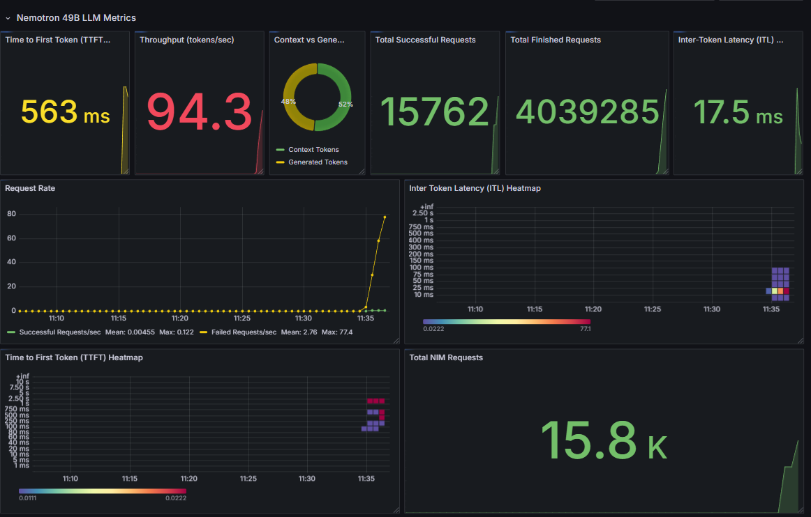

**Milvus Performance Dashboard**

- Vector search latency trends
- Index build/query performance
- Storage utilization and growth
- Query Throughput (vectors/sec)

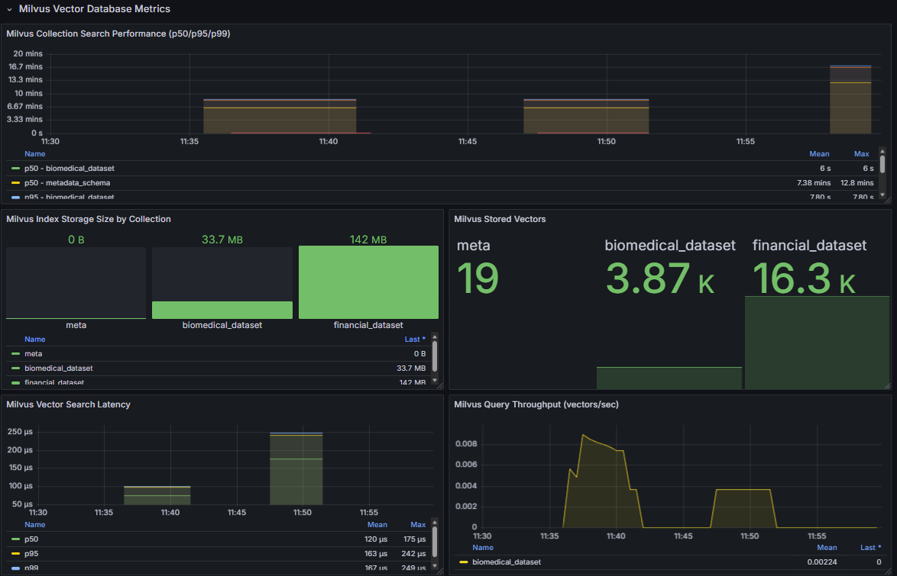

**GPU Hardware Metrics Dashboard**
- Real-time GPU utilization across all nodes
- Temperature, memory, and power consumption trends
- Per-model GPU allocation and efficiency (Option C)


**DCGM GPU Metrics (Hardware View)**

- DCGM GPU Utilization 
- DCGM GPU Temperature
- DCGM GPU Power Usage
- DCGM GPU Memory (Framebuffer)
- DCGM PCIe Bandwidth
- DCGM Tensor Core Activity

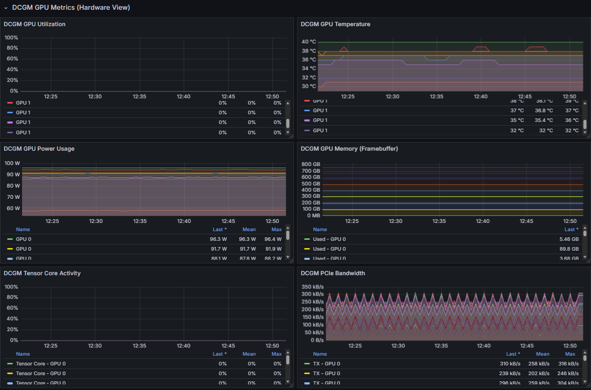

---

## Cleanup

### Remove AI-Q Deployment

```bash
# Uninstall AI-Q Helm release
helm uninstall aiq -n aira

# Delete namespace
kubectl delete namespace aira
```

### Remove RAG Blueprint

```bash
# Uninstall RAG Helm release
helm uninstall rag -n rag

# Delete namespace
kubectl delete namespace rag
```

### Remove GPU Operator

```bash
# List GPU Operator releases
helm list -n gpu-operator

# Uninstall GPU Operator
helm uninstall <release-name> -n gpu-operator

# Delete namespace
kubectl delete namespace gpu-operator
```

### Delete AKS Cluster

```bash
# Delete the entire cluster
az aks delete --resource-group $RESOURCE_GROUP --name $CLUSTER_NAME --yes --no-wait

# Delete resource group (removes all associated resources)
az group delete --name $RESOURCE_GROUP --yes --no-wait
```

### Verify Cleanup

```bash
# Check resource group status
az group show --name $RESOURCE_GROUP

# List remaining resources
az resource list --resource-group $RESOURCE_GROUP -o table
```

**Warning**: Deleting the resource group will remove ALL resources including storage accounts, networks, and persistent volumes. Ensure you have backed up any important data before proceeding.

## References

* (Create a fully managed GPU node pool on Azure Kubernetes Service (AKS) (preview))[https://learn.microsoft.com/en-us/azure/aks/aks-managed-gpu-nodes?tabs=add-ubuntu-gpu-node-pool]