# Configuring NVIDIA Dynamo on Azure Kubernetes Service (AKS) with Managed Prometheus

This guide provides a comprehensive walkthrough for setting up NVIDIA Dynamo for disaggregated inference serving on Azure Kubernetes Service (AKS). You will learn how to configure GPU-accelerated node pools, integrate Azure Managed Prometheus for observability, and deploy the Dynamo platform to achieve optimized scaling and performance.

**What this guide covers.** This guide focuses on disaggregated inference serving with the **Dynamo Planner**: provisioning an AKS cluster with GPU node pools, wiring Prometheus for metrics, and deploying the Dynamo platform so the planner can make scaling and placement decisions. It does **not** cover KV cache routing or KVBM (KV cache block manager); those features are outside the scope of this walkthrough.

**Why disaggregated serving?** Disaggregated serving separates the compute that runs the model (prefill, decode) from the orchestration and scheduling layer. That lets you scale GPUs and request handling independently, use the right-sized resources for each job, and improve utilization and cost efficiency compared to running everything on a single, fixed cluster.

## Prerequisites

- An active <b>Azure Subscription</b> with sufficient quota for GPU-enabled VMs.
- <b>Azure CLI</b> installed and configured.
- <b>Helm</b> and <b>kubectl</b> installed locally.
- A <b>HuggingFace Token</b> (HF_TOKEN) with access to the models you intend to deploy (e.g., Llama-3.1).

## Step 1: Create an AKS Cluster
While AKS clusters can be provisioned via the Azure CLI or SDKs, this example uses the Azure Portal for a guided experience.

1. <b>Navigate</b> to the Azure Portal and search for Kubernetes services.
2. <b>Click Create</b> and select <b>Kubernetes cluster</b>.
3. <b>Complete the configuration:</b> Follow the wizard to define your resource group, region, and cluster name. Standard networking and security defaults are sufficient for this walkthrough.

## Step 2: Configure GPU-Accelerated Node Pools
To leverage NVIDIA Dynamo's disaggregated inference capabilities, you must provision a node pool with high-performance GPUs.

1. <b>Create a GPU Node Pool:</b> Follow the <a href="https://learn.microsoft.com/en-us/azure/aks/use-nvidia-gpu">official AKS documentation</a> to add an Ubuntu-based GPU node pool.
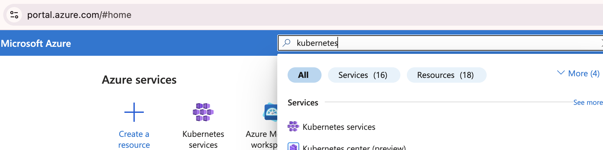
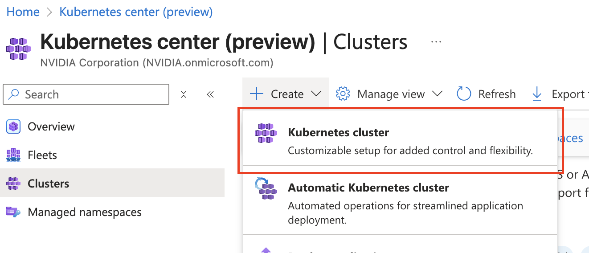
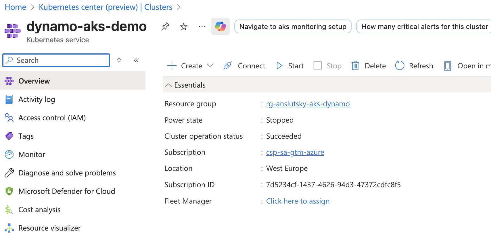
2. <b>Select an Advanced SKU:</b> For effective disaggregated serving, create a pool with at least <b>two (2) nodes</b>. Select a SKU with multiple GPUs per VM, such as Standard_NC80adis_H100_v5.

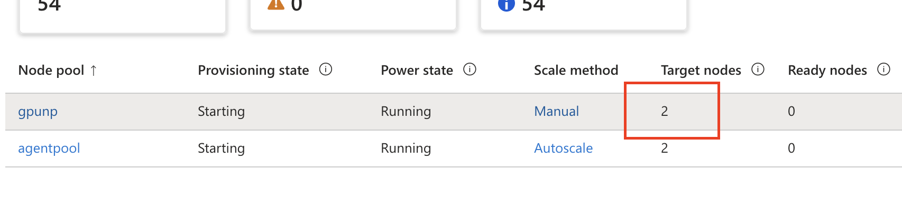
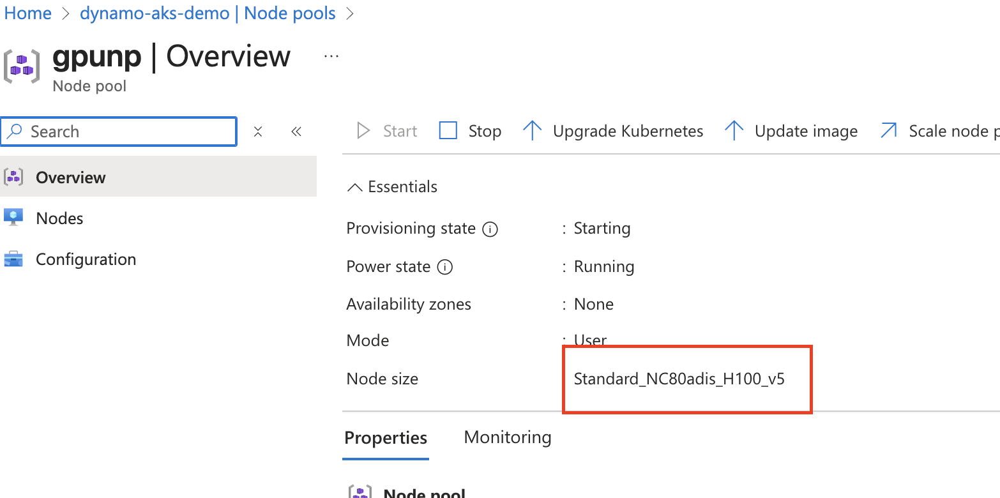

3. <b>Install the GPU Operator:</b> Ensure the NVIDIA GPU Operator is installed to manage GPU resources and drivers.
4. <b>Verify Capacity:</b> Use the following command to ensure your nodes are ready and GPUs are detectable:
```bash
kubectl describe node <aks-gpunp-***>
```
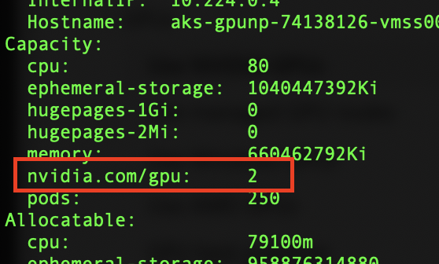


## Step 3: Enable Azure Managed Prometheus
Azure Managed Prometheus provides a fully managed environment for collecting and analyzing metrics.

1. Navigate to the <b>Monitor</b> configuration page within your AKS cluster resource.

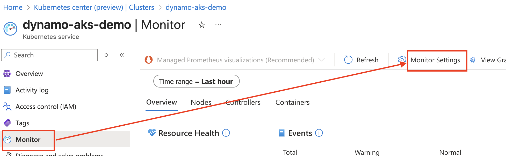

2. Select <b>Enable Managed Prometheus</b> and link it to an Azure Monitor Workspace.

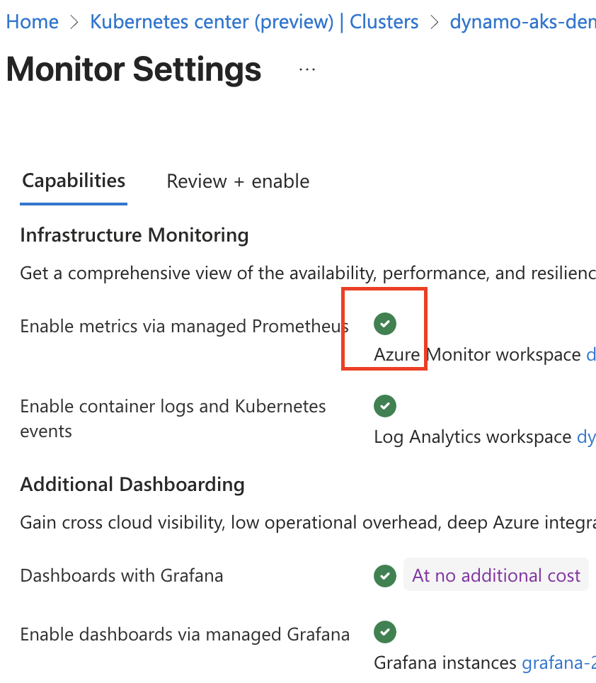

## Step 4: Install and Configure NVIDIA Dynamo

### 4a: Install Cluster-Local Prometheus
The <b>NVIDIA Dynamo Planner</b> requires a cluster-local Prometheus service to access real-time metrics for scaling decisions. We use the <a href="https://github.com/ai-dynamo/dynamo/blob/main/docs/kubernetes/observability/metrics.md">kube-prometheus-stack</a> for this purpose.

```
helm repo add prometheus-community https://prometheus-community.github.io/helm-charts
helm repo update
# Values allow PodMonitors to be picked up that are outside of the kube-prometheus-stack helm release
helm install prometheus -n monitoring --create-namespace prometheus-community/kube-prometheus-stack \
  --set prometheus.prometheusSpec.podMonitorSelectorNilUsesHelmValues=false \
  --set prometheus.prometheusSpec.podMonitorNamespaceSelector.matchLabels=null \
  --set prometheus.prometheusSpec.probeNamespaceSelector.matchLabels=null
````

**NOTE** You can verify the installation by port-forwarding the Prometheus service and accessing the UI at http://localhost:9090.

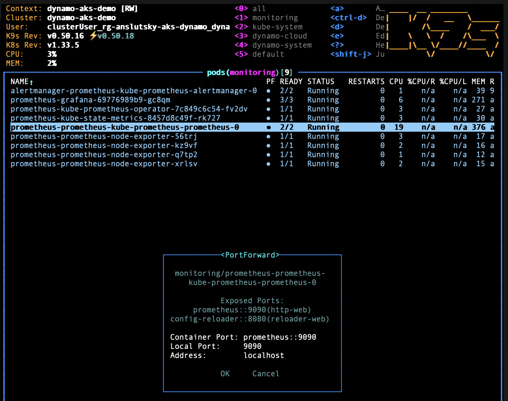
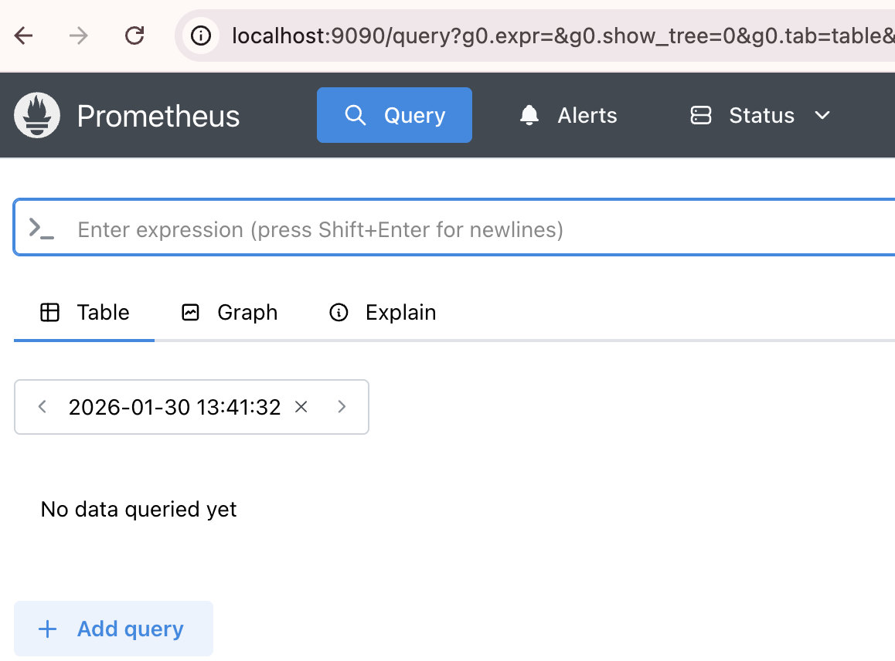

### 4b: Install the Dynamo Platform
With Prometheus running, install the dynamo-platform and point it to your local Prometheus endpoint.

Once the local Prometheus service is install, we now install the dynamo-platform component using <a href="https://github.com/ai-dynamo/dynamo/blob/v0.8.0/docs/kubernetes/installation_guide.md#path-a-production-install">Production Installation</a> Helm instructions and point it to the local Prometheus endpoint (http://prometheus-kube-prometheus-prometheus.monitoring.svc.cluster.local:9090):

```
# 1. Set environment
export NAMESPACE=<your namespace name, e.g.: dynamo-system >
export RELEASE_VERSION=0.8.0 # For this example, we choose Dynamo 0.8.0

# 2. Install CRDs (skip if on shared cluster where CRDs already exist)
helm fetch https://helm.ngc.nvidia.com/nvidia/ai-dynamo/charts/dynamo-crds-${RELEASE_VERSION}.tgz
helm install dynamo-crds dynamo-crds-${RELEASE_VERSION}.tgz --namespace default

# 3. Install Platform
helm fetch https://helm.ngc.nvidia.com/nvidia/ai-dynamo/charts/dynamo-platform-${RELEASE_VERSION}.tgz

# Install the platform and set "prometheusEndpoint"
helm install dynamo-platform dynamo-platform-${RELEASE_VERSION}.tgz --set prometheusEndpoint=http://prometheus-kube-prometheus-prometheus.monitoring.svc.cluster.local:9090 --namespace ${NAMESPACE} --create-namespace 
```

Once the installation completes, we can verify the installation in k9s:

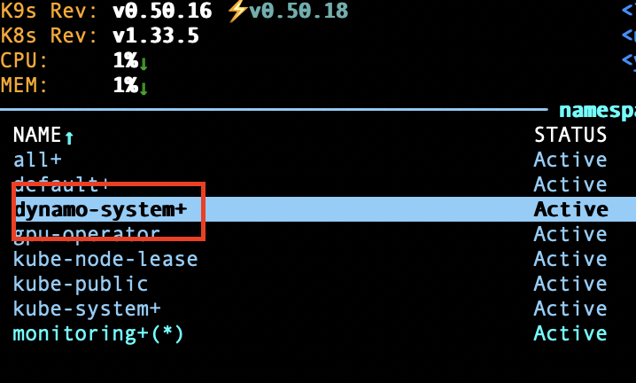
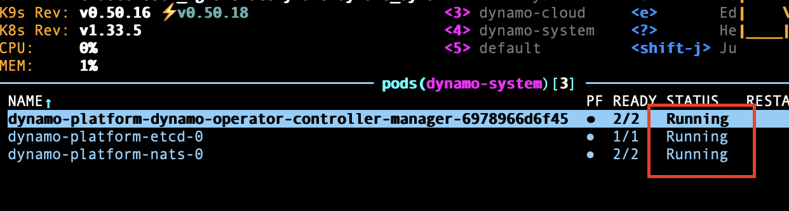

## Step 5: Deploy the Dynamo Planner
The Dynamo Planner is the "brain" of the operation. It monitors Key Performance Indicators (KPIs) and manages disaggregated scaling.

### 5a: Modify the Deployment YAML
Download the base disagg_planner.yaml from the NVIDIA Dynamo GitHub or use the pre-modified version in this repository.

Mandatory: Update the HF_TOKEN environment variable with your actual HuggingFace token.

Ports: Ensure the container ports in the YAML match your service configurations to allow Azure Managed Prometheus to scrape metrics correctly.

Dynamo Planner is the component responsible for monitoring inference performance KPIs and performing nodepool pod scaling to implement effective Disaggregate serving.  To install Dynamo Planner, we must first customize the base deployment yaml to suit our environment.  The following steps offer a simplified digest of the following in-depth <a src="https://github.com/ai-dynamo/dynamo/tree/main/tests/planner">Planner Installation Instructions</a>


Base deployment yaml example used in this walkthrough may be found in the following GitHub location: <a href="https://github.com/ai-dynamo/dynamo/blob/v0.8.0/examples/backends/vllm/deploy/disagg_planner.yaml">https://github.com/ai-dynamo/dynamo/blob/v0.8.0/examples/backends/vllm/deploy/disagg_planner.yaml</a>

Download the disagg_planner.yaml to a local folder and modify it according to <a src="https://github.com/ai-dynamo/dynamo/tree/main/tests/planner">Planner Installation Instructions</a>.

For simplicity, we are including a pre-modified version in this repository <a href="disagg_planner.yaml">./disagg_planner.yaml</a>

The included file has the following salient sections:

Please modify the HF_TOKEN value to include your HuggingFace token:

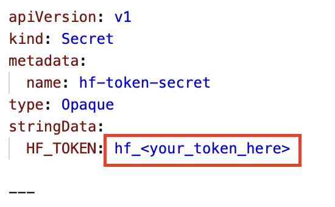

Next we show configuration sections used by Azure Managed Prometheus to scapre Dynamo Prometheus metrics and propogate them to Azure Minitoring Workspace dashboards.  Port configurations must match container ports for each of the services.  For this basic walkthrough, leave these configurations as-is unless working on an advanced installation with custom container port configation

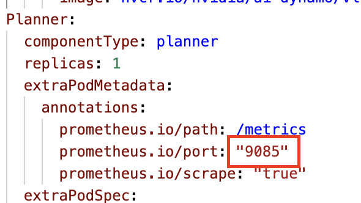
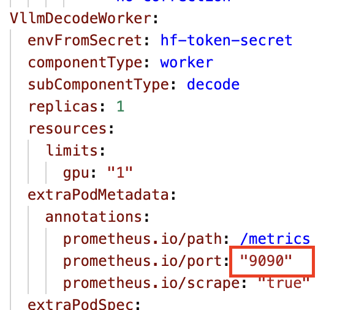
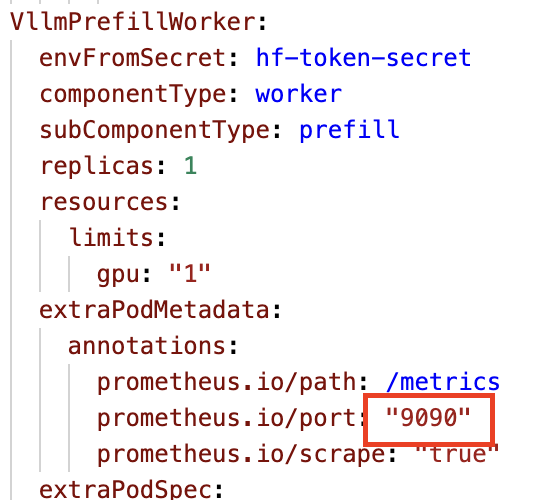

## Step 5b: Apply the custom Dynamo Planner Deployment YAML:

```
# Create a namespace
export CLOUD_NAMESPACE=<namespace name for cloud resource, for example 'dynamo-cloud'>
kubectl create namespace $CLOUD_NAMESPACE

# Apply the Deployment configuration
kubectl apply -f ./disagg_planner.yaml -n $CLOUD_NAMESPACE
```

## Step 5c: Verify Dynamo Planner deployment:

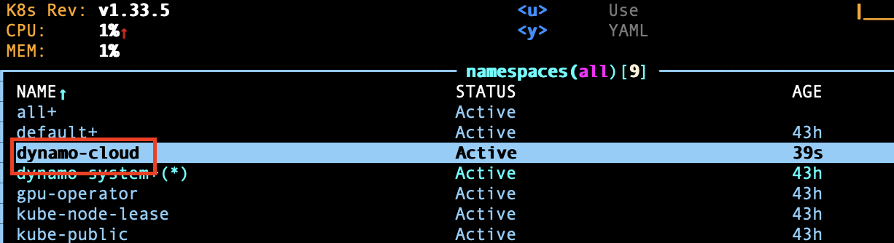
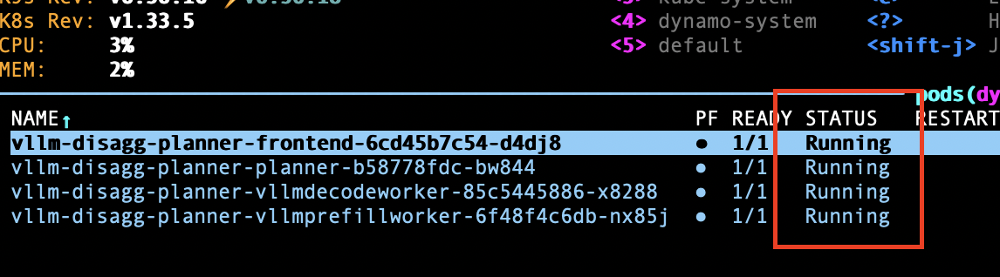


# Step 6: Configure Azure Manage Prometheus integration

Azure Managed Prometheus is a useful service that allows for application metrics collection and visualization within Azure environment.  However, by default, Azure Managed Prometheus is rather concervative and only collects a set of default metrics available in AKS.  

To enable Dynamo metrics collections, such as Time to First Token (TTFL), etc. we need to follow <a href="https://learn.microsoft.com/en-us/azure/azure-monitor/containers/prometheus-metrics-scrape-configuration">Customize collection of Prometheus metrics from your Kubernetes cluster using ConfigMap</a> instructions and enable custom metrics collection on the dynamo-cloud namespece created in the previous step.  

For simplicity, we include a pre-configured ConfigMap file in this repository <a href="ama-metrics-prometheus-config.yaml">./ama-metrics-prometheus-config.yaml</a> with the salient section highlighted below:

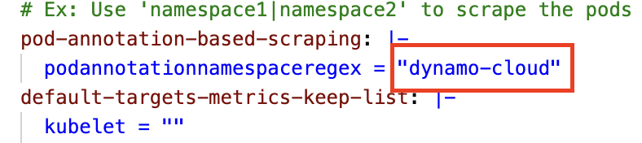

## Step 6a: Apply the custom ConfigMap to the cluster:

```
kubectl apply -f ./ama-metrics-prometheus-config.yaml
```

## Step 6b: Verify Azure Managed Prometheus metrics collection is active:

Locate any AKS Managed Prometheus metrics pod in the kube-system namespace:

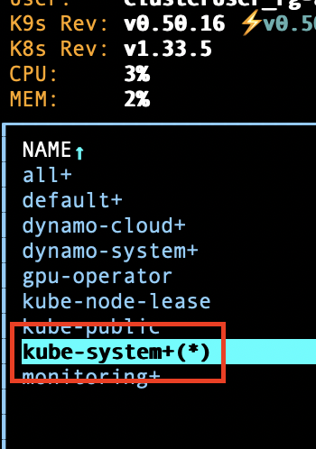
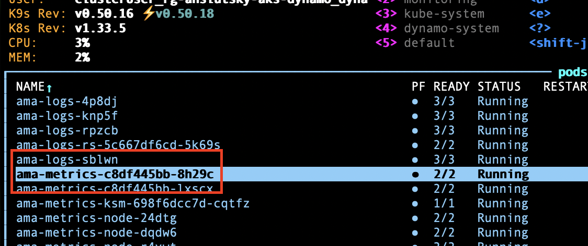

Set up port-forwarding:

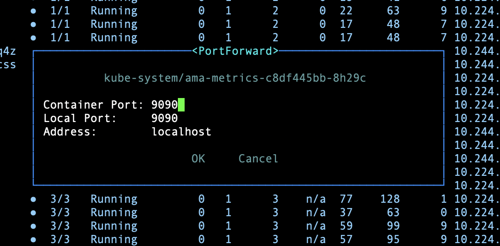

Navigate to <a href="http://localhost:9090">http://localhost:9090</a>:

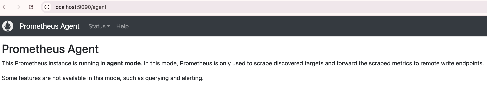

## Step 7: Testing Disaggregate serving 

Now that the Dynamo stack is set up and configured, we will be able to observe the benefits of Disaggregate in action.  The following steps show how to 

1. apply load to our cluster, 
2. observe worker scaling on the cluster
3. observe real-time TTFT metric improvements in Azure Monitoring Workspace

### Step 7a: Enable port-forwarding 

We first need to open a port on the frontend service:

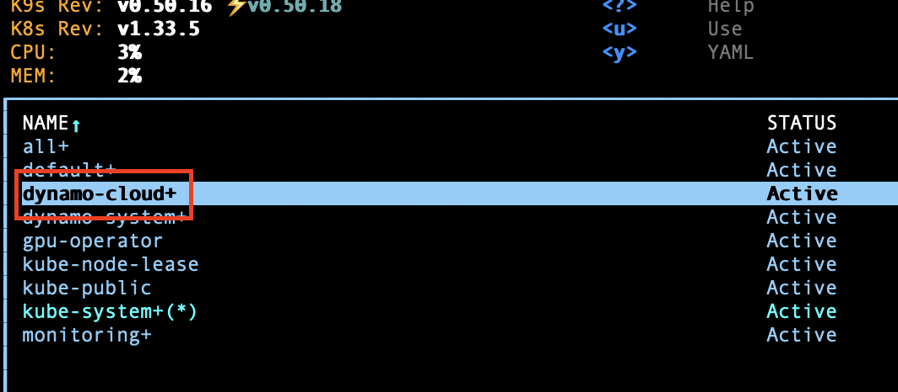
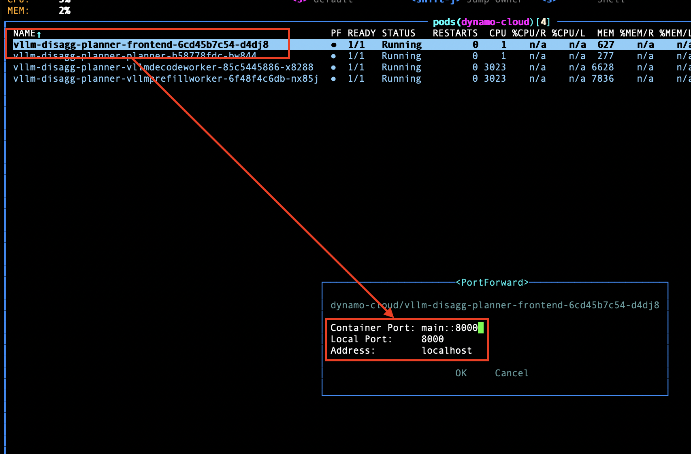

Test the port forward by navigating to <a href="http://localhost:8000/health">http://localhost:8000/health</a>

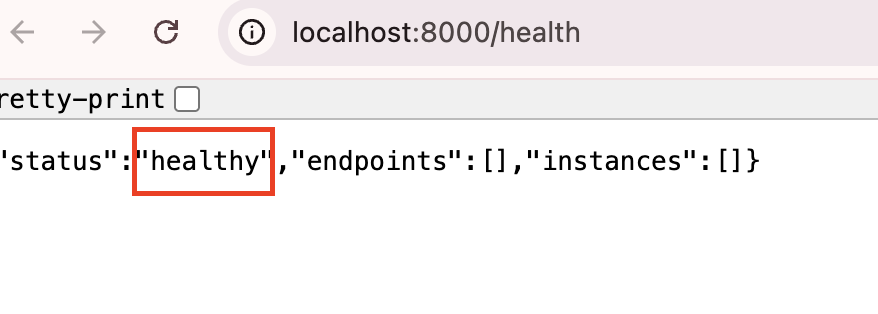

### Step 7b: Apply the Load Test:

For this example, we use the `aiperf` tool to apply load test to our Dynamo cluster.

(Optional if not already installed) Install the `airperf` tool using `pip`

```
pip install aiperf
```

Now run the following command to send test load to the AKS service on port 8000:

```
# set longer timeout allow for larger test window
export AIPERF_SERVICE_PROFILE_START_TIMEOUT=300

aiperf profile \
  --model nvidia/Llama-3.1-8B-Instruct-FP8 \
  --tokenizer nvidia/Llama-3.1-8B-Instruct-FP8 \
  --endpoint-type chat \
  --url localhost:8000 \
  --streaming \
  --synthetic-input-tokens-mean 4000 \
  --output-tokens-mean 150 \
  --request-rate 36.0 \
  --request-count 6480 \
  --num-dataset-entries 180 \
  --artifact-dir /tmp/scaling_test_phase2_extended \
  -v
```

Once the load test starts running, Dynamo Planner will analyze various metrics and scale cluster worker pods to optimize performance:

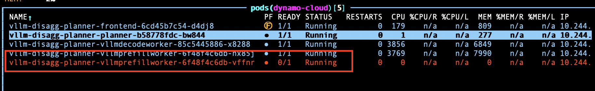

Users may observe the effect of the Disaggregate scaling in terms of important metrics such as Time to First Token in the AKS Monitoring Dashboards:


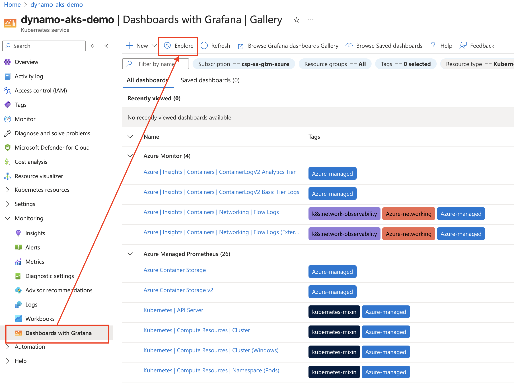
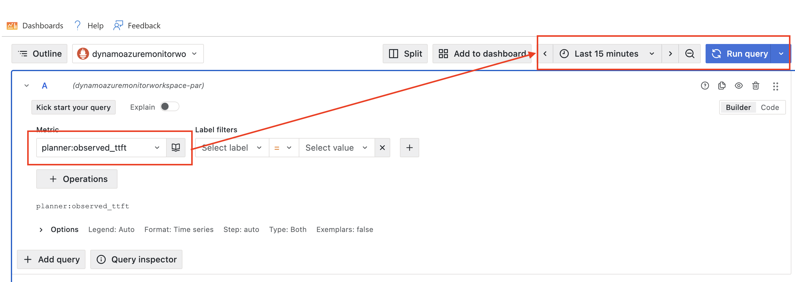

The resulting graph shows TTFT metrics climb and then rapidly decline, which reflects the effects of the Disaggregate scaling:

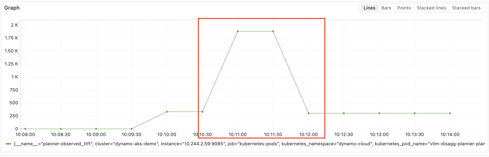

