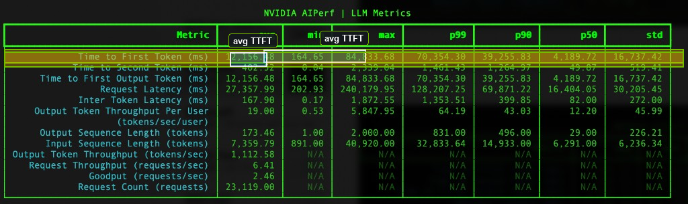
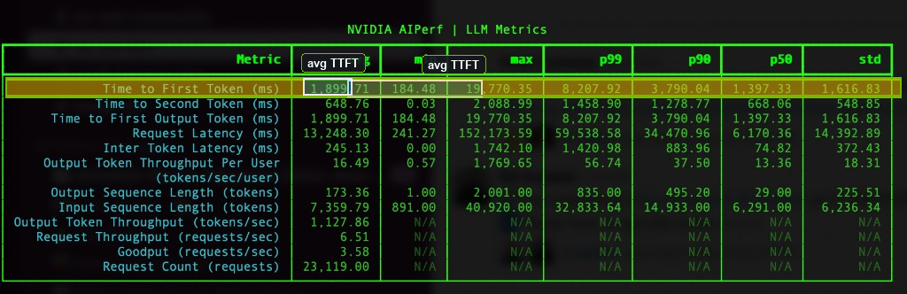

# NVIDIA Dynamo on AKS with KV cache routing and Azure Managed Prometheus

This guide walks through deploying **NVIDIA Dynamo** on **Azure Kubernetes Service (AKS)** for disaggregated LLM inference, enabling **KV cache routing** on the Dynamo frontend and wiring **Azure Managed Prometheus** to scrape Dynamo metrics (including time to first token, TTFT).

## What you will do

- Create or use an AKS cluster with a **multi-GPU** node pool suitable for Dynamo.
- Enable **Azure Managed Prometheus** on the cluster.
- Install the **Dynamo Kubernetes operator** (CRDs + platform Helm chart) *before* applying a `DynamoGraphDeployment`.
- Deploy the sample **`deploy_kvrouter.yaml`** (Qwen3-32B FP8) with **`--router-mode kv`** on the frontend.
- Extend Prometheus scraping so Dynamo metrics appear in **Azure Monitor**.
- Optionally run **NVIDIA AIPerf** with the **Mooncake** trace to compare latency and throughput with routing on vs. off.

## Prerequisites

- An active **Azure subscription** with quota for GPU-enabled VMs.
- **Azure CLI** installed and signed in (`az login`).
- **Helm 3** and **kubectl** configured to talk to your cluster.
- A **Hugging Face** token (**`HF_TOKEN`**) with access to the models you deploy (this workshop uses **Qwen/Qwen3-32B**).

## Table of contents

1. [Create an AKS cluster](#step-1-create-an-aks-cluster)
2. [GPU-accelerated node pools](#step-2-configure-gpu-accelerated-node-pools)
3. [Enable Azure Managed Prometheus](#step-3-enable-azure-managed-prometheus)
4. [Install the Dynamo Kubernetes operator](#step-35-install-the-dynamo-kubernetes-operator)
5. [Deploy Dynamo with KV cache routing](#step-4-deploy-dynamo-with-kv-cache-routing)
6. [Prometheus scrape configuration for Dynamo](#step-5-configure-azure-managed-prometheus-integration)
7. [Load testing and benchmark results](#step-6-load-testing-and-benchmark-results)

---

## Step 1: Create an AKS cluster

Clusters can be created with Azure CLI, Bicep, or Terraform; this example assumes the **Azure portal** for a guided flow.

1. In the [Azure portal](https://portal.azure.com), search for **Kubernetes services**.
2. Select **Create** → **Kubernetes cluster**.
3. Complete the wizard (resource group, region, cluster name). Default networking and security settings are sufficient for this workshop.

---

## Step 2: Configure GPU-accelerated node pools

Dynamo disaggregated serving needs nodes with **NVIDIA GPUs** and a supported driver/GPU stack.

1. **Add a GPU node pool** — Follow [Use NVIDIA GPUs on AKS](https://learn.microsoft.com/en-us/azure/aks/use-nvidia-gpu) to add an Ubuntu-based GPU node pool.


2. **Choose an appropriate SKU** — For disaggregated serving, use **at least two nodes** in the pool when you scale out. Pick a VM size with **multiple GPUs per node** if you plan multi-GPU workers (for example **Standard_NC80adis_H100_v5**). For this workshop, we have tested and recommend using **Standard_NC80adis_H100_v5** (H100) or **Standard_ND96asr_v4** (A100) depending on availability.


3. **Install the NVIDIA GPU Operator** (if not already installed) so GPU resources and drivers are managed consistently on the nodes.

4. **Verify GPUs** — Replace the placeholder with your node name:

```bash
kubectl describe node <aks-gpunp-node-name>
```

Confirm GPU capacity and that the node is **Ready**.


---

## Step 3: Enable Azure Managed Prometheus

[Azure Managed Prometheus](https://learn.microsoft.com/en-us/azure/azure-monitor/essentials/prometheus-metrics-overview) collects and stores Prometheus metrics without you running Prometheus yourself.

1. Open your AKS resource in the portal → **Monitor** (or **Insights** / monitoring settings, depending on portal layout).


2. **Enable Azure Monitor managed service for Prometheus** and associate an **Azure Monitor workspace**.


---

## Step 3.5: Install the Dynamo Kubernetes operator

`DynamoGraphDeployment` objects are reconciled by the **Dynamo operator**. Install **CRDs + platform** *before* `kubectl apply` of the deployment manifest, or you may see errors such as:

`no endpoints available for service dynamo-platform-dynamo-operator-webhook-service`

That happens when the **validating webhook** has no running backend (operator pod not up).

1. **Set namespace and chart versions** — Use chart versions that match the **Dynamo / runtime images** you intend to run. The sample [`deploy_kvrouter.yaml`](deploy_kvrouter.yaml) pins **`nvcr.io/nvidia/ai-dynamo/vllm-runtime:0.8.0`**; align your Helm chart release with that line of images, or update both charts and image tags together. Example:

```bash
export NAMESPACE=dynamo-system
export RELEASE_VERSION_PLATFORM=1.0.0   # adjust to match NGC chart + your images (previously tested: 0.9.0-post1)
export RELEASE_VERSION_CRD=1.0.0        # adjust to pair with platform (previously tested: 0.9.0)
```

2. **Install CRDs** (skip if already installed):

```bash
helm fetch https://helm.ngc.nvidia.com/nvidia/ai-dynamo/charts/dynamo-crds-${RELEASE_VERSION_CRD}.tgz
helm install dynamo-crds dynamo-crds-${RELEASE_VERSION_CRD}.tgz --namespace default
```

3. **Install Dynamo platform** (operator, etcd, NATS):

```bash
helm fetch https://helm.ngc.nvidia.com/nvidia/ai-dynamo/charts/dynamo-platform-${RELEASE_VERSION_PLATFORM}.tgz
helm install dynamo-platform dynamo-platform-${RELEASE_VERSION_PLATFORM}.tgz \
  --namespace ${NAMESPACE} --create-namespace
```

4. **Verify** the operator and dependencies:

```bash
kubectl get pods -n dynamo-system
```

You should see **`dynamo-platform-dynamo-operator-controller-manager-*`**, **`dynamo-platform-etcd-0`**, and **`dynamo-platform-nats-0`** in **Running** state. If the operator is not running, webhook validation fails and `kubectl apply` for `DynamoGraphDeployment` returns an **InternalError**.

**Optional:** To scrape operator metrics into Managed Prometheus, add to `helm install`, for example:

`--set dynamo-operator.dynamo.metrics.prometheusEndpoint=<your-prometheus-url>`

See the Dynamo [Kubernetes installation guide](https://docs.nvidia.com/dynamo/latest/kubernetes/installation_guide.html).

---

## Step 4: Deploy Dynamo with KV cache routing

KV cache routing is enabled on the **Frontend** service by passing **`--router-mode`** **`kv`** (see [`deploy_kvrouter.yaml`](deploy_kvrouter.yaml)). The sample is derived from the upstream [aggregated round-robin Qwen3-32B recipe](https://github.com/ai-dynamo/dynamo/blob/main/recipes/qwen3-32b/vllm/agg-round-robin/deploy.yaml).

### 4a: Namespace, Hugging Face secret, and model cache

1. **Create a namespace** for the Dynamo “cloud” deployment (name is arbitrary; examples use `dynamo-cloud`):

```bash
export CLOUD_NAMESPACE=dynamo-cloud   # or your preferred name
kubectl create namespace "${CLOUD_NAMESPACE}"
```

2. **Provide `HF_TOKEN`** — Either:
   - Edit the **`hf-token-secret`** `Secret` in [`deploy_kvrouter.yaml`](deploy_kvrouter.yaml) and set `HF_TOKEN`, **or**
   - Create the secret from the CLI (do not commit real tokens to git):

```bash
kubectl create secret generic hf-token-secret \
  --from-literal=HF_TOKEN="your-token-here" \
  -n "${CLOUD_NAMESPACE}"
```

If you use the CLI secret, ensure the deployment references the same secret name as in the manifest.

Edit the token in the manifest or portal as needed (example placement):


3. **Model cache PVC** — Apply the model cache storage so the model is downloaded once and reused across restarts:

```bash
kubectl apply -f model-cache/cache.yaml -n "${CLOUD_NAMESPACE}"
```

4. **Download the model** into the cache (one-time job):

```bash
kubectl apply -f model-cache/model-download.yaml -n "${CLOUD_NAMESPACE}"
```

Wait for the download job to complete before relying on fast worker startup.

**PVC creation via operator:** [`deploy_kvrouter.yaml`](deploy_kvrouter.yaml) sets `create: true` for **`model-cache`** and **`compilation-cache`**. If you see *“Top-level PVC does not exist and create is not enabled”*, either keep `create: true` or create those PVCs manually in **`${CLOUD_NAMESPACE}`** before applying the deployment.

**Metrics ports:** Keep container ports and **`prometheus.io/*`** annotations in the YAML consistent so **Azure Managed Prometheus** can scrape the frontend and workers.

**About the sample model:** **`deploy_kvrouter.yaml`** runs **FP8**-quantized **Qwen/Qwen3-32B**, which fits smaller SKUs (for example **Standard_NC40ads_H100_v5**) for experimentation. Production sizing depends on model size, concurrency, and SLOs—choose larger SKUs and replica counts accordingly.

**Prometheus annotations in the manifest** — The following screenshots highlight scrape-related settings; ports must match the pods’ metric endpoints.


### 4b: Apply the DynamoGraphDeployment

```bash
kubectl apply -f ./deploy_kvrouter.yaml -n "${CLOUD_NAMESPACE}"
```

### 4c: Verify the deployment

Confirm frontend and worker pods become **Running** and services are created as expected.


#### Troubleshooting: webhook “no endpoints available”

If `kubectl apply -f ./deploy_kvrouter.yaml` fails with **InternalError** and **“no endpoints available for service dynamo-platform-dynamo-operator-webhook-service”**, the operator is not installed or not healthy.

**Fix:** Complete [Step 3.5: Install the Dynamo Kubernetes operator](#step-35-install-the-dynamo-kubernetes-operator), run `kubectl get pods -n dynamo-system`, ensure **`dynamo-platform-dynamo-operator-controller-manager-*`** is **Running**, then apply again.

---

## Step 5: Configure Azure Managed Prometheus integration

By default, scraping on AKS can be **conservative** and may not include all application metrics. To scrape **Dynamo** endpoints (TTFT and other Prometheus metrics), customize collection using a **ConfigMap**, as described in [Customize Prometheus metric collection for AKS](https://learn.microsoft.com/en-us/azure/azure-monitor/containers/prometheus-metrics-scrape-configuration).

Target the **same namespace** where Dynamo runs (**`CLOUD_NAMESPACE`**, e.g. `dynamo-cloud`).

This repo includes [`ama-metrics-prometheus-config.yaml`](ama-metrics-prometheus-config.yaml). It sets **`podannotationnamespaceregex`** to **`dynamo-cloud`** so pods with `prometheus.io/scrape` annotations in that namespace are discovered. If you used a different **`CLOUD_NAMESPACE`**, update that regex (or add `|your-namespace`) before applying. The salient section is illustrated below.


### Step 5a: Apply the ConfigMap

```bash
kubectl apply -f ./ama-metrics-prometheus-config.yaml
```

### Step 5b: Verify scraping

Locate the **Azure Monitor / managed Prometheus** agent metrics pods (often in **`kube-system`**), port-forward if needed, and open the local Prometheus UI to query Dynamo metrics.


[http://localhost:9090](http://localhost:9090)


---

## Step 6: Load testing and benchmark results

With the KV-aware frontend in place, you can:

1. **Generate load** against the Dynamo HTTP API (for example via port-forward).
2. **Watch TTFT and related metrics** in Azure Monitor dashboards as workers scale and cache behavior changes.

### Step 6a: Port-forward to the frontend

Forward a local port to the **Dynamo frontend** `Service` (port **8000** in the sample).


Check health:

[http://localhost:8000/health](http://localhost:8000/health)


### Step 6b: Run AIPerf with the Mooncake trace

**What this dataset is.** The workshop load test uses traces published with [Mooncake](https://github.com/kvcache-ai/Mooncake/)—the serving stack behind **Kimi** (Moonshot AI). For the [FAST'25 paper](https://www.usenix.org/conference/fast25/presentation/qin), the project released **`FAST25-release/traces/`**, including **`toolagent_trace.jsonl`**: one JSON object per line describing a **synthetic replay** of real production **shape** (lengths, timing, and **which KV blocks** would have been shared), not the original user text. Prompts are **not** in the file; block identities are **remapped** to opaque integers (`hash_ids`).

**Note (naming):** You may hear informal shorthand like “Moonrake”; **this guide means the Mooncake FAST’25 JSONL traces** and AIPerf’s **`mooncake_trace`** loader.

**Why we use it here.** KV cache routing matters most when many live requests **start the same way**—same instructions, same tool definitions, same retrieved document, same long scaffold—so a worker that already processed that **prefix** can serve the next request with less **prefill** work and lower **time to first token**. Random or wholly unique prompts do not exercise that behavior. The Mooncake **tool/agent**-style trace captures **realistic timing** and **realistic overlap** from a large production-shaped workload, so AIPerf stresses **router decisions** and **TTFT** in a way that lines up with what you graph in [Step 5](#step-5-configure-azure-managed-prometheus-integration). [Step 6c](#step-6c-sample-aiperf-results--kv-routing-on-vs-off-8-gpu) compares routing on vs. off on this trace because it is intentionally **cache-friendly**, not a worst-case stream of unrelated long prompts.

**When KV routing helps (plain English).** “Prefix reuse” simply means **the beginning of the prompt is shared** across requests. The model would compute the same early tokens (and their **KV cache**) again unless a **router** sends follow-on traffic to a worker that **already holds** that cache.

- **Same system prompt for everyone** — You ship one long system message (safety policy, tone, formatting rules, locale) in front of every user turn. Thousands of short user questions hit the cluster; without routing, round-robin spreads them across GPUs and **each GPU recomputes the identical multi-thousand-token head** before it ever reads the user’s question.

- **RAG with a hot document** — Many users ask different questions but the **same** retrieved passages (runbook, contract section, product spec) are pasted at the top of the prompt. The **shared chunk** is the prefix; routing can keep those requests on workers that already encoded that text.

- **Coding assistants and tool-using agents** — A session repeats a **large fixed scaffold**: IDE rules, repository map, API descriptions, tool JSON, environment preamble. Each turn only **appends** a small user message or tool result. Parallel users often share the same **tool and instruction block** even when their follow-up text differs.

- **Support bots and templated workflows** — The first screen of context is the same product disclaimers, **FAQ**, escalation logic, and CRM fields; only the customer’s latest message changes. High traffic amplifies the waste if every replica prefills that template from scratch.

- **Batch evaluation and A/B harnesses** — Benchmark rows look like **identical evaluation instructions + different test item**. The harness text is a long shared prefix repeated across the batch; routing amortizes that work across requests.

**When it helps less.** If prompts are mostly **unique from token one** (arbitrary open-ended chat with no shared template), or traffic is so sparse that **cache is cold** on every worker, routing has little prefix to exploit. KV routing is a **workload-shaped** win: it shows up when **overlap** is real in production.

**Trace file (for AIPerf).** `toolagent_trace.jsonl` is **JSONL**: one request per line with **`timestamp`** (schedule, ms), **`input_length`**, **`output_length`**, and abstract **`hash_ids`** that encode **which parts of the prompt overlap** between requests—without storing real user text. Use **`--custom-dataset-type mooncake_trace`** and **`--fixed-schedule`** so replay follows that timing; see the [Mooncake traces](https://github.com/kvcache-ai/Mooncake/tree/main/FAST25-release/traces) for the raw files.

**Caveats.** The trace is **one** anonymized slice of one product workload; counts shift if you change model or tokenizer. Use it to compare **routing on vs. off** and to reason about **TTFT** under reuse, then validate against **your** traffic.

Install **AIPerf** if needed:

```bash
pip install aiperf
```

Clone or download the Mooncake trace repository so the **`--input-file`** path exists locally. With port-forward to **localhost:8000**, run (adjust **`--artifact-dir`** per run so results do not overwrite):

```bash
# Long timeout supports long-running trace replay

aiperf profile \
  -m "Qwen/Qwen3-32B" \
  --tokenizer "Qwen/Qwen3-32B" \
  --input-file ./Mooncake/FAST25-release/traces/toolagent_trace.jsonl \
  --custom-dataset-type mooncake_trace \
  --fixed-schedule \
  --url "http://localhost:8000" \
  --streaming \
  --random-seed 42 \
  --workers-max 200 \
  --request-timeout-seconds 10000 \
  --record-processors 8 \
  --artifact-dir /tmp/aiperf_run \
  --goodput "time_to_first_token:5000 inter_token_latency:100"
```

While load runs, observe scaling and TTFT in Azure Monitor (examples below).


TTFT may rise during cold start, then improve as workers and cache state stabilize:


### Step 6c: Sample AIPerf results — KV routing on vs. off (8× GPU)

The tables below summarize **NVIDIA AIPerf** on the same **Mooncake FAST'25 toolagent** trace against **Qwen/Qwen3-32B** on an **eight-GPU** cluster. The only deliberate change between runs was **Dynamo KV cache routing** (**`--router-mode kv`** on vs. off). Each run processed **23,119** requests.

**TTFT (time to first token)** — routing **disabled** vs. **enabled**:

| TTFT statistic | Routing disabled | Routing enabled |
| :-- | --: | --: |
| **Average** | ~12.2 s (~12,156 ms) | ~1.9 s (~1,900 ms) |
| **p50** | ~4.2 s | ~1.4 s |
| **p99** | ~70 s | ~8.2 s |

Mean TTFT is roughly **6.4× faster** (~**84%** lower) with routing on; **p99** improves by about an order of magnitude—consistent with KV reuse avoiding full prefills on cold workers for many requests.

**Throughput and goodput.** Aggregate **output token throughput** stays similar (**~1,113** vs. **~1,128** tokens/s) and **request throughput** is close (**~6.4** vs. **~6.5** req/s), so routing improves **latency and SLO hit rate** more than raw cluster capacity for this trace. **Goodput** (requests/s meeting the configured TTFT and inter-token latency thresholds) rises from about **2.5** to **3.6** req/s.

**End-to-end request latency.** Mean **request latency** is lower with routing enabled (**~13.2 s** vs. **~27.4 s**); **p50** **~6.2 s** vs. **~16.4 s**. Distributions stay skewed by long outputs and queueing—**max** latency is driven by outliers, not the typical request.

**Workload shape (both runs).** Average **input length** ~**7.4k** tokens, average **output length** ~**173** tokens.

AIPerf screenshots (**routing off**, then **on**). The **Time to First Token** row is tinted amber, the **avg** cell is outlined in cyan with a small **avg TTFT** label—see [`scripts/highlight_aiperf_images.py`](scripts/highlight_aiperf_images.py) if you replace the source PNGs and need to reapply the overlays (requires [Pillow](https://pypi.org/project/pillow/)).





Results depend on **model**, **GPU SKU**, **concurrency**, and **trace**. For apples-to-apples comparisons, keep the same **AIPerf** flags, trace file, and **`--random-seed`**.

---

## Notes for reviewers and contributors

- **Workshop layout:** This content lives under `cloud-service-providers/azure/workshops/aks-kv-cache-router/`, following the same pattern as other Azure workshops (for example [`aiq-rag-blueprint`](../aiq-rag-blueprint/)).
- **Operator install order:** Apply **Dynamo CRDs**, then install the **Dynamo platform** chart (operator, etcd, NATS) and wait until those pods are **Running** before `kubectl apply` of `DynamoGraphDeployment`. **Step 3.5** is written to match the [Dynamo Kubernetes installation guide](https://docs.nvidia.com/dynamo/latest/kubernetes/installation_guide.html); if upstream changes the required sequence, update that step and any version notes together.
- **Secrets:** Use the manifest placeholder or `kubectl create secret` for `HF_TOKEN` only. Do **not** commit real tokens or other credentials in YAML or documentation.
- **`.gitignore`:** A local virtualenv for image tooling (for example `.venv_img/` when using [`scripts/highlight_aiperf_images.py`](scripts/highlight_aiperf_images.py)) is excluded at the `nim-deploy` repo root via `cloud-service-providers/azure/workshops/aks-kv-cache-router/.venv_img/` in [`.gitignore`](../../../../.gitignore).

## See also

- [NVIDIA Dynamo documentation](https://docs.nvidia.com/dynamo/latest/index.html)
- [Dynamo on GitHub](https://github.com/ai-dynamo/dynamo)
- [Azure AKS GPU documentation](https://learn.microsoft.com/en-us/azure/aks/use-nvidia-gpu)
