# Configuring NVIDIA Dynamo on Azure Kubernetes Service (AKS) with Managed Prometheus

This guide provides a comprehensive walkthrough for setting up NVIDIA Dynamo for disaggregated inference serving on Azure Kubernetes Service (AKS). You will learn how to configure GPU-accelerated node pools, integrate Azure Managed Prometheus for observability, and deploy the Dynamo platform to achieve optimized scaling and performance.

## Prerequisites

- An active <b>Azure Subscription</b> with sufficient quota for GPU-enabled VMs.
- <b>Azure CLI</b> installed and configured.
- <b>Helm</b> and <b>kubectl</b> installed locally.
- A <b>HuggingFace Token</b> (HF_TOKEN) with access to the models you intend to deploy (e.g., Llama-3.1).

## Step 1: Create an AKS Cluster
While AKS clusters can be provisioned via the Azure CLI or SDKs, this example uses the Azure Portal for a guided experience.

1. <b>Navigate</b> to the Azure Portal and search for Kubernetes services.
2. <b>Click Create</b> and select <b>Kubernetes cluster</b>.
3. <b>Complete the configuration:</b> Follow the wizard to define your resource group, region, and cluster name. Standard networking and security defaults are sufficient for this walkthrough.

## Step 2: Configure GPU-Accelerated Node Pools
To leverage NVIDIA Dynamo's disaggregated inference capabilities, you must provision a node pool with high-performance GPUs.

1. <b>Create a GPU Node Pool:</b> Follow the <a href="https://learn.microsoft.com/en-us/azure/aks/use-nvidia-gpu">official AKS documentation</a> to add an Ubuntu-based GPU node pool.
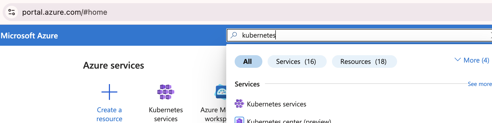
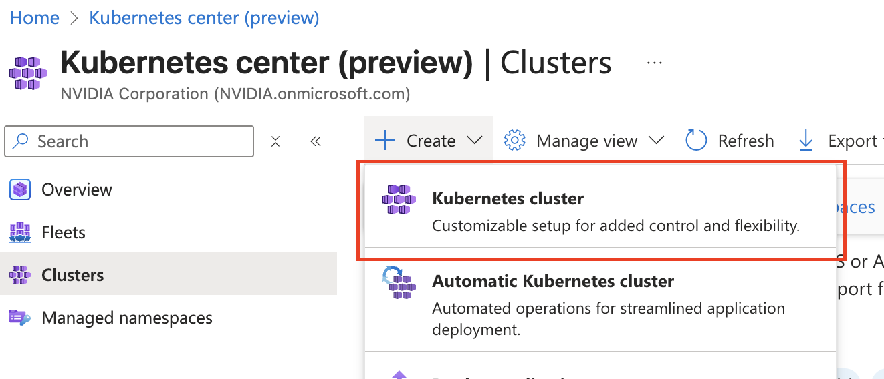
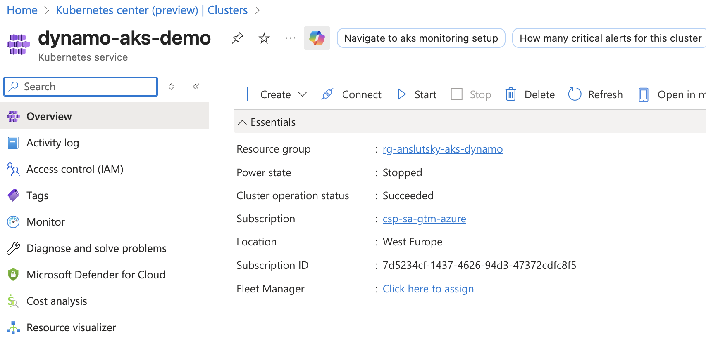
2. <b>Select an Advanced SKU:</b> For effective disaggregated serving, create a pool with at least <b>two (2) nodes</b>. Select a SKU with multiple GPUs per VM, such as Standard_NC80adis_H100_v5.

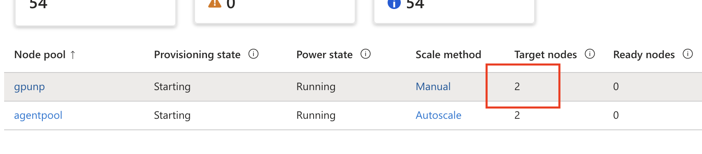
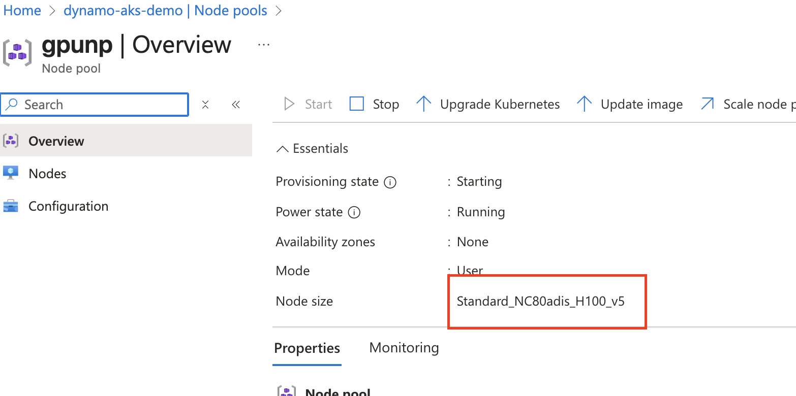

3. <b>Install the GPU Operator:</b> Ensure the NVIDIA GPU Operator is installed to manage GPU resources and drivers.
4. <b>Verify Capacity:</b> Use the following command to ensure your nodes are ready and GPUs are detectable:
```bash
kubectl describe node <aks-gpunp-***>
```
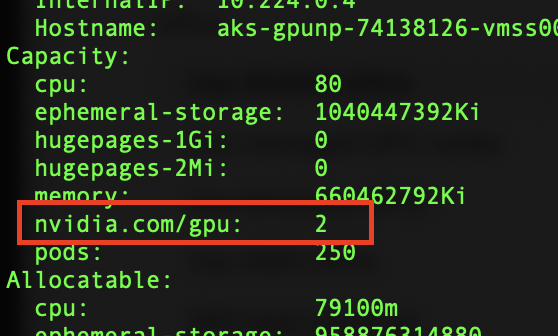


## Step 3: Enable Azure Managed Prometheus
Azure Managed Prometheus provides a fully managed environment for collecting and analyzing metrics.

1. Navigate to the <b>Monitor</b> configuration page within your AKS cluster resource.

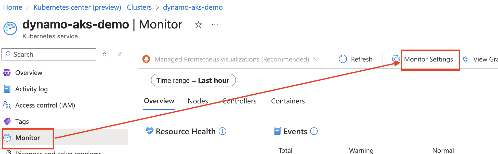

2. Select <b>Enable Managed Prometheus</b> and link it to an Azure Monitor Workspace.

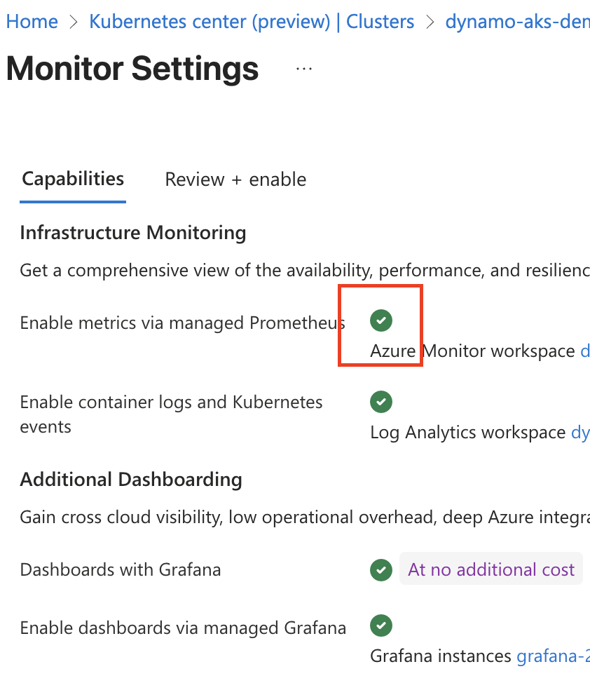

## Step 3.5: Install Dynamo Kubernetes Operator

The DynamoGraphDeployment resource is managed by the Dynamo operator. You must install the Dynamo platform (CRDs + operator) **before** applying the deployment YAML; otherwise you will see errors such as "no endpoints available for service dynamo-platform-dynamo-operator-webhook-service".

1. **Set environment and version** (use a Dynamo release that matches your deployment images, e.g. 0.8.0):
```bash
export NAMESPACE=dynamo-system
export RELEASE_VERSION_PLATFORM=0.9.0-post1
export RELEASE_VERSION_CRD=0.9.0
```

2. **Install CRDs** (skip if CRDs are already installed on the cluster):
```bash
helm fetch https://helm.ngc.nvidia.com/nvidia/ai-dynamo/charts/dynamo-crds-${RELEASE_VERSION_CRD}.tgz
helm install dynamo-crds dynamo-crds-${RELEASE_VERSION_CRD}.tgz --namespace default
```

3. **Install Dynamo platform** (operator, etcd, NATS):
```bash
helm fetch https://helm.ngc.nvidia.com/nvidia/ai-dynamo/charts/dynamo-platform-${RELEASE_VERSION_PLATFORM}.tgz
helm install dynamo-platform dynamo-platform-${RELEASE_VERSION_PLATFORM}.tgz --namespace ${NAMESPACE} --create-namespace
```

4. **Verify operator and webhook are running:**
```bash
kubectl get pods -n dynamo-system
```
You should see `dynamo-platform-dynamo-operator-controller-manager-*`, `dynamo-platform-etcd-0`, and `dynamo-platform-nats-0` in Running state. If the operator pod is not Running, the validating webhook will have no endpoints and `kubectl apply` of DynamoGraphDeployment will fail with an InternalError.

(Optional) To send Dynamo operator metrics to Azure Managed Prometheus, add to the helm install:  
`--set dynamo-operator.dynamo.metrics.prometheusEndpoint=<your-prometheus-url>`  
See the Dynamo [installation guide](https://docs.nvidia.com/dynamo/latest/kubernetes/installation_guide.html) for details.

## Step 4: Install Dynamo Deployment with KV Cache Routing Enabled
KV Cache routing is enabled by switching on the `router-mode` configuration in the Frontend portion of the Dynamo deployment YAML.  For this walkthrough, deployment configuration is based on the aggregated round-robin example <a href="https://github.com/ai-dynamo/dynamo/blob/main/recipes/qwen3-32b/vllm/agg-round-robin/deploy.yaml">deploy.yaml</a>

### 4a: Modify the Deployment YAML
Download the base <a href="https://github.com/ai-dynamo/dynamo/blob/main/recipes/qwen3-32b/vllm/agg-round-robin/deploy.yaml">deploy.yaml</a> from the NVIDIA Dynamo GitHub or use the pre-modified version in this repository <a href="deploy_kvrouter.yaml">deploy_kvrouter.yaml</a>.

**Mandatory:** Update the HF_TOKEN environment variable with your actual HuggingFace token.

**PVCs:** The included `deploy_kvrouter.yaml` sets `create: true` for the `model-cache` and `compilation-cache` PVCs so the Dynamo operator creates them automatically. If you see "Top-level PVC does not exist and create is not enabled", either use this version (with `create: true`) or create those PVCs manually in the same namespace before applying the deployment.

Ports: Ensure the container ports in the YAML match your service configurations to allow Azure Managed Prometheus to scrape metrics correctly.

Dynamo Frontend is the component responsible for monitoring KV Cache utilization and routing requests to appropriate worker nodes during inference.  To enable Dynamo KV Cache Routing, we must first customize the base deployment yaml.

The included <a href="deploy_kvrouter.yaml">deploy_kvrouter.yaml</a> offers a simple pre-configured example of inference using the FP8 quantized Qwen/Qwen3-32B model.  This model is chosen to allow for smaller SKUs, such as Standard_NC40ads_H100_v5.  For production applications and larger models, larger SKUs may need to be used to fit a larger model.  

Please modify the HF_TOKEN value to include your HuggingFace token:

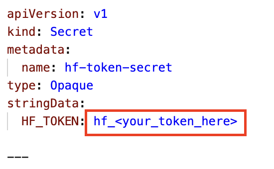

Next we show configuration sections used by Azure Managed Prometheus to scapre Dynamo Prometheus metrics and propogate them to Azure Minitoring Workspace dashboards.  Port configurations must match container ports for each of the services.  For this basic walkthrough, leave these configurations as-is unless working on an advanced installation with custom container port configation

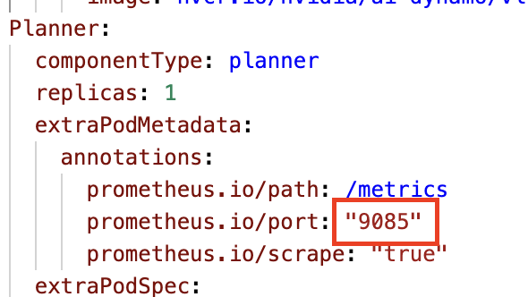
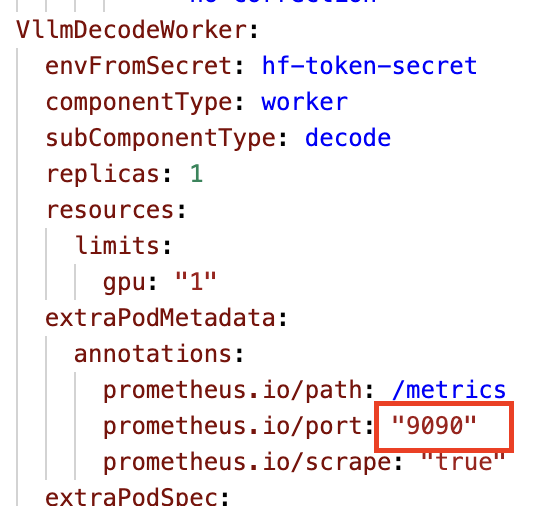
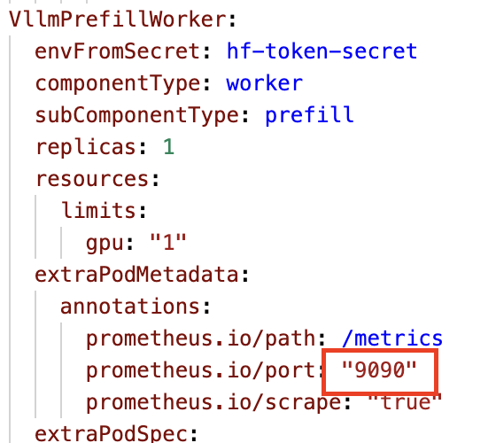

## Step 4b: Apply the custom Dynamo Planner Deployment YAML:

```
# Create a namespace
export CLOUD_NAMESPACE=<namespace name for cloud resource, for example 'dynamo-cloud'>
kubectl create namespace $CLOUD_NAMESPACE

# Apply the Deployment configuration
kubectl apply -f ./deploy_kvrouter.yaml -n $CLOUD_NAMESPACE
```

## Step 4c: Verify Dynamo Planner deployment:

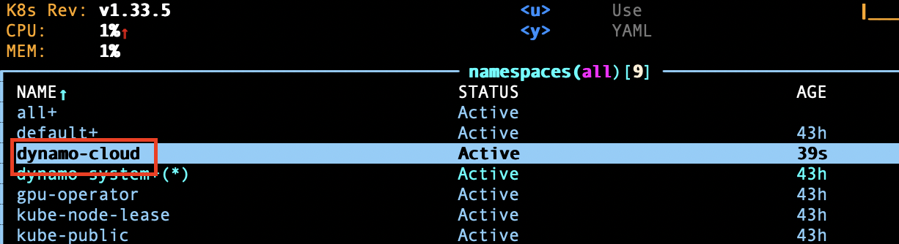
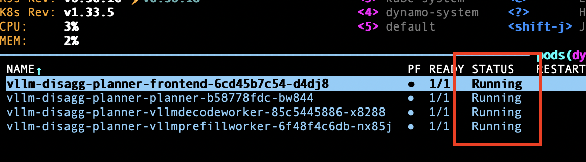

### Troubleshooting: Webhook / "no endpoints available"

If `kubectl apply -f ./deploy_kvrouter.yaml` fails with **InternalError** and a message like **"no endpoints available for service dynamo-platform-dynamo-operator-webhook-service"**, the Dynamo operator is not running or not installed. The API server calls this webhook to validate DynamoGraphDeployments; if no operator pod is backing the service, the request fails.

**Fix:** Complete [Step 3.5: Install Dynamo Kubernetes Operator](#step-35-install-dynamo-kubernetes-operator) above, then run `kubectl get pods -n dynamo-system` and ensure `dynamo-platform-dynamo-operator-controller-manager-*` is Running. Re-apply the deployment afterward.

# Step 5: Configure Azure Manage Prometheus integration

Azure Managed Prometheus is a useful service that allows for application metrics collection and visualization within Azure environment.  However, by default, Azure Managed Prometheus is rather concervative and only collects a set of default metrics available in AKS.  

To enable Dynamo metrics collections, such as Time to First Token (TTFL), etc. we need to follow <a href="https://learn.microsoft.com/en-us/azure/azure-monitor/containers/prometheus-metrics-scrape-configuration">Customize collection of Prometheus metrics from your Kubernetes cluster using ConfigMap</a> instructions and enable custom metrics collection on the dynamo-cloud namespece created in the previous step.  

For simplicity, we include a pre-configured ConfigMap file in this repository <a href="ama-metrics-prometheus-config.yaml">./ama-metrics-prometheus-config.yaml</a> with the salient section highlighted below:

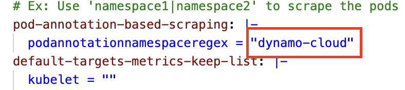

## Step 5a: Apply the custom ConfigMap to the cluster:

```
kubectl apply -f ./ama-metrics-prometheus-config.yaml
```

## Step 5b: Verify Azure Managed Prometheus metrics collection is active:

Locate any AKS Managed Prometheus metrics pod in the kube-system namespace:

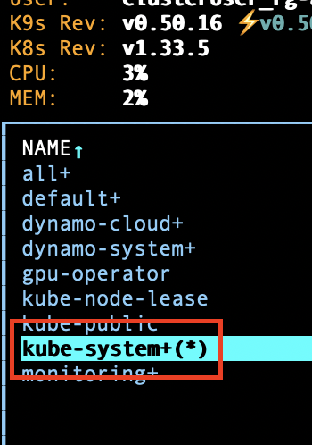
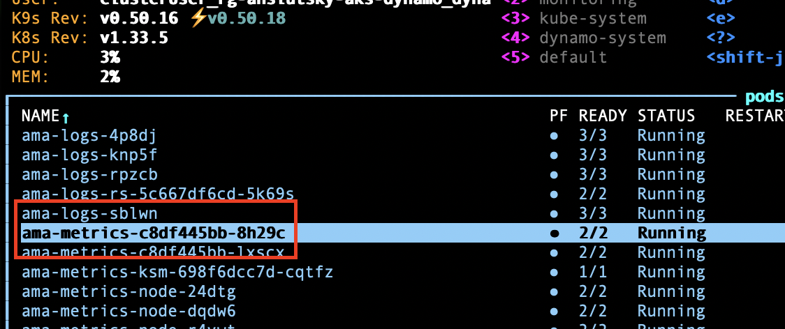

Set up port-forwarding:

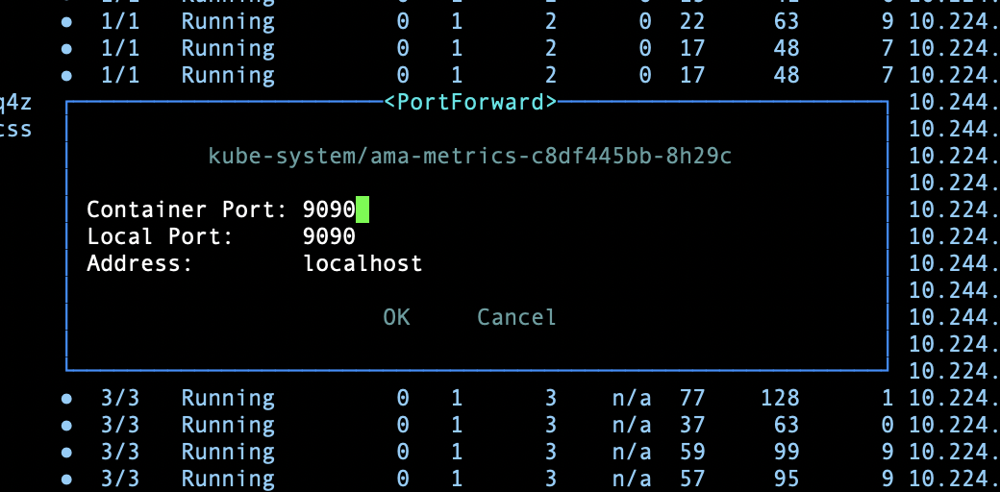

Navigate to <a href="http://localhost:9090">http://localhost:9090</a>:

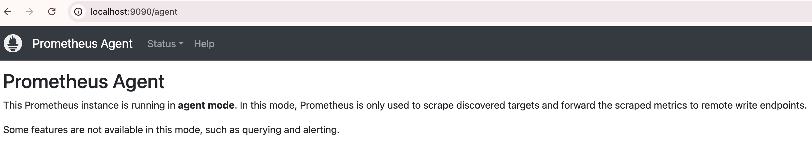

## Step 6: Testing KV Cache Routing optimized serving 

Now that the Dynamo KV Cache Router front end has been configured, we are able to observe the benefits of KV cache routing in action.  The following steps show how to 

1. apply load to our cluster, 
2. observe real-time TTFT metric improvements in Azure Monitoring Workspace

### Step 6a: Enable port-forwarding 

We first need to open a port on the frontend service:

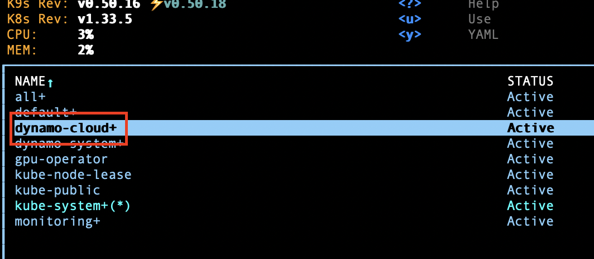
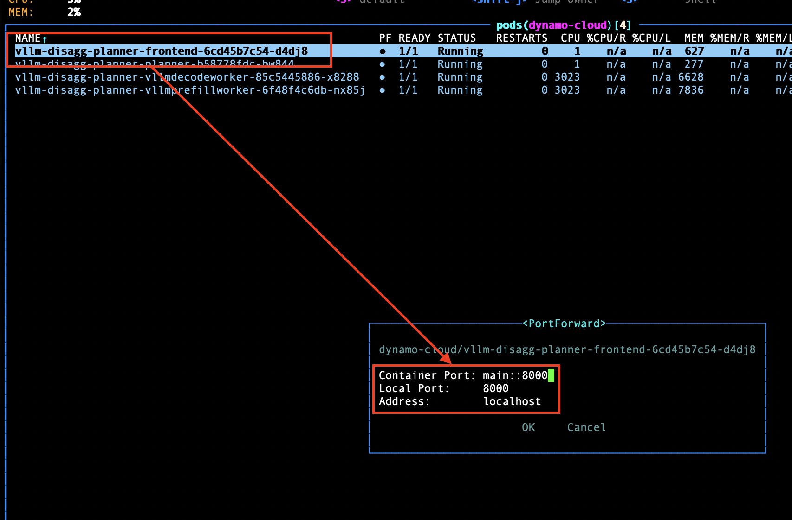

Test the port forward by navigating to <a href="http://localhost:8000/health">http://localhost:8000/health</a>

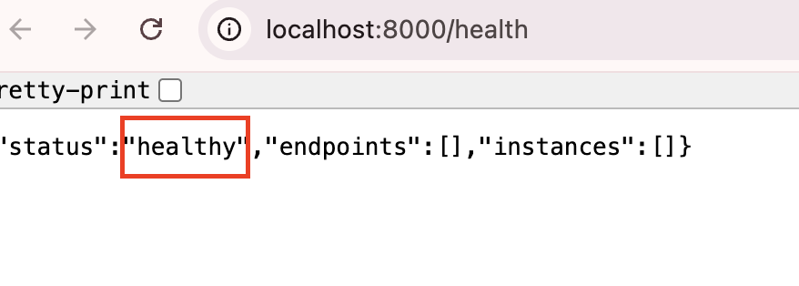

### Step 6b: Apply the Load Test:

**Mooncake trace dataset.** The load test uses the [Mooncake](https://github.com/kvcache-ai/Mooncake/) open-source trace dataset. Mooncake is the KVCache-centric serving platform for Kimi (Moonshot AI). The project publishes real request traces in JSONL format, with fields such as `timestamp`, `input_length`, `output_length`, and remapped block `hash_ids`. Traces are anonymized for privacy while preserving utility for simulated evaluation (e.g., cache-hit behavior). The FAST'25 release traces (e.g., `FAST25-release/traces/toolagent_trace.jsonl`) are used with `--custom-dataset-type mooncake_trace` in aiperf to drive realistic load against your Dynamo cluster.

**Similarities and differences vs. a realistic dataset.** The Mooncake traces are derived from real traffic on the Kimi LLM service, so request timing, input/output lengths, and block reuse patterns (`hash_ids`) reflect production behavior—including tool-agent-style workloads in the FAST'25 toolagent trace. That makes the dataset useful for evaluating KV cache routing and disaggregation under realistic load and cache-hit scenarios. On the other hand, the traces are anonymized and use remapped block IDs rather than actual prompt content, so you cannot reproduce exact user sessions or prompt distributions. The trace is also a single workload type (e.g., toolagent) over a fixed window; your own production mix (e.g., chat, RAG, code, varying time-of-day or geography) may differ. For benchmarking Dynamo and observing TTFT/cache effects, Mooncake is a strong stand-in; for capacity or SLO planning, complement it with traces or synthetic load that match your expected traffic.

For this example, we use the `aiperf` tool to apply load test to our Dynamo cluster.

(Optional if not already installed) Install the `airperf` tool using `pip`

```
pip install aiperf
```

Now run the following command to send test load to the AKS service on port 8000:

```
# set longer timeout allow for larger test window

aiperf profile \
  -m "Qwen/Qwen3-32B" \
  --tokenizer "Qwen/Qwen3-32B" \
  --input-file ./Mooncake/FAST25-release/traces/toolagent_trace.jsonl \
  --custom-dataset-type mooncake_trace \
  --fixed-schedule \
  --url "http://localhost:8000" \
  --streaming \
  --random-seed 42 \
  --workers-max 200 \
  --request-timeout-seconds 10000 \
  --record-processors 8 \
  --artifact-dir /tmp/aiperf_router_off_16 \
  --goodput "time_to_first_token:5000 inter_token_latency:100"
```

Once the load test starts running, Dynamo Planner will analyze various metrics and scale cluster worker pods to optimize performance:

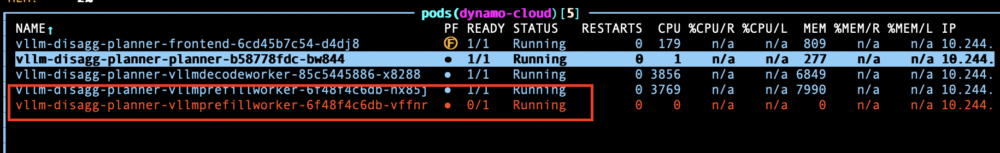

Users may observe the effect of the Disaggregate scaling in terms of important metrics such as Time to First Token in the AKS Monitoring Dashboards:


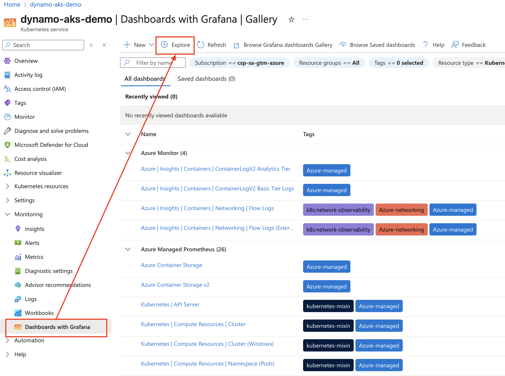
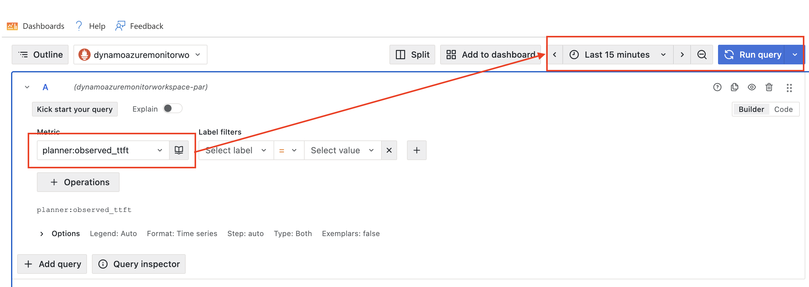

The resulting graph shows TTFT metrics climb and then rapidly decline, which reflects the effects of the Disaggregate scaling:

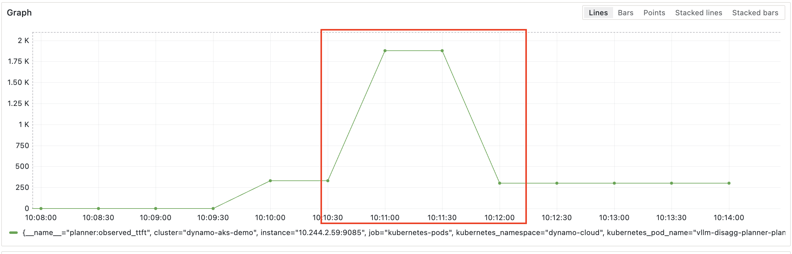

