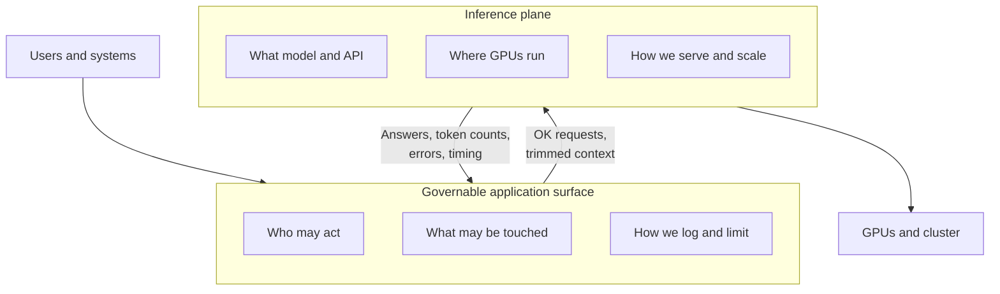
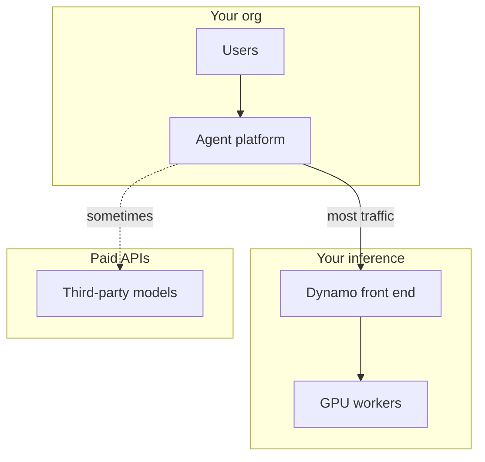
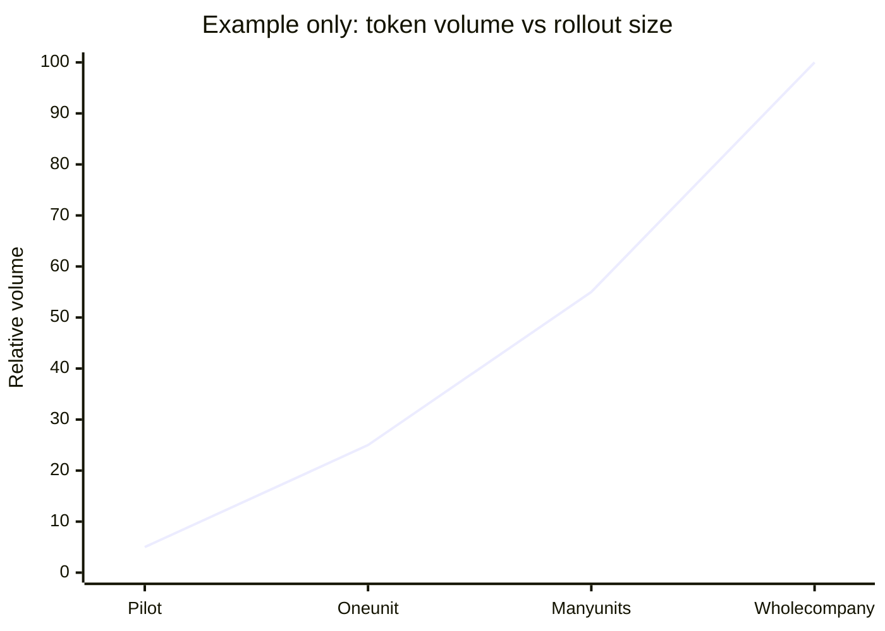
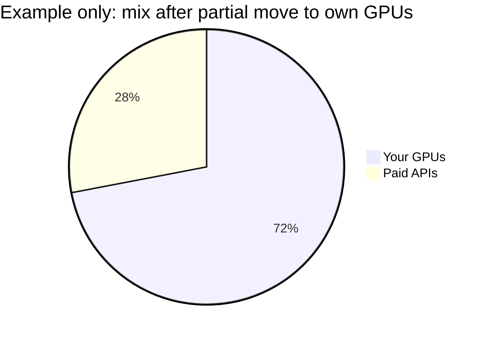
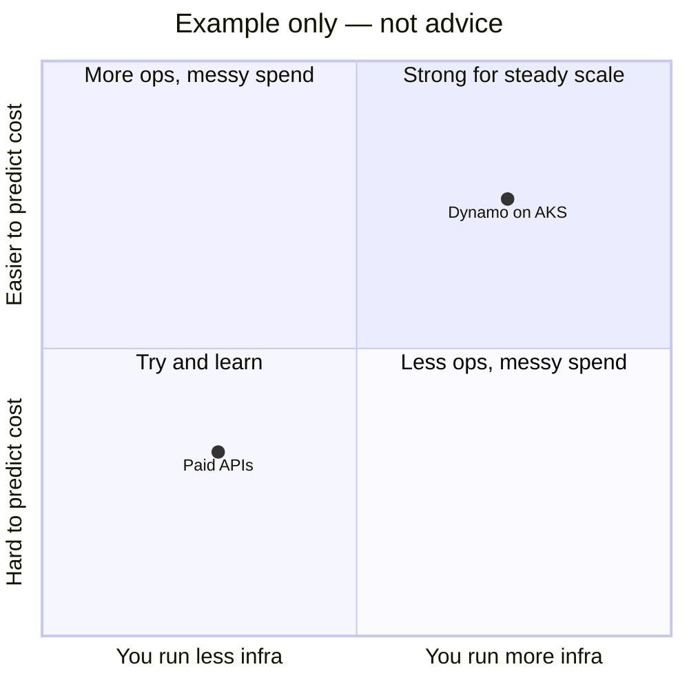
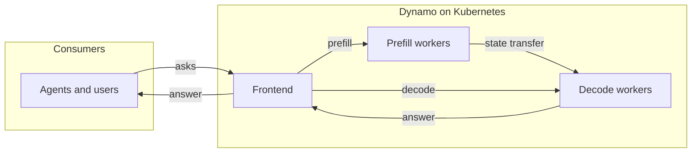

# Enterprise agents on Azure Kubernetes Service

This workshop shows [NVIDIA NemoClaw](https://github.com/NVIDIA/NemoClaw) agents talking to [NVIDIA Dynamo](https://github.com/ai-dynamo/dynamo) inference on AKS. The sample model is the Nemotron-3 Super FP8 weights listed below.

## Document purpose

This README explains **why** the workshop exists and **how** to run it. The sample model ID is `nvidia/NVIDIA-Nemotron-3-Super-120B-A12B-FP8`. Use `deploy_nemoclaw_k8s.sh` to optionally install inference, build and push a container to Azure Container Registry (ACR), and update the Kubernetes pod.

## Value in short

Agents send a lot of traffic to the model: long prompts, tools, search hits, and streamed answers. You need two things working together:

1. A **governable application surface** — rules, users, tools, and logs live here.
2. An **inference plane** — the model runs here, on your GPUs, with stable cost and latency inside your cloud boundary.

### Governable application surface

This is the software layer where **your** rules apply (not only inside the model file).

- **Who** — which users or services may run an agent, and with what access.
- **What** — which tools, APIs, and data the agent may use; what may go into the prompt.
- **How** — how text is filtered, redacted, logged, and kept for audit; how a request is traced from the user through tools to the model call.

You change these with config and policy; you do not need to retrain the model. Here, **NemoClaw** plays this role: assistants, sandboxes, and policies sit **above** the plain HTTP call to the model.

### Inference plane

This is the stack that **runs** the model: GPUs, scheduling, and the HTTP API your apps call. Some people say “inference plan” for the same idea (how you buy and use GPU capacity).

- **What** — which model, precision (e.g. FP8), max context, and API shape (here: OpenAI-style routes); how traffic is split between workers.
- **Where** — which AKS cluster, GPU nodes, and region run the job and hold weights/cache.
- **How** — how requests wait in line, batch, scale up and down, and how you watch errors and usage for ops and finance.

Here, **Dynamo on AKS** is the inference plane. The governable surface **sends** requests in; the plane **returns** answers and metrics for logging and policy, without every user dealing with cluster details.

### How the two layers connect

The **governable surface** is close to **people and rules**. The **inference plane** is close to **GPUs and speed**. They meet at one API: the surface checks and shapes requests; the plane runs them inside your tenant.



### Three workshop layers

1. **Agents (NemoClaw)** — Assistants, policies, sandboxes. Turns real work into model calls you can watch and control.
2. **Serving (Dynamo)** — OpenAI-style HTTP front door, routing, GPU workers on Kubernetes. Many apps can share one stack.
3. **Model (Nemotron FP8)** — Large hybrid model (attention + recurrence + experts) in FP8 where it helps. Uses less GPU memory than BF16-only for the same class of model, so you can often get **more tokens per GPU dollar** when the model fits the task.

Together: agent load + shared serving + one strong NVIDIA model on AKS.

## Why disaggregated serving helps here

Big models often split **prefill** (new prompt work) and **decode** (next tokens). Workers pass cache/state between them. Dynamo does that in **disaggregated** mode: prefill workers take new context, decode workers keep generating, the front end sends work to both. This repo’s default uses **SGLang** and **NIXL** between workers; see `dynamo/dynamo/recipes/nemotron-3-super-fp8/sglang/disagg/deploy.yaml`.

NemoClaw drives **realistic** traffic (chat, tools, install steps), not a single lab query.

## Money, data, and “your own” inference

**Metered APIs** (e.g. OpenAI, Anthropic): you pay per token; the bill grows with use.

**Your own inference** (Dynamo on your AKS): you pay for GPUs and ops; tokens can get **cheaper per unit** as you use the hardware more.

Some people call your stack a **token factory**: answers are made **inside** your cloud under **your** rules, not only bought as an outside line item.

Using Dynamo on AKS ties more of your agent spend to capacity you already run. You can still send some traffic to outside APIs when policy allows.

| Topic | Metered API | Dynamo on your AKS |
|--------|-------------|-------------------|
| Cost vs use | Bill grows with adoption | Fixed/step GPU cost; busy GPUs lower cost per token |
| Data | Leaves your account unless contracts say otherwise | Prompts and answers stay in your subscription unless you send them out |
| Busy times | Shared public service may queue | You size your cluster to your SLA |
| Reuse | Fast access to many public models | One stack many apps can share (OpenAI-style clients) |



### Token volume

Agents burn many tokens per task: system text, search, tool JSON, plans, UI stream. Across a company, small per-user use adds up fast—often more than a pilot guessed.



Real curves depend on user count, agent depth, and max context. Plan for **cost per token** and **serving speed**, not only model quality.

### Cost per token (simple view)

**Cost per token ≈ (all-in cost for a month) ÷ (tokens served that month).**

Dynamo helps the bottom number (more tokens per GPU) and ties the top number to **GPUs you control**, not a retail API markup.



### Strategy chart (example only)



Savings are **not** automatic. You still need busy GPUs, a full cost picture (hardware, power, staff, licenses, risk), and the right model. Nemotron here is **one** choice.

## Disaggregated serving (Dynamo)

**Prefill** workers handle new input (attention and, for hybrid models, extra state). **Decode** workers keep making tokens. They share state over the network (this workshop: **SGLang** + **NIXL**). A **frontend** takes client requests and talks to both tiers.



**Tradeoff:** more moving parts than one big pool; you must run more pod types and tune the network/GPU layout.

## KV routing and this workshop’s model

Dynamo can **route** requests to workers that already hold part of the prompt in cache (fewer repeats, faster first token). See `dynamo/dynamo/docs/components/router/router-concepts.md` and `router-guide.md` in the bundled Dynamo tree.

For **this** Nemotron hybrid recipe, the bundled **disagg** setup does **not** use full KV-overlap routing like simple attention-only stacks. Hybrid Mamba + attention models do not yet give clean KV “events” for exact routing in these backends. This workshop’s SGLang disagg file uses **round-robin** and turns KV events **off**. That may change in future releases.

## What this repo does

On AKS: agents in Kubernetes; inference installed by the script or by you; default recipe is **SGLang disagg** for the model ID at the top.

- **`deploy_nemoclaw_k8s.sh`**
  1. Optionally install Dynamo from a manifest and wait until pods look ready.
  2. Clone a fixed NemoClaw git tag into `nemoclaw-base/nemoclaw-src/NemoClaw`.
  3. Build `nemoclaw-base` for `linux/amd64`.
  4. Push `nemoclaw-dind-src:latest` to ACR (`az acr login` retry on auth errors).
  5. Apply `nemoclaw-install` (secrets if present, delete `nemoclaw` pod, apply `nemoclaw-k8s.yaml` with your registry name).

- **`nemoclaw-base/`** — Docker build: NemoClaw at `NEMOCLAW_GIT_TAG` (default `v0.0.18`), `nemoclaw-blueprint`, OpenShell; image the pod uses.

- **`nemoclaw-install/`** — YAML for a DinD + workspace pod: non-interactive NemoClaw install; `NEMOCLAW_ENDPOINT_URL` points at Dynamo in the cluster (`socat`, `host.openshell.internal`). Edit URLs and `CHAT_UI_URL` for your site.

- **`dynamo/`** — Copy of Dynamo (recipes, docs, tests). Default manifest: `dynamo/dynamo/recipes/nemotron-3-super-fp8/sglang/disagg/deploy.yaml`. Read that folder’s README for GPUs and secrets.

## Prerequisites

- `bash`, `git`, Docker, `kubectl` (pointed at your cluster), `az` if you use ACR login from the script.
- An ACR your cluster can pull from.
- Namespaces if missing, e.g. `kubectl create namespace nemoclaw` and `kubectl create namespace dynamo-system` (or your chosen names).
- For Dynamo: follow `dynamo/dynamo/recipes/nemotron-3-super-fp8/README.md` and `dynamo/dynamo/docs/kubernetes/` (GPU pool, Hugging Face secret, model cache, etc.).

## `deploy_nemoclaw_k8s.sh`

Run from any directory; the script finds its own files.

### Required

| Flag / variable | Meaning |
|-----------------|--------|
| `--acr-name NAME` or `ACR_NAME` | Short ACR name only (e.g. `myregistry`). Image: `NAME.azurecr.io/nemoclaw-dind-src:latest`. |

### Options

| Flag | Env | Default | Purpose |
|------|-----|---------|---------|
| `--install-dynamo` | — | off | Apply Dynamo YAML, wait for Running/Ready pods and enough ready pods per disagg tier (`-disagg-decode-`, `-disagg-frontend-`, `-disagg-prefill-`). |
| `--nemoclaw-namespace NS` | `NEMOCLAW_NAMESPACE` | `nemoclaw` | Where NemoClaw YAML applies. |
| `--dynamo-namespace NS` | `DYNAMO_NAMESPACE` | `dynamo-system` | Where Dynamo YAML applies when using `--install-dynamo`. |
| `-h`, `--help` | — | — | Help text. |

### Environment variables

| Variable | Default | Purpose |
|----------|---------|---------|
| `DYNAMO_DEPLOY_MANIFEST` | `dynamo/dynamo/recipes/nemotron-3-super-fp8/sglang/disagg/deploy.yaml` | YAML for `--install-dynamo`. |
| `DYNAMO_READY_POLL_INTERVAL` | `15` | Seconds between pod checks. |
| `DYNAMO_READY_TIMEOUT_SEC` | `3600` | Max wait (`0` = no limit). |
| `DYNAMO_DISAGG_MIN_PODS` | `3` | Min ready pods per decode / front / prefill tier (name match). |
| `NEMOCLAW_GIT_URL` | `https://github.com/NVIDIA/NemoClaw.git` | Git remote for NemoClaw. |
| `NEMOCLAW_GIT_TAG` | `v0.0.18` | Git tag to checkout; if unset, `NEMOCLAW_GIT_REF` is used. |
| `VERBOSE` | `0` | Set `1` for more logs. |

### Examples

Inference already running — only rebuild image and refresh pod:

```bash
./deploy_nemoclaw_k8s.sh --acr-name myregistry
```

Install Dynamo, wait, then build, push, refresh:

```bash
./deploy_nemoclaw_k8s.sh --acr-name myregistry --install-dynamo
```

Custom namespaces:

```bash
./deploy_nemoclaw_k8s.sh \
  --acr-name myregistry \
  --install-dynamo \
  --dynamo-namespace my-dynamo \
  --nemoclaw-namespace my-nemoclaw
```

Custom Dynamo YAML:

```bash
export DYNAMO_DEPLOY_MANIFEST="/path/to/your/deploy.yaml"
./deploy_nemoclaw_k8s.sh --acr-name myregistry --install-dynamo
```

### After you run it

1. Edit `nemoclaw-install/nemoclaw-k8s.yaml`: `CHAT_UI_URL` (must match the URL users open), `DYNAMO_HOST`, `NEMOCLAW_ENDPOINT_URL`, `NEMOCLAW_MODEL` if needed; apply again or rerun the script.
2. Secrets: copy `nemoclaw-install/nemoclaw-secrets.example.yaml` to `nemoclaw-secrets.yaml`, fill keys, align with pod env. The script applies it if the file exists.

## Related paths

- Default recipe: `dynamo/dynamo/recipes/nemotron-3-super-fp8/sglang/disagg/`
- Pod YAML: `nemoclaw-install/nemoclaw-k8s.yaml`
