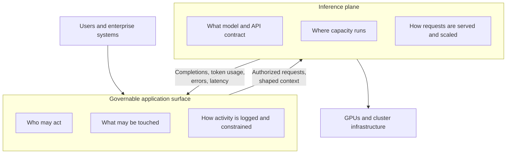
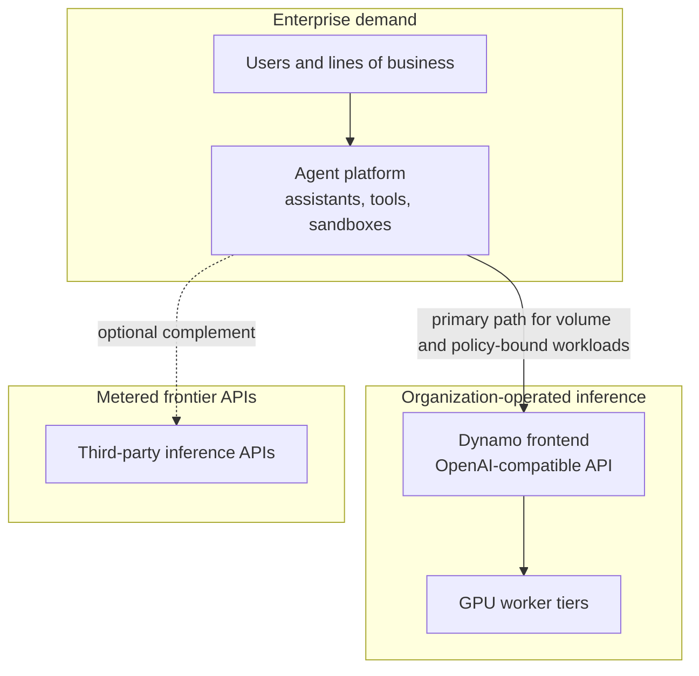
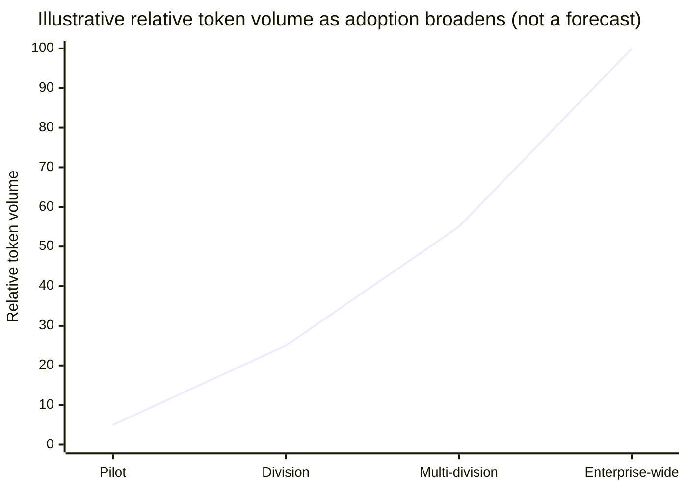
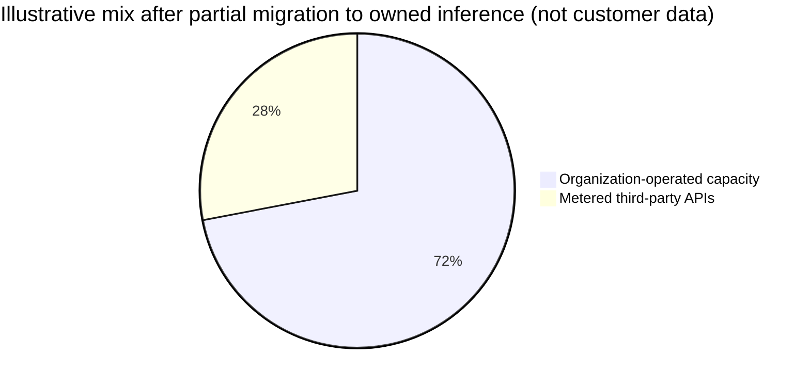
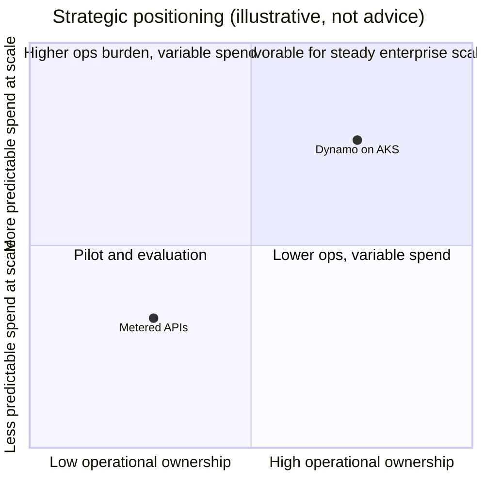
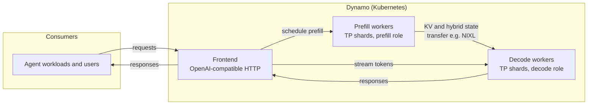

# Enterprise agents on Azure Kubernetes Service

Workshop materials for running the [NVIDIA NemoClaw](https://github.com/NVIDIA/NemoClaw) agent stack against [NVIDIA Dynamo](https://github.com/ai-dynamo/dynamo) inference on AKS, using the Nemotron-3 Super FP8 reference weights named under Document purpose.

## Document purpose

This document accompanies the workshop introduced above. It is written for readers who need both a business-level rationale and a concise technical orientation. The Hugging Face model identifier used as the reference large language model is `nvidia/NVIDIA-Nemotron-3-Super-120B-A12B-FP8`. Deployment is automated in part by `deploy_nemoclaw_k8s.sh` (optional inference install, container build and push to Azure Container Registry, and refresh of the Kubernetes pod manifest).

## Value proposition in plain terms

Modern agent systems generate sustained inference load: instructions, retrieved knowledge, tool arguments, intermediate plans, and streamed responses all expand context. Success depends on pairing a **governable application surface** with an **inference plane** that can absorb that load at predictable cost and latency inside the organization’s chosen boundary.

### Governable application surface

A **governable application surface** is the layer of software where enterprise rules are actually enforced—not only inside the model weights, but around identity, scope, and process. In practice that means:

- **Who** — which principals (users, services, tenants) may invoke an agent, and under which roles or entitlements.
- **What** — which tools, APIs, and data stores the agent may call, and which classes of documents or secrets may enter context.
- **How** — how prompts and retrieved text are filtered, redacted, logged, and retained; how requests are traced from user action through tool calls to the inference call; and where audit evidence is stored so security, compliance, and product owners can review it.

It is “governable” because those dimensions are expressed in configuration and policy that can be inspected and changed without retraining the model. In this workshop, that role is filled by the agent platform (NemoClaw): assistants, sandboxes, and policies sit above the raw HTTP call to the inference plane, so the organization retains control surfaces that a bare API client to a frontier provider does not, by itself, supply.

### Inference plane

The document uses **inference plane** for the capacity and software stack that turns approved model requests into tokens: not the agent’s business rules, but the **serving contract**, **compute**, and **operations** behind it. (Some teams speak of an “inference plan” in the same sense—the plan for *how* model capacity is provisioned and consumed; here that idea is folded into the plane itself.) In practice that means:

- **What** — which model identifiers, checkpoints, quantization, and context limits are deployed; which API surface (for example OpenAI-compatible routes) clients call; and which routing or disaggregation profiles are active.
- **Where** — which Kubernetes clusters, node pools, GPU SKUs, regions, and tenancy boundaries run forward passes and hold weights or cache.
- **How** — how requests are admitted, queued, batched, and scheduled across frontends and workers; how autoscaling and capacity buffers interact with latency targets; and how utilization and errors are observed for FinOps and reliability.

In this workshop, the inference plane is realized primarily by Dynamo on AKS (frontend, worker tiers, manifests) and by the reference Nemotron weights named under Document purpose. The governable surface issues requests *into* that plane; the plane returns completions and telemetry *back* for logging and policy without exposing raw cluster complexity to every end user.

### Relationship between the two layers

The governable application surface sits **closer to people and process** (identity, tools, audit). The inference plane sits **closer to hardware and throughput** (models, GPUs, scheduling). They meet at a stable API boundary: the surface shapes and authorizes traffic; the plane executes it inside the organization’s boundary.



The workshop answers that pairing in three layers, without treating any single vendor slogan as the headline.

1. **Experience and orchestration.** NemoClaw provides the operator- and developer-facing path for assistants, policies, sandboxes, and related workflows. It is the component that turns business process automation into a stream of model requests the enterprise can observe and control.

2. **Serving and scale-out.** Dynamo provides a Kubernetes-native distributed inference stack: an OpenAI-compatible HTTP entrypoint, routing, and GPU-backed workers. Organizations standardize on such a layer so that multiple applications—not only the workshop scenario—can share capacity and operational practice.

3. **Capability and efficiency.** The reference Nemotron variant named above is a large hybrid architecture (attention, recurrence, mixture-of-experts) offered in FP8 where applicable. That precision class improves memory efficiency relative to serving the same conceptual model class only in BF16, which in turn supports higher throughput per dollar of GPU when workloads fit the model’s strengths.

Together, these layers show how agent demand, enterprise serving discipline, and a flagship NVIDIA model class can be exercised on AKS as a coherent reference architecture.

## Technical complementarity

Hybrid models of this scale benefit from serving patterns that separate prompt-heavy phases from decode-heavy phases and from transfer paths that move cache and related state between workers. Dynamo’s disaggregated mode implements that pattern: prefill workers handle new context; decode workers continue generation; the frontend schedules work across tiers. The default manifest in this repository uses SGLang with a NIXL transfer path; see `dynamo/dynamo/recipes/nemotron-3-super-fp8/sglang/disagg/deploy.yaml`.

The agent platform supplies traffic shapes that stress those mechanisms: multi-turn dialogue, tool round-trips, and installer-driven setup resemble production conditions more closely than a single-shot benchmark.

## Economics, governance, and organization-operated inference

Finance and procurement teams distinguish **metered third-party inference** (per-token list pricing from frontier providers such as OpenAI or Anthropic) from **organization-operated inference** (GPUs and software the enterprise runs and amortizes). The latter is sometimes described informally as a “token factory”: completions are produced inside the tenant boundary under policies the organization defines, rather than purchased only as an external line item.

Pairing the workshop’s application layer with Dynamo on AKS anchors a growing share of agent spend to capacity the organization already procures and operates, while retaining the option to route specialized workloads to external APIs where policy permits.

| Concern | Typical outcome with metered APIs | Typical outcome with organization-operated Dynamo on AKS |
|--------|-------------------------------------|-------------------------------------------------------------|
| Spend elasticity | Cost rises in rough proportion to successful adoption | Fixed and step costs dominate; high utilization dilutes effective cost per token |
| Data residency | Governed by provider contracts and connectivity | Prompts and completions remain within the customer subscription unless explicitly egressed |
| Capacity at peak | Shared public capacity; queuing during vendor-wide demand | Sized to organizational SLAs; subject to the customer’s own cluster headroom |
| Portfolio leverage | Fast access to frontier model catalogs | A reusable inference asset shared across agent instances and other OpenAI-compatible clients |



### Aggregate token demand

Agent installations multiply tokens per business outcome: system prompts, retrieval, tool schemas, planning steps, and UI streaming all consume context. Enterprise-wide adoption converts modest per-user averages into very large aggregate prompt and completion volumes—often beyond what a pilot forecast—because automated agents do not self-limit the way discretionary human clicks do.



The curve is conceptual; actual slopes depend on user counts, agent depth, and context limits. The implication for planning is that **unit economics** and **serving efficiency** move to the foreground alongside model quality.

### Drivers of lower effective cost per token

Effective cost per token is approximately: *(fully loaded infrastructure and operations cost for a period) ÷ (useful tokens served in that period)*. Dynamo improves the denominator through higher sustained throughput per GPU (including disaggregated pools and FP8-efficient backends where applicable), and clarifies the numerator for FinOps by tying spend to reserved or burstable GPU capacity rather than to a retail API margin.



The split is a communication aid only; real portfolios depend on governance, model coverage, and migration phasing.

### Strategic positioning

Frontier APIs remain attractive for rapid experimentation, broad model choice, and minimal capital to first token. Organization-operated stacks trade higher operational ownership for greater predictability of spend at scale and for tighter alignment with data-sovereignty requirements.



Savings are not automatic. They require utilization discipline, total cost of ownership analysis (hardware, power, network, staffing, licensing, and risk), and a deliberate choice of model class. The Nemotron reference named in this document is one option among many.

## Disaggregated serving with Dynamo

In disaggregated mode, Dynamo assigns prefill workers to compute attention and, for hybrid models, Mamba or SSM-related state for new tokens; decode workers continue generation and consume transferred cache and state. A frontend accepts client requests and coordinates tiers. After prefill, KV cache and related state are transferred to decode workers (this workshop’s default recipe uses SGLang with NIXL for GPU-direct transfer between workers).



Relative to aggregated serving, disaggregation isolates bursty prefill from steady decode and can improve utilization when the two phases have different hardware profiles. The tradeoff is operational complexity: additional pod types, transfer backends, and network or GPU topology constraints must be engineered explicitly.

## KV cache routing (Dynamo) and this workshop’s model

Dynamo’s KV cache routing (KV-aware or overlap-based routing) directs requests toward workers that already hold relevant prefix blocks, reducing redundant prefill and improving time-to-first-token on multi-turn or shared-prefix workloads. Conceptual and configuration detail appears in `dynamo/dynamo/docs/components/router/router-concepts.md` and `router-guide.md` within the vendored Dynamo tree.

For the reference Nemotron hybrid in this repository, full overlap-driven routing is not enabled on the bundled disaggregated path in the same manner as for simpler attention-only stacks. Upstream recipe notes explain that hybrid Mamba-and-attention models do not yet expose a reliable KV-event path for exact overlap scoring in the vLLM and SGLang configurations used there; aggregated recipes may use approximate prefix-hash routing instead. The SGLang disaggregated manifest used here configures the frontend with `round-robin` and disables KV events; traffic is balanced without KV-aware placement. Future releases may tighten routing as backends expose consistent event semantics for this architecture class.

## What this codebase does

The repository implements the workshop on AKS: the agent workload runs in Kubernetes; inference may be installed by the same automation flow or supplied separately; the default model recipe is SGLang disaggregated serving for the Nemotron-3 Super FP8 reference named above.

- **`deploy_nemoclaw_k8s.sh`** — One entrypoint that can:
  1. Optionally deploy **Dynamo** from a Kubernetes manifest and wait until disaggregated tiers look healthy.
  2. **Clone** a pinned NemoClaw git tag into `nemoclaw-base/nemoclaw-src/NemoClaw` (for reproducible Docker build context).
  3. **Build** the `nemoclaw-base` image for `linux/amd64` (Node-based image with NemoClaw sources and workshop policy baked in).
  4. **Push** `nemoclaw-dind-src:latest` to your **Azure Container Registry (ACR)** (with `az acr login` retry on auth errors).
  5. **Apply** `nemoclaw-install` manifests: optional secrets, delete the `nemoclaw` pod, then `kubectl apply` `nemoclaw-k8s.yaml` with the registry host rewritten from your `--acr-name`.

- **`nemoclaw-base/`** — Dockerfile and build context: clones/copies **NemoClaw** at `NEMOCLAW_GIT_TAG` (default `v0.0.18`), copies **`nemoclaw-blueprint`** policy overrides, installs OpenShell, and produces the image referenced by the pod spec.

- **`nemoclaw-install/`** — Kubernetes manifests for a **Docker-in-Docker (DinD) + workspace** pod that runs NemoClaw’s installer non-interactively and wires **`NEMOCLAW_ENDPOINT_URL`** to an in-cluster Dynamo frontend (via `socat` and `host.openshell.internal`). Edit URLs, model name, and `CHAT_UI_URL` here for your environment.

- **`dynamo/`** — Vendored Dynamo tree (recipes, docs, tests). The deploy script’s default manifest is `dynamo/dynamo/recipes/nemotron-3-super-fp8/sglang/disagg/deploy.yaml` (SGLang, disaggregated, for the Hugging Face model identifier stated in Document purpose). See that recipe’s README for GPU and secret requirements.

## Prerequisites

- Shell with **bash**, **git**, **Docker**, **kubectl** (context pointing at your cluster), and **Azure CLI** (`az`) if you use ACR login from the script.
- **ACR** your cluster can pull from (attach ACR to AKS or use another supported pull pattern).
- Kubernetes **namespaces** you will use (defaults below); create them if they do not exist, for example:
  - `kubectl create namespace nemoclaw`
  - For Dynamo: `kubectl create namespace dynamo-system` (or your `--dynamo-namespace`).
- For **Dynamo** deployments: satisfy the recipe’s prerequisites (GPU node pool, Hugging Face token secret, model cache jobs, etc.) as described in `dynamo/dynamo/recipes/nemotron-3-super-fp8/README.md` and Dynamo’s Kubernetes docs under `dynamo/dynamo/docs/kubernetes/`.

## Install / refresh with `deploy_nemoclaw_k8s.sh`

Run the script from anywhere; it resolves paths relative to its own location.

### Required

| Flag / variable | Meaning |
|-----------------|--------|
| `--acr-name NAME` or `ACR_NAME` | **Short** ACR name only (e.g. `myregistry`), not the full `*.azurecr.io` login server. The image pushed is `NAME.azurecr.io/nemoclaw-dind-src:latest`. |

### Options (flags or environment variables)

| Flag | Env (if any) | Default | Purpose |
|------|----------------|---------|---------|
| `--install-dynamo` | — | off | Before build/push: `kubectl apply` the Dynamo manifest (see `DYNAMO_DEPLOY_MANIFEST`), then **wait** until every pod in the Dynamo namespace is Running with full readiness, and there are at least **`DYNAMO_DISAGG_MIN_PODS`** ready pods per disagg tier (names matching `-disagg-decode-`, `-disagg-frontend-`, `-disagg-prefill-`). |
| `--nemoclaw-namespace NS` | `NEMOCLAW_NAMESPACE` | `nemoclaw` | Namespace for NemoClaw `kubectl apply` / pod delete. |
| `--dynamo-namespace NS` | `DYNAMO_NAMESPACE` | `dynamo-system` | Namespace used when `--install-dynamo` is set. |
| `-h`, `--help` | — | — | Print usage and exit. |

### Environment-only tuning

| Variable | Default | Purpose |
|----------|---------|---------|
| `DYNAMO_DEPLOY_MANIFEST` | `dynamo/dynamo/recipes/nemotron-3-super-fp8/sglang/disagg/deploy.yaml` (under this workshop) | Manifest path for `--install-dynamo`. |
| `DYNAMO_READY_POLL_INTERVAL` | `15` | Seconds between pod status polls while waiting. |
| `DYNAMO_READY_TIMEOUT_SEC` | `3600` | Max wait seconds (`0` = no limit). |
| `DYNAMO_DISAGG_MIN_PODS` | `3` | Minimum **ready** pods per decode / frontend / prefill tier (name substring match). |
| `NEMOCLAW_GIT_URL` | `https://github.com/NVIDIA/NemoClaw.git` | Clone URL for NemoClaw under `nemoclaw-base/nemoclaw-src/NemoClaw`. |
| `NEMOCLAW_GIT_TAG` | `v0.0.18` | Git **tag** to fetch (detached checkout). If unset, `NEMOCLAW_GIT_REF` is still read for backward compatibility. |
| `VERBOSE` | `0` | Set to `1` for more detailed logs (e.g. push output, Dynamo criteria). |

### Example commands

**Agent image and manifest refresh only** (build, push to ACR, refresh the pod). Use when inference is already deployed and the pod configuration points at an existing frontend.

```bash
./deploy_nemoclaw_k8s.sh --acr-name myregistry
```

**Inference install followed by agent refresh** (apply the default SGLang disaggregated recipe, wait for readiness, then build, push, and refresh):

```bash
./deploy_nemoclaw_k8s.sh --acr-name myregistry --install-dynamo
```

**Non-default Kubernetes namespaces**:

```bash
./deploy_nemoclaw_k8s.sh \
  --acr-name myregistry \
  --install-dynamo \
  --dynamo-namespace my-dynamo \
  --nemoclaw-namespace my-nemoclaw
```

**Custom Dynamo manifest** (same flags; override path):

```bash
export DYNAMO_DEPLOY_MANIFEST="/path/to/your/deploy.yaml"
./deploy_nemoclaw_k8s.sh --acr-name myregistry --install-dynamo
```

### After the script

1. **`nemoclaw-install/nemoclaw-k8s.yaml`** — Adjust `CHAT_UI_URL` (must match the origin users type in the browser for the Control UI), `DYNAMO_HOST` / service DNS if your frontend differs, `NEMOCLAW_ENDPOINT_URL`, and `NEMOCLAW_MODEL` as needed, then re-run the script or `kubectl apply` the same pattern the script uses.
2. **Secrets** — Copy `nemoclaw-install/nemoclaw-secrets.example.yaml` to `nemoclaw-secrets.yaml` (gitignored), fill Azure OpenAI / NGC keys if you use those paths, and ensure the pod env references match. The script applies `nemoclaw-secrets.yaml` when the file exists.

## Related paths

- Default Dynamo recipe: `dynamo/dynamo/recipes/nemotron-3-super-fp8/sglang/disagg/`
- Pod and Service definitions: `nemoclaw-install/nemoclaw-k8s.yaml`
