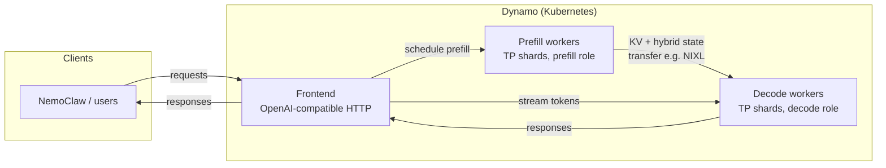

# AKS NemoClaw workshop

## Workshop overview

This is an **Azure Kubernetes Service (AKS)** workshop whose goal is to show **end-to-end agentic use of [NVIDIA NemoClaw](https://github.com/NVIDIA/NemoClaw)** against a **production-style inference stack**: **[NVIDIA Dynamo](https://github.com/ai-dynamo/dynamo)** serving **`nvidia/NVIDIA-Nemotron-3-Super-120B-A12B-FP8`** (Nemotron-3 “Super” in FP8). You deploy Dynamo on the cluster (optional but recommended via `deploy_nemoclaw_k8s.sh --install-dynamo`), build and push the NemoClaw workspace image to **ACR**, then run NemoClaw in Kubernetes with its OpenAI-compatible endpoint pointed at the Dynamo **frontend** so assistants, tools, and the Control UI exercise the same model your users would hit in Azure.

The story is intentionally **NemoClaw + Dynamo + Nemotron-3 Super FP8**: NemoClaw orchestrates agents and UX; Dynamo provides scalable **LLM serving**; Nemotron-3 Super FP8 is a large **hybrid** (Mamba / attention / MoE) model that benefits from modern serving patterns. Together they demonstrate how agent platforms plug into NVIDIA’s inference platform on AKS.

## Why Dynamo and Nemotron-3 Super FP8 are a strong match

**Nemotron-3 Super FP8** is a ~124B-parameter hybrid model shipped in **FP8** (weights and KV cache in FP8 where applicable). That pushes memory and math efficiency so you can run a tier of model that would be painful in BF16-only footprints—while still targeting high quality for reasoning and tool use.

**NVIDIA Dynamo** is built for **distributed LLM inference**: frontends, routers, and **worker pools** that can run **aggregated** (prefill+decode on the same workers) or **disaggregated** (separate prefill and decode tiers with **KV/state transfer** between them). For a wide, MoE-heavy model, disaggregation lets you size **prefill** (long prompts, parallel experts) and **decode** (token generation, latency) differently and scale tiers independently—exactly the kind of knob large hybrid models need on real clusters.

So the match is: **NemoClaw** drives realistic multi-turn and tool-heavy traffic; **Dynamo** exposes a stable **HTTP/OpenAI-compatible** frontend and operational model on Kubernetes; **Nemotron-3 Super FP8** is the flagship NVIDIA model this recipe targets—large, efficient, and representative of what enterprises want behind agents.

## Disaggregated serving with Dynamo

In **disaggregated** mode, Dynamo splits work across **prefill workers** (they compute attention and, for hybrid models, **Mamba/SSM state** for new tokens) and **decode workers** (they continue generation and consume transferred cache/state). A **frontend** accepts client requests and schedules work across the tiers. After prefill on one tier, **KV cache and related state** are **transferred** to decode workers (this workshop’s default recipe uses **SGLang** with a **NIXL** transfer path—GPU-direct between workers—see `dynamo/dynamo/recipes/nemotron-3-super-fp8/sglang/disagg/deploy.yaml`).



**Compared to aggregated serving**, disaggregation isolates **burst prefill** from **steady decode**, improves **utilization** when prompt and generation phases have different hardware needs, and aligns with Dynamo’s component model (frontend + labeled worker roles). The tradeoff is **complexity**: you operate more pod types, tune transfer backends, and ensure the cluster network and GPU topology support the chosen path.

## KV cache routing in Dynamo (and this model)

Dynamo’s **KV cache routing** (often described as **KV-aware** or **KV overlap** routing) lets a **router** prefer workers that already hold **relevant prefix blocks** in cache, so you avoid redundant prefill and improve **time-to-first-token** and throughput on **multi-turn** or **shared-prefix** workloads. The router can combine **cache overlap** signals with **decode load** in a cost model; see `dynamo/dynamo/docs/components/router/router-concepts.md` and `router-guide.md` in this repo’s vendored Dynamo tree.

**Important for this workshop:** full **KV overlap–driven routing is not used for `nvidia/NVIDIA-Nemotron-3-Super-120B-A12B-FP8` in the bundled paths the way it is for simpler attention-only stacks. The Nemotron-3 Super recipes document that **hybrid Mamba + attention** models do not yet expose a **reliable KV-event path** for accurate overlap scoring in vLLM/SGLang; aggregated vLLM/SGLang recipes therefore use **approximate** prefix-hash routing (`--router-mode kv --no-kv-events`), not true event-based KV routing. The **SGLang disaggregated** manifest used by this workshop runs the frontend with **`--router-mode round-robin --no-kv-events`**—so **KV cache routing is not enabled** for this Nemotron deployment; traffic is balanced without KV-aware placement. When NVIDIA extends event/KV semantics for this architecture, recipes can adopt stricter KV routing again.

---

This directory is an **AKS-oriented** implementation of that story: NemoClaw on Kubernetes, optionally deployed together with Dynamo serving **Nemotron-3 Super FP8** over **SGLang disaggregated** mode.

## What this codebase does

- **`deploy_nemoclaw_k8s.sh`** — One entrypoint that can:
  1. Optionally deploy **Dynamo** from a Kubernetes manifest and wait until disaggregated tiers look healthy.
  2. **Clone** a pinned NemoClaw git tag into `nemoclaw-base/nemoclaw-src/NemoClaw` (for reproducible Docker build context).
  3. **Build** the `nemoclaw-base` image for `linux/amd64` (Node-based image with NemoClaw sources and workshop policy baked in).
  4. **Push** `nemoclaw-dind-src:latest` to your **Azure Container Registry (ACR)** (with `az acr login` retry on auth errors).
  5. **Apply** `nemoclaw-install` manifests: optional secrets, delete the `nemoclaw` pod, then `kubectl apply` `nemoclaw-k8s.yaml` with the registry host rewritten from your `--acr-name`.

- **`nemoclaw-base/`** — Dockerfile and build context: clones/copies **NemoClaw** at `NEMOCLAW_GIT_TAG` (default `v0.0.18`), copies **`nemoclaw-blueprint`** policy overrides, installs OpenShell, and produces the image referenced by the pod spec.

- **`nemoclaw-install/`** — Kubernetes manifests for a **Docker-in-Docker (DinD) + workspace** pod that runs NemoClaw’s installer non-interactively and wires **`NEMOCLAW_ENDPOINT_URL`** to an in-cluster Dynamo frontend (via `socat` and `host.openshell.internal`). Edit URLs, model name, and `CHAT_UI_URL` here for your environment.

- **`dynamo/`** — Vendored **Dynamo** tree (recipes, docs, tests). The deploy script’s default Dynamo manifest is  
  `dynamo/dynamo/recipes/nemotron-3-super-fp8/sglang/disagg/deploy.yaml`  
  (SGLang disaggregated Nemotron-3 Super FP8). See that recipe’s README for GPU and secret requirements.

## Prerequisites

- Shell with **bash**, **git**, **Docker**, **kubectl** (context pointing at your cluster), and **Azure CLI** (`az`) if you use ACR login from the script.
- **ACR** your cluster can pull from (attach ACR to AKS or use another supported pull pattern).
- Kubernetes **namespaces** you will use (defaults below); create them if they do not exist, for example:
  - `kubectl create namespace nemoclaw`
  - For Dynamo: `kubectl create namespace dynamo-system` (or your `--dynamo-namespace`).
- For **Dynamo** deployments: satisfy the recipe’s prerequisites (GPU node pool, Hugging Face token secret, model cache jobs, etc.) as described in `dynamo/dynamo/recipes/nemotron-3-super-fp8/README.md` and Dynamo’s Kubernetes docs under `dynamo/dynamo/docs/kubernetes/`.

## Install / refresh with `deploy_nemoclaw_k8s.sh`

Run the script from anywhere; it resolves paths relative to its own location.

### Required

| Flag / variable | Meaning |
|-----------------|--------|
| `--acr-name NAME` or `ACR_NAME` | **Short** ACR name only (e.g. `myregistry`), not the full `*.azurecr.io` login server. The image pushed is `NAME.azurecr.io/nemoclaw-dind-src:latest`. |

### Options (flags or environment variables)

| Flag | Env (if any) | Default | Purpose |
|------|----------------|---------|---------|
| `--install-dynamo` | — | off | Before build/push: `kubectl apply` the Dynamo manifest (see `DYNAMO_DEPLOY_MANIFEST`), then **wait** until every pod in the Dynamo namespace is Running with full readiness, and there are at least **`DYNAMO_DISAGG_MIN_PODS`** ready pods per disagg tier (names matching `-disagg-decode-`, `-disagg-frontend-`, `-disagg-prefill-`). |
| `--nemoclaw-namespace NS` | `NEMOCLAW_NAMESPACE` | `nemoclaw` | Namespace for NemoClaw `kubectl apply` / pod delete. |
| `--dynamo-namespace NS` | `DYNAMO_NAMESPACE` | `dynamo-system` | Namespace used when `--install-dynamo` is set. |
| `-h`, `--help` | — | — | Print usage and exit. |

### Environment-only tuning

| Variable | Default | Purpose |
|----------|---------|---------|
| `DYNAMO_DEPLOY_MANIFEST` | `dynamo/dynamo/recipes/nemotron-3-super-fp8/sglang/disagg/deploy.yaml` (under this workshop) | Manifest path for `--install-dynamo`. |
| `DYNAMO_READY_POLL_INTERVAL` | `15` | Seconds between pod status polls while waiting. |
| `DYNAMO_READY_TIMEOUT_SEC` | `3600` | Max wait seconds (`0` = no limit). |
| `DYNAMO_DISAGG_MIN_PODS` | `3` | Minimum **ready** pods per decode / frontend / prefill tier (name substring match). |
| `NEMOCLAW_GIT_URL` | `https://github.com/NVIDIA/NemoClaw.git` | Clone URL for NemoClaw under `nemoclaw-base/nemoclaw-src/NemoClaw`. |
| `NEMOCLAW_GIT_TAG` | `v0.0.18` | Git **tag** to fetch (detached checkout). If unset, `NEMOCLAW_GIT_REF` is still read for backward compatibility. |
| `VERBOSE` | `0` | Set to `1` for more detailed logs (e.g. push output, Dynamo criteria). |

### Example commands

**NemoClaw only** (build, push, refresh pod; assumes Dynamo is already installed if the pod expects it):

```bash
./deploy_nemoclaw_k8s.sh --acr-name myregistry
```

**Dynamo + NemoClaw** (apply default SGLang disagg recipe, wait for pods, then build/push/refresh):

```bash
./deploy_nemoclaw_k8s.sh --acr-name myregistry --install-dynamo
```

**Custom namespaces**:

```bash
./deploy_nemoclaw_k8s.sh \
  --acr-name myregistry \
  --install-dynamo \
  --dynamo-namespace my-dynamo \
  --nemoclaw-namespace my-nemoclaw
```

**Custom Dynamo manifest** (same flags; override path):

```bash
export DYNAMO_DEPLOY_MANIFEST="/path/to/your/deploy.yaml"
./deploy_nemoclaw_k8s.sh --acr-name myregistry --install-dynamo
```

### After the script

1. **`nemoclaw-install/nemoclaw-k8s.yaml`** — Adjust `CHAT_UI_URL` (must match the origin users type in the browser for the Control UI), `DYNAMO_HOST` / service DNS if your frontend differs, `NEMOCLAW_ENDPOINT_URL`, and `NEMOCLAW_MODEL` as needed, then re-run the script or `kubectl apply` the same pattern the script uses.
2. **Secrets** — Copy `nemoclaw-install/nemoclaw-secrets.example.yaml` to `nemoclaw-secrets.yaml` (gitignored), fill Azure OpenAI / NGC keys if you use those paths, and ensure the pod env references match. The script applies `nemoclaw-secrets.yaml` when the file exists.

## Related paths

- Default Dynamo recipe: `dynamo/dynamo/recipes/nemotron-3-super-fp8/sglang/disagg/`
- Pod and Service definitions: `nemoclaw-install/nemoclaw-k8s.yaml`
