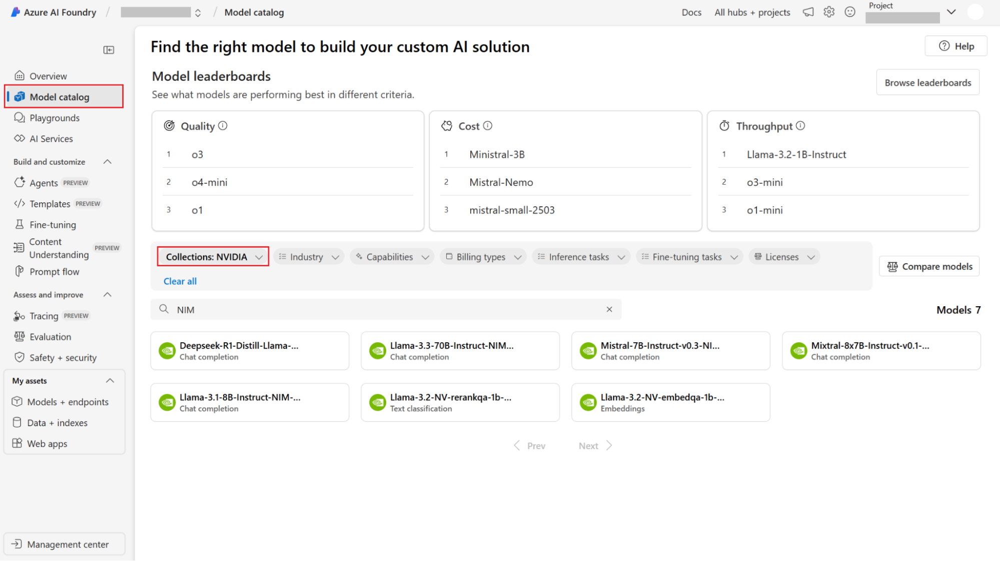
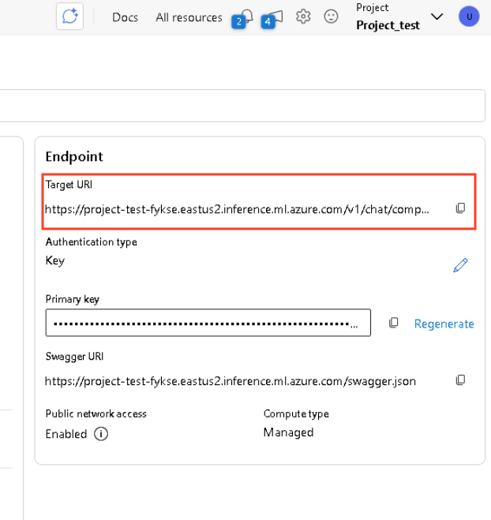
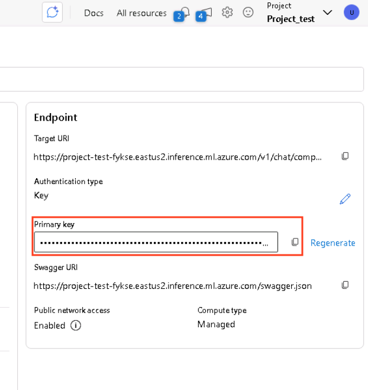

# Overview
NVIDIA Cosmos Reason – an open, customizable, 7B-parameter reasoning vision language model (VLM) for physical AI and robotics - enables robots and vision AI agents to reason like humans, using prior knowledge, physics understanding and common sense to understand and act in the real world. 

This model understands space, time, and fundamental physics, and can serve as a planning model to reason what steps an embodied agent might take next. Cosmos Reason excels at navigating the long tail of diverse scenarios of the physical world with spatial-temporal understanding. 

Cosmos Reason is post-trained with physical common sense and embodied reasoning data with supervised fine-tuning and reinforcement learning. It uses chain-of-thought reasoning capabilities to understand world dynamics without human annotations.


Learn more on the [NVIDIA Cosmos Reason Github Repository](https://github.com/nvidia-cosmos/cosmos-reason1?tab=readme-ov-file) and the official NVIDIA [webpage](https://research.nvidia.com/labs/dir/cosmos-reason1/)


## What you will learn

By the end of this workshop, you will have hands-on experience with:

  1. Creating an Azure AI Foundry Hub and Project
  2. Exploring the NVIDIA Collection of NIM microservices that are intergrated natively in Azure AI Foundry
  3. Deploying the Cosmos Reason NIM on an Azure AI Foundry endpoint and how to use it


## Learn the Components

### **NVIDIA Cosmos Reason**

[NVIDIA Cosmos Reason](https://research.nvidia.com/labs/dir/cosmos-reason1/)
 is an open, customizable, 7B-parameter reasoning vision language model (VLM) for physical AI and robotics - enables robots and vision AI agents to reason like humans, using prior knowledge, physics understanding and common sense to understand and act in the real world

### **NVIDIA NIM microservices**

[NVIDIA NIM](https://developer.nvidia.com/nim) are a set of easy-to-use
inference microservices for accelerating the deployment of foundation models
on any cloud or data center and helping to keep your data secure.

### **Azure AI Foundry**

[Azure AI Foundry](https://ai.azure.com/?cid=learnDocs&tid=43083d15-7273-40c1-b7db-39efd9ccc17a) is a unified Azure platform-as-a-service offering for enterprise AI operations, model builders, and application development. This foundation combines production-grade infrastructure with friendly interfaces, enabling developers to focus on building applications rather than managing infrastructure.


## What you need

To complete this lab, you need:

  * Access to a standard internet browser
  * Access to an Azure subscription with access to Azure GPU A100 


# Task 1: Create an Azure AI Foundry Hub

1. Go to the Azure AI Foundry homepage

    Once you log in, click on the search bar, located at the top bar, type in "Azure AI Foundry" and click on the first result:


2. Create an Azure AI Foundry Hub Record

    On the left hand side menu, click "AI Hubs"


3. Click "Create"


4. Select "Hub"


5.  Fill out the fields

Select the only available Resource group, provide a name for the resource (in this example, we used "nim-ai-foundry-hub", but you can use any unique value you want)


4. Review and Create

Click next in all tabs until you reach the "Review and Create" tab, then click "Create"

5. Verify Hub has been successfully created

    1. In the screen you're redirected to, confirm that all resources have been successfully deployed and there is a message "Your deployment is complete" at the top

    2. Go back to Azure AI Foundry and make sure you can see the newly created Hub, under the "AI Hubs" tab


# Task 2: Create an Azure AI Foundry Project

1. Create an Azure AI Foundry Project Record

On the left hand side menu, make sure you are under the "AI Hubs" tab


3. Click "Create"


4. Select "Project"


5.  Fill out the fields

Select the only available Resource group, provide a name for the resource (in this example, we used "nim-ai-foundry-project", but you can use any unique value you want), and select the "nim-ai-foundry-hub" record in the last field


6. Review and Create

Click next in all tabs until you reach the "Review and Create" tab, then click "Create"

7. Go to Azure AI Foundry Studio

Click "Go to Resource", and then click the "Launch Studio" button


# Task 3: Deploy a NIM in the Azure AI Foundry Portal

1. In the new tab that opens, select Model Catalog from the left sidebar menu.
In the Collections filter, type in and select NVIDIA to see all the NIM microservices that are available on Azure AI Foundry.



2. Select the NIM you want to use. This example uses the `NVIDIA Cosmos Reason` NIM microservice.

3. Click on the respective icon, and then click "Use this Model".


4. In the popup window that appears, tick the checkbox. Then choose "Standard_NC48ads_A100_v4" as the virtual machine (VM) type for your deployment. 

VM SKUs that are supported for the selected NIM and also specified within the model card will be preselected. 


Click "Next", tick the terms of use checkbox and click "Deploy"


# Task 4: Test the NVIDIA Cosmos Reason NIM

Wait until the model has been fully deployed on the Azure AI Foundry endpoint:


### **Note:** Make sure you've cloned this repository or downloaded the files in the "sample_files" folder before moving on to the next steps

1. Open a terminal on your computer

2. Execute the below command to navigate to the sample files folder

```
cd [YOUR_PATH_HERE]/sample_files
```

3. Copy and paste the command below (following the screenshots)

**You will need to replace** these 2 values :

1. `<YOUR_URI>` with the value of the field "Target URI":



2. `<YOUR_PRIMARY_KEY>` with the value of the field "Primary Key"


```json
curl -X 'POST' \
'<YOUR_URI>/v1/chat/completions' \
    -H 'Accept: application/json' \
    -H "Authorization: Bearer <YOUR_PRIMARY_KEY>" \
    -H 'Content-Type: application/json' \
    -d "@example_request_1.json" | jq
```

Change the number of the json file name in the command above, from 1, to 2 or 3, if you want to test with a different image.

Output should like this:

```json
{
  "id": "chatcmpl-a88cdf900da9483a87fb78adf7537794",
  "object": "chat.completion",
  "created": 1762463499,
  "model": "nvidia/cosmos-reason1-7b",
  "choices": [
    {
      "index": 0,
      "message": {
        "role": "assistant",
        "reasoning_content": null,
        "content": "The pizza is topped with various ingredients, including pepperoni slices, mushrooms, peppers, and onions.",
        "tool_calls": []
      },
      "logprobs": null,
      "finish_reason": "stop",
      "stop_reason": null
    }
  ],
  "usage": {
    "prompt_tokens": 1029,
    "total_tokens": 1050,
    "completion_tokens": 21,
    "prompt_tokens_details": null
  },
  "prompt_logprobs": null,
  "kv_transfer_params": null
}
```

1. example_request_1 JSON file contains this image 


and this prompt: **"Can you identify the toppings on the pizza?"**

2. example_request_2 JSON file contains this image:


and this prompt: **"Can you describe the scene in detail?"**

3. example_request_3 JSON file contains this video:

[](imgs/warehouse_trimmed.mp4)


this prompt for the system role:

**"You are a warehouse monitoring system. A video will be shown that includes people with an ID overlaid on them. Be sure to idenitfy this value then answer the user's questions with the ID."**}

and this prompt for the user role:

**"Which worker dropped the box? Describe what they are wearing as well as the ID overlaid on their body. YOU MUST INCLUDE THE ID!"**


# Congratulations!

You've successfully deployed an NVIDIA Cosmos Reason NIM on Azure AI Foundry! Explore further by implementing robotics and physical AI applications with NIMs, experimenting with different GPU types, and scaling your deployments today. Happy modeling!

NVIDIA offers NIMs with enterprise support through our Azure Marketplace listing, [NVIDIA AI Enterprise](https://azuremarketplace.microsoft.com/en-us/marketplace/apps/nvidia.nvidia-ai-enterprise?tab=Overview).