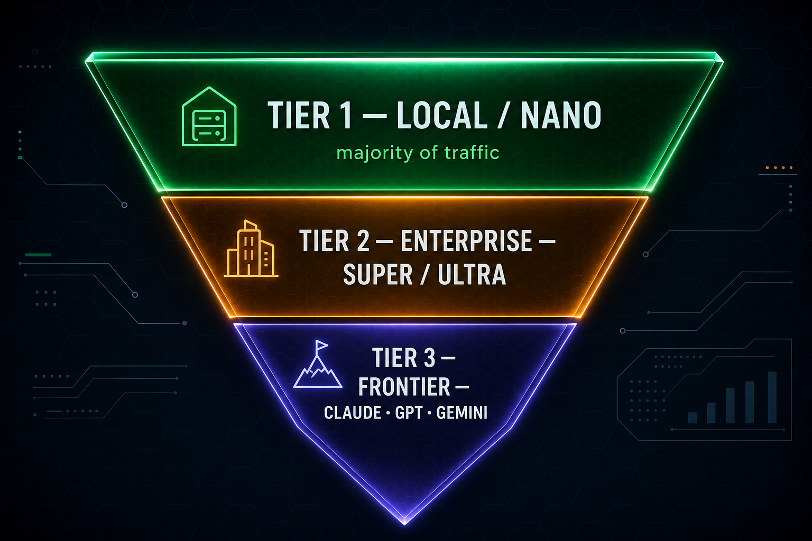

# Cursor Dynamo workshop

## Summary

This workshop shows how **widely adopted AI tools** (for example **Cursor**) can be paired with a **governed inference stack** so spend follows a **tokenomics funnel**: most work stays on **efficient, on-platform models** (wide top of the triangle), a **smaller share** steps up to **enterprise-class models** (Nemotron 3 Super / Ultra in the middle), and only a **thin tail** reaches **frontier APIs** at the tip—by design, not by accident. The figure below is the same mental model for executives: **better unit economics** without giving up capability when it truly matters.

## Tokenomics Funnel

