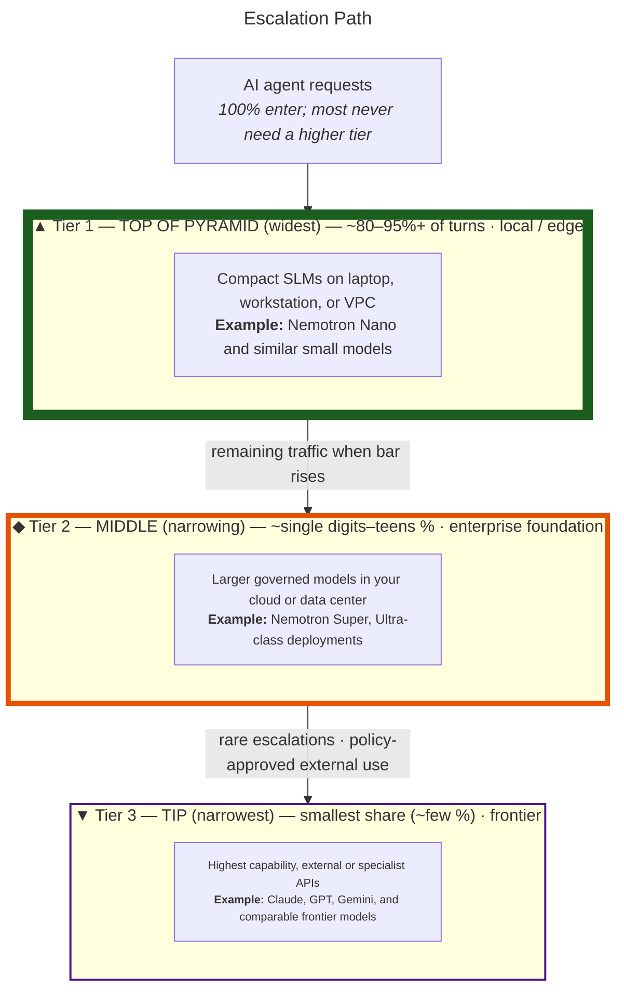

**Escalation Path** — inverted pyramid: **Tier 1** is the wide top (most agent traffic); **Tier 3** is the narrow tip (rare frontier escalation).

*Graphic: generated with Cursor’s built-in image model (Gemini-class / diffusion-style image generation, comparable in spirit to Google Imagen / Gemini image tools).*

