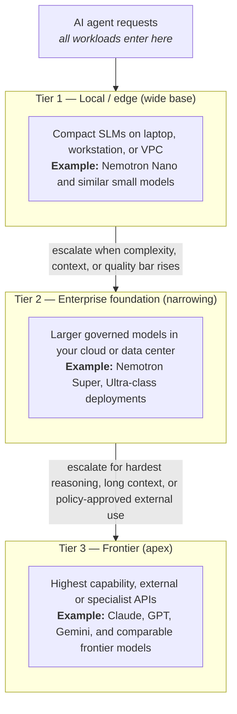

# Cursor Dynamo Workshop

## Executive overview

Organizations that deploy AI agents at scale face a predictable tension: **volume, latency, and cost** at the base of the stack versus **depth of reasoning and capability** at the top. The most sustainable pattern is not “one model for everything,” but a **deliberate escalation path**: handle the majority of work on governed, cost-efficient infrastructure, and reserve the most capable (and expensive) models for tasks that truly need them.

### Escalation Path

The diagram below summarizes how agent traffic can be shaped from high-throughput, local inference through enterprise-class foundation models to frontier providers when the task demands it.

**How to read this funnel.** Most agent turns should resolve at **Tier 1**: fast feedback loops, data stays close to the user or inside your boundary, and unit economics stay favorable. A smaller fraction escalates to **Tier 2** when tasks need stronger reasoning, richer context, or centralized policy and observability at enterprise scale. Only the **narrow apex** at **Tier 3** should absorb frontier spend—typically for novel problems, long-horizon planning, or capabilities not yet replicated on your own stack.

This workshop’s Dynamo-oriented material supports the **middle and lower parts** of that path: repeatable deployment patterns for high-throughput, GPU-backed inference on Azure so escalation is a **design choice**, not an accident.
