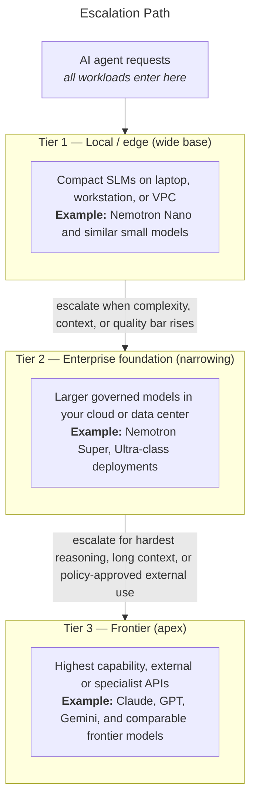

```mermaid
---
title: Escalation Path
---
flowchart TB
    REQ["AI agent requests<br/><i>all workloads enter here</i>"]

    subgraph tier1["Tier 1 — Local / edge (wide base)"]
        direction TB
        L1["Compact SLMs on laptop, workstation, or VPC<br/><b>Example:</b> Nemotron Nano and similar small models"]
    end

    subgraph tier2["Tier 2 — Enterprise foundation (narrowing)"]
        direction TB
        L2["Larger governed models in your cloud or data center<br/><b>Example:</b> Nemotron Super, Ultra-class deployments"]
    end

    subgraph tier3["Tier 3 — Frontier (apex)"]
        direction TB
        L3["Highest capability, external or specialist APIs<br/><b>Example:</b> Claude, GPT, Gemini, and comparable frontier models"]
    end

    REQ --> tier1
    tier1 -->|"escalate when complexity, context, or quality bar rises"| tier2
    tier2 -->|"escalate for hardest reasoning, long context, or policy-approved external use"| tier3
```
