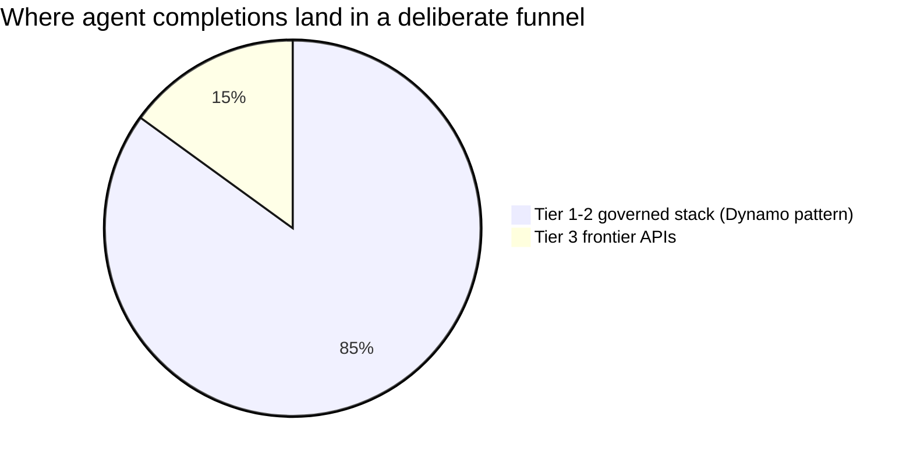
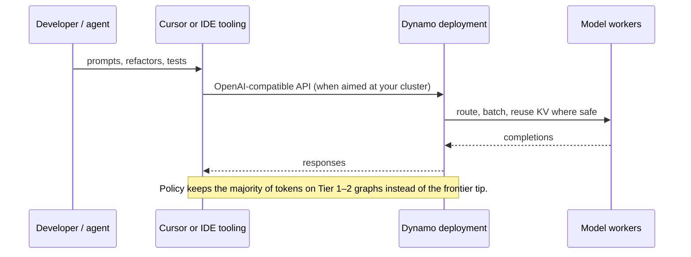
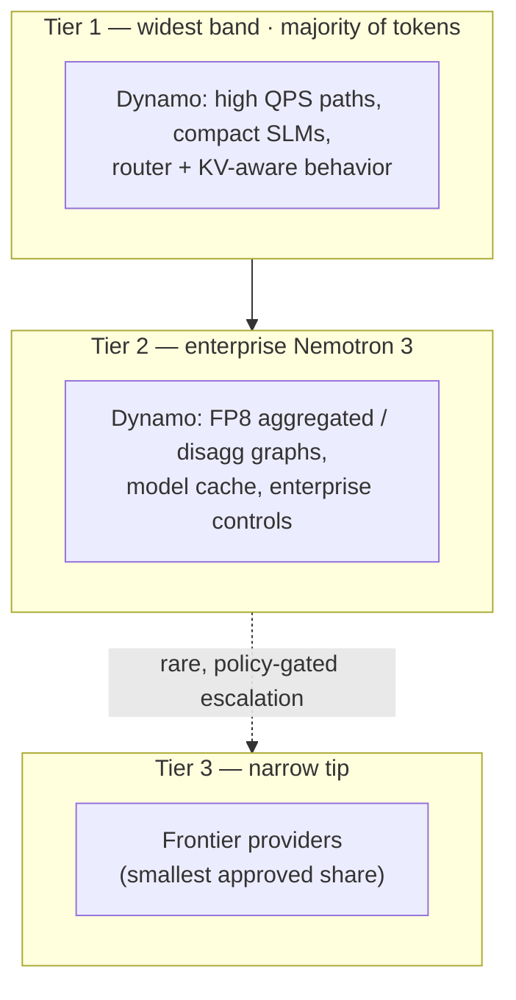

# Cursor Dynamo workshop

## Summary

This workshop shows how **widely adopted AI tools** (for example **Cursor**) can be paired with a **governed inference stack** so spend follows a **tokenomics funnel**: most work stays on **efficient, on-platform models** (wide top of the triangle), a **smaller share** steps up to **enterprise-class models** (Nemotron 3 Super / Ultra in the middle), and only a **thin tail** reaches **frontier APIs** at the tip—by design, not by accident. The figure below is the same mental model for executives: **better unit economics** without giving up capability when it truly matters.

**NVIDIA Dynamo** is the runtime pattern this workshop uses to **own the bulk of Tier 1 and Tier 2**: the same serving graph, routing, and GPU placement discipline that works for **high-volume compact models** also scales into **aggregated and disaggregated Nemotron 3** deployments—so agent traffic stays on **your** stack until policy says otherwise.

## Tokenomics Funnel

## Why Dynamo sits across Tier 1 and Tier 2

Frontier models earn the headlines; **margin and compliance** are won where tokens are cheapest and data stays put. Dynamo is built for that middle of the market:

- **Tier 1 (volume):** tight loops for coding agents, summarization, retrieval, and guard-railed “small” models. Dynamo’s **frontend + router + worker** layout, **KV-aware routing**, and **batched GPU serving** are meant to absorb **most turns** at low incremental cost—exactly the profile of a wide funnel band.
- **Tier 2 (quality bar):** when the task needs stronger reasoning or longer context but must remain **governed**, **Nemotron 3 Super / Ultra**-class graphs (FP8 aggregated, optional prefill/decode split) sit naturally on the **same control plane**—so escalation is a **capacity and model-card change**, not a wholesale jump to a different vendor surface.
- **Tier 3 (tip):** frontier APIs remain available for the **rare** cases you approve; the workshop story is that **Dynamo shrinks how often you need them** by making Tier 1–2 “good enough” more of the time.

Concrete entry points bundled here (see subfolders under `dynamo/recipes/`):

- **Enterprise Tier 2:** [Nemotron-3 Super FP8 recipes](dynamo/recipes/nemotron-3-super-fp8/README.md) — aggregated and disaggregated patterns for large hybrid models on multi-GPU Dynamo graphs.
- **Compact / omni Tier 1:** [Nemotron-3 Nano Omni recipes](dynamo/recipes/nemotron-3-nano-omni/README.md) — smaller footprints aligned with high-throughput, lower-cost turns.

### Illustrative completion share (conceptual)

Not measured throughput—only a **narrative** split consistent with the funnel above.

### Request path: tools on the left, Dynamo in the middle

### Tier stack with Dynamo called out

## In this workshop folder

Beyond the recipes linked above, explore `dynamo/docs/kubernetes/README.md` for platform install context and the `dynamo/recipes/README.md` index for additional backends. Azure-specific manifests you iterate on for the workshop can live alongside this README as you evolve the lab.
