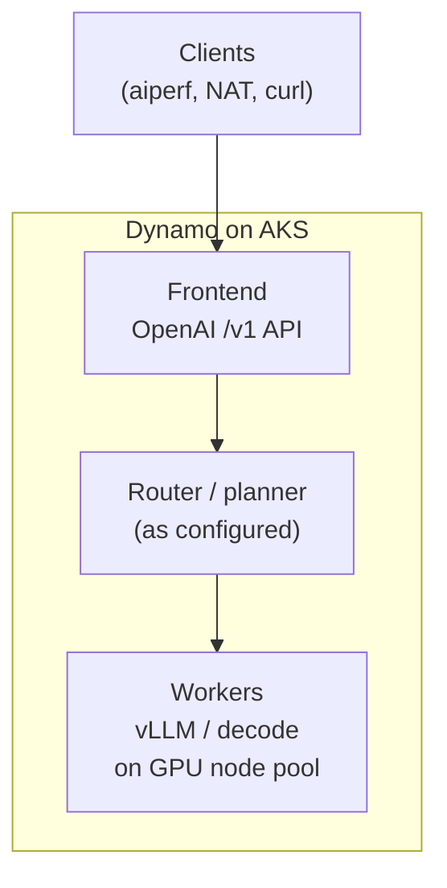
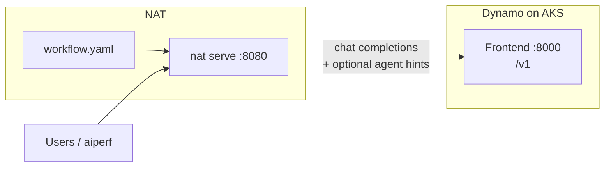
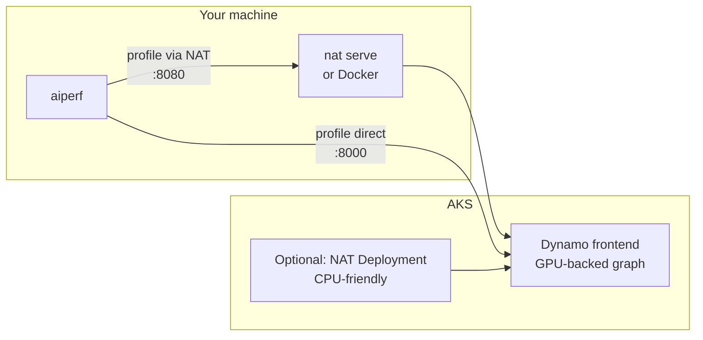

# NeMo Agent Toolkit (NAT) on NVIDIA Dynamo — Azure AKS Workshop

Welcome to this hands-on workshop. Whether you are new to NeMo Agent Toolkit and NVIDIA Dynamo or you just want a concise map of how they fit together on Azure, you are in the right place. By the end, you should understand each stack, how they connect over an OpenAI-compatible API, and the concrete steps to run inference on AKS, layer an agent on top, and measure behavior with **aiperf**.

### Prerequisites

| Area | You need |
|------|-----------|
| **Cluster** | An **Azure Kubernetes Service (AKS)** cluster you can administer (create namespaces, install operators/Helm charts, apply CRDs and custom resources). If you need to create a cluster, see Microsoft Learn: [Deploy AKS with the Azure CLI](https://learn.microsoft.com/en-us/azure/aks/learn/quick-kubernetes-deploy-cli) or [with the Azure portal](https://learn.microsoft.com/en-us/azure/aks/learn/quick-kubernetes-deploy-portal). |
| **GPU** | A **node pool with NVIDIA GPUs** suitable for the model and Dynamo runtime you will deploy (size and count depend on your chosen graph; check the example manifest and release notes). To add or configure GPU-backed node pools on AKS, see Microsoft Learn: [Use GPUs for compute-intensive workloads on Azure Kubernetes Service (AKS)](https://learn.microsoft.com/en-us/azure/aks/use-nvidia-gpu?tabs=add-ubuntu-gpu-node-pool). |
| **Local tools** | **kubectl** and **Helm** (v3) configured for that cluster—see [Install Tools for Kubernetes](https://kubernetes.io/docs/tasks/tools/) and [Installing Helm](https://helm.sh/docs/intro/install/); **Azure CLI** if you use it for ACR attach, credentials, or portal-free steps—see [How to install the Azure CLI](https://learn.microsoft.com/en-us/cli/azure/install-azure-cli). |
| **Workstation** | **Python 3.12+** (see [Download Python](https://www.python.org/downloads/)) or **Docker** (see [Get Docker](https://docs.docker.com/get-docker/)) if you run NAT locally; use **`kubectl port-forward`** to reach in-cluster services—see [Port forward access to applications](https://kubernetes.io/docs/tasks/access-application-cluster/port-forward-access-application-cluster/). |
| **Secrets / access** | A **Hugging Face** user access token (see [User access tokens](https://huggingface.co/docs/hub/en/security-tokens)) or other credentials your model graph requires, stored safely—often as a Kubernetes **Secret** (see [Kubernetes Secrets](https://kubernetes.io/docs/concepts/configuration/secret/)) referenced by the deployment. |
| **Load testing** | **AIPerf** (`aiperf` on the CLI): install from [PyPI](https://pypi.org/project/aiperf/) and use the [aiperf project docs](https://github.com/ai-dynamo/aiperf/tree/main/docs); for Dynamo-oriented context see [Dynamo benchmarking](https://docs.nvidia.com/dynamo/user-guides/dynamo-benchmarking). You will also need an input trace such as **`mooncake_trace.jsonl`** when you run the profile commands in this guide. |

### Assumptions checklist

Use this to confirm your environment matches what the exercises expect.

- [ ] You have **cluster-admin or sufficient RBAC** to install the Dynamo platform and apply `DynamoGraphDeployment` resources.
- [ ] **GPU nodes are schedulable** (drivers/device plugin or GPU Operator already handled per your cluster policy).
- [ ] You can **pull container images** used by the workshop (NGC, ghcr.io, or your mirror/ACR as applicable).
- [ ] You accept that **ports and service names** in examples (`8000` for Dynamo frontend, `8080` for NAT) are **defaults**—you will align them with your actual Services and port-forwards.
- [ ] **No prior knowledge of NAT or Dynamo** is required; general Kubernetes and HTTP/API literacy is enough.

This guide explains **what** NeMo Agent Toolkit and NVIDIA Dynamo are, **how the pieces connect**, and **what to run** to deploy Dynamo inference in-cluster, run a NAT agent in front of it, optionally ship NAT as a container or Kubernetes workload, and validate with **aiperf**.

---

## 1. Two products, two roles

| | **NVIDIA Dynamo** | **NeMo Agent Toolkit (NAT)** |
|---|---------------------|------------------------------|
| **Purpose** | **Model inference at scale** on Kubernetes: schedule GPUs, run disaggregated graphs (prefill/decode, routers, workers), expose an **OpenAI-compatible HTTP API** (`/v1/chat/completions`, etc.). | **Agent orchestration**: define **workflows** (ReAct and other patterns), **tools** (HTTP, search, …), and **LLM backends** in YAML; run via CLI (`nat run`, `nat serve`) or your own app using the same configs. |
| **You implement** | A **`DynamoGraphDeployment`** (CRD): which images, model id, replicas, caches, frontend URL. | A **`workflow.yaml`**: which LLM adapter to use (`dynamo`, `openai`, …), tool list, and workflow `_type` (e.g. `tool_calling_agent` or `react_agent`). |
| **Runs where** | **On GPUs in the cluster** (workers, routers, frontend pod). | **On your laptop, in Docker, or on CPU pods in AKS**—anywhere that can reach Dynamo’s HTTP endpoint. |

**Why use them together:** Dynamo answers “how do we serve **Qwen3-32B** (or similar) efficiently on **AKS**?” NAT answers “how do we build an **agent** (reasoning + tools) that **calls** that model?” NAT’s **`dynamo` LLM type** speaks the same OpenAI-style protocol Dynamo exposes, and can add **agent hints** (prefix ids, pacing / length hints) so the backend can route and cache smarter than a dumb HTTP client. You keep **one inference stack** (Dynamo) and swap or extend **agent logic** (NAT) without changing how the model is served.

---

## 2. Agent hints (why NAT matters for Dynamo)

Generic clients send chat requests with little context. NAT’s **Dynamo LLM** integration can attach **hints** (e.g. prefix identifiers, output-length and inter-arrival hints) so Dynamo-side routing and caching can treat **agent sessions** more intelligently. Details and knobs: [NAT Dynamo LLM API](https://docs.nvidia.com/nemo/agent-toolkit/latest/api/nat/llm/dynamo_llm/index.html).

---

## 3. Dynamo stack (what you deploy on AKS)

At a high level:

1. **Dynamo Kubernetes Platform** — Helm install in a namespace (often `dynamo-system`): **operator**, CRDs, shared services. This is what lets you apply **`DynamoGraphDeployment`** manifests.
2. **Dynamo graph** — Your CRD describes **services**: typically a **Frontend** (HTTP API, OpenAI-compatible) and **Workers** (e.g. vLLM) that run the model on **GPU nodes**. Optional components (routers, planners, KV-related pieces) depend on the recipe and version—follow the manifest comments and release docs for your version.
3. **Traffic** — Clients send **`POST /v1/chat/completions`** (streaming optional) to the **frontend** `Service`. Inside the cluster, DNS looks like `<release>-frontend.<namespace>.svc.cluster.local:8000` (port may vary; check your `Service`).

**Conceptual diagram:**



For a longer Azure-focused walkthrough (Prometheus, node pools, platform install order), see [**Configuring NVIDIA Dynamo on AKS**](../aks-dynamo/README.md). This repo includes an example graph for **Qwen/Qwen3-32B**: [`agg-router-qwen3-32B.yaml`](./agg-router-qwen3-32B.yaml)—adjust image tags and names to match your Dynamo release.

---

## 4. NAT stack (what you configure and run)

1. **`workflow.yaml`** — Declares **`llms`** (each has `_type`: `dynamo`, `openai`, …), **`functions`** (tools), and a **`workflow`** (`_type` such as `tool_calling_agent` or `react_agent`) that references an LLM by name and which tools to use.
2. **CLI** — From a Python env that has NAT installed (this workshop bundles **`NeMo-Agent-Toolkit`** for local/Docker builds): `nat run` (interactive) or `nat serve` (HTTP server, default **8080**).
3. **Dynamo LLM block** — Points `base_url` at Dynamo’s **`…/v1`** URL. **Local dev:** after `kubectl port-forward`, often `http://127.0.0.1:8000/v1`. **Pod in cluster:** use the Kubernetes **DNS name** of the frontend service (see comments in [`workflow.yaml`](./workflow.yaml)).

#### Workflow type: tool_calling_agent, streaming, and TTFT

For **end-to-end HTTP streaming** (OpenAI-style SSE on `POST /v1/chat/completions` with `"stream": true`), prefer **`_type: tool_calling_agent`** in `workflow.yaml`. That workflow registers both a one-shot handler and a **streaming** handler: NAT selects streaming when the request sets `stream: true` (see the FastAPI chat route). By contrast, **`react_agent`** completes the LangGraph turn and returns a full **`ChatResponse`**—it does not expose the same token-level streaming path to the client.

**Why this matters for TTFT (time to first token):** With **`tool_calling_agent`** and **`stream: true`**, the first byte the client sees is typically the **first streamed chunk** from the agent node (after the model begins emitting tokens for that step). The client does **not** wait for the full agent response (all tool rounds and the final message) before TTFT can be observed—benchmarking tools such as **aiperf** (`--streaming`) report TTFT as **time until that first chunk**, not end-to-end completion time. If you use a non-streaming workflow or call NAT with **`stream: false`**, the HTTP response is held until the workflow returns a complete result, so “first token” style metrics align with **full completion latency**, not an early partial token.

**Requirements:** `tool_calling_agent` relies on **native tool calling** (LangChain `bind_tools` / model `tool_calls`). Your served model and Dynamo endpoint must support that protocol. **`react_agent`** uses **text ReAct** parsing instead and can be a better fit when the backend must not receive structured tool calls—at the cost of no NAT-managed streaming path as described above.

**Conceptual diagram:**



---

## 5. End-to-end architecture (this workshop)



- **Port 8000 (example):** Dynamo frontend after port-forward, or as declared in your `Service`.
- **Port 8080:** NAT when using `nat serve` or the workshop Docker image.

---

## 6. Workshop steps

### Step A — Deploy Qwen/Qwen3-32B on AKS/Dynamo

This section gets **Qwen/Qwen3-32B** running behind Dynamo’s OpenAI-compatible frontend on your **GPU-backed AKS** cluster. You install the Dynamo platform once (if not already present), then wire secrets, shared **model/compilation** volumes, a **prefetch job** for this model’s weights, and finally apply the workshop **`DynamoGraphDeployment`** ([`agg-router-qwen3-32B.yaml`](./agg-router-qwen3-32B.yaml)). Image tags, resource sizes, and router layout should stay aligned with your Dynamo release—treat the YAML as a starting point if your cluster needs different SKUs or counts.

1. **Install the Dynamo platform** (Helm) so the cluster has CRDs and an operator for **`DynamoGraphDeployment`**. This step is **cluster-level**: skip only if your admins already installed a compatible platform version. Follow the NVIDIA Dynamo **[Kubernetes deployment guide](https://docs.nvidia.com/dynamo/latest/kubernetes-deployment/deployment-guide)** and **[Detailed installation guide](https://docs.nvidia.com/dynamo/latest/kubernetes-deployment/deployment-guide/detailed-installation-guide)**. Pin the **chart version** to match your workshop tarball or [GitHub releases](https://github.com/ai-dynamo/dynamo/releases)—use the docs version selector if you need a specific release’s docs.

2. **Secret for Hugging Face** — **Qwen/Qwen3-32B** is pulled from Hugging Face; workers and the prefetch job expect a Secret named **`hf-token-secret`** with key **`HF_TOKEN`** (see [user access tokens](https://huggingface.co/docs/hub/en/security-tokens)):

   ```bash
   export NAMESPACE=dynamo-system   # namespace where this graph will run
   kubectl create secret generic hf-token-secret \
     --from-literal=HF_TOKEN="${HF_TOKEN}" \
     -n "${NAMESPACE}"
   ```

3. **PVCs and prefetch for Qwen/Qwen3-32B** — [`agg-router-qwen3-32B.yaml`](./agg-router-qwen3-32B.yaml) uses existing PVCs named **`model-cache`** and **`compilation-cache`** (`spec.pvcs.create: false`). Create them, then **prefetch** the model revision the graph will use so workers do not cold-download the full weights at startup.

   1. Review [`model-cache/cache.yaml`](./model-cache/cache.yaml): PVC sizes and **`storageClassName`** (defaults to **`azurefile-csi`** for ReadWriteMany on AKS). Adjust for your storage class and expected checkpoint size.
   2. Apply the PVCs:

      ```bash
      kubectl apply -f model-cache/cache.yaml -n "${NAMESPACE}"
      ```

   3. Run the download **Job** [`model-cache/model-download-job.yaml`](./model-cache/model-download-job.yaml): it installs `huggingface_hub` and runs **`hf download`** for **Qwen/Qwen3-32B** (revision pinned in the file) into **`model-cache`**. Expect a long runtime and sufficient egress.

      ```bash
      kubectl apply -f model-cache/model-download-job.yaml -n "${NAMESPACE}"
      kubectl wait --for=condition=complete job/model-download -n "${NAMESPACE}" --timeout=24h
      ```

      On failure: `kubectl logs -n "${NAMESPACE}" job/model-download`. Retry with `kubectl delete job model-download -n "${NAMESPACE}"` and re-apply.

4. **Deploy the Qwen3-32B graph** — Apply the vLLM-based aggregated + router example (metadata name **`agg-8xtp2`** in the sample file; rename only if you avoid collisions):

   ```bash
   kubectl apply -f agg-router-qwen3-32B.yaml -n "${NAMESPACE}"
   ```

   Edit the manifest first if your **Dynamo runtime image version**, GPU counts, or service names must differ from the workshop defaults.

5. Wait until **Frontend** and **worker** pods are **Ready**; note the **frontend** `Service` (pattern `<release-name>-frontend` for this graph).

6. **Reach the model from your laptop** — `kubectl port-forward svc/<frontend-service> 8000:8000 -n "${NAMESPACE}"` (adjust ports to match the `Service`). The served OpenAI **`model`** id should match **Qwen/Qwen3-32B** as configured in the graph.

Smoke-test: [`test_dynamo_endpoint.py`](./test_dynamo_endpoint.py) — set **`DYNAMO_BASE_URL`** (and model env vars if used) to match your port-forward; align with the local port you chose (**8080** vs **8000**).

### Step B — Configure NAT (`workflow.yaml`)

1. Set **`model_name`** to the model served by Dynamo (e.g. `Qwen/Qwen3-32B`).
2. Set **`llms.dynamo_llm.base_url`** to Dynamo’s OpenAI root (**must end with `/v1`**, no trailing slash). Relevant excerpt from [`workflow.yaml`](./workflow.yaml) (edit the **`base_url`** line; keep **`model_name`** aligned with the graph):

```31:53:nim-deploy/cloud-service-providers/azure/workshops/nat-dynamo/workflow.yaml
  dynamo_llm:
    _type: dynamo
    # --- base_url (pay close attention): NAT must reach Dynamo's OpenAI-compatible root, always ending in /v1
    #     (no trailing slash after v1). Wrong host/port/namespace is the #1 cause of in-cluster NAT failures.
    #
    #     In-cluster form: http://<FRONTEND_SVC_NAME>.<K8S_NAMESPACE>.svc.cluster.local:<PORT>/v1
    #     - FRONTEND_SVC_NAME: the Kubernetes Service for the Dynamo *Frontend* (often "<DynamoGraphDeployment.metadata.name>-frontend").
    #     - K8S_NAMESPACE: the namespace where that Service exists (must match where you applied the graph).
    #     - PORT: the Service's *port* (often 8000; confirm with kubectl/k9s below).
    #
    #     kubectl (examples):
    #       kubectl get svc -n dynamo-cloud | grep -i frontend
    #       kubectl get svc -A | grep -i frontend
    #       kubectl describe svc agg-8xtp2-frontend -n dynamo-cloud   # Ports: line shows targetPort vs port
    #     From output, use metadata.name of the Service + its namespace + the port clients use (e.g. 8000).
    #
    #     k9s: :svc → pick the Dynamo namespace → find the row whose name ends with *-frontend* (or contains Frontend)
    #     → Enter for details → note Service name, Namespace, and Port. Build the URL as above.
    #
    #     Local dev (NAT on laptop): use port-forward instead, e.g. http://127.0.0.1:8000/v1
    base_url: "http://agg-8xtp2-frontend.dynamo-cloud.svc.cluster.local:8000/v1"
    model_name: Qwen/Qwen3-32B
    api_key: "EMPTY"  # or export OPENAI_API_KEY
```

**How to fill in the right `base_url`**

| Where NAT runs | Set `base_url` to |
|----------------|---------------------|
| **Laptop** (Dynamo reached via `kubectl port-forward`) | `http://127.0.0.1:<local-port>/v1` — same port you forwarded the **frontend** `Service` to (often `8000`). |
| **Pod on AKS** (NAT Deployment, Docker on cluster network) | Cluster DNS: `http://<FRONTEND_SVC_NAME>.<NAMESPACE>.svc.cluster.local:<PORT>/v1` |

Build the in-cluster value from your cluster:

1. **Discover** the **frontend** `Service` **name** and **namespace** (often `<DynamoGraphDeployment.metadata.name>-frontend`, e.g. `agg-8xtp2-frontend`):

   ```bash
   kubectl get svc -A | grep -i frontend
   ```

2. **Confirm the port** clients should use (often `8000`):

   ```bash
   kubectl get svc agg-8xtp2-frontend -n dynamo-cloud -o wide   # replace name/namespace from the previous step
   ```

3. **Edit `workflow.yaml`**: set `base_url` to the template below (only change host/port if your Service differs):

   `http://<SERVICE_NAME>.<NAMESPACE>.svc.cluster.local:<PORT>/v1`

   Example: service `agg-8xtp2-frontend`, namespace `dynamo-cloud`, port `8000` → `http://agg-8xtp2-frontend.dynamo-cloud.svc.cluster.local:8000/v1`.

In **k9s**, press **`:`** then **`svc`**, select the namespace where Dynamo runs, open the **`*-frontend`** service, and read **Name**, **Namespace**, and **Port** from the detail view, then use the same template.

4. Ensure **`workflow.llm_name`** references your Dynamo LLM entry (e.g. `dynamo_llm`).
5. Set **`workflow._type`** to match your goal: use **`tool_calling_agent`** when you want **streaming** and meaningful **TTFT** under aiperf (see [Workflow type: tool_calling_agent, streaming, and TTFT](#workflow-type-tool_calling_agent-streaming-and-ttft) in section 4). Use **`react_agent`** for text-based ReAct when native tool calling is not desired.

Run locally (after installing NAT / `uv sync` in `NeMo-Agent-Toolkit` per project README):

```bash
nat serve --config_file workflow.yaml --port 8080
```

### Step C — (Optional) Container image for NAT

[`Dockerfile`](./Dockerfile) builds an image that runs `nat serve` on **8080**. Build from this directory so `NeMo-Agent-Toolkit` and `workflow.yaml` are in context:

```bash
docker build -t nat-dynamo-serve .
docker run --rm -p 8080:8080 nat-dynamo-serve
```

If Dynamo is on the host via port-forward, you may need **`host.docker.internal`** (or host networking on Linux) for `base_url` inside the container—or keep **`127.0.0.1`** only when NAT runs on the host, not in Docker.

### Step D — (Optional) Push the image to Azure Container Registry (ACR)

Use this step when **Step E** (run NAT on AKS) requires an image in a registry the cluster can pull.

Set **`ACR_NAME`** to your registry’s short name (no `.azurecr.io`). After **`docker build -t nat-dynamo-serve .`** from Step C:

```bash
export ACR_NAME=<your-acr-name>
export TAG=latest   # or a version tag you prefer

az acr login --name "${ACR_NAME}"

docker tag nat-dynamo-serve "${ACR_NAME}.azurecr.io/nat-dynamo-serve:${TAG}"
docker push "${ACR_NAME}.azurecr.io/nat-dynamo-serve:${TAG}"
```

Use that full reference (**`<ACR_NAME>.azurecr.io/nat-dynamo-serve:<TAG>`**) as the **`image`** in [`k8s/nat-dynamo-serve.yaml`](./k8s/nat-dynamo-serve.yaml). Ensure the cluster can pull from ACR—typically **`az aks update -g <resource-group> -n <aks-cluster-name> --attach-acr "${ACR_NAME}"`**—or configure an `imagePullSecret` as described in the manifest comments.

If you build on **Apple Silicon** (or another non-`linux/amd64` host), build and push for AKS nodes with **`docker buildx`** (see the comments at the top of [`k8s/nat-dynamo-serve.yaml`](./k8s/nat-dynamo-serve.yaml)).

### Step E — (Optional) Run NAT on AKS

[`k8s/nat-dynamo-serve.yaml`](./k8s/nat-dynamo-serve.yaml) defines a **Namespace**, **Deployment**, and **Service** (example uses a private registry image). **Replace** the image with **your** built image in **your** registry; attach ACR to AKS or use an `imagePullSecret`. **Critical:** `workflow.yaml` inside the image must use an **in-cluster** Dynamo `base_url`, not `127.0.0.1`. Apply when ready:

```bash
kubectl apply -f k8s/nat-dynamo-serve.yaml
```

### Step F — Load test with aiperf

**Mooncake trace (`mooncake_trace.jsonl`)**

The file is a **JSONL** workload published with the [Mooncake](https://github.com/kvcache-ai/Mooncake) project (see the **FAST'25 / arxiv** trace release under `FAST25-release/arxiv-trace/` in that repository). Each line is one client request, with fields such as:

- **`timestamp`** — Arrival time in **milliseconds** relative to the first request. Several lines can share a timestamp when requests land in the same batch.
- **`input_length`** and **`output_length`** — Requested **input** and **output** sequence lengths for that turn (the lengths aiperf’s `mooncake_trace` mode uses to shape the load). They span a **wide range**, unlike a single fixed prompt size.
- **`hash_ids`** — A sequence of **block-level identifiers** for the prompt prefix (the public format assumes a **512-token block** for interpreting array length: one block per `input_length / block_size` segment). **Shared** integers across requests indicate **overlapping prefixes**, which is how the trace encodes **KV-cache reuse** pressure and realistic **prefix** behavior.

**Why use it for this workshop**

Solo hand-written prompts or a single repeated string do not stress **time-to-first-token (TTFT)**, **streaming**, **decode length**, or **concurrency** the way a production mix does. This trace supplies **varied ISL/OSL**, **non-trivial timing**, and **prefix structure** so a profile run reflects **router, cache, and decode** effects on Dynamo—and so adding **NAT in front** (extra hop, agent workflow, tool-calling) is measured against a **stable, comparable** workload. Using the **identical** `mooncake_trace.jsonl` for the **NAT** and **direct-to-Dynamo** commands below isolates the effect of the agent layer on **the same** request mix.

For a **light smoke run**, use **`--concurrency 1`** and a small **`--request-count`** (the example below uses **10** requests). Obtain the trace from the Mooncake release path above or from the same source the workshop **`aiperf_harness`** image uses; keep the file path aligned with **`--input-file`**.

**Through NAT** (full path: NAT in front of Dynamo; replace **`YOUR_NAT_IP`** with your **LoadBalancer / public IP** or DNS name, or use `localhost` when using `kubectl port-forward` to NAT):

```bash
aiperf profile \
  --model Qwen/Qwen3-32B \
  --endpoint-type chat \
  --streaming \
  --url YOUR_NAT_IP:8080 \
  --input-file mooncake_trace.jsonl \
  --custom-dataset-type mooncake_trace \
  --concurrency 1 \
  --request-count 10
```

**Directly against Dynamo** (baseline: inference frontend only, no NAT)—same concurrency and request count; point **`--url`** at the Dynamo frontend (e.g. `localhost:8000` after port-forward, or the frontend’s public endpoint if exposed):

```bash
aiperf profile \
  --model Qwen/Qwen3-32B \
  --endpoint-type chat \
  --streaming \
  --url localhost:8000 \
  --input-file mooncake_trace.jsonl \
  --custom-dataset-type mooncake_trace \
  --concurrency 1 \
  --request-count 10
```

Match **`--url`** host/port to where NAT or Dynamo is reachable, and **`--model`** to the served model id. For heavier or schedule-driven runs you can add options such as **`--fixed-schedule`** (see [aiperf docs](https://github.com/ai-dynamo/aiperf/tree/main/docs)).

---

## 7. Files in this folder

| File | Role |
|------|------|
| [`workflow.yaml`](./workflow.yaml) | NAT agents, tools, and Dynamo LLM URL |
| [`Dockerfile`](./Dockerfile) | Build NAT `nat serve` image |
| [`k8s/nat-dynamo-serve.yaml`](./k8s/nat-dynamo-serve.yaml) | Example NAT Deployment + Service on AKS |
| [`agg-router-qwen3-32B.yaml`](./agg-router-qwen3-32B.yaml) | Example `DynamoGraphDeployment` |
| [`model-cache/cache.yaml`](./model-cache/cache.yaml) | PVCs for model, compilation, and perf caches (RWX) |
| [`model-cache/model-download-job.yaml`](./model-cache/model-download-job.yaml) | Job to prefetch **Qwen/Qwen3-32B** into `model-cache` |
| [`test_dynamo_endpoint.py`](./test_dynamo_endpoint.py) | Minimal HTTP health + chat test for Dynamo |

---

## 8. Reference links

- [NVIDIA Dynamo](https://github.com/ai-dynamo/dynamo) — releases, K8s docs, examples  
- [NeMo Agent Toolkit](https://docs.nvidia.com/nemo/agent-toolkit/latest/) — NAT concepts and LLM types
