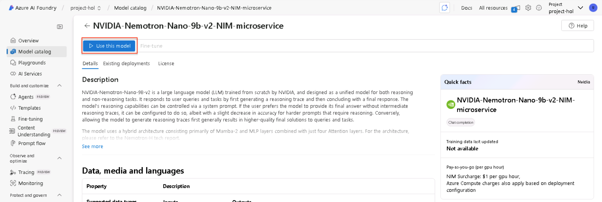
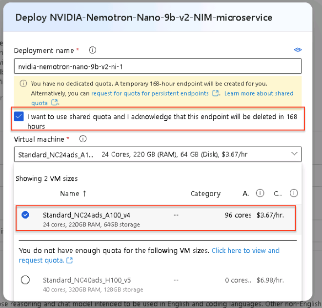
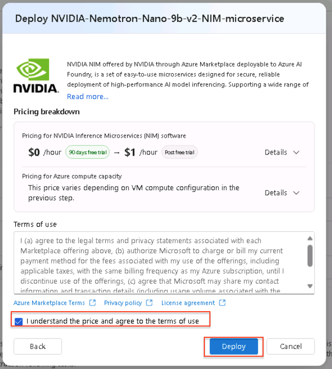
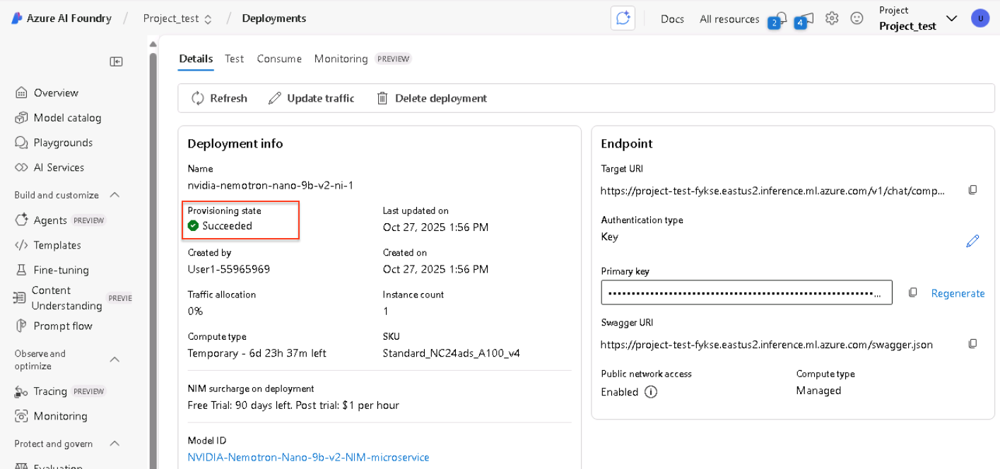
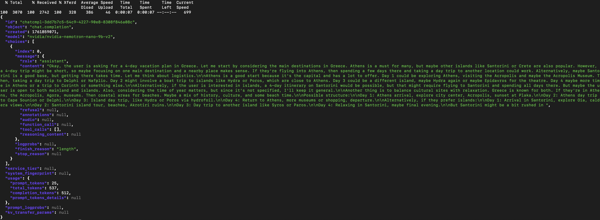

# Deploy NVIDIA NIM on  Azure AI Foundry

To learn more about NVIDIA NIM on  Azure AI Foundry: 
https://developer.nvidia.com/blog/accelerated-ai-inference-with-nvidia-nim-on-azure-ai-foundry/

## What you will learn

By the end of this workshop, you will have hands-on experience with:

  1. Creating an Azure AI Foundry Hub and Project
  2. Exploring the NVIDIA Collection of NIM microservices that are intergrated natively in Azure AI Foundry
  3. Deploying the NVIDIA Nemotron NIM on an Azure AI Foundry endpoint and how to use it


## Learn the Components

### **NVIDIA Cosmos Reason**

[NVIDIA Nemotron ](https://www.nvidia.com/en-us/ai-data-science/foundation-models/nemotron/)
 is a family of open models, datasets, and technologies that empower you to build efficient, accurate, and specialized agentic AI systems. Designed for advanced reasoning, coding, visual understanding, agentic tasks, safety, and information retrieval, Nemotron models are openly available and integrated across the AI ecosystem so they can be deployed anywhere—from edge to cloud.

### **NVIDIA NIM microservices**

[NVIDIA NIM](https://developer.nvidia.com/nim) are a set of easy-to-use
inference microservices for accelerating the deployment of foundation models
on any cloud or data center and helping to keep your data secure.

### **Azure AI Foundry**

[Azure AI Foundry](https://ai.azure.com/?cid=learnDocs&tid=43083d15-7273-40c1-b7db-39efd9ccc17a) is a unified Azure platform-as-a-service offering for enterprise AI operations, model builders, and application development. This foundation combines production-grade infrastructure with friendly interfaces, enabling developers to focus on building applications rather than managing infrastructure.


## What you need

To complete this lab, you need:

  * Access to a standard internet browser
  * Access to an Azure subscription with access to Azure GPU A100 


# Task 1: Create an Azure AI Foundry Hub

1. Go to the Azure AI Foundry homepage

Once you log in, click on the search bar, located at the top bar, type in "Azure AI Foundry" and click on the first result:


2. Create an Azure AI Foundry Hub Record

On the left hand side menu, click "AI Hubs"


3. Click "Create"


4. Select "Hub"


5.  Fill out the fields

Select the only available Resource group, provide a name for the resource (in this example, we used "nim-ai-foundry-hub", but you can use any unique value you want)


4. Review and Create

Click next in all tabs until you reach the "Review and Create" tab, then click "Create"

5. Verify Hub has been successfully created

    1. In the screen you're redirected to, confirm that all resources have been successfully deployed and there is a message "Your deployment is complete" at the top


    1. Go back to Azure AI Foundry and make sure you can see the newly created Hub, under the "AI Hubs" tab


# Task 2: Create an Azure AI Foundry Project

1. Create an Azure AI Foundry Project Record

On the left hand side menu, make sure you are under the "AI Hubs" tab


3. Click "Create"


4. Select "Project"


5.  Fill out the fields

Select the only available Resource group, provide a name for the resource (in this example, we used "nim-ai-foundry-project", but you can use any unique value you want), and select the "nim-ai-foundry-hub" record in the last field


6. Review and Create

Click next in all tabs until you reach the "Review and Create" tab, then click "Create"

7. Go to Azure AI Foundry Studio

Click "Go to Resource", and then click the "Launch Studio" button


# Task 3: Deploy a NIM in the Azure AI Foundry Portal

1. In the new tab that opens, select Model Catalog from the left sidebar menu.
In the Collections filter, type in and select NVIDIA to see all the NIM microservices that are available on Azure AI Foundry.


2. Select the NIM you want to use. This example uses the `NVIDIA Nemotron Nano 9b v2 NIM` microservice.

3. Click on the respective icon, and then click "Use this Model".




4. In the popup window that appears, tick the checkbox. Then choose "Standard_NC24ads_A100_v4" as the virtual machine (VM) type for your deployment. 

VM SKUs that are supported for the selected NIM and also specified within the model card will be preselected. 



Click "Next", tick the terms of use checkbox and click "Deploy"




# Task 4: Test the NVIDIA Nemotron NIM

Wait until the model has been fully deployed on the Azure AI Foundry endpoint:



1. Open a terminal, either on your laptop, or the Azure Cloud Shell

2. Copy and paste the command below (following the screenshots)

**You will need to replace** these 2 values, :

1. `<YOUR_URL>` with the value of the field "Target URI":


2. `<YOUR_PRIMARY_KEY>` with the value of the field "Primary Key"


```
curl -X 'POST' \
  <YOUR_URI> \
  -H 'accept: application/json' \
-H "Authorization: Bearer <YOUR_PRIMARY_KEY>" \
-H 'Content-Type: application/json' \
  -d '{
  "messages": [
    {
      "content": "/think",
      "role": "system"
    },
    {
      "content": "What should I do for a 4 day vacation in Greece?",
      "role": "user"
    }
  ],
  "model": "nvidia/nvidia-nemotron-nano-9b-v2",
  "max_tokens": 512,
  "top_p": 1,
  "n": 1,
  "stream": false,
  "frequency_penalty": 0.0
}' | jq
```


Output should like this:




> [note] If you want to test the API with **reasoning OFF**, replace "/think" with "/no_think" in the request


# Congratulations!
You've successfully deployed an NVIDIA NIM on Azure AI Foundry! Explore further by implementing RAG patterns with NIMs, experimenting with different GPU types, and scaling your deployments today. Happy modeling!

NVIDIA offers NIMs with enterprise support through our Azure Marketplace listing, [NVIDIA AI Enterprise](https://azuremarketplace.microsoft.com/en-us/marketplace/apps/nvidia.nvidia-ai-enterprise?tab=Overview).