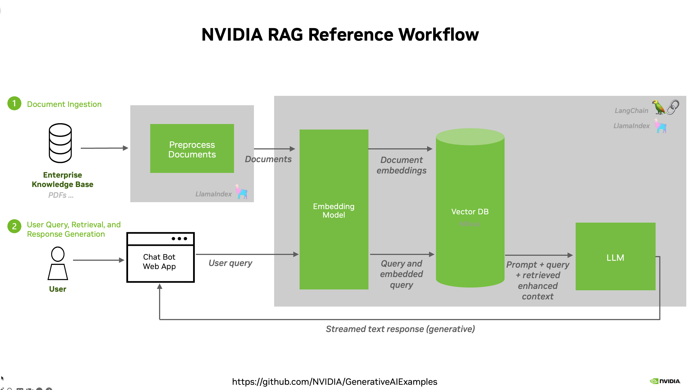
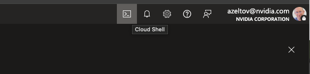
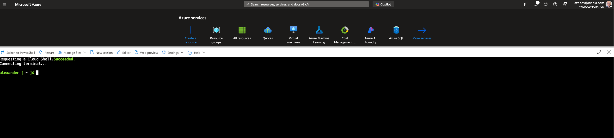
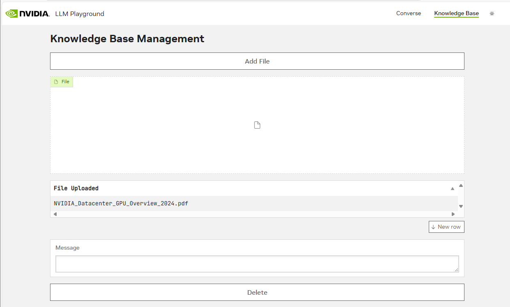
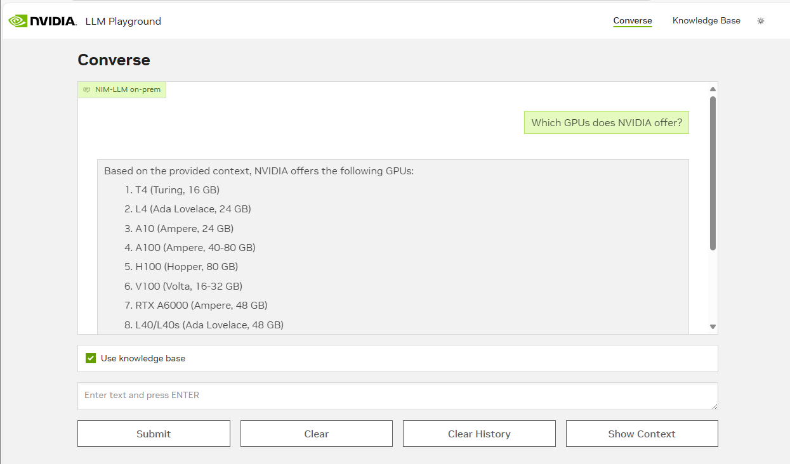

# Deploy RAG application using NVIDIA NIMs and NeMo Retriever on Azure Kubernetes Service Workshop

  * Diagram
  * Introduction
  * What you will learn
  * Learn the Components
  * Setup and Requirements
  * Task 1. Infrastructure Deployment
  * Task 2a. Configure NVIDIA NGC API Key
  * Task 2b. Install Nvidia GPU Operator
  * Task 3. Deploying NVIDIA NIM
  * Task 4. Deploying NeMo Retriever Embedding Microservice
  * Task 5. Deploying NeMo Retriever Ranking Microservice
  * Task 6. Deploying Milvus
  * Task 7. Deploying Chain Server & RAG Playground
  * Task 8. Access the RAG Playground Frontend Service
  * Congratulations!

## Diagram

## Introduction

This workshop will guide you through deploying a [Retrieval Augmented
Generation (RAG) text Q&A agent
microservice](https://catalog.ngc.nvidia.com/orgs/nvidia/teams/aiworkflows/helm-charts/rag-app-text-chatbot-langchain) on Azure Kubernetes Service (AKS).
You'll leverage the power of NVIDIA Inference Microservices (NIMs) and Nemo
LLM Retriever Embedding to build a robust question-answering system. This
system utilizes Milvus as the vector store to manage embeddings and generate
accurate responses to user queries.

This workshop is ideal for developers and data scientists interested in:

  * Building RAG applications: Learn how to construct a complete RAG pipeline using NVIDIA's pre-built microservices and open-source tools.
  * Optimizing LLM inference: Explore how to deploy and utilize TensorRT optimized LLMs for efficient inference within a microservice architecture.
  * Leveraging vector databases: Understand how to use Milvus to store and query embeddings for semantic search in a RAG workflow.

## What you will learn

By the end of this workshop, you will have hands-on experience with:

  1. Deploying a RAG pipeline on AKS: Learn to deploy a complete RAG pipeline, including LLM, embedding, and retriever microservices, onto your AKS cluster using NVIDIA NIMs.
  2. Integrating with Milvus vector database: Understand how to connect your RAG pipeline to a Milvus vector store for efficient storage and retrieval of embeddings.
  3. Utilizing the NVIDIA Langchain wrapper: Gain familiarity with the NVIDIA Langchain wrapper for seamless interaction with deployed NIMs.
  4. Managing and scaling your RAG deployment: Explore techniques for managing, monitoring, and scaling your RAG pipeline using Kubernetes features to ensure optimal performance and resource utilization.

## Learn the Components

### **GPUs in Azure Kubernetes Service (AKS)**

[GPUs](https://learn.microsoft.com/en-us/azure/virtual-machines/sizes/overview?tabs=breakdownseries%2Cgeneralsizelist%2Ccomputesizelist%2Cmemorysizelist%2Cstoragesizelist%2Cgpusizelist%2Cfpgasizelist%2Chpcsizelist#gpu-accelerated) let you accelerate specific
workloads running on your nodes such as machine learning and data processing.
AKS provides a range of machine type options for node configuration, including
machine types with [NVIDIA  A100, H100, H200
GPUs](https://learn.microsoft.com/en-us/azure/virtual-machines/sizes/overview?tabs=breakdownseries%2Cgeneralsizelist%2Ccomputesizelist%2Cmemorysizelist%2Cstoragesizelist%2Cgpusizelist%2Cfpgasizelist%2Chpcsizelist#gpu-accelerated).

### **NVIDIA NIMs**

[NVIDIA NIMs](https://www.nvidia.com/en-us/ai/) are a set of easy-to-use
inference microservices for accelerating the deployment of foundation models
on any cloud or data center and helping to keep your data secure.

### **NVIDIA NeMo Retriever Embedding & Reranker Microservice**

[NVIDIA NeMo Retriever](https://developer.nvidia.com/blog/develop-production-grade-text-retrieval-pipelines-for-rag-with-nvidia-nemo-retriever), part of
[NVIDIA NeMo](https://www.nvidia.com/en-us/ai-data-science/products/nemo/), is
a collection of generative AI microservices that enable organizations to
seamlessly connect custom models to diverse business data and deliver highly
accurate responses.

### **NVIDIA AI Enterprise**

[NVIDIA AI Enterprise](https://www.nvidia.com/en-us/data-center/products/ai-enterprise/) is an end-to-end, cloud-native software platform that accelerates
data science pipelines and streamlines development and deployment of
production-grade co-pilots and other generative AI applications. Available
through [Azure
Marketplace](https://azuremarketplace.microsoft.com/en-us/marketplace/apps/nvidia.nvidia-ai-enterprise?tab=overview).

### **Chain Server**

NVIDIA developed a chain server that communicates with the inference server.
The server also supports retrieving embeddings from the vector database before
submitting a query to the inference server to perform retrieval augmented
generation.

### **Vector Database**

The Chain Server supports connecting to either Milvus or pgvector. NVIDIA
provides a sample RAG pipeline that deploys Milvus to simplify demonstrating
the inference and embedding microservices.

### **RAG Playground**

The application provides a user interface for entering queries that are
answered by the inference microservice. The application also supports
uploading documents that the embedding microservice processes and stores as
embeddings in a vector database.

## Setup and Requirements


#### What you need

To complete this lab, you need:

  * Access to a standard internet browser (Chrome browser recommended).
  * Access to Azure subscription with access to Azure GPU A100 (minimum 3 GPUs , 4 GPUs if you want to run vector DB on GPU)
  * Time to complete the lab.


#### How to start your lab and sign in to the Azure Cloud Console


### Activate Cloud Shell

Cloud Shell is a virtual machine that is loaded with development tools. It
offers a persistent home directory and runs on the Azure Cloud. Cloud
Shell provides command-line access to your Azure Cloud resources.

In the Cloud Console, in the top right toolbar, click the **Activate Cloud
Shell** button.



It takes a few moments to provision and connect to the environment. 


`az` is the command-line tool for Azure Cloud. It comes pre-installed on
Cloud Shell and supports tab-completion.


## Task 1. Infrastructure Deployment

  1. Open **Cloud Shell** and install pre-reqs:

```
az extension add --name aks-preview
az extension update --name aks-preview
```

generate an rsa ssh key for using with aks cluster:
```
ssh-keygen -t rsa -b 4096 -C "yourid@companyname.com"
```

  2. Specify the following parameters

  ```
  export REGION=westeurope
  export RESOURCE_GROUP=rg-aks-rag
  export ZONE=2
  export CLUSTER_NAME=aksrag
  export CPU_COUNT=1
  ```
Create Azure Resource Group for this Lab
  ```
  az group create -l $REGION -n $RESOURCE_GROUP
  ```


  3. Create AKS Cluster
```    
az aks create -g  $RESOURCE_GROUP -n $CLUSTER_NAME --location $REGION --zones $ZONE --node-count $CPU_COUNT --enable-node-public-ip --ssh-key-value ~/.ssh/id_rsa.pub
```

Get Credentials:

```
az aks get-credentials --resource-group $RESOURCE_GROUP --name $CLUSTER_NAME
```

```
kubectl config get-contexts
```
You should see output like this:
```
alexander [ ~ ]$ kubectl config get-contexts
CURRENT   NAME     CLUSTER   AUTHINFO                                NAMESPACE
*         aksrag   aksrag    clusterUser_rg-azeltov-aks-rag_aksrag  
```

  4. Create GPU node pool . Minimum is needed 3 GPUs for this lab to work. 1 GPU for LLM , 1 for Embedding and 1 more for reranker service. Milvus Vector DB can run on CPU or GPU. IF you want to run milvus on GPU you will need the 4th GPU. You can spin up azure in 2 approaches: 

* 3 or 4 vm nodes of standard_nc24ads_a100_v4 ( standard_nc24ads_a100_v4 has 1 gpu)

        
      az aks nodepool add --resource-group $RESOURCE_GROUP --cluster-name $CLUSTER_NAME --name gpupool --node-count 3 --skip-gpu-driver-install --node-vm-size standard_nc24ads_a100_v4 --node-osdisk-size 2048 --max-pods 110
        

* 1 vm node of standard_nc96ads_a100_v4 ( standard_nc96ads_a100_v4 has 4 gpus) 

        
      az aks nodepool add --resource-group $RESOURCE_GROUP --cluster-name $CLUSTER_NAME --name gpupool --node-count 1 --skip-gpu-driver-install --node-vm-size standard_nc96ads_a100_v4 --node-osdisk-size 2048 --max-pods 110
        


Refer to azure pricing calculator for VM cost: [azure pricing calculator](https://azure.microsoft.com/en-us/pricing/calculator/?ef_id=_k_EAIaIQobChMIpL_K6YjViwMVTEn_AR2cHgc7EAAYASAAEgIcO_D_BwE_k_&OCID=AIDcmm5edswduu_SEM__k_EAIaIQobChMIpL_K6YjViwMVTEn_AR2cHgc7EAAYASAAEgIcO_D_BwE_k_&gad_source=1&gclid=EAIaIQobChMIpL_K6YjViwMVTEn_AR2cHgc7EAAYASAAEgIcO_D_BwE)

## Task 2a. Configure NVIDIA NGC API Key

The first step in the pipeline is to deploy an inference NIM - this will be
used to host the LLM that will be responsible for generating responses for a
given set of user queries. In order to get started with NIM, we’ll need to
make sure we have access to an [NGC API
key](https://org.ngc.nvidia.com/setup/api-key). We can export this key to be
used an environment variable:

    
```    
export NGC_CLI_API_KEY="<YOUR NGC API KEY>"
```

## Task 2b. Install Nvidia GPU Operator

Once your ASK cluster is configured with a GPU-enabled node pool, we can proceed with setting up the NVIDIA GPU Operator. This operator automates the deployment and lifecycle of all NVIDIA software components required to provision GPUs in the Kubernetes cluster. The NVIDIA GPU operator enables the infrastructure to support GPU workloads like LLM inference and embedding generation.

* Add the NVIDIA Helm repository:

``` 
helm repo add nvidia https://helm.ngc.nvidia.com/nvidia --pass-credentials && helm repo update
``` 
* Install the GPU Operator:
``` 
helm install --create-namespace --namespace gpu-operator nvidia/gpu-operator --wait --generate-name
```

* Validate install:
```
kubectl get pods -A -o wide
```

You should see output similar to the example below. Note that this is not the complete output, there should be additional pods running. The most important thing is to verify that the GPU Operator pods are in a `Running` state.

```
NAMESPACE     NAME                                                          READY   STATUS    RESTARTS   AGE   IP             NODE
gpu-operator  gpu-operator-xxxx-node-feature-discovery-gc-xxxxxxxxx         1/1     Running   0          40s   10.244.0.194   aks-nodepool1-xxxx
gpu-operator  gpu-operator-xxxx-node-feature-discovery-master-xxxxxxxxx     1/1     Running   0          40s   10.244.0.200   aks-nodepool1-xxxx
gpu-operator  gpu-operator-xxxx-node-feature-discovery-worker-xxxxxxxxx     1/1     Running   0          40s   10.244.0.190   aks-nodepool1-xxxx
gpu-operator  gpu-operator-xxxxxxxxxxxxxx                                   1/1     Running   0          40s   10.244.0.128   aks-nodepool1-xxxx
```

For additional guidance on setting up GPU node pools in AKS, refer to the [Microsoft Docs](https://learn.microsoft.com/en-us/azure/aks/gpu-cluster?tabs=add-ubuntu-gpu-node-pool).


## Task 3. Deploying NVIDIA NIM

  1. Open **Cloud Shell**

  2. Fetch the NIM LLM Helm chart  
    Now that we've configured the NGC API key, we can download the NIM LLM Helm chart from NGC using the following command:

        ```
        helm fetch https://helm.ngc.nvidia.com/nim/charts/nim-llm-1.1.2.tgz --username='$oauthtoken' --password=$NGC_CLI_API_KEY
        ```
        

  3. Create a NIM Namespace  
    Namespaces are used to manage resources for a specific service or set of services in kubernetes. It’s best practice to ensure all the resources for a given service are managed in its corresponding namespace. We will set up the namespaces for the other corresponding services in later steps, but we create a namespace for our NIM service using the following kubectl command:

      ```
      # create namespace
      kubectl create namespace nim
      ```
        

  4. Configure secrets  
    In order to configure and launch an NVIDIA NIM, it is important to configure the secrets we’ll need to pull all the model artifacts directly from NGC. This can be done using your NGC API key:

      ```
      kubectl create secret docker-registry registry-secret --docker-server=nvcr.io --docker-username='$oauthtoken'     --docker-password=$NGC_CLI_API_KEY -n nim
      kubectl create secret generic ngc-api --from-literal=NGC_API_KEY=$NGC_CLI_API_KEY -n nim
      ```
            

5. Setup NIM Configuration  
  We deploy the LLama 3 8B instruct NIM for this exercise. In order to configure our NIM, we create a custom value file where we configure the deployment:
    ```    
    # create nim_custom_value.yaml manifest
    cat <<EOF > nim_custom_value.yaml
    image:
      repository: "nvcr.io/nim/meta/llama3-8b-instruct" # container location
      tag: 1.0.0 # NIM version you want to deploy
    model:
      ngcAPISecret: ngc-api  # name of a secret in the cluster that includes a key named NGC_CLI_API_KEY and is an NGC API key
    persistence:
      enabled: true
    imagePullSecrets:
      - name: registry-secret # name of a secret used to pull nvcr.io images, see https://kubernetes.io/docs/tasks/    configure-pod-container/pull-image-private-registry/
    EOF
    ```    


6. Launching NIM deployment  
    Now we can deploy our NIM microservice to the namespace we created:

    ```     
    helm install my-nim nim-llm-1.1.2.tgz -f nim_custom_value.yaml --namespace nim
    ``` 

    Verify NIM pod is running:

    ``` 
    kubectl get pods -n nim
    ``` 
  7. Testing NIM deployment  
    Once we’ve verified that our NIM service was deployed successfully. We can make inference requests to see what type of feedback we’ll receive from the NIM service. In order to do this, we enable port forwarding on the service to be able to access the NIM from our localhost on port 8000:
    

        ``` 
        kubectl port-forward service/my-nim-nim-llm 8000:8000 -n nim
        ``` 
        Next, we can open another terminal or tab in the cloud shell and try the
        following request:

        ```     
        curl -X 'POST' \
        'http://localhost:8000/v1/chat/completions' \
        -H 'accept: application/json' \
        -H 'Content-Type: application/json' \
        -d '{
        "messages": [
            {
            "content": "You are a polite and respectful chatbot helping people plan a vacation.",
            "role": "system"
            },
            {
            "content": "What should I do for a 4 day vacation in Spain?",
            "role": "user"
            }
        ],
        "model": "meta/llama3-8b-instruct",
        "max_tokens": 512,
        "top_p": 1,
        "n": 1,
        "stream": false,
        "frequency_penalty": 0.0
        }'
        ``` 


        If you get a chat completion from the NIM service, that means the service is
        working as expected! From here, we can move on to deploying the NeMo Retriever
        service.

## Task 4. Deploying NeMo Retriever Embedding Microservice

  1. Fetch NeMo Retriever Embedding Helm Chart  
  The NeMo Retriever microservice can be installed via Helm. As a starting point we can fetch the Helm chart, assuming we still leverage the NGC API Key we configured earlier:
        ```
        helm fetch https://helm.ngc.nvidia.com/nim/nvidia/charts/text-embedding-nim-1.2.0.tgz --username='$oauthtoken'     --password=$NGC_CLI_API_KEY
        ```


  2. Create NeMo Retriever Namespace  
  We create the NeMo Retriever namespace to manage all the kubernetes related resource for the microservice:
        ```   
        kubectl create namespace nrem
        ```

  3. Creating Secrets  
  We need to configure image pull secrets and NGC secrets to enable the pulling of model artifacts from NGC and the NVCR registry. In the next following steps, we configure these secrets using the API key we set as a prerequisite:
    
        ```    
        DOCKER_CONFIG='{"auths":{"nvcr.io":{"username":"$oauthtoken", "password":"'${NGC_CLI_API_KEY}'" }}}'
        echo -n $DOCKER_CONFIG | base64 -w0
        NGC_REGISTRY_PASSWORD=$(echo -n $DOCKER_CONFIG | base64 -w0 )
        ```
        ``` 
        # build imagepull.yaml file
        cat <<EOF > imagepull.yaml
        apiVersion: v1
        kind: Secret
        metadata:
          name: nvcrimagepullsecret
        type: kubernetes.io/dockerconfigjson
        data:
          .dockerconfigjson: ${NGC_REGISTRY_PASSWORD}
        EOF
        ```
        ``` 
        # build ngc cli api secrets manifest
        cat <<EOF > ngc-cli.yaml
        apiVersion: v1
        kind: Secret
        metadata:
          name: ngc-api
        type: Opaque
        data:
          NGC_API_KEY: $(echo -n $NGC_CLI_API_KEY | base64 -w0 )
        EOF
        ```
        ``` 
        # apply manifests and create secrets 
        kubectl apply -n nrem -f imagepull.yaml
        kubectl apply -n nrem -f ngc-cli.yaml
        ```


  4. Install the Helm Chart for Nemo Retriever  
  Embedding Microservice Now that we’ve configured the secrets we need to pull artifacts from NGC, we can deploy the NeMo retriever microservice via Helm. In this case, we deploy the service using the NVIDIA Retrieval QA E5 Embedding v5 NIM:
        ```    
        helm upgrade --install \
        --namespace nrem \
        --set image.repository=nvcr.io/nim/nvidia/nv-embedqa-e5-v5 \
        --set image.tag=1.1.0 \
        nemo-embedder \
        text-embedding-nim-1.2.0.tgz
        ```

Ensure all of the pods are in a running state:

```
kubectl get pods -n nrem
```
The output should be similar to the following:

    
        NAME                                          READY   STATUS    RESTARTS   AGE
    nemo-embedder-text-embedding-nim-0   1/1     Running   0          10m


Once we’ve verified the pods are running. We can test by enabling port
forwarding on the service to be able to access from our localhost:

```
kubectl port-forward -n nrem service/nemo-embedder-text-embedding-nim 8000:8000
```


Next, we can open another terminal or tab in the cloud shell and try the
following request:

    
        curl -X 'POST'   'http://localhost:8000/v1/embeddings'   -H 'accept: application/json'   -H 'Content-Type: application/json'       -d '{
        "input": "hello world",
        "model": "nvidia/nv-embedqa-e5-v5",
        "input_type": "passage"
      }'


We should receive an embedding vector as output from the cURL command. Once
we’ve verified that we’re able to ping the service, ctrl + c to stop port
forwarding. From here, we can move on to setting up the Milvus microservice.

## Task 5. Deploying NeMo Retriever Ranking Microservice

In this section, we will deploy the NeMo Retriever Ranking microservice. In
the previous section, we built the namespace and secrets we’ll need to run
this service! We just have to fetch the Helm chart from NGC and install it in
our current workspace.

  1. Fetch NeMo Retriever Reranking Helm Chart

The NeMo Retriever microservice can be installed via Helm. As a starting point
we can fetch the Helm chart, assuming we still leverage the NGC API Key we
configured earlier:

```
helm fetch https://helm.ngc.nvidia.com/nim/nvidia/charts/text-reranking-nim-1.3.0.tgz --username='$oauthtoken'     --password=$NGC_CLI_API_KEY
```

  2. Configure secrets

We need to configure the secrets we’ll need to pull all the model artifacts
directly from NGC. This can be done using your NGC API key:

```
kubectl create secret -n nrem docker-registry ngc-secret --docker-server=nvcr.io --docker-username='$oauthtoken'     --docker-password=$NGC_CLI_API_KEY
```

  3. Install the Helm Chart for Nemo Retriever Ranking Microservice

Now that we’ve been able to fetch the Helm chart, we can deploy the
microservice by running the following command:

    
    helm upgrade --install \
      --namespace nrem \
      --set image.repository=nvcr.io/nim/nvidia/llama-3.2-nv-rerankqa-1b-v2 \
      --set image.tag=1.3.1 \
      nemo-ranker \
      text-reranking-nim-1.3.0.tgz 


We can verify the pods status by running the command below:

    
    kubectl get pods -n nrem


The output should be similar to the following:

    
        NAME              READY   STATUS    RESTARTS   AGE
    nemo-ranker-text-reranking-nim-5f457975b6-tsxzz   1/1     Running   0          8m44s

Once we’ve verified the pods are running. We can test by enabling port
forwarding on the service to be able to access from our localhost:

    
        kubectl port-forward -n nrem service/nemo-ranker-text-reranking-nim 8000:8000


Next, we can open another terminal or tab in the cloud shell and try the
following request:

    
    curl -X 'POST' \
      'http://localhost:8000/v1/ranking' \
      -H 'accept: application/json' \
      -H 'Content-Type: application/json' \
      -d '{
        "query": {"text": "which way should i go?"},
        "model": "nvidia/llama-3.2-nv-rerankqa-1b-v2",
        "passages": [
          {
            "text": "two roads diverged in a yellow wood, and sorry i could not travel both and be one traveler, long i stood and     looked down one as far as i could to where it bent in the undergrowth;"
          },
          {
            "text": "then took the other, as just as fair, and having perhaps the better claim because it was grassy and wanted     wear, though as for that the passing there had worn them really about the same,"
          },
          {
            "text": "and both that morning equally lay in leaves no step had trodden black. oh, i marked the first for another     day! yet knowing how way leads on to way i doubted if i should ever come back."
          }
        ]
      }'


## Task 6. Deploying Milvus

The RAG application will leverage Milvus as the vector store - we’ll be
storing any embeddings generated for retrieval purposes in this vector store.
When we enable use of the knowledge base, the users query will be vectorized
using the embedding NIM and contents semantically similar will be retrieved
and injected as context into the inference NIM to improve the quality of the
generated output.

  1. **Create the Milvus Namespace**  
  In order to get started with the Milvus service, we create a namespace that
  will be used to manage resources specific to the microservice:
      ```
      kubectl create namespace vectorstore
      ```


  2. **Add the Milvus Repository**

The Milvus microservice can be installed and managed via Helm charts. We can
add the Helm repo by running the following:

    
    helm repo add milvus https://zilliztech.github.io/milvus-helm/


And then updating the repository:

    
    helm repo update


  3. **Optional!!! Create Custom File to Utilize GPUs**

In order to leverage the Milvus microservice, we'll need to ensure that we
have access to at least one GPU resource. We can configure a file with custom
values, to request a GPU for the service:

    
        cat <<EOF > milvus_custom_value.yaml
    standalone:
      resources:
        requests:
          nvidia.com/gpu: "1"
        limits:
          nvidia.com/gpu: "1"
    EOF


  4. **Install Milvus Helm Chart**

From here, we can install the Milvus Helm Chart and point to the file we
created in the previous section:

If Milvus is GPU enabled:

    helm install milvus milvus/milvus --set cluster.enabled=false --set etcd.replicaCount=1 --set minio.mode=standalone --set     pulsar.enabled=false -f milvus_custom_value.yaml -n vectorstore

Otherwise: 

    helm install milvus milvus/milvus --set cluster.enabled=false --set etcd.replicaCount=1 --set minio.mode=standalone --set     pulsar.enabled=false  -n vectorstore


We can check the status of the pods, which should all be **up and running** in
a **Ready** state within a couple of minutes:

    
    kubectl get pods -n vectorstore


Output should look like the following:

    
        NAME                                READY   STATUS    RESTARTS        AGE
    milvus-etcd-0                       1/1     Running   0               5m34s
    milvus-minio-76f9d647d5-44799       1/1     Running   0               5m34s
    milvus-standalone-9ccf56df4-m4tpm   1/1     Running   3 (4m35s ago)   5m34


## Task 7. Deploying Chain Server & RAG Playground

Now that we’ve deployed all the prerequisite services, we can deploy the chain
server and RAG playground services.

  1. **Create the Chain Server & RAG Playground Namespace**

We can create a namespace for the chain server and RAG playground using the
following command:

    
    kubectl create namespace canonical-rag-langchain


  2. **Installing the Helm Pipeline**

Both the chain server and RAG playground can be installed via Helm.  
First we fetch the Helm chart from NGC using our API key:

    
        helm fetch https://helm.ngc.nvidia.com/nvidia/aiworkflows/charts/rag-app-text-chatbot-langchain-24.08.tgz     --username='$oauthtoken' --password=$NGC_CLI_API_KEY


Once fetched, we can install the Helm pipeline by running the following:

    
        helm install canonical-rag-langchain rag-app-text-chatbot-langchain-24.08.tgz -n canonical-rag-langchain --set imagePullSecret.password=$NGC_CLI_API_KEY


**************
 ## Need to change the chain-server to point to exposed fqdn service names:
```
kubectl get svc -n nim

NAME                 TYPE        CLUSTER-IP     EXTERNAL-IP   PORT(S)    AGE
my-nim-nim-llm       ClusterIP   10.0.223.195   <none>        8000/TCP   100m
my-nim-nim-llm-sts   ClusterIP   None           <none>        8000/TCP   100m

```

```
kubectl get svc -n nrem
 

kubectl set env deployment/chain-server \
  APP_LLM_SERVERURL=my-nim-nim-llm.nim.svc.cluster.local:8000 \
  -n canonical-rag-langchain

kubectl set env deployment/chain-server \
  APP_EMBEDDINGS_SERVERURL=nemo-embedder-text-embedding-nim.nrem.svc.cluster.local:8000 \
  -n canonical-rag-langchain

 kubectl rollout restart deployment chain-server -n canonical-rag-langchain  
```


**************


We can check the status of the pods, which should all be **up and running** in
a **Ready** state within a couple of minutes:

    
        kubectl get pods -n canonical-rag-langchain


Output should look like the following:

```    
        NAME                              READY   STATUS    RESTARTS   AGE
    chain-server-748bb5c5ff-58cw7     1/1     Running   0          71s
    rag-playground-855c7b9f65-qv42k   1/1     Running   0          71s
```


To troubleshoot:
```
kubectl logs  chain-server-748bb5c5ff-58cw7 -n canonical-rag-langchain
```


## Task 8. Access the RAG Playground Frontend Service

The RAG Playground service exposes a UI that enables interaction with the end
to end RAG pipeline. A user submits a prompt or a request and this triggers
the chain server to communicate with all the necessary services required to
generate output.  
We need to take a few steps in order to access the service.

  1. **Understanding Service Types**

The service type that’s been configured for the RAG playground is a `NodePort`
service type. With this service, kubernetes exposes applications to external
clients via specific ports on worker nodes.  
Given the exposure via ports on worker nodes, this service type is used purely
just for demo purposes and is **NOT** recommended for production workloads for
security related reasons.  
For more secure approaches, we recommend configuring services using
`ClusterIP` or `LoadBalancer` types.

We can verify the service types for the RAG playground by running the
following command:

    
        kubectl get svc -n canonical-rag-langchain


  2. **Accessing the Frontend Service**

In order to access the `NodePort` service, we need to configure a firewall
rule to allow TCP traffic on your node port. In order to do this, we need to
find the node port our applications are exposed on.  
We can do this using the following command:

    
    kubectl get service rag-playground --output yaml -n canonical-rag-langchain


Output should look like the following:

    
```
apiVersion: v1
kind: Service
metadata:
  annotations:
    meta.helm.sh/release-name: canonical-rag-langchain
    meta.helm.sh/release-namespace: canonical-rag-langchain
  creationTimestamp: "2025-02-20T20:49:37Z"
  labels:
    app.kubernetes.io/managed-by: Helm
  name: rag-playground
  namespace: canonical-rag-langchain
  resourceVersion: "22251"
  uid: 4913d960-be3f-4467-bd10-117133041fc8
spec:
  clusterIP: 10.0.76.185
  clusterIPs:
  - 10.0.76.185
  externalTrafficPolicy: Cluster
  internalTrafficPolicy: Cluster
  ipFamilies:
  - IPv4
  ipFamilyPolicy: SingleStack
  ports:
  - name: http
    nodePort: 30212
    port: 3001
    protocol: TCP
    targetPort: http
  selector:
    app.kubernetes.io/name: rag-playground
```


In this example, the node port the application is exposed on is **30212** ,
but this will be different depending on the application.

Using this node port value, we create a firewall to enable TCP traffic using
the following command:

_Note: Replace`30212` from the command below, with the nodePort value from
the previous command_

```
   az network nsg rule create \
  --resource-group MC_rg-azeltov-aks-rag_aksrag_westeurope \
  --nsg-name aks-agentpool-10268696-nsg \
  --name allow-nodeport \
  --priority 100 \
  --direction Inbound \
  --access Allow \
  --protocol Tcp \
  --destination-port-ranges 30212
```


With this the azure network nsg rules has been configured. In addition, we need the external
IP address of one of the nodes in the cluster. This can be done using the
following command:

```    
# get information on nodes in the cluster
kubectl get nodes --output wide
```


This output should yield information regarding the list of current nodes in
the cluster.  
Each node may come configured with an internal and external IP address. To
access the application, we get the external IP address the RAG playground
service is running on.

With both the external IP address and exposed node port, we can access the
frontend service in our browser using the following address:
`NODE_IP_ADDRESS:NODE_PORT/converse`.

From here, we should be able to interact with the service and get some outputs
from the LLM.

## Congratulations!

Congratulations! You've successfully deployed a RAG text Q&A agent microservice on Azure AKS using NVIDIA Inference Microservices. To validate that the system is working as expected, try uploading your own document and asking questions about its content. As a next step, you can begin exploring improvements like experimenting with different LLMs, fine-tuning the embedding model, or scaling the deployment for increased performance and availability.





NVIDIA offers NIMs with enterprise support through our Azure Marketplace
listing, [NVIDIA AI
Enterprise](https://azuremarketplace.microsoft.com/en-us/marketplace/apps/nvidia.nvidia-ai-enterprise?tab=overview).


### Learn More

Be sure to check out the following articles for more information:

  * [Azure Kubernetes Service (AKS)](https://azure.microsoft.com/en-us/products/kubernetes-service)
  * [NVIDIA GPUs](https://learn.microsoft.com/en-us/azure/virtual-machines/sizes/overview?tabs=breakdownseries%2Cgeneralsizelist%2Ccomputesizelist%2Cmemorysizelist%2Cstoragesizelist%2Cgpusizelist%2Cfpgasizelist%2Chpcsizelist#gpu-accelerated)
  * [NVIDIA AI Enterprise](https://console.cloud.Azure.com/marketplace/product/nvidia/nvidia-ai-enterprise-vmi)
  * [NVIDIA NIMs](https://www.nvidia.com/en-us/ai/)


