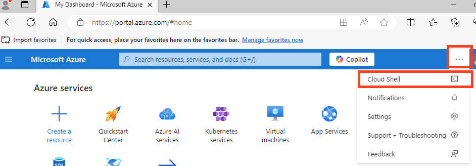

# Overview

The NVIDIA RAG blueprint serves as a reference solution for a foundational Retrieval Augmented Generation (RAG) pipeline.
One of the key use cases in Generative AI is enabling users to ask questions and receive answers based on their enterprise data corpus.
This blueprint demonstrates how to set up a RAG solution that uses NVIDIA NIM and GPU-accelerated components.


## Key Features

- Multimodal PDF data extraction support with text, tables, charts, and infographics
- Support for audio file ingestion
- Native Python library support
- Custom metadata support
- Multi-collection searchability
- Opt-in for Vision Language Model (VLM) Support in the answer generation pipeline.
- Document summarization
- Hybrid search with dense and sparse search
- Opt-in image captioning with vision language models (VLMs)
- Reranking to further improve accuracy
- GPU-accelerated Index creation and search
- Multi-turn conversations
- Multi-session support
- Telemetry and observability
- Improve accuracy with optional reflection
- Improve content safety with an optional programmable guardrails to
- Sample user interface
- OpenAI-compatible APIs
- Decomposable and customizable

## What you will learn

By the end of this workshop, you will have hands-on experience with:
1. Deploying a RAG pipeline on AKS: Learn to deploy a complete RAG pipeline, including LLM, embedding, and retriever microservices, onto your AKS cluster using NVIDIA NIM microservices
2. Integrating with Milvus vector database: Understand how to connect your RAG pipeline to a Milvus vector store for efficient storage and retrieval of embeddings.
3. Utilizing the NVIDIA Langchain wrapper: Gain familiarity with the NVIDIA Langchain wrapper for seamless interaction with deployed NIM.
4. Managing and scaling your RAG deployment: Explore techniques for managing, monitoring, and scaling your RAG pipeline using Kubernetes features to ensure optimal performance and resource utilization.

## Learn the Components
### **NVIDIA RAG Blueprint**
A production-ready Retrieval Augmented Generation pipeline that enables Q&A over your documents. Includes document ingestion, embedding, vector search, reranking, and LLM-powered response generation with citations.

### **NVIDIA NIM Microservices**
[NVIDIA NIM](https://developer.nvidia.com/nim) are a set of easy-to-use
inference microservices for accelerating the deployment of foundation models on any cloud or data center and helping to keep your data secure.

# Prerequisites 

- NVIDIA Account and API Key (follow [these instructions](https://nvdam.widen.net/s/tvgjgxrspd/create-build-account-and-api-key) to create an account and generate an API Key)


### Hardware Requirements

The infrastructure provisioning script will automatically create an Azure Kubernetes Service (AKS) cluster with the following resources in the specified region. Ensure your Azure subscription has sufficient quotas for these resources.

* **Cluster Management Node Pool**:
  * **Machine Type**: `Standard_D32s_v5`
  * **Quantity**: 2 nodes (default for control/management)
* **GPU Worker Node Pool**:
  * **Machine Type**: `Standard_NC96ads_A100_v4`
  * **Quantity**: 1 nodes
  * **GPUs per node**: 4 x **NVIDIA A100** (80GB)

You may adjust node counts and machine types in the environment variables to fit your workload and quota limits.


# Task 1: Environment Configuration

### 1. Install AKS Preview extension

1. Open Cloud Shell

Once you log in, click on the Cloud Shell button, located at the top bar:


(Note: if it's not visible, click on the 3 dots):



2. When asked, select "Bash"


3. When asked, select "No Storage", the preferred subscription, and click "Apply"


4. Run the below commands:

```bash
az extension add --name aks-preview
az extension update --name aks-preview
```

### 2. Configure NVIDIA API Key

As part of the RAG blueprint several NVIDIA NIM will be deployed. In order to get started with NIM, we'll need to make sure we have access to an [NVIDIA API key](https://build.nvidia.com/settings/api-keys). We can export this key to be used as an environment variable:

```bash
export NGC_API_KEY="<YOUR NGC API KEY>"
```

### 3. Set up environment variables

```bash
export REGION=<PREFERRED_AZURE_REGION>
export RESOURCE_GROUP=<RG-GROUP-NAME>
export CLUSTER_NAME=rag-demo 
export CLUSTER_MACHINE_TYPE=Standard_D32s_v5
export NODE_POOL_MACHINE_TYPE=standard_nc96ads_a100_v4
export NODE_COUNT=1
export CPU_COUNT=2
export CHART_NAME=rag-chart
export NAMESPACE=rag
```

### 4. Create a Resource Group

```bash
az group create -l $REGION -n $RESOURCE_GROUP
```

### 5. Create AKS cluster

```bash
az aks create -g $RESOURCE_GROUP \
    -n $CLUSTER_NAME \
    --location $REGION \
    --node-count $CPU_COUNT \
    --node-vm-size $CLUSTER_MACHINE_TYPE \
    --enable-node-public-ip \
    --generate-ssh-keys
```

### 6. Get AKS cluster credentials

```bash
az aks get-credentials --resource-group $RESOURCE_GROUP --name $CLUSTER_NAME
```

### 7. Create node pool

```bash
az aks nodepool add --resource-group $RESOURCE_GROUP \
    --cluster-name $CLUSTER_NAME \
    --name gpupool \
    --node-count $NODE_COUNT \
    --gpu-driver none \
    --node-vm-size $NODE_POOL_MACHINE_TYPE \
    --node-osdisk-size 2048 \
    --max-pods 110
```

# Task 2: NVIDIA GPU Operator Installation

### 1. Add the NVIDIA Helm repository

```bash
helm repo add nvidia https://helm.ngc.nvidia.com/nvidia --pass-credentials && helm repo update
```

### 2. Install the GPU Operator

```bash
helm install --create-namespace --namespace gpu-operator nvidia/gpu-operator --wait --generate-name
```

### 3. Validate the installation 

```bash
kubectl get pods -A -o wide
```

We need to wait until all pods are in "Running" status and their "Ready" column shows all pods ready (e.g. 1/1, 2/2 etc.)

# Task 3: NVIDIA Blueprint Deployment

### 1. Install the RAG blueprint Helm chart

Ensure that all pods from the previous command, are in "Running" status and their "Ready" column shows all pods ready (e.g. 1/1, 2/2 etc.)


Note: in order to save GPU resources, we will be deploying the text-only ingestion blueprint.

```bash
helm upgrade --install rag --create-namespace --namespace $NAMESPACE https://helm.ngc.nvidia.com/nvidia/blueprint/charts/nvidia-blueprint-rag-v2.3.0.tgz \
--set imagePullSecret.password=$NGC_API_KEY \
--set ngcApiSecret.password=$NGC_API_KEY \
--set nim-llm.resources.limits."nvidia\.com/gpu"=2 \
--set nim-llm.resources.requests."nvidia\.com/gpu"=2 \
--set nv-ingest.milvus.image.all.repository=docker.io/milvusdb/milvus \
--set nv-ingest.milvus.image.tools.repository=docker.io/milvusdb/milvus-config-tool \
--set nv-ingest.milvus.standalone.resources.limits."nvidia\.com/gpu"=0 \
--set nv-ingest.milvus.standalone.resources.requests."nvidia\.com/gpu"=0 \
--set nv-ingest.milvus.minio.image.repository=docker.io/minio/minio \
--set ingestor-server.envVars.APP_VECTORSTORE_ENABLEGPUINDEX=False \
--set ingestor-server.envVars.APP_VECTORSTORE_ENABLEGPUSEARCH=False \
--set nv-ingest.nemoretriever-graphic-elements-v1.deployed=false \
--set nv-ingest.nemoretriever-table-structure-v1.deployed=false \
--set nv-ingest.paddleocr-nim.deployed=false \
--set nv-ingest.nemoretriever-ocr.deployed=false \
--set nvidia-nim-llama-32-nv-rerankqa-1b-v2.enabled=false \
--set frontend.service.type=LoadBalancer \
--set ingestor-server.envVars.APP_NVINGEST_EXTRACTTEXT=True \
--set ingestor-server.envVars.APP_NVINGEST_EXTRACTINFOGRAPHICS=False \
--set ingestor-server.envVars.APP_NVINGEST_EXTRACTTABLES=False \
--set ingestor-server.envVars.APP_NVINGEST_EXTRACTCHARTS=False 
```

### 3. Verify that the PODs are running

```bash
kubectl get pods -n $NAMESPACE
```

### **IT CAN TAKE UP TO 20 mins ** for all services to come up. You can continue on next steps in the meantime while you wait. When all services start , it should look like this:
```
user1-54803080 [ ~ ]$ kubectl get pods -n $NAMESPACE
NAME                                                        READY   STATUS    RESTARTS        AGE
ingestor-server-c5f5fd5c7-fmdgm                             1/1     Running   0               13m
milvus-standalone-594df6565-mzzpm                           1/1     Running   5 (8m11s ago)   13m
rag-etcd-0                                                  1/1     Running   0               13m
rag-frontend-547bc85495-svhzm                               1/1     Running   0               13m
rag-minio-f88fb7fd4-2h4sv                                   1/1     Running   0               13m
rag-nim-llm-0																								1/1     Running   0               13m
rag-nv-ingest-795cbb7bfd-b7zql                              1/1     Running   0               13m
rag-nvidia-nim-llama-32-nv-embedqa-1b-v2-576fdc44bb-hmx6j   1/1     Running   0               13m
rag-redis-master-0                                          1/1     Running   0               13m
rag-redis-replicas-0                                        1/1     Running   4 (115s ago)    13m
rag-server-64dd5c74c9-zclj9                                 1/1     Running   0               13m
```


# Task 4: Access the RAG Frontend Service

The RAG Playground service exposes a UI that enables interaction with the end to end RAG pipeline. A user submits a prompt or a request and this triggers the chain server to communicate with all the necessary services required to generate output.

We need to take a few steps in order to access the service.

### 1. Accessing the Frontend Service

In order to access the UI, we need to expose an external load balancer service to allow TCP traffic to the service that is running our front end.

We can do this using the following command:

```bash
kubectl -n $NAMESPACE expose deployment rag-frontend --name=rag-frontend-lb --type=LoadBalancer --port=80 --target-port=3000
```

To access the UI of the application, we get the external IP address of the front end load balancer service:

```bash
kubectl -n $NAMESPACE get svc rag-frontend-lb
```

Output should look like this:
```
user1-54803080 [ ~ ]$ kubectl -n $NAMESPACE get svc rag-frontend-lb -w
NAME              TYPE           CLUSTER-IP   EXTERNAL-IP       PORT(S)        AGE
rag-frontend-lb   LoadBalancer   10.0.XX.XX   XX.XX.XX.XX   80:30977/TCP   14s
```

### Before using the RAG app. Verify that all PODs are running:

```bash
kubectl get pods -n $NAMESPACE
```

Open your browser and navigate to: http://EXTERNAL-IP-FROM-YOUR-CLI-RESULT-ABOVE

From here, we should be able to interact with the service and get some outputs from the LLM.

It should look like this:


### 3. Testing the RAG Blueprint

In order to test the RAG capabilities of this application, we need to upload a document:

* Click new collection at the bottom left corner and give it a name
* Upload a Document by clicking in the square under "Source Files", selecting a PDF or text file and clicking "Create Collection"
    - Here is an [ example document that talks about the NVIDIA Nemotron 3 family of models](https://research.nvidia.com/labs/nemotron/files/NVIDIA-Nemotron-3-White-Paper.pdf)


* Wait for "Collection Created successfully" notification


* Close the prompt window, and click the "Test_Collection" checkbox on the left:


### 4. Test Nemotron Thinking Capabilities

Try these example prompts to see the advanced reasoning:

* Basic Q&A:

	"What are the main topics covered in this document?"


* Analysis Request:

	"Analyze the key arguments presented and identify any potential weaknesses or gaps."


* Complex Reasoning:

	"Based on the information in this document, what implications does this have for [relevant topic]? Please consider multiple perspectives."