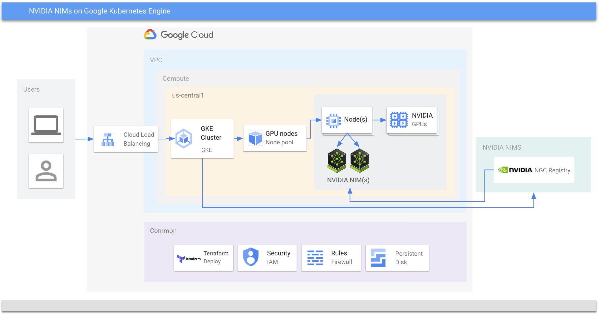

# NVIDIA NIMs on GKE

This repository sets up a GKE cluster with node pools equipped with NVIDIA GPUs for hosting NIMs and carrying out inference. Meta's [llama3-8b-instruct NIM](https://build.nvidia.com/meta/llama3-8b) serves as a demonstration model in this instance. The repository references the NVIDIA-provided [helm charts](https://github.com/NVIDIA/nim-deploy/tree/main/helm).

NOTE: Try out NIM integrated as ready to deploy solution on GKE [here](https://console.cloud.google.com/marketplace/product/nvidia/nvidia-nim)

## Table of Contents

- [Introduction to NVIDIA NIM](#introduction-to-nvidia-nim)
- [Setup](#setup)
  - [Prerequisites](#prerequisites)
  - [Steps](#steps)
    - [NVIDIA H100 (MEGA - 80GB) for A3 machine series](#nvidia-h100-mega-80gb-for-a3-machine-series)
    - [NVIDIA A100 (80GB) for A2 machine series](#nvidia-a100-80gb-for-a2-machine-series)
    - [NVIDIA L4 for G2 machine series](#nvidia-l4-for-g2-machine-series)
    - [Optional](#optional)
- [Inference](#inference)
  - [Health check](#health-check)
  - [Confirm models](#confirm-models)
  - [Run inference](#sample-inference)
- [Performance](#performance)
  - [Setup GenAI-Perf](#setup-genai-perf)
  - [Run test](#run-test)
  - [Results](#results)
- [Teardown](#sample-inference)
- [LICENSE](#license)

## Introduction to NVIDIA NIM

NVIDIA NIM™ — inference microservices provide models as optimized containers that can be deployed in a Cloud environment like Google Cloud to easily build generative AI applications.

> [!IMPORTANT]
> Before you proceed further, ensure you have the NVIDIA AI Enterprise License (NVAIE) to access the NIMs. To get started, go to [build.nvidia.com](https://build.nvidia.com/explore/discover?signin=true) and provide your company email address.

## Setup

The repo provisions the below infrastructure and software resources:

- VPC network with a subnet
- GKE cluster with 2 node pools
  - CPU node pool
  - GPU node pool attached with NVIDIA GPU(s)
- Kubernetes secrets
- Helm chart deploy of llama3-8b-instruct NIM

[](HighLevelArch)

### Prerequisites

1. [Google Cloud Project](https://console.cloud.google.com) with billing enabled
2. [gcloud CLI](https://cloud.google.com/sdk/docs/install)
3. [gcloud kubectl](https://cloud.google.com/kubernetes-engine/docs/how-to/cluster-access-for-kubectl#install_kubectl)
4. [Terraform](https://developer.hashicorp.com/terraform/tutorials/gcp-get-started/install-cli)
5. [Git](https://git-scm.com/book/en/v2/Getting-Started-Installing-Git)

## Steps

1. Clone this repo

```shell
git clone https://github.com/NVIDIA/nim-deploy
cd nim-deploy/cloud-service-providers/google-cloud/gke
```

2. Update common variables in `infra/1-bootstrap/terraform.auto.tfvars`

  | Variable | Description | Default | Need update? |
  |---|---|---|---|
  | `project_id` | Google Project ID | <> | *Yes* |

 Update variables in `infra/2-setup/terraform.auto.tfvars`

  | Variable | Description | Default | Need update? |
  |---|---|---|---|
  | `cluster_location` | GCP region or zone to provision resources | <> | *Yes* |
  | `cluster_name` | Name of GKE Cluster | `nim-demo-gke` | *No* |
  | `network_name` | VPC network name | `nim-demo-vpc` | *No* |
  | `subnetwork_name` | Subnet name | `nim-demo-subnet` | *No* |
  | `subnetwork_region` | Region for subnetwork | <> | *Yes* |

 Depending on the GPU machine type, below variables need to be updated:

### NVIDIA H100 (MEGA 80GB) for A3 machine series

  | Variable | Description | Recommended Value |
  |---|---|---|
  | `gpu_pools.machine_type` | A3 machine type | `a3-megagpu-8g` |
  | `gpu_pools.accelerator_type` | NVIDIA GPU name | `nvidia-h100-mega-80gb` |
  | `gpu_pools.accelerator_count` | GPU count | `8` |

### NVIDIA A100 (80GB) for A2 machine series

  | Variable | Description | Recommended Value |
  |---|---|---|
  | `gpu_pools.machine_type` | A2 machine type | `a2-ultragpu-1g` |
  | `gpu_pools.accelerator_type` | NVIDIA GPU name | `nvidia-a100-80gb` |
  | `gpu_pools.accelerator_count` | GPU count | `1` |

### NVIDIA L4 for G2 machine series

  | Variable | Description | Recommended Value |
  |---|---|---|
  | `gpu_pools.machine_type` | G2 machine type | `g2-standard-4` |
  | `gpu_pools.accelerator_type` | NVIDIA GPU name | `nvidia-l4` |
  | `gpu_pools.accelerator_count` | GPU count | `1` |

3. Update variables in `infra/3-config/terraform.auto.tfvars`

  | Variable | Description | Default | Need update? |
  |---|---|---|---|
  | `registry_server` | NVIDIA Registry that hosts the images | `nvcr.io` | *No* |
  | `ngc_api_key` | NGC API Key from NVIDIA | <> | *Yes* |
  | `repository` | NIM image | `nvcr.io/nim/meta/llama3-8b-instruct` | *No* |
  | `tag` | Tag of image | `1.0.0` | *No* |
  | `model_name` | NIM Model name | `meta/llama3-8b-instruct` | *No* |
  | `gpu_limits` | GPU Limits | `1` | *No* |

4. Create a YAML file under `infra/3-config/helm/custom-values.yaml` with below contents:

 ```yaml

image:
  repository: 
  tag: 
imagePullSecrets:
  - name: registry-secret
model:
  name: 
  ngcAPISecret: ngc-api
  nimCache: /.cache
persistence:
  enabled: true
  existingClaim: "ngc-cache"
  accessMode: ReadOnlyMany
statefulSet:
  enabled: false
# Uncomment if you want to control the number of GPUs
# resources:
#   limits:
#     nvidia.com/gpu: 1
podAnnotations:
  gke-gcsfuse/volumes: "true"
  gke-gcsfuse/cpu-limit: "0"
  gke-gcsfuse/memory-limit: "0"
  gke-gcsfuse/ephemeral-storage-limit: "0"

 ```

5. Provision infrastructure and helm charts

```shell
bash 1.setup.sh
```

### Optional

By default the llama3-8b NIM is setup. If a different NIM is needed, follow these steps:

```shell
helm uninstall my-nim -n nim
```

Update [custom-values.yaml](./infra/3-config/helm/custom-values.yaml) file

  | Variable | Description | New value |
  |---|---|---|
  | `image.repository` | NIM container image | <> |
  | `tag` | Tag of image | <> |
  | `model_name` | NIM Model name | <> |
  | `gpu_limits` | GPU Limits | <> |

```shell
export NGC_API_KEY=<Your API KEY>

helm --namespace nim install my-nim ../../../helm/nim-llm/ \
-f ./infra/3-config/helm/custom-values.yaml \
--set model.ngcAPIKey=$NGC_API_KEY
```

4.Port forward to local at 8000 (change as needed) and update in the curl command as well.

```shell
kubectl -n nim port-forward service/my-nim-nim-llm 8000:8000
```

## Inference

Execute the below shell commands in a terminal

### Health check

```shell
curl -X GET 'http://localhost:8000/v1/health/ready'
```

### Confirm models

```shell
curl -X GET 'http://localhost:8000/v1/models'
```

### Sample inference

```shell
curl -X 'POST' \
    'http://localhost:8000/v1/chat/completions' \
    -H 'accept: application/json' \
    -H 'Content-Type: application/json' \
    -d '{
  "messages": [
    {
      "content": "You are a polite and respectful chatbot helping people plan a vacation.",
      "role": "system"
    },
    {
      "content": "What should I do for a 4 day vacation in Spain?",
      "role": "user"
    }
  ],
  "model": "meta/llama3-8b-instruct",
  "max_tokens": 4096,
  "top_p": 1,
  "n": 1,
  "stream": false,
  "stop": "\n",
  "frequency_penalty": 0.0
}'
```

### Outputs

```shell
{
  "id": "cmpl-4e79cc8d64724a238e85f612a633b7ae",
  "object": "chat.completion",
  "created": 1719855971,
  "model": "meta/llama3-8b-instruct",
  "choices": [
    {
      "index": 0,
      "message": {
        "role": "assistant",
        "content": "What a wonderful choice! Spain is a fantastic destination for a 4-day vacation, with a rich history, vibrant culture, and stunning landscapes. Let's plan an unforgettable trip for you!"
      },
      "logprobs": null,
      "finish_reason": "stop",
      "stop_reason": "\n"
    }
  ],
  "usage": {
    "prompt_tokens": 42,
    "total_tokens": 80,
    "completion_tokens": 38
  }
}
```

## Performance

The Triton inference server's [GenAI-Perf tool](https://github.com/triton-inference-server/client/tree/main/src/c%2B%2B/perf_analyzer/genai-perf) will be used to measure performance of the NIM.

### Setup GenAI-Perf

1. Setup a Pod using `nvcr.io/nvidia/tritonserver:24.04-py3-sdk` image

 ```shell
 kubectl apply -f perf/1.genai-perf.yaml
 ```

Wait for 5-10 mins for the `triton-perf` pod up and running. Meanwhile, get variables to run the test.

```shell
kubectl get pods -n nim -l app.kubernetes.io/name=nim-llm -o jsonpath='{.items[0].status.podIP}'
```

2. Configure variables to run the test

```shell
kubectl exec -it triton-perf -n nim -- bash
```

```shell
export NIM_MODEL_NAME="meta/llama3-8b-instruct"
export SERVER_URL=http://{IP}:8000
export NUM_PROMPTS=100
export INPUT_TOKENS=200
export CONCURRENCY=1
export OUTPUT_TOKENS=10
```

### Run test

Within the `triton-perf` container, run the below command:

```shell
genai-perf -m $NIM_MODEL_NAME \
 --endpoint v1/chat/completions \
 --endpoint-type chat \
 --service-kind openai \
 --streaming \
 -u $SERVER_URL \
 --num-prompts $NUM_PROMPTS \
 --prompt-source synthetic \
 --synthetic-input-tokens-mean $INPUT_TOKENS \
 --synthetic-input-tokens-stddev 0 \
 --concurrency $CONCURRENCY \
 --extra-inputs max_tokens:$OUTPUT_TOKENS \
 --extra-input ignore_eos:true
```

### Results

The results will have a table for below statistics:

| # | Statistics |
|---|---|
| 1 | `Time to first token (ns)` |
| 2 | `Inter token latency (ns)` |
| 3 | `Request latency (ns)` |
| 4 | `Num output token` |
| 5 | `Num input token` |

along with throughput for:

| # | Statistics |
|---|---|
| 1 | `Output token throughput (per sec)` |
| 2 | `Request throughput (per sec)` |

## Teardown

Teardown the infrastructure

> :warning: All resources provisioned by this repo will be destroyed.

```shell
bash 2.teardown.sh
```

## License

Copyright 2024 Google. This software is provided as-is, without warranty or representation for any use or purpose. Your use of it is subject to your agreement with Google.

For details, [View License](./LICENSE)
