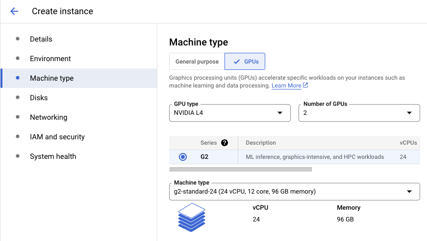
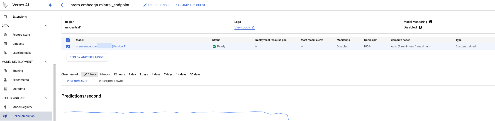

# NVIDIA NeMo Retriever NIM on GCP Vertex AI

**NVIDIA NeMo Retriever NIM** provides easy access to state-of-the-art models that are foundational building blocks for enterprise semantic search applications, delivering accurate answers quickly at scale. Developers can use these APIs to create robust copilots, chatbots, and AI assistants from start to finish. Text Retriever NIM models are built on the NVIDIA software platform, incorporating CUDA, TensorRT, and Triton to offer out-of-the-box GPU acceleration. 

Leveraging NVIDIA’s GPU acceleration on Google Cloud Platform, NeMo Retriever NIM offers an efficient and scalable path to inference with unparalleled performance.

This repository demonstrates NeMo Retriever Text Embedding NIM (NREM NIM) [nv-embedqa-e5-v5](https://build.nvidia.com/nvidia/nv-embedqa-e5-v5) deploy and inference on **GCP Vertex AI** with NVIDIA GPUs.

## Prerequisites
* [NGC API KEY](https://org.ngc.nvidia.com/setup/personal-keys)
* [NGC CLI](https://org.ngc.nvidia.com/setup/installers/cli)
* [Vertex AI Workbench](https://cloud.google.com/vertex-ai/docs/workbench/introduction)
* [gcloud CLI](https://cloud.google.com/sdk/docs/install)

## Run NREM NIM on Vertex AI Workbench Instance

To deploy NREM NIM on Vertex AI, start by obtaining the required credentials and completing the prerequisite setup. 

Next, create a Vertex AI Workbench instance with GPU support.

Once your instance is ready, follow the instructions provided in the Jupyter notebook to complete the deployment process. 

The steps are outlined below:

* Pull NREM NIM container from NGC.
* Push NREM NIM container to Artifact Registry.
* Run NREM NIM container to make inference within interface.
* Upload NIM container as a Vertex AI Model Resource.
* Create a Vertex AI Endpoint Resource.
* Deploy the Model Resource to the Endpoint Resource.
* Generate prediction responses from Endpoint Resource.

Finally, NREM NIM will be capable of performing inferences both locally within the notebook interface and through the Vertex AI endpoint, which can be accessed via Vertex AI `Model Registry` and `Online prediction`.

### 1. Create a Vertex AI Workbench Instance
Create a new Vertex AI Workbench instance and select `ADVANCED OPTIONS`. Choose NVIDIA GPUs (e.g. L4 for G2 machine series) and recommended [Disk Space](https://docs.nvidia.com/nim/nemo-retriever/text-embedding/latest/support-matrix.html) for specific NREM NIM.

[](HighLevelArch)

### 2. Run NREM NIM on JupyterLab Notebook
`OPEN JUPYTERLAB` of the instance, and install required packages per `requirements.txt`. 

Run `nrem-nim-vertexai.ipynb` Python jupyter notebook, which provides step-to-step guidance on how to deploy and inference the NREM NIM container within notebook interface or via Vertex AI endpoint resource.

If NREM NIM container has been successfully launched, you will see below output in cell or deployment log:

```shell
=========================================
== NVIDIA Retriever Text Embedding NIM ==
=========================================

NVIDIA Release 1.0.1 (build 0cf1c7ad8e51bdffc4e4d4226735dbb7f59d70d4)
Model: nvidia/nv-embedqa-e5-v5

Container image Copyright (c) 2016-2024, NVIDIA CORPORATION & AFFILIATES. All rights reserved.
This NIM container is governed by the NVIDIA AI Product Agreement here:
https://www.nvidia.com/en-us/data-center/products/nvidia-ai-enterprise/eula/.
A copy of this license can be found under /opt/nim/LICENSE.

The use of this model is governed by the AI Foundation Models Community License
here: https://docs.nvidia.com/ai-foundation-models-community-license.pdf.
```

### 3. Inference in Online prediction
After deploying NREM NIM container to endpoint, check Vertex AI `Model Registry` and `Online prediction` for model/endpoint version details and event logs.

[](HighLevelArch)

Perform endpoint inference using the OpenAI Python API or CLI.

> [!IMPORTANT]
> Please use `rawPredict` to make endpoint inference, as `predict` method will need additional formatting.
> 
Sample request and response:

* Payload
```shell
payload_model = "nvidia/nv-embedqa-e5-v5"

inputs = ["Hello world"]

payload = {
  "model": payload_model,
  "input": inputs,
  "input_type": "query"
}

with open("request_nrem.json", "w") as outfile: 
    json.dump(payload, outfile)
```

* Python Inference
```shell
import json
from pprint import pprint
from google.api import httpbody_pb2
from google.cloud import aiplatform_v1

http_body = httpbody_pb2.HttpBody(
    data=json.dumps(payload).encode("utf-8"),
    content_type="application/json",
)

req = aiplatform_v1.RawPredictRequest(
    http_body=http_body, endpoint=endpoint.resource_name
)

print("Request")
print(req)
pprint(json.loads(req.http_body.data))
print()

API_ENDPOINT = "{}-aiplatform.googleapis.com".format(region)
client_options = {"api_endpoint": API_ENDPOINT}

pred_client = aiplatform.gapic.PredictionServiceClient(client_options=client_options)

response = pred_client.raw_predict(req)
print("--------------------------------------------------------------------------------------")
print("Response")
print("Length of Embeddings:", len(json.loads(response.data)['data'][0]['embedding']))
pprint(json.loads(response.data))
```


```shell
Request
endpoint: "projects/$project_id/locations/us-central1/endpoints/$ENDPOINT_ID"
http_body {
  content_type: "application/json"
  data: "{\"model\": \"nvidia/nv-embedqa-e5-v5\", \"input\": [\"Hello world\"], \"input_type\": \"query\"}"
}

{'input': ['Hello world'],
 'input_type': 'query',
 'model': 'nvidia/nv-embedqa-e5-v5'}

--------------------------------------------------------------------------------------
Response
Length of Embeddings: 4096
{'data': [{'embedding': [0.0145416259765625,
                         0.0167388916015625,
                         ...
                         0.0050506591796875],
           'index': 0,
           'object': 'embedding'}],
 'model': 'nvidia/nv-embedqa-e5-v5',
 'object': 'list',
 'usage': {'prompt_tokens': 5, 'total_tokens': 5}}
 ```

 * CLI Inference
```shell
! curl \
    --request POST \
    --header "Authorization: Bearer $(gcloud auth print-access-token)" \
    --header "Content-Type: application/json" \
    https://$region-prediction-aiplatform.googleapis.com/v1/projects/$project_id/locations/$region/endpoints/$ENDPOINT_ID:rawPredict \
    --data "@request_nrem.json"
```
```shell
{
  "object": "list",
  "data": [
    {
      "index": 0,
      "embedding": [
        0.0145416259765625,
        0.0167388916015625,
        ...
        0.0050506591796875
      ],
      "object": "embedding"
    }
  ],
  "model": "nvidia/nv-embedqa-e5-v5",
  "usage": {
    "prompt_tokens": 5,
    "total_tokens": 5
  }
}
```

 ## Reference
 For more information about NIM, please refer to 
 * [NGC User Guide](https://docs.nvidia.com/ngc/gpu-cloud/ngc-user-guide/index.html)
 * [NVIDIA Text Embedding NIM](https://docs.nvidia.com/nim/nemo-retriever/text-embedding/latest/index.html)
 * [NeMo Text Embedding NIM API](https://docs.nvidia.com/nim/nemo-retriever/text-embedding/latest/reference.html) 
