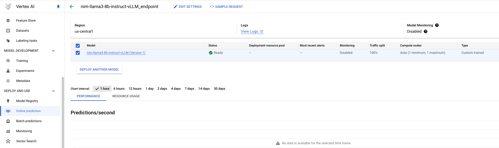

# NVIDIA NIM on GCP Vertex AI

**NVIDIA NIM** is a set of microservices designed to accelerate the deployment of generative AI models across the cloud, data center, and workstations. NIMs are categorized by model family and a per model basis. Leveraging NVIDIA’s GPU acceleration on Google Cloud Platform, NIM offers an efficient and scalable path to inference with unparalleled performance.

This repository demonstrates [llama3-8b-instruct NIM](https://build.nvidia.com/meta/llama3-8b) deploy and inference on **GCP Vertex AI** with NVIDIA GPUs.

## Prerequisites
* [NGC API KEY](https://org.ngc.nvidia.com/setup/personal-keys)
* [NGC CLI](https://org.ngc.nvidia.com/setup/installers/cli)
* [Vertex AI Workbench](https://cloud.google.com/vertex-ai/docs/workbench/introduction)
* [gcloud CLI](https://cloud.google.com/sdk/docs/install)

## Run NIM on Vertex AI Workbench Instance

To deploy NIM on Vertex AI, start by obtaining the required credentials and completing the prerequisite setup. 

Next, create a Vertex AI Workbench instance with GPU support.

Once your instance is ready, follow the instructions provided in the Jupyter notebook to complete the deployment process. 

The steps are outlined below:

* Pull NVIDIA NIM container from NGC.
* Push NVIDIA NIM container to Artifact Registry.
* Run NIM container to make inference within interface.
* Upload NIM container as a Vertex AI Model resource.
* Create a Vertex AI Endpoint resource.
* Deploy the Model resource to the Endpoint resource.
* Generate prediction responses from Endpoint resource.

Finally, NIM will be capable of performing inferences both locally within the notebook interface and through the Vertex AI endpoint, which can be accessed via Vertex AI `Model Registry` and `Online prediction`.

### 1. Create a Vertex AI Workbench Instance
Create a new Vertex AI Workbench instance and select `ADVANCED OPTIONS`. Choose NVIDIA GPUs (e.g. L4 for G2 machine series) and recommended [Disk Space](https://docs.nvidia.com/nim/large-language-models/latest/support-matrix.html) for specific NIM.

Please note NIM supports [TensorRT-LLM](https://docs.nvidia.com/tensorrt-llm/index.html) profile on L40S, A100, H100 GPU types, and vLLM profile on others.

[](HighLevelArch)

### 2. Run NIM on JupyterLab Notebook
`OPEN JUPYTERLAB` of the instance, and install required packages per `requirements.txt`. 

Run `nim-vertexai.ipynb` Python jupyter notebook, which provides step-to-step guidance on how to deploy and inference the NIM container within notebook interface or via Vertex AI endpoint resource.

If NIM container has been successfully launched, you will see below output in cell or deployment log:

```shell
===========================================
== NVIDIA Inference Microservice LLM NIM ==
===========================================

NVIDIA Inference Microservice LLM NIM Version 1.0.0
Model: nim/meta/llama3-8b-instruct

Container image Copyright (c) 2016-2024, NVIDIA CORPORATION & AFFILIATES. All rights reserved.

This NIM container is governed by the NVIDIA AI Product Agreement here:
https://www.nvidia.com/en-us/data-center/products/nvidia-ai-enterprise/eula/.
A copy of this license can be found under /opt/nim/LICENSE.

The use of this model is governed by the AI Foundation Models Community License
here: https://docs.nvidia.com/ai-foundation-models-community-license.pdf.

ADDITIONAL INFORMATION: Meta Llama 3 Community License, Built with Meta Llama 3. 
A copy of the Llama 3 license can be found under /opt/nim/MODEL_LICENSE.
```

### 3. Inference in Online prediction
After deploying NIM container to endpoint, check Vertex AI `Model Registry` and `Online prediction` for model/endpoint version details and event logs.

[](HighLevelArch)

Perform endpoint inference using the OpenAI Python API or CLI. The option to stream results on or off is supported.

> [!IMPORTANT]
> Please use `rawPredict` to make endpoint inference, as `predict` method will need additional formatting.
> 
Sample request and response:

* Payload
```shell
payload_model = "meta/llama3-8b-instruct"

messages = [
    {"role": "user", "content": "Hello! How are you?"},
    {"role": "assistant", "content": "Hi! I am quite well, how can I help you today?"},
    {"role": "user", "content": "Write a short limerick about the wonders of GPU Computing."}
]

payload = {
  "model": payload_model,
  "messages": messages,
  "temperature": 0.2,  # Temperature controls the degree of randomness in token selection.
  "max_tokens": 512,  # Token limit determines the maximum amount of text output.
  "top_p": 0.8,  # Tokens are selected from most probable to least until the sum of their probabilities equals the top_p value.
}

with open("request.json", "w") as outfile: 
    json.dump(payload, outfile)
```

* Python Inference
```shell
import json
from pprint import pprint
from google.api import httpbody_pb2
from google.cloud import aiplatform_v1

http_body = httpbody_pb2.HttpBody(
    data=json.dumps(payload).encode("utf-8"),
    content_type="application/json",
)

req = aiplatform_v1.RawPredictRequest(
    http_body=http_body, endpoint=endpoint.resource_name
)

print('Request')
print(req)
pprint(json.loads(req.http_body.data))
print()

API_ENDPOINT = "{}-aiplatform.googleapis.com".format(region)
client_options = {"api_endpoint": API_ENDPOINT}

pred_client = aiplatform.gapic.PredictionServiceClient(client_options=client_options)

response = pred_client.raw_predict(req)
print("--------------------------------------------------------------------------------------")
print('Response')
pprint(json.loads(response.data))
```


```shell
Request
endpoint: "projects/.../locations/us-central1/endpoints/..."
http_body {
  content_type: "application/json"
  data: "{\"model\": \"meta/llama3-8b-instruct\", \"messages\": [{\"role\": \"user\", \"content\": \"Hello! How are you?\"}, {\"role\": \"assistant\", \"content\": \"Hi! I am quite well, how can I help you today?\"}, {\"role\": \"user\", \"content\": \"Write a short limerick about the wonders of GPU Computing.\"}], \"temperature\": 0.2, \"max_tokens\": 256, \"top_p\": 0.8}"
}

{'max_tokens': 256,
 'messages': [{'content': 'Hello! How are you?', 'role': 'user'},
              {'content': 'Hi! I am quite well, how can I help you today?',
               'role': 'assistant'},
              {'content': 'Write a short limerick about the wonders of GPU '
                          'Computing.',
               'role': 'user'}],
 'model': 'meta/llama3-8b-instruct',
 'temperature': 0.2,
 'top_p': 0.8}

--------------------------------------------------------------------------------------
Response
{'choices': [{'finish_reason': 'stop',
              'index': 0,
              'logprobs': None,
              'message': {'content': 'There once was a GPU so fine,\n'
                                     'Whose computing powers did shine.\n'
                                     'It processed with ease,\n'
                                     'Massive data with peace,\n'
                                     'And solved problems in no time divine!',
                          'role': 'assistant'},
              'stop_reason': 128009}],
 'created': ...,
 'id': '...',
 'model': 'meta/llama3-8b-instruct',
 'object': 'chat.completion',
 'usage': {'completion_tokens': 35, 'prompt_tokens': 53, 'total_tokens': 88}}
 ```

 * CLI Inference
```shell
! curl \
    --request POST \
    --header "Authorization: Bearer $(gcloud auth print-access-token)" \
    --header "Content-Type: application/json" \
    https://us-central1-prediction-aiplatform.googleapis.com/v1/projects/$project_id/locations/$region/endpoints/$ENDPOINT_ID:rawPredict \
    --data "@request.json"
```
```shell
{
  "id": "...",
  "object": "chat.completion",
  "created": ...,
  "model": "meta/llama3-8b-instruct",
  "choices": [
    {
      "index": 0,
      "message": {
        "role": "assistant",
        "content": "There once was a GPU so fine,\nComputed at speed, oh so divine.\nIt ran tasks with ease,\nSimulations to please,\nAnd processed data in a short time!"
      },
      "logprobs": null,
      "finish_reason": "stop",
      "stop_reason": 128009
    }
  ],
  "usage": {
    "prompt_tokens": 53,
    "total_tokens": 89,
    "completion_tokens": 36
  }
}
```

 ## Reference
 For more information about NIM, please refer to 
 * [NVIDIA NIM](https://docs.nvidia.com/nim/large-language-models/latest/introduction.html)
 * [NGC User Guide](https://docs.nvidia.com/ngc/gpu-cloud/ngc-user-guide/index.html)
 * [NIM API](https://docs.nvidia.com/nim/large-language-models/latest/api-reference.html) 
