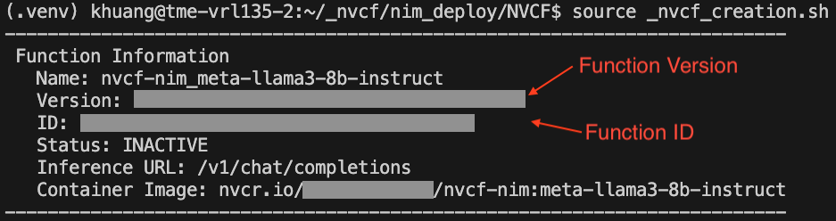
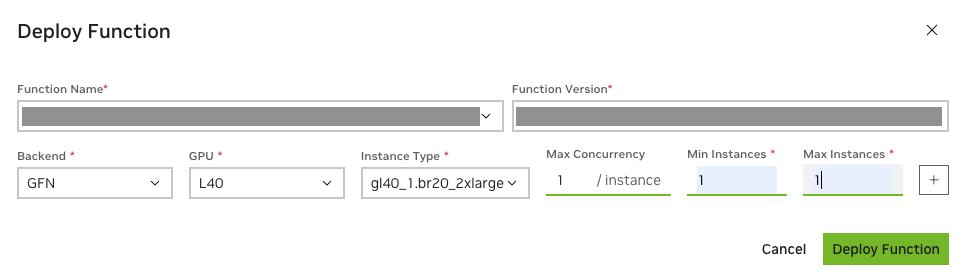

# Deploy NIM to NVCF

## 1. NVCF Introduction
[NVCF](https://docs.nvidia.com/cloud-functions/index.html) (NVIDIA Cloud Functions) is a serverless API to deploy & manage AI workloads on GPUs, which provides security, scale and reliability to workloads. The API to access the workloads is un-opinionated and supports HTTP polling, HTTP streaming & gRPC. NVCF is primarily suited for shorter running, preemptable workloads such as inferencing and fine-tuning.

NVCF is available via the [NGC Portal](https://ngc.nvidia.com/).

## 2. Quick Start
In this approach, user will first build a image based on NIM container, add `NGC_API_KEY`, `INFERENCE_URL`, and ANY other relevant environment variables in `.env`, and then push to the private registry, from where NVCF can pull customized images.

0. Run `docker login nvcr.io` with a personal key.
1. Modify following variables in `.env` accordingly
    - model image name/tag
    - organization ID
    - container name and tag which will be pushed to private registry 
    - a personal key
    - modify inference url and/or port if relevant

2. Build the image and push to NGC private registry
    ```shell
    docker compose build nvcf-nim
    docker compose push nvcf-nim
    ```

3. Run `ngc config set` with a **personal key** then run following shell cmd to create a NVCF function.

    ```shell
    source _nvcf_creation.sh
    ```
4. After running the command, a Cloud Function is created.
    
5. The next script will get the function ID and VERSION and deploy the function. One can also deploy the function in the NVCF console
    ```shell
    source _nvcf_deploy.sh
    ```
    
6. After the function is active, use the `nvcf_test.ipynb` to test out the hosted endpoint with proper key and function id.
   ```shell
   curl -X POST "https://api.nvcf.nvidia.com/v2/nvcf/pexec/functions/${FUNCTION_ID}" \
    -H "Authorization: Bearer ${NGC_API_KEY}" \
    -H "Accept: application/json" \
    -H "Content-Type: application/json" \
    -d '{
            "model": "meta/llama3-8b-instruct",
            "messages": [
                {
                    "role":"user",
                    "content":"Can you write me a happysong?"
                }
            ],
            "max_tokens": 32
        }'
   ``` 

7. See example of deploying embedding or reranking NIM in the `embedding` folder.
