# Deploy an NVIDIA NIM microservice on Oracle Kubernetes Engine (OKE)


### Prerequisites

Before you begin, ensure you have:
- Access to an OCI tenancy with proper permissions
- kubectl configured for your cluster
- Helm installed
- An NVIDIA API key – please follow [these instructions](https://nvdam.widen.net/s/kfshg7fpsr/create-build-account-and-api-key-4)
- Service quota to launch NVIDIA GPU-based compute instances (Minimum: 2 x A10 or 1 x A100)
<!-- - Docker or OCI container registry access (for custom container pulls if needed) -->
<!--- A running OKE cluster (v1.26 or later) with GPU nodes -->


## Task 1: Set Up the necessary infrastructure

1. Go to OKE page

Ensure your node pool uses a GPU shape and that the “nvidia-container-runtime” is configured. Oracle’s GPU Marketplace images already have this pre-installed.

To begin, log in to your OCI console, and click **OCI menu - Developer Services - Kubernetes Clusters (OKE)**.

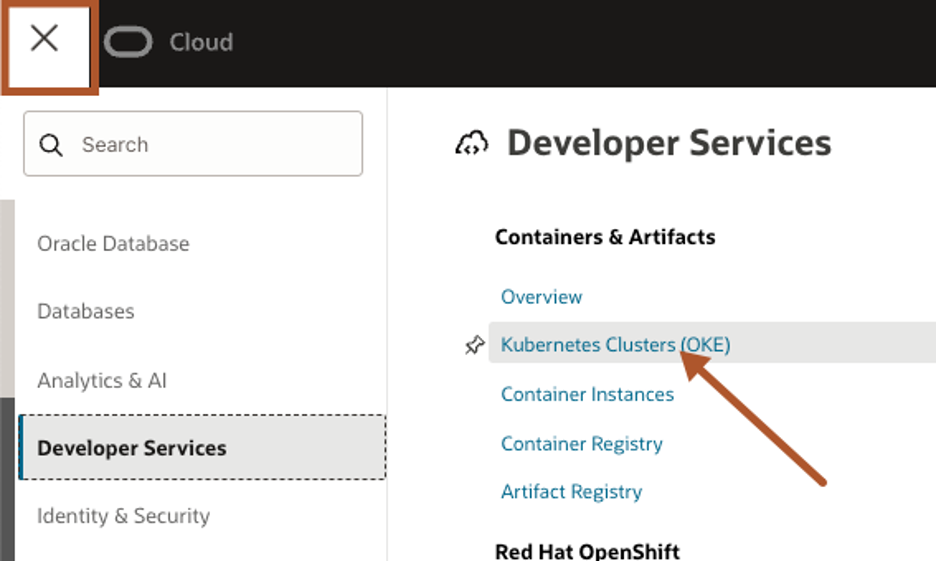

2. Click Create Clusters

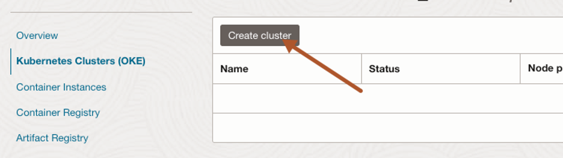

3. Check Quick create is selected and click Submit


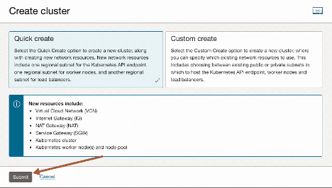

4. For this workshop, we will pick a Public endpoint, Managed node type and Private workers as the worker nodes

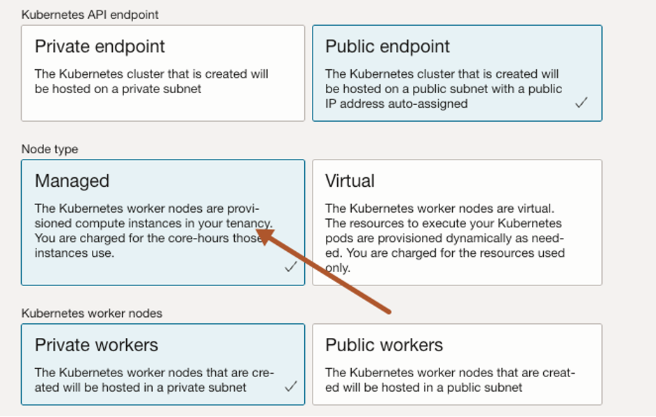


5. Select Node shape, BM.GPU.A10.4 and node count as 2 (or the respective GPU if you have different quota). You can adapt the shapes according to your needs. 

For further references on compute shapes visit https://docs.oracle.com/en-us/iaas/Content/Compute/References/computeshapes.htm

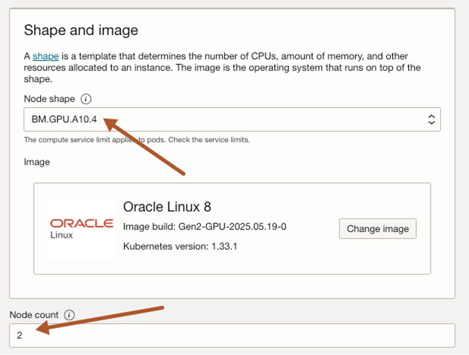

6. The default volume size is 50GB, so we need to increase it to 500GB. Click Show advanced options and change boot volume size to 500GB and click next.

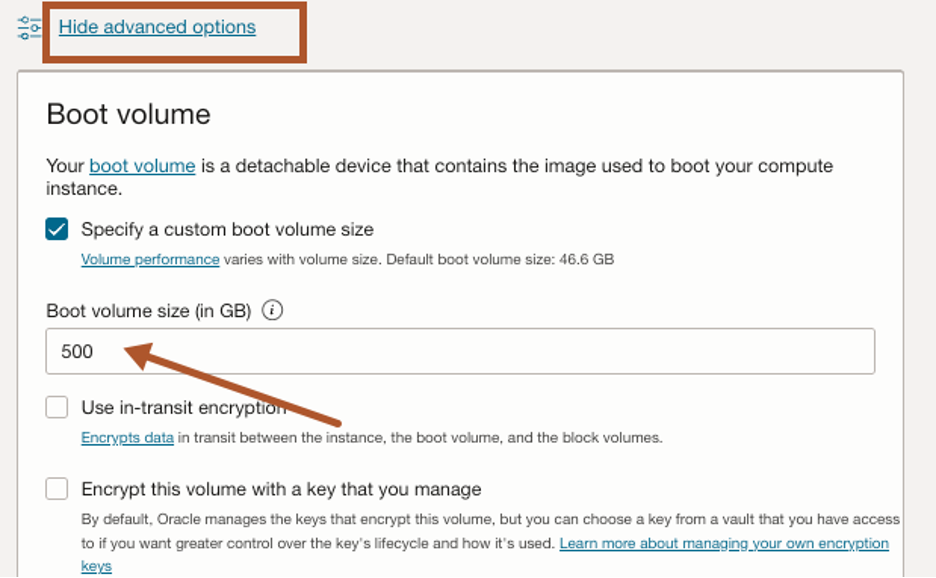


7. Review and Create Cluster

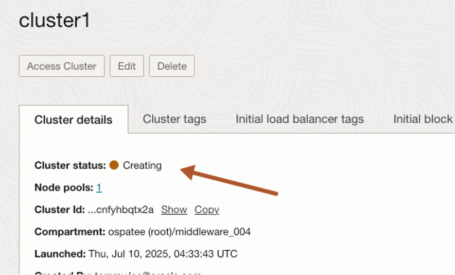

Check node pool status is waiting for cluster. You should see the cluster is being created and will take around 10 to 15 minutes to complete.

8. Access Cluster

Once the process is complete, click Access Cluster.

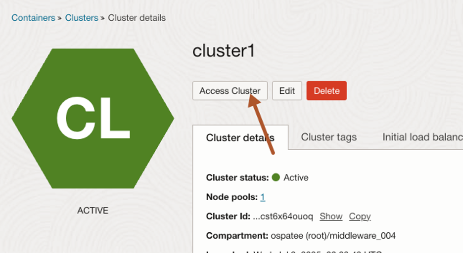

Now you can use Kubernetes commands such as as kubectl to manage your Kubernetes cluster.

You can run this locally using OCI CLI or leverage Cloud Shell.

Cloud Shell provides:
- An ephemeral machine to use as a host for a Linux shell, pre-configured with the latest version of the OCI Command Line Interface (CLI) and several useful tools
- 5GB of encrypted persistent storage for your home directory
- A persistent frame of the Console which stays active as you navigate to different pages of the console

For this example, we will use Cloud Shell because of its simplicity and easy access to OCI resources.

Click Launch Cloud Shell and then copy-and-paste the command to the Cloud Shell and press enter.

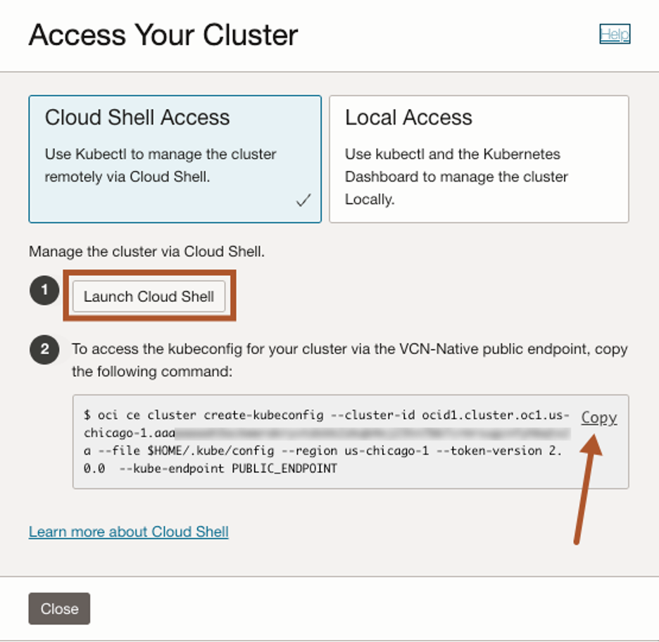

You should see something like this:

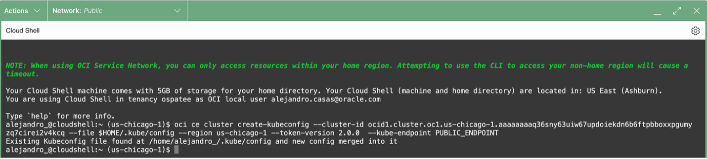

## Task 2: Set up the Environment

1. Execute all below instructions in the cloudshell terminal

2. Remove taints

Run the below commands:

```
kubectl get nodes
kubectl get pods –all-namespaces
```

The output should list 2 nodes and the kubernetes systems pods.

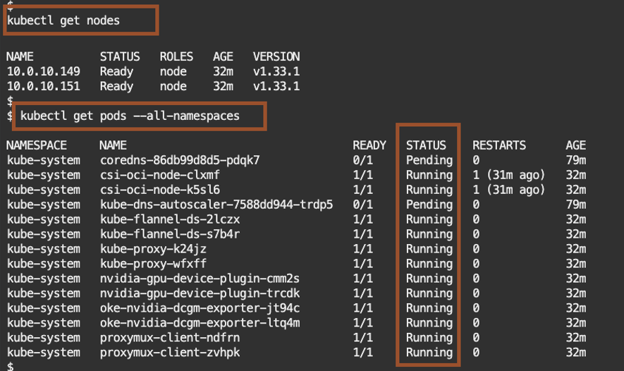

By now you should have access to your OKE cluster.

Kubernetes taints are a way to mark a node so that only specific pods can be scheduled on to it, preventing other pods from using that node unless they tolerate the taint.

Get all taints:
```
kubectl describe nodes | grep -i taints
```

If you identified Taints, remove the nvidia.com/gpu:NoSchedule with the following command.

```
kubectl taint nodes –all nvidia.com/gpu:NoSchedule-
```
3. Create namespace

Run the following command in the terminal to create the namespace.

```
kubectl create namespace nim
``` 

4. Replace `<insert your NGC_API_KEY>` with your NGC API key, then paste the updated command into the Cloud Shell and press Enter.
```
export NGC_API_KEY=<insert your NGC_API_KEY>
```

5. Install the GPU Operator

The NVIDIA GPU Operator manages NVIDIA GPU resources in a Kubernetes cluster and automates tasks related to bootstrapping GPU nodes.

First add the NVIDIA Repository
```
helm repo add nvidia https://helm.ngc.nvidia.com/nvidia && helm repo update
```
Then install the GPU Operator
```
helm install gpu-operator nvidia/gpu-operator -n nim
```

6. Create Secrets
Create a secret with specified type.
- A docker-registry type secret is for accessing the NGC registry.
- The generic type of secret is for accessing NGC catalog.

```
kubectl create secret docker-registry ngc-secret \
  --namespace nim\
  --docker-server=nvcr.io \
  --docker-username='$oauthtoken' \
  --docker-password="$NGC_API_KEY"
```

```
kubectl create secret generic ngc-api-secret \
  --namespace nim\
  --from-literal=NGC_API_KEY="$NGC_API_KEY" \
  --from-literal=NVIDIA_API_KEY="$NGC_API_KEY"
```

6. Check the secret was successfully created within the Kubernetes cluster.

```
kubectl get secrets -n nim
```

## STEP 2:  Deploy the LLM NIM

NIM microservices are intended to be run on NVIDIA GPUs, with the type and number of GPUs depending on the model. With the GPU Operator installed you can use Helm to install your LLM.

1. Create a deployment YAML that references the model-specific container. For example, for **llama-3.1-nemotron-nano-8b-v1**.

```
cat <<ENDEND > oke-nim-llama.yaml 
image:
  repository: nvcr.io/nim/nvidia/llama-3.1-nemotron-nano-8b-v1
  tag: 1.8.4
  pullSecrets:
    - name: ngc-secret

model:
  name: nvidia/llama-3.1-nemotron-nano-8b-v1
  ngcAPISecret: ngc-api-secret

ENDEND
```

2. Download the **nim-llm** helm chart from the NVIDIA NGC repository.
```
helm fetch https://helm.ngc.nvidia.com/nim/charts/nim-llm-1.3.0.tgz --username='$oauthtoken' --password=$NGC_API_KEY
```

3. Run the install.
```
helm install my-nim nim-llm-1.3.0.tgz -f oke-nim-llama.yaml -n nim
```

4. Check the progress of the install.
```
kubectl get pods -n nim
```

5. When you see the pod status as **Running**, this mean the installation was successful.

6. Check what services are running.
```
kubectl get svc -n nim
```
7. Look for the pod name **my-nim-nim-llm** and take note of the **EXTERNAL-IP**


## Task 3: Testing the Inference API

1. Once the NIM is live, send a test prompt via curl or Postman. Replace the <EXTERNAL_IP>: with the EXTERNAL-IP from the my-nim-nim-llm service (previous step).
```
curl -X POST http://<$NIM_DOMAIN>/v1/chat/completions \
  -H "Content-Type: application/json" \
  -d '{
    "messages": [
      {"role": "system", "content": "You are a helpful assistant."},
      {"role": "user", "content": "What should I do for a 4 day vacation in Greece?"}
    ],
    "model": "nvidia/llama-3.1-nemotron-nano-8b-v1",
    "max_tokens": 200
  }' | jq .
```

2. You should see a response like the one below.
```
{
  "id": "cmpl-abc123",
  "object": "chat.completion",
  "created": 1752132000,
  "model": "nvidia/llama-3.1-nemotron-nano-8b-v1",
  "choices": [
    {
      "index": 0,
      "message": {
        "role": "assistant",
        "content": "Day 1: Athens—Acropolis, Acropolis Museum, Plaka. Day 2: Athens—Agora, food tour, Lycabettus at sunset. Day 3: Ferry to Hydra—car‑free island, coastal walk, swim, seafood taverna. Day 4: Hydra morning hike, ferry back and fly out. Tips: buy combo ticket for sites, prebook ferry, carry cash for small tavernas. Budget: €120–€180/day mid‑range; ferries €35–€60 each way."
      }
    }
  ],
  "usage": {
    "prompt_tokens": 55,
    "completion_tokens": 140,
    "total_tokens": 195
  }
}
```
3. Send another prompt "What is oracle Autonomous Database?".
```
curl -X POST http://<$NIM_DOMAIN>:8000/v1/chat/completions \
  -H "Content-Type: application/json" \
  -d '{
    "messages": [
      {"role": "system", "content": "You are a helpful assistant."},
      {"role": "user", "content": "What is oracle Autonomous Database?"}
    ],
    "model": "nvidia/llama-3.1-nemotron-nano-8b-v1",
    "max_tokens": 150
  }' | jq .
```
4. LLM's response.
```
{
  "id": "cmpl-xyz987",
  "object": "chat.completion",
  "created": 1752132500,
  "model": "nvidia/llama-3.1-nemotron-nano-8b-v1",
  "choices": [
    {
      "index": 0,
      "message": {
        "role": "assistant",
        "content": "Oracle Autonomous Database is a cloud-based database service that uses machine learning to automate key management tasks such as provisioning, tuning, backups, and patching. It is designed to run without human intervention, reducing administrative overhead while improving performance, reliability, and security. Available in configurations for transaction processing, data warehousing, or mixed workloads, it scales automatically and includes built-in security and analytics capabilities."
      }
    }
  ],
  "usage": {
    "prompt_tokens": 19,
    "completion_tokens": 102,
    "total_tokens": 150
  }
}

```
5. As part of the prompt settings, you can tweak the system prompt, model, and the max_tokens. Let's try updating the system prompt that the size of the max_tokens.
```
curl -X POST http://<$NIM_DOMAIN$>:8000/v1/chat/completions \
  -H "Content-Type: application/json" \
  -d '{
    "messages": [
      {"role": "system", "content": "Act as a Software Engineer and respond to the questions towards a new solution development ."},
      {"role": "user", "content": "What is oracle Autonomous Database?"}
    ],
    "model": "nvidia/llama-3.1-nemotron-nano-8b-v1",
    "max_tokens": 2048
  }' | jq .
```
6. LLM's response.
```
{
  "id": "cmpl-abc2000",
  "object": "chat.completion",
  "created": 1752133000,
  "model": "nvidia/llama-3.1-nemotron-nano-8b-v1",
  "choices": [
    {
      "index": 0,
      "message": {
        "role": "assistant",
        "content": "Oracle Autonomous Database (ADB) is a fully managed, self-driving cloud database service offered on Oracle Cloud Infrastructure (OCI). It leverages advanced machine learning to automate the full lifecycle of a database — including provisioning, configuring, securing, tuning, scaling, patching, and repairing — without human intervention. This eliminates much of the manual database administration work while improving reliability, security, and performance.\n\n**1. Architecture**\nThe architecture is built on Oracle Database technology running in the OCI environment, enhanced with AI/ML-driven automation. Key layers include:\n- **Compute Layer**: Dedicated or shared infrastructure, optimized for database workloads.\n- **Storage Layer**: Exadata storage servers with high-bandwidth, low-latency access to persistent data.\n- **Automation Layer**: ML models monitor workloads, optimize indexes, allocate CPU/memory dynamically, and detect anomalies.\n- **Security Layer**: Always-on encryption (TDE), automatic security patching, access controls, and audit logging.\n\n**2. Deployment Options**\n- **Autonomous Transaction Processing (ATP)**: Optimized for OLTP workloads, mobile/web apps, ERP, and CRM systems.\n- **Autonomous Data Warehouse (ADW)**: Optimized for analytics, BI, data lakes, and reporting.\n- **Autonomous JSON Database**: For applications requiring a JSON-native store with SQL integration.\n- **Autonomous Database on Dedicated Exadata Infrastructure**: For isolation, compliance, and predictable performance.\n\n**3. Key Features**\n- **Self-Driving**: Automates provisioning, scaling, backups, tuning, and patching.\n- **Self-Securing**: Automatically applies security updates, encrypts all data, and protects from malicious attacks.\n- **Self-Repairing**: Detects and recovers from failures automatically with minimal downtime (99.995% SLA).\n- **Elastic Scaling**: CPU and storage scale independently without downtime.\n- **Data Integration**: Native connectors for Oracle Analytics Cloud, GoldenGate, Data Integration, and 3rd-party BI tools.\n- **Multi-Model Support**: Relational, JSON, spatial, graph, blockchain tables.\n\n**4. Benefits**\n- **Reduced Operational Cost**: Eliminates most DBA repetitive tasks.\n- **Higher Reliability**: Machine learning reduces misconfiguration risk.\n- **Performance Optimization**: Automatic indexing and query plan adjustments.\n- **Security Compliance**: Meets standards like ISO 27001, SOC, PCI-DSS, HIPAA.\n\n**5. Use Cases**\n- Real-time analytics dashboards.\n- High-transaction e-commerce platforms.\n- IoT sensor data ingestion and analysis.\n- Financial fraud detection.\n- Government and regulated industries requiring high compliance.\n\n**6. Technical Specs (OCI ADB)**\n- Storage: Up to petabytes with Exadata scale-out storage.\n- Memory: Up to hundreds of GB per instance.\n- CPUs: Elastic OCPU model (per second billing).\n- Network: RDMA over Converged Ethernet (RoCE) for ultra-low latency.\n\nIn summary, Oracle Autonomous Database combines Oracle’s database expertise with cloud-scale automation to deliver a service that is faster to deploy, easier to maintain, and more secure than traditional database models, freeing up teams to focus on innovation instead of administration."
      }
    }
  ],
  "usage": {
    "prompt_tokens": 45,
    "completion_tokens": 1020,
    "total_tokens": 1065
  }
}
```
## Key takeaways

- **Enterprise-Grade AI at Scale:** Combines NVIDIA GPU acceleration with OKE's secure, managed infrastructure to reliably run LLMs and other AI models in production.
- **Pre-Built, Optimized Microservices:** NIM include foundation models, optimized inference engines, and standard APIs packaged in ready-to-deploy containers, no complex manual setup required.
- **Kubernetes-Native Deployment:** OKE manages the full container lifecycle (scaling, high availability, upgrades), reducing operational overhead.
- Performance Boost & Cost Efficiency: Delivers faster inference than open-source inference engines on the same infrastructure, with even greater gains for high-concurrency workloads.
- **Flexible Workload Support:** Ideal for chatbots, copilots, semantic search, document analysis, computer vision, and more, supporting multiple frameworks and models.
- **Integrated OCI Services:** Natively connects to OCI Data Science, Object Storage, API Gateway, and observability tools like Grafana and Prometheus.
- **Security & Compliance by Design:** Encryption, network isolation, access control, and compliance with ISO, SOC, PCI, HIPAA, and other standards.
- **Faster Time-to-Value:** Go from concept to production inference endpoints in hours, not weeks, with automated deployments and preconfigured stacks.

**Final Thoughts**

Running NIM on OKE brings together the best of NVIDIA and Oracle Cloud: performance-optimized model microservices deployed on enterprise-grade, scalable infrastructure.

Whether you're deploying a GenAI chatbot, a document Q&A system, or powering a RAG pipeline, this architecture gives you:

- Full control over models and infrastructure
- The flexibility of Kubernetes with the speed of NVIDIA inference
- Seamless integration into your broader OCI AI and data ecosystem


**Resources**  
[Oracle Cloud Infrastructure Documentation](https://docs.oracle.com/en-us/iaas/Content/home.htm)

[OKE Quickstart Guide](https://docs.oracle.com/en-us/iaas/Content/ContEng/Tasks/contengcreatingclusterusingoke.htm)  
Learn more about [NVIDIA NIM Microservices](https://developer.nvidia.com/nim?sortBy=developer_learning_library%2Fsort%2Ffeatured_in.nim%3Adesc%2Ctitle%3Aasc&hitsPerPage=12)

[NVIDIA Developer Program](https://developer.nvidia.com/developer-program)  
[GitHub Sample: NIM on OKE](https://github.com/NVIDIA/nim-deploy/tree/main/cloud-service-providers/oracle/oke)

[NVIDIA AI Enterprise](https://cloudmarketplace.oracle.com/marketplace/en_US/listing/165234016)