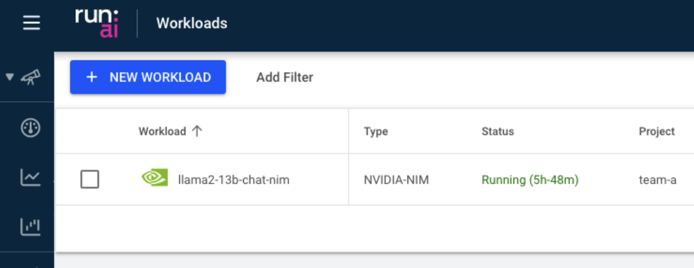

# Deploy NVIDIA NIM microservices on RunAI

This document describes the procedure for deploying NIM Microservice employing helm on a RunAI cluster.

## Prerequisites
1.  A conformant Kubernetes cluster ([RunAI K8s requirements](https://docs.run.ai/latest/admin/overview-administrator/))
2.  RunAI installed (version \>= 2.18)
3.  [NVIDIA GPU Operator](https://github.com/NVIDIA/gpu-operator) installed
4.  General NIM requirements: [NIM Prerequisites](https://docs.nvidia.com/nim/large-language-models/latest/getting-started.html#prerequisites)
5.  [Helm](https://helm.sh/docs/) installed locally

## Integration features

| Feature                            | Exists             |
|------------------------------------|--------------------|
| Deploy through helm CLI            | :white_check_mark: | 
| Engine capabilities (Scheduling)   | :white_check_mark: |  
| Visibility (UI + CLI)              | :white_check_mark: |
| Submit through RunAI Workload API  |                    | 
| Submit through RunAI UI            |                    |   

## Preparation

The following initial steps are required:

### RunAI

1. Create or select an existing project to deploy the NIM within - for example: `team-a`
2. Enforce RunAI Scheduler in the project's namespace: `Kubectl annotate ns runai-team-a runai/enforce-scheduler-name=true` For additional background see the [RunAI Documentation](https://docs.run.ai/v2.18/admin/runai-setup/config/default-scheduler/)

### NVIDIA NGC
 1. Create API Key: please follow the guidance in the [NVIDIA NIM Getting Started](https://docs.nvidia.com/nim/large-language-models/latest/getting-started.html#option-2-from-ngc) documentation to generate a properly scoped API key if you haven't already.  For illustration purposes the generated key will be indicated as `XXXYYYZZZ` below.
 2. Add NIM Helm repository to deploy NIM charts: `helm repo add nemo-ms "https://helm.ngc.nvidia.com/ohlfw0olaadg/ea-participants" --username=\$oauthtoken --password=XXXYYYZZZ`
 3. Create docker registry secret to pull NIM images: `kubectl create secret docker-registry -n runai-team-a registry-secret --docker-username=\$oauthtoken --docker-password=XXXYYYZZZ`
 4. Create docker secret to pull models: `kubectl create secret generic ngc-api -n runai-team-a --from-literal=NGC_CLI_API_KEY=XXXYYYZZZ`

## Deployment

For any given NIM you desire to deploy, prepare the values.yaml file (changing as needed)
```
initContainers:
  ngcInit:
    imageName: nvcr.io/ohlfw0olaadg/ea-participants/nim_llm
    imageTag: 24.06
    secretName: ngc-api
    env:
      STORE_MOUNT_PATH: /model-store
      NGC_CLI_ORG: ohlfw0olaadg
      NGC_CLI_TEAM: ea-participants
      NGC_MODEL_NAME: llama2-13b-chat
      NGC_MODEL_VERSION: a100x2_fp16_24.06
      NGC_EXE: ngc
      DOWNLOAD_NGC_CLI: "true"
      NGC_CLI_VERSION: "3.34.1"
      MODEL_NAME: llama2-13b-chat

image:
  repository: nvcr.io/ohlfw0olaadg/ea-participants/nim_llm
  tag: 24.06

imagePullSecrets:
  - name: registry-secret

model:
  numGpus: 2
  name: llama2-13b-chat
  openai_port: 9999
```

Run the following command:
```
helm -n runai-team-a install llama2-13b-chat-nim nemo-ms/nemollm-inference -f values.yaml
```
> [!Important]
-   The namespace we deploy the helm chart is the RunAI Project namespace (runai-team-a)
-   For other models consult the [NVIDIA NIM Supported Models](https://docs.nvidia.com/nim/large-language-models/latest/support-matrix.html#supported-models) matrix

# View the model within the RunAI UI



