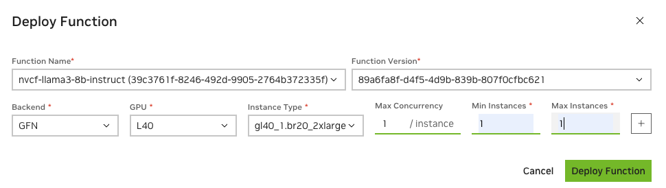

# Deploy NIM to NVCF
## 1. NVCF Introduction
[NVCF](https://docs.nvidia.com/cloud-functions/index.html)(Nvidia Cloud Functions) is a serverless API to deploy & manage AI workloads on GPUs, which provides security, scale and reliability to your workloads. The API to access the workloads is un-opinionated and supports HTTP polling, HTTP streaming & gRPC. NVCF is primarily suited for shorter running, preemptable workloads such as inferencing and fine-tuning.

NVCF is available via the [NGC Portal](https://ngc.nvidia.com/).

## 2. Quick Start
In this approach, you will first build a image based on NIM container, add `NGC_API_KEY` environment variable, and then push to private register, from where NVCF can pull customized images.

0. Run `docker login nvcr.io` with your personal key.
1. Modify following variables in `.env` accordingly
    - Set model image name/tag
    - Set organization ID
    - Set container name and tag which will be pushed to private registry 
    - Set your personal key
2. Build the image and push to NGC private registry
    ```shell
    docker compose build nvcf-nim
    docker compose push nvcf-nim
    ```
3. Run `ngc config set` with your **personal key**, then run following shell cmd to create a NVCF function.
    ```shell
    source _nvcf_creation.sh
    ```
4. After running the command, you should be able to identify ID and VERSION of the created function.
    
5. Modify `_nvcf_deploy.sh` with function ID and VERSION and run following script the deploy the function. You can also deploy the function in the NVCF console
    ```shell
    source _nvcf_deploy.sh
    ```
    
6. After the function is active, use the `nvcf_test.ipynb` to test out the hosted endpoint with proper key and function id.
